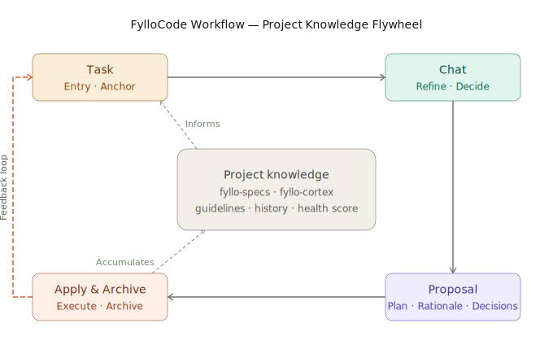

<p align="center">
  
</p>

<h1 align="center">FylloCode</h1>

<p align="center">
  The governance layer for Coding Agents<br/>
  One evolving ruleset for every agent on your team, end to end traceable.<br/>
</p>

<p align="center">
  <a href="./README.zh-CN.md">中文</a> ·
  <a href="https://github.com/Fioooooooo/FylloCode/releases">Download</a>
</p>

---

## Background

When each Agent session ends, the code stays. The decisions don't.

- **Three days later, you don't know why this line changed.** The Agent touched 100+ files, and `git blame` only tells
  you who committed — not the reasoning behind it.
- **Two months later, no one knows the design rationale.** The Agent picked an architecture direction, and why the
  alternatives were rejected vanished with the chat window.
- **Every new session starts from scratch.** Same questions, same constraints, same history — re-explained to a new
  Agent instance every single time.
- **Every team member's Agent runs on its own rules.** No shared engineering standards, no consistency across agents or
  sessions. The conventions held together by personal habits are accelerating toward collapse.

These problems share one root cause: **Agents lack a persistent, structured governance layer.** FylloCode is that layer.

---

## Core Mechanism

FylloCode sits on top of your existing codebase and toolchain — not replacing your IDE, CI/CD, or project management
system, but adding a layer above them dedicated to the problem of sustainably using Agents as a team.

```
Dev Systems (GitHub / Yunxiao / Jira ...)
        ↑ writes back results
┌──────────────────────────────┐
│         FylloCode            │  ← governance layer
│  fyllo-specs · fyllo-skills  │
└──────────────────────────────┘
        ↓ constraints & context injection
   Coding Agent (any)
        ↓
   your codebase
```

| Capability                     | Description                                                                                                                                           |
| ------------------------------ | ----------------------------------------------------------------------------------------------------------------------------------------------------- |
| **Unified standards**          | The `fyllo-specs` MCP server exposes project-level specs to all agents, persisting across sessions and agent instances                                |
| **Decision archiving**         | Every proposal's rationale and rejected alternatives are persisted as structured data, not lost in chat history                                       |
| **Full traceability**          | Task → Chat → Proposal → Apply & Archive — every step recorded as one lineage, from intent to execution                                               |
| **Self-evolving rules**        | `fyllo-skills` currently ships the `guidelines` tool, which auto-updates project conventions after each task so agents always work from current rules |
| **Writes back to dev systems** | Task results sync back to your existing project management tools — no new silos                                                                       |

---

## Workflow



FylloCode structures every coding task into four phases along a single line, each with defined inputs, outputs, and
constraints. Every step — its input, decisions, and artifacts — is recorded as one **lineage**, and what gets settled
feeds straight into the next task.

```
  Task ──────▶ Chat ──────▶ Proposal ──────▶ Apply & Archive
  Intent       Refine &      Plan review      Constrained
  entry        decide                         execution & archive
```

### Task

The entry point of the line. A task can be created directly by a team member or synced in from a connected dev system
(GitHub / Yunxiao / Jira ...). FylloCode imposes nothing here — it is simply where a unit of work enters the governed
flow and becomes the shared anchor for everything that follows.

### Chat

This is where the approach takes shape. Facing a concrete task, the Agent analyzes the requirement, gathers evidence
from the codebase, and guides the team through the tradeoffs until you converge on a decision together — rather than
producing a plan out of thin air. `fyllo-specs` injects the current project spec state so the discussion stays within
the right boundaries from the start. The reasoning, including the options that were ruled out, is captured as part of
the lineage instead of vanishing in a chat window.

### Proposal

Once a decision is reached, the Agent turns it into reviewable, structured artifacts. Output is driven by OpenSpec and
customizable per project. The default is four structured artifacts:

- `proposal.md` — background, new capabilities, changed capabilities, affected modules
- `design.md` — Goals and Non-Goals, final decisions on open questions with justifications for rejected alternatives,
  change risks
- `specs` — spec entries extracted from this change, written back to the project knowledge base
- `tasks.md` — detailed task breakdown by file and function, with acceptance criteria, triggering guidelines
  auto-evolution

These four artifacts are the substance of the Proposal review — and the record that remains two months later when
someone asks why the system was designed this way.

### Apply & Archive

The Agent executes under `fyllo-specs` constraints. Architecture boundaries, naming conventions, restricted operations —
all enforced in real time during coding, not caught later in code review. Execution is strictly scoped to what
`tasks.md` approved: changes outside that boundary are blocked, ensuring the actual diff matches the reviewed plan. Each
task runs in an isolated Git worktree by default, keeping the main branch clean until the task is reviewed and merged,
and multiple tasks can run in parallel at different stages without blocking each other.

Once the change lands, the complete record is automatically archived: code change scope, decision context, spec
updates, guidelines evolution, and a refreshed project health score. Part of this feeds back into `fyllo-specs` and
`fyllo-skills` as background knowledge for the next task — closing the lineage so the next Task no longer starts from
scratch. The rest syncs to your existing dev systems — no new tool silos.

---

## Model Selection

FylloCode works with any API-compatible model. Different phases make different demands on model capability. From
practical experience:

- **Chat and Proposal** benefit from stronger reasoning models — Claude Opus or GPT-4.5 are good choices. The Agent
  needs to deeply understand the project context, weigh tradeoffs across multiple approaches, and make defensible
  design decisions. Model reasoning quality directly affects how credible and reviewable the output is.

- **Apply** can run on smaller, faster models. By this point, task boundaries are precisely defined by `tasks.md`, and
  the Agent's job is closer to structured execution than open-ended reasoning — smaller models work well here, with the
  added benefit of lower cost.

A common pairing: Opus for Chat and Proposal, Sonnet or Haiku for Apply.

---

## What an Agent Knows Before It Changes Your Code

A typical Agent session has two inputs: the current code and this session's prompt.

Before it writes any code, a FylloCode Agent has access to:

- **The current code** (from your repository)
- **Project specs** (from `fyllo-specs`: architecture constraints, naming conventions, restricted operations)
- **Historical decision context** (why this module was designed this way, which directions were ruled out)
- **Change history** (what problem was being solved the last time this area was touched)
- **Evolving guidelines** (from `fyllo-skills`, auto-updated after each task)

It knows **why** the project became what it is today — not just **what** it is.

---

## Team Knowledge Accumulation

Sustaining a project over time means turning what the team learns in practice — mistakes made, conventions reached,
recurring patterns — into structured context that agents can use directly in the next task.

This is currently implemented through the `fyllo-skills.guidelines` tool: during Chat and Proposal, the Agent considers
whether the guidelines need updating; while applying, project conventions are automatically updated based on the task
details — so agents always work from current rules, not a manually maintained document that drifts over time.

This mechanism addresses one core problem: **how team engineering knowledge accumulates through Agent collaboration
instead of being reset at the end of every session.**

Sustained maintenance of complex projects requires that every change leaves behind not just modified code, but decision
traces that future Agents and engineers can understand. FylloCode's architecture is built around this.

We're actively expanding knowledge accumulation across more dimensions — guidelines are just the starting point.

---

## Integrations

Task results can be written back to existing dev systems to maintain toolchain continuity.

| System        | Status               |
| ------------- | -------------------- |
| Yunxiao       | ✅ First integration |
| TAPD          | 🔄 Planned           |
| GitHub        | 🔄 Planned           |
| GitLab        | 🔄 Planned           |
| Linear        | 🔄 Planned           |
| Jira          | 🔄 Planned           |
| PingCode      | 🔄 Planned           |
| Coding DevOps | 🔄 Planned           |

---

## Architecture

| Layer          | Technology                                             |
| -------------- | ------------------------------------------------------ |
| Client         | Electron · Vue 3 · TypeScript                          |
| Agent protocol | Agent Client Protocol (ACP)                            |
| Spec server    | `fyllo-specs` (MCP Server enhanced on top of OpenSpec) |
| Skills server  | `fyllo-skills` MCP Server                              |

---

## Installation

Download the installer for your platform from the [Releases](https://github.com/Fioooooooo/FylloCode/releases) page.

## Contributing

FylloCode is licensed under AGPL-3.0. PRs are welcome — please read [CONTRIBUTING.md](CONTRIBUTING.md) before
submitting.

## Acknowledgements

FylloCode is built on top of these open source projects and protocols:

[Electron](https://www.electronjs.org) · [Vue 3](https://vuejs.org) · [TypeScript](https://www.typescriptlang.org) · [Nuxt UI](https://ui.nuxt.com) · [Tailwind CSS](https://tailwindcss.com) · [ACP](https://agentclientprotocol.com) · [MCP](https://modelcontextprotocol.io) · [OpenSpec](https://github.com/Fission-AI/OpenSpec) · [markstream-vue](https://github.com/Simon-He95/markstream-vue)

## License

[AGPL-3.0](LICENSE)

## Community

[LinuxDO](https://linux.do/) — Sincere · Friendly · United · Professional
