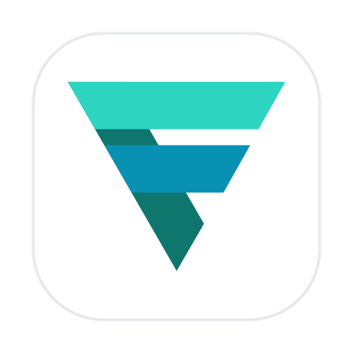
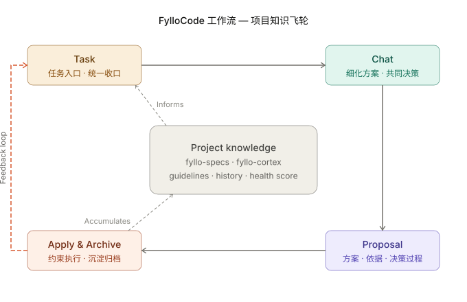

<p align="center">
  
</p>

<h1 align="center">FylloCode</h1>

<p align="center">
  <b>让 Agent 越来越懂你的项目</b><br/>
  开源桌面应用，把 Claude Code、Codex 等本地 Coding Agent 接进项目工作流<br/>
  派任务、审方案、追溯每一次改动，积累下来的规范和结论，换一个 Agent 也能继承
</p>

<p align="center">
  <a href="./README.en.md">English</a> ·
  <a href="https://fyllocode.cc">文档</a> ·
  <a href="https://github.com/Fioooooooo/FylloCode/releases">下载</a>
</p>

---

## 背景

每个 Agent 会话一结束，代码留下来了，决策却丢失了 ……

- **三天后不知道这行代码为什么改。** Agent 帮你动了 100+ 个文件，`git blame` 只告诉你谁提交的，不告诉你当时的决策背景。
- **两个月后没人知道方案的设计依据。** Agent 给出了一个架构方向，其他候选方案为什么被放弃，这些推理过程全消失在当时的聊天窗口里。
- **每个新会话都要从头建立上下文。** 相同的问题，每个 Agent、每次对话都要重新解释一遍项目约束、历史决策和禁忌操作。
- **不同 Agent 给出的写法互相打架。** 同一个项目里，换一个 Agent 或换一次会话，架构取向、命名习惯、测试方式就可能变一套，没有任何东西约束它们保持一致。

这几个问题的根源相同：**Agent 缺少一个持久的、结构化的项目治理层。** FylloCode 就是这个治理层。

---

## 核心机制

FylloCode 在你已有的代码库和研发工具链之上工作，不替代 IDE、CI/CD 或项目管理系统。它在这些系统上面加一层，
专门解决"如何持续用好 Agent，并把工作产生的上下文留下来"的问题。

```
研发系统（GitHub / 云效 / Jira ...）
        ↑ 回写任务结果
┌──────────────────────────────┐
│         FylloCode            │  ← 治理层
│  fyllo-specs · fyllo-cortex  │
└──────────────────────────────┘
        ↓ 约束 & 注入上下文
   Coding Agent（任意）
        ↓
      代码库
```

| 能力             | 说明                                                                                                                          |
| ---------------- | ----------------------------------------------------------------------------------------------------------------------------- |
| **统一规范**     | `fyllo-specs` MCP 服务器向所有 Agent 暴露按 Project 归属的规范，在 Workspace 内跨会话、跨 Agent 持续生效                      |
| **决策留档**     | 每个方案的依据和弃置理由以结构化数据持久化，不消失在会话记录里                                                                |
| **全程可追溯**   | Task → Chat → Proposal → Apply & Archive，每一步串成一条 lineage，变更从意图到执行都有记录                                    |
| **项目概览**     | 进入 Workspace 的默认首屏，按 Project 聚合治理状态、进行中变更、最近 lineage 脉络与规范演化趋势                               |
| **规则自进化**   | `fyllo-cortex` 维护各 Project 的 `guidelines` 和 Workspace knowledge，会话注入索引并在关键阶段提示 Agent 评估、修复或新增约定 |
| **回写研发系统** | 任务结果同步回已有的项目管理工具，不在工具链里形成孤岛                                                                        |

---

## 工作流



FylloCode 把每个编码任务沿一条主线推进，每个阶段有明确的输入、产物和约束。每一步的输入、决策和产物都会被记录成一条
**lineage**，固化下来的结果直接成为下一次任务的起点。

但主线不是一条固定流水线。Task 和 Chat 之后，要根据改动的性质选择执行路径：

```
  Task ──────▶ Chat ──────▶ 路径分流 ──────▶ Apply & Archive
  任务入口      细化决策         │              约束执行 & 归档
                               │
                               ├─ 直接实现   范围明确，不改变对外契约
                               ├─ Plan       需要先梳理思路，但不动契约
                               └─ Proposal   会改变 API、schema 或用户可见行为
```

三条路径不是三个独立入口，而是同一次讨论里可以逐步升级的选择：先判断要不要 Plan，Plan 过程中如果发现会动到契约，再升级到 Proposal。无论走哪条，都记录在同一条 lineage 上。

### Task

主线的起点。一个任务可以直接创建，也可以从已接入的研发系统（GitHub / 云效 / Jira ...）同步进来。FylloCode
在这里不施加任何约束，它只是一个工作单元进入治理流程的入口，并成为后续所有环节共同锚定的对象。

### Chat

方案在这里成形。面对具体任务，Agent 会分析需求、从代码库中检索佐证、引导你权衡取舍，最终一起收敛出决策，而不是凭空给出方案。`fyllo-specs`
会注入 Workspace 内相关 Project 的规范状态，让讨论从一开始就在正确的边界内进行。包括被否决的思路在内的推理过程，都会作为 lineage 的一部分留存，而不是消失在聊天窗口里。

### Proposal

三条路径中最重的一条，只在改动会影响公开 API、schema、协议、持久化格式、用户可见行为或职责边界时才走。范围明确的小改动直接实现，需要先梳理思路但不动契约的写一份会话级 Plan，都不必产出下面这套评审材料。

决策确定后，Agent 把它固化为可评审的结构化产物。产物由 OpenSpec 规范驱动，可按项目需求定制，默认输出四份结构化文件：

- proposal.md：背景说明、新增能力、变更能力、受影响的模块
- design.md：Goals 与 Non-Goals、开放问题的最终决策及弃置原因、变更风险
- specs：从本次变更中抽取的规范条目，回写到项目知识库
- tasks.md：以文件和函数为维度的详细任务拆分，含验收标准，并评估是否需要更新 guidelines

这四份文件是 Proposal 评审的实体，也是两个月后追溯"当时为什么这么设计"的唯一依据。

### Apply & Archive

Agent 在 `fyllo-specs` 的约束下执行。规范覆盖架构禁区、命名约定、危险操作范围，在编码过程中实时生效，不依赖事后 code review
发现越界。实际执行严格限定在 tasks.md 批准的范围内。超出边界的修改会被拦截，确保变更与评审记录一致。每个任务默认运行在独立的 Git
worktree 中，主分支在任务完成前保持干净，多个任务可以并行推进、各自处于不同阶段，互不干扰。

变更落地后，完整记录自动归档：代码变更范围、决策上下文、specs 更新、guidelines 演化结果，以及项目健康度重新评分。其中一部分反哺
`fyllo-specs` 和 `fyllo-cortex`，成为下一次任务的背景知识。这样 lineage 可以闭环，下一个 Task 不再从零开始；另一部分同步到已有的研发系统，不形成工具链孤岛。

---

## 模型选择

FylloCode 支持任意接入 ACP 的 Agent，但不同阶段对模型能力的侧重不同。根据实际使用经验：

- **Chat 与 Proposal 阶段**建议使用推理能力更强的模型，如 Claude Opus 或 GPT-Sol。这两个阶段需要 Agent
  深度理解项目背景、权衡多个方案的利弊、做出有依据的设计决策。模型的推理质量直接影响方案的可信度和可审查性。

- **Apply 阶段**可以使用更小、更快的模型。任务边界已由 `tasks.md` 明确约定，Agent 的工作更接近结构化执行而非开放式推理，对模型的要求相对较低，也更容易控制成本。

一个典型的搭配：Chat 与 Proposal 用 Opus，Apply 用 Sonnet 或 Haiku。

---

## 当 Agent 开始改代码

普通的 Agent 会话能拿到两样东西：当前代码 + 这次的 prompt。

FylloCode 的 Agent 在动手改代码之前，能拿到：

- **当前代码**（来自你的仓库）
- **项目规范**（来自 `fyllo-specs`：架构约束、命名约定、禁止操作）
- **历史决策上下文**（这个模块为什么这么设计，当时否决了哪些方向）
- **变更原因记录**（上次动这里是为了解决什么问题）
- **持续演进的 guidelines**（来自 `fyllo-cortex`，在任务流程中持续评估和维护）

它既保留这个项目**为什么**变成今天这样，也保留它现在的**实现**。

---

## 知识沉淀

在持续演进中，需要把实际工程中积累的约定、排查得出的结论、只有你知道的业务背景，转化为下次任务时
Agent 能直接使用的结构化上下文。这件事由 `fyllo-cortex` 的两个工具分别承担。

**guidelines（工程约定，随代码入库）**：新的 Chat / Apply session 会注入 `guidelines/**/*.md`
的索引，Agent 按需读取全文；Chat、Proposal、Apply、Archive 和 Project Health Check
的阶段提示会要求 Agent 判断是否需要初始化、创建或修复 guideline。这样约定跟着真实改动更新，而不是依赖随版本漂移的静态文档。

**knowledge（代码里推不出来的事实，Workspace 级）**：Agent
在会话中遇到反直觉的结论、代价远大于产出的排查，或你给出的超出当前任务范围的指令时，会放置一张 `knowledge.flag`
卡片。标记不打断当前讨论，**由你确认之后才写入**，来源和时间一并留存，过期时可以重新核查。

这套机制解决的核心问题是：**工程智慧如何在 Agent 协作中持续沉淀，而不是每次会话结束就清零。**

复杂工程要持续维护，每一次变更都要留下代码改动和可被后续 Agent 与工程师理解的决策痕迹。FylloCode 的架构就是围绕这一点设计的。

我们正在从更多维度持续扩展知识积累的范围，guidelines只是起点。

---

## 集成

FylloCode 的任务结果可以回写到已有的研发系统，保持工具链的连续性。

| 研发系统      | 状态        |
| ------------- | ----------- |
| 云效          | ✅ 首批集成 |
| TAPD          | 🔄 计划中   |
| GitHub        | 🔄 计划中   |
| GitLab        | 🔄 计划中   |
| Linear        | 🔄 计划中   |
| Jira          | 🔄 计划中   |
| PingCode      | 🔄 计划中   |
| Coding DevOps | 🔄 计划中   |

---

## 技术架构

| 层         | 技术                                             |
| ---------- | ------------------------------------------------ |
| 客户端     | Electron · Vue 3 · TypeScript                    |
| Agent 协议 | Agent Client Protocol (ACP)                      |
| 规范服务   | `fyllo-specs`（基于 OpenSpec 增强的 MCP Server） |
| 大脑服务   | `fyllo-cortex` MCP Server                        |

---

## 安装

在 [Releases](https://github.com/Fioooooooo/FylloCode/releases) 页面下载对应平台的安装包：

| 平台    | 架构                  | 格式           |
| ------- | --------------------- | -------------- |
| macOS   | Apple Silicon / Intel | dmg            |
| Windows | x64                   | 安装包         |
| Linux   | x64                   | AppImage · deb |

仓库扫描、git 查询和 lineage 投影全部在本地完成，不依赖任何外部服务。

## 参与贡献

FylloCode 使用 MIT 许可证。欢迎提交 PR，贡献前请阅读 [CONTRIBUTING.md](CONTRIBUTING.md)。

## 致谢

FylloCode 构建在这些开源项目和协议之上：

[Electron](https://www.electronjs.org) · [Vue 3](https://vuejs.org) · [TypeScript](https://www.typescriptlang.org) · [Nuxt UI](https://ui.nuxt.com) · [Tailwind CSS](https://tailwindcss.com) · [ACP](https://agentclientprotocol.com) · [MCP](https://modelcontextprotocol.io) · [OpenSpec](https://github.com/Fission-AI/OpenSpec) · [markstream-vue](https://github.com/Simon-He95/markstream-vue)

## 许可证

[MIT](LICENSE)

## 技术社区

[LinuxDO](https://linux.do/)：真诚、友善、团结、专业
