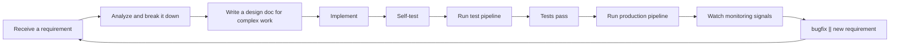

---
sidebar:
  order: 2
  text: Why I Built FylloCode
---

# Why I Built FylloCode

I like trying new tools. When a new product appears, I usually want to understand what problem it tries to solve and how it chooses to solve it.

As Coding Agent products multiplied, I ended up with more and more Agents installed locally, and I gradually formed my own preferences. To avoid same-source bias, I use different Agents for different tasks. For large cross-module changes, I may use `Claude Code` for planning. For changes across one or two modules, I may use `Codex`. For implementation, I may choose domestic models such as `GLM`, `Kimi`, or `Qwen`, because they are fast and follow instructions well enough.

Combining multiple Agents and models does produce higher-quality task results.

But another problem appeared.

## The Terminal Started to Get Out of Control

As the number of requirements grew, I opened multiple split panels in `Ghostty`, each running a different Agent. When several projects were active at the same time, I also needed multiple terminal windows.

I like command-line tools. `Arch Linux` was my main system for many years. But after using Agents for long enough, the terminal experience started to feel wrong: I would forget which panel was running which Agent and what that Agent was doing.

I could only rely on memory: this style looks like `Claude Code`, this one is `Codex`, and that other window may belong to another project.

If the problem were only "too many windows", a better terminal layout might solve it. What pushed me to build something new was that these powerful Agents were still scattered across isolated command-line sessions.

I kept repeating instructions like:

- `First review the existing design of module xx and module yy, consider xx, then produce a plan.`
- `The task is done. Summarize the changes into document xx.`
- `Follow the existing project conventions and do not bypass the IPC / storage / renderer layering.`

These are not really requirements. They are repeated attempts to rebuild context, constraints, and workflow.

If we are already in the AI era, I do not think we should keep wrapping old workflows with new tools. I started to look again at the daily workflow of software engineers.

## Engineering Workflow Is a Loop

Most engineering workflows look roughly like this:

It looks like a line, but it is really a loop.

Every requirement brings new code, new tradeoffs, new experience, and sometimes new problems. The valuable part of engineering is not only finishing this requirement. It is also capturing the judgment, constraints, and knowledge produced during the work so the next requirement can start from a better position.

So I did not want to build a prettier terminal or just a shell that puts many Agents into one chat box.

I wanted to use engineering constraints plus Agent autonomy to help engineers complete each loop faster and better, and to make the output of each loop feed back into the project.

After abstracting the workflow further, the early shape of FylloCode became clear.

## FylloCode Should First Own This Workflow

FylloCode needs several basic capabilities:

1. Receive tasks.
2. Organize Agent conversations to discuss and clarify requirements.
3. Drive the following workflow from the discussion result.
4. After a task is done, write valuable information back into the project.

The next question was how to organize these capabilities as a product.

This is a large workflow. There are already many Agent workflow projects, such as `spec-kit`, `superpower`, `GSD`, and `OpenSpec`. They all have strengths and weaknesses, but I prefer `OpenSpec`.

The reason is simple: it has a defined and extensible rule set, and it also has a CLI that helps bring the workflow into engineering constraints. A workflow that cannot land in engineering constraints, and only says "you should do this", easily becomes another process maintained by human memory.

I also needed a mechanism to organize local Agents. At first I considered using Agent CLI headless modes directly, and I even tried integrating `Claude Code`. After more thought, I gave up on that direction.

FylloCode should not spend most of its energy adapting every CLI. If the product is dominated by how one CLI starts, how another CLI outputs data, and how a third CLI resumes sessions, it will be dragged away from its real goal.

Then I found `ACP`, proposed by Zed and advanced with IntelliJ. The protocol is not perfect and has shortcomings, but it already provides the basics, and more Agents are adopting it. It can serve as the Agent connection layer.

Another key part is integration with external task management platforms.

FylloCode should not become a task management product. Many mature products already exist. FylloCode only needs to connect task, code, pipeline, and release links.

With the rise of skills plus CLIs, many products expose entry points to Agents in that form. In this scenario, I do not fully favor relying on skills for everything.

Task reading and writing, code PRs, and pipelines are high-frequency operations. Skill-based integration may look elegant, but every API call consumes tokens. API integration is more stable, faster, and does not consume tokens.

Together, these capabilities can first make FylloCode a local Agent workbench. But that is still not the endpoint I care about most.

## Automatic Flow Is the Key

I want FylloCode to become an Agent harness that leads a project toward self-evolution.

The point is not "let Agents write code for me". The point is to let Agents work inside a constrained engineering system. They should not improvise freely or understand the project from zero every time. They should continue from existing project rules, designs, history, and knowledge.

Senior engineers do not keep every rule and project fact only in their heads. Mature engineers think about how to solidify those things so less experienced teammates can work under constraints and avoid pulling the project off track.

Agents should work the same way.

If every task ends with only code changes and a closed session, a lot of valuable information disappears:

- Why this solution was chosen instead of another.
- Which module boundaries must not be crossed.
- Which tests revealed hidden project constraints.
- Which repeated issues should become guidelines.
- Which requirements changed project capability boundaries and should return to specs.

If this information only exists in chat history, it has not really entered the project. The next time an Agent receives a similar task, it must search again, understand again, make similar mistakes again, and wait for a human to remind it again.

That is why I want FylloCode to connect `openspec archive + guidelines + lineage + knowledge` into an automatic flow.

`OpenSpec` describes capabilities and behavior boundaries: what the project should do and to what extent.

`guidelines` capture engineering conventions and project constraints: how work should be done in this project.

`lineage` records key tasks, decisions, and evolution paths: why a decision was made.

`knowledge` holds smaller but high-frequency project facts: what context should be brought back automatically next time.

They should not be isolated document directories. They should participate in every task.

At task start, FylloCode prepares relevant context from task source, touched modules, historical changes, and existing specs, then gives it to the Agent. The Agent starts from the current project state instead of guessing rules from one long prompt.

During the task, FylloCode records discussion, plan, code changes, test results, and human feedback, and links them to the task itself. Future readers see not just one commit, but the reasoning behind the change.

At task end, FylloCode asks the reverse questions: does this task add a new rule? Should a design decision enter lineage? Did the capability boundary change and require OpenSpec archive? Is there high-frequency knowledge to preserve?

Only when this flow exists is the Agent no longer a one-time code generator. It becomes an engineering collaborator that keeps participating in project construction.

## The Flywheel Starts Here

The flywheel I care about is simple:

More tasks produce more captured knowledge. More captured knowledge gives the next task better context. Better context makes Agents steadier. Steadier Agents reduce the amount of correction humans need to provide. Lower correction cost makes people more willing to give the system more tasks.

The first time an Agent handles a kind of task, it may still need a lot of searching and confirmation.

The second time, FylloCode already knows the module boundary, common pitfalls, previous tradeoffs, and required documents.

The third time, many things that used to depend on human memory become context the system can retrieve automatically.

That is the flywheel I want.

It does not depend on the model suddenly becoming smarter. It depends on the project's own knowledge assets becoming richer, so the same Agent understands this project better over time.

This matters even more for teams. People join, switch modules, and temporarily take over unfamiliar code. In the past, the relevant information was often scattered in senior engineers' memories, group chats, PR comments, or abandoned documents.

If FylloCode can reorganize that information and bring it back when real work happens, the project slowly gains a form of memory.

That is what I mean by self-evolution.

## Self-Evolution Is Not AI Going Uncontrolled

Project self-evolution does not mean letting AI freely change rules, refactor anything, or decide project direction.

The opposite is true. Self-evolution must be built on engineering constraints. Everything captured should be traceable, reviewable, and reversible. An Agent can propose that a guideline should be updated, that a spec needs another scenario, or that a module's historical decision no longer matches reality. But whether to accept it must still go through a clear review process.

That is healthy self-evolution.

It does not remove human judgment. It frees human judgment from repetitive reminders. Humans should not need to tell the Agent every time that "this should not be done", "this module already has a constraint", or "we hit this issue last time", because those facts have already been captured and will appear at the right moment.

What humans should review are higher-level questions: does this plan fit the business better? Does this architecture support business growth? Is this rule worth preserving? Does this design decision still hold? Is the issue exposed by this task accidental, or a signal that the project structure should change?

When the loop stabilizes, the project does not just passively receive and finish requirements. After each requirement, it becomes clearer about:

- Its capability boundaries
- Its engineering constraints
- Which knowledge belongs in long-term memory
- How the next task should start

That is what I ultimately want FylloCode to achieve.

It does not take over one Agent or one command. It takes over the parts of the engineering workflow that used to depend on human memory, habits, and oral transmission.

At this point, FylloCode's core shape exists. The remaining work is to build it step by step.
