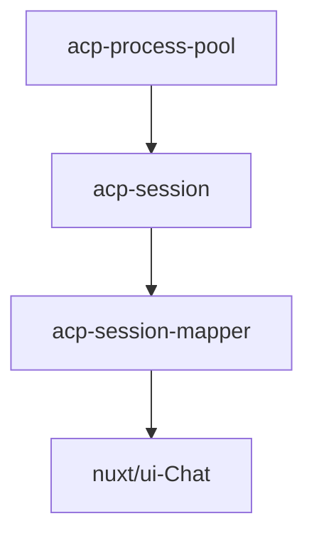

# Using ACP as the Agent Connection Layer

> This article records one core technical choice for FylloCode's Agent Runtime layer: why I did not adapt CLIs one by one, and instead placed ACP at the Agent connection layer while keeping an internal message layer for decoupling and fallback.

## First Encounter with ACP

When I was trying OpenClaw, I wanted to use it to drive `Claude Code` or `Codex` for coding tasks. While searching for options, I found OpenClaw's [acpx](https://github.com/openclaw/acpx), then learned it was a headless ACP Client that talks to Coding Agents through JSON-RPC 2.0 using the ACP protocol.

My original intent for FylloCode was to drive local Coding Agents installed by users. A conventional approach would define a compatibility layer, integrate each CLI one by one, and normalize each CLI's special behavior and parameters through that layer. But if FylloCode went that way, much of its development work would land on CLI adaptation, which should not be the product's focus.

So I started studying ACP more carefully.

ACP was first introduced by Zed and later advanced with IntelliJ. It does provide this kind of compatibility protocol. There are two roles in ACP: Agent and Client.

The current version (v1) includes these basic features:

**Agent capabilities**

| Capability | Description |
| --- | --- |
| image | Images in prompts |
| audio | Audio in prompts |
| embeddedContext | Embedded content in prompts, such as text blocks and files |
| MCP | MCP connections, including stdio, http, and sse |
| additionalDirectories | Additional directories when a session starts, extending the effective working directory |
| authentication | Authentication during connection setup, such as login or API key configuration |
| session/new | Create a new session |
| session/prompt | Client sends user content |
| session/cancel | Actively cancel a session |
| session/update | Session data updates, such as streamed output, Agent mode changes, plan lists, slash commands, and more |

**Session settings**

| Setting | Description |
| --- | --- |
| mode | Session mode. Agents return supported modes such as `YOLO`, `Accept Edits`, or `Bypass Permissions`. |
| model | Session model. Agents return supported model lists. |

ACP also supports filesystem and terminal operations, allowing Agents to hand file operations and command execution back to the Client.

ACP provides a registry as well. Agents that support ACP can submit to it, making it an official maintained list of Agents.

In April, the ACP registry already had 20+ Agents. Today it has nearly 40, plus many Agent products that support ACP but have not yet submitted to the registry.

This matters to FylloCode because I do not want it to become a collection of CLI adapters. If Agents are willing to speak ACP, FylloCode can spend more energy on session organization, task flow, and context capture instead of repeatedly handling launch parameters and output formats for different CLIs.

## Integrating ACP

ACP looks like a standard protocol and is still evolving. After weighing options, I chose to integrate ACP plus registry directly to avoid one-by-one CLI integration.

ACP naturally fits pooling. Each Agent can maintain one connection, and each connection can hold multiple sessions. During user-Agent conversations, FylloCode only needs to receive `session/update` events and push them to the renderer.

In FylloCode, this is not just a simple SDK call. ACP Agents are long-lived external processes, so they need a process pool for start, exit, retry, and cleanup. A session is a business-visible resource and needs to be separated from the Agent process lifecycle. Streamed events must also be consumed reliably by the frontend. Therefore, a runtime layer is needed for connection management, session management, event mapping, and error normalization.

I did not choose to push raw ACP messages directly. I wanted decoupling, so that if ACP slows down or gets abandoned in the future, FylloCode still has a way back. I chose an intermediate `ai-sdk` layer. The reason is simple: it supports both service and renderer layers.

- On the service layer, it can integrate models from multiple vendors, which means its message format is balanced and extensible. FylloCode might build its own Agent on top of `ai-sdk` later.
- On the renderer layer, it supports `React` and `Vue`. After Vercel acquired Nuxt, Nuxt released a feature-rich Chat UI kit with good extension points.

If raw ACP messages were passed directly to the frontend, the short-term implementation would be simpler, but the frontend would be tied to ACP event structures. Any future ACP schema change or non-ACP Agent integration would become a larger migration.

So the integration path is:

The core logic is straightforward. Even if ACP becomes a problem, FylloCode can fall back to direct LLM integration through `ai-sdk`.

FylloCode has already implemented ACP process pool, session management, `session/update` to internal event mapping, and multi-Agent `tool_call` compatibility. ACP is now part of the core session infrastructure in FylloCode.

## The Awkward ACP Adapter Problem

After using ACP for two months, I strongly feel it is a survival move by traditional IDE vendors. They want users to use multiple Agents without leaving the IDE. If they build their own Agents, they face pressure from both IDE competitors and Agent vendors. ACP is a reasonable direction.

When FylloCode first integrated ACP, the common Agents were `Claude Code`, `Codex`, `Gemini CLI`, and `OpenCode`. `Gemini CLI` and `OpenCode` are open source and quickly adopted ACP with strong support. But the two larger products did not support ACP natively, so ACP official projects created two adapters.

`Claude Agent` is based on `Claude Agent SDK`, and `Codex ACP` is based on the `Codex` module. Both approaches are somewhat unstable. Features can lag behind the official Agent experience, and Claude announced that subscription users consume separate quota when using `Claude Agent SDK`.

The problem with adapters is that they cannot fully represent native experience. When the upstream CLI or SDK changes, the adapter must chase it. Many details are not about whether it can run, but whether it can express what the Agent is doing in a stable way. For Clients, those differences become compatibility cost in UI state, permission requests, and tool call display.

Fortunately, more Agents now support ACP natively, including `Qodercli` and `Kimi Code`. Domestic model vendors are still pushing forward, so we do not have to be locked to one vendor.

## The Openness of ACP

ACP is very open. To reduce difficulty for Agent products, many events and fields in the schema are optional. The most frustrating one for me is `tool_call`. In ACP, almost every field of `tool_call` is optional. Except for `toolCallId` and `title`, fields such as `status`, `kind`, `rawInput`, `rawOutput`, `content`, and `locations` are optional. The protocol also does not define when each field should appear. That means different Agent behaviors are all legal, and Clients must handle compatibility to provide a good experience.

I tested five Agents: `Claude Agent`, `Codex ACP`, `Gemini CLI`, `OpenCode`, and `Qodercli`. The results are [here](https://github.com/Fioooooooo/FylloCode/tree/main/references/third-party/acp/tool-call-trace). In one sentence: it is messy. I had to build another compatibility layer for `tool_call`.

These differences may look small at the protocol level, but they are obvious in the product. For the same file edit, one Agent may first send a tool title, another may send a diff first, and another may only fill content after completion. Without extra processing, users do not see a stable tool call flow. They see fragments with inconsistent timing.

I did not write a long chain of Agent-specific if/else logic. Instead, I treat `tool_call` and `tool_call_update` as events whose fields may arrive in unstable positions. Whether `rawInput`, `content`, or `locations` appears at start or update, the same extraction logic handles it. Cross-event compensation is left to the downstream assembler through lazy upsert, instead of making the mapper maintain state.

This boundary matters for Agent Runtime. The mapper only normalizes one ACP event into one internal event. The assembler combines multiple events into messages users can understand. This keeps compatibility logic from becoming a huge state machine and makes it easier to add new Agents later.

## ACP's Future

ACP has recently started planning v2 RFDs. Some problems are being improved, and recent meetings mentioned that future ACP will be "Not only for Editors", meaning the protocol is moving toward broader use.

My attitude toward ACP is mixed. It solves the part FylloCode least wants to do: adapting CLIs one by one. But it also leaves many compatibility costs to the Client. For me, ACP is still worth betting on, but it should not be treated as a fully mature standard.

If ACP is treated as just an API, many issues eventually surface in the UI. FylloCode treats it as the access layer of Agent Runtime: processes must be governed, sessions must be managed, events must be normalized, and protocol risk must be isolated. Only when these foundations are stable can the upper Agent workflow continue to expand.
