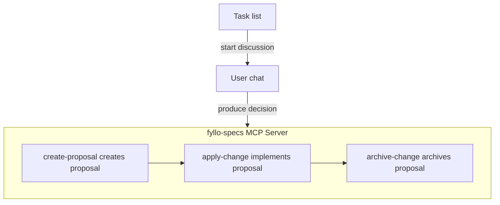

# Lineage: Giving Agents Engineering Context

> As the Proposal path became stable, I needed FylloCode to record something more important: where a requirement came from, which discussions happened along the way, why it became this design, and which code commit finally landed it.

For humans, `git blame` can answer "who changed this line and when". After Agents enter the development workflow, that answer is not enough. Agents need to know why the change was made, what the original user task was, which options were rejected in discussion, and which decisions were written into the final Proposal.

If this information stays only in chat history, task systems, and commits, it is scattered. The next time an Agent tries to understand a piece of code, it still has to search again, guess again, and ask people again.

So I wanted to add a causal chain to FylloCode. It connects Task, Chat Session, Proposal, and Archive Commit, making the path from requirement to implementation queryable. I call this path `Lineage`.

To design Lineage, I first reviewed the existing FylloCode flow:



FylloCode promotes the `Task -> Proposal -> Apply -> Archive` work path. Lineage records the key values when the path moves between important nodes, and it does so in an engineering way.

::: tip Why emphasize engineering
Lineage needs stable writes and stable reads. Things suitable for engineering systems should not be delegated to open-ended Agent generation. Agents are better at judgment, analysis, and expression. Link integrity should be guaranteed by the system.
:::

## The Lineage Data Structure

A Lineage needs to associate:

- Task ID
- Task source
- Session ID
- Proposals produced by the session
- Commit hash when a proposal is archived

Several constraints matter:

1. One task may start multiple discussions.
2. One discussion may produce multiple Proposals.
3. A Proposal may not come from an existing task. It may come from an open chat.
4. A chat-origin trace can create a task later, but its origin must not be rewritten.

So the structure is:

```typescript
interface Lineage {
  id: string;
  origin: "task" | "chat";
  task: {
    ref: `${source}:${taskId}`;
    snapshot: TaskItem;
    capturedAt: string;
  } | null;
  links: {
    sessionId: string;
    createdAt: string;
    proposals: {
      changeId: string;
      createdAt: string;
      commitHash?: string;
    }[];
  }[];
  createdAt: string;
  updatedAt: string;
}
```

- `origin` marks whether the Lineage started from a task or from a chat.
- `task` uses `ref` to mark both task source and task ID, and stores a task snapshot.
- `links` is the session list under this task, including session ID and produced proposals.
- `proposals` records the produced `changeId` and final commit hash.

One important design point: `origin` never changes after creation.

If an open chat later creates a local task, the Lineage can receive the task, but `origin` remains `chat`. Later queries can still tell that this task was created after discussion, not selected from the task list at the beginning.

This small detail is useful for later analysis. It separates task-driven discussions from tasks produced by discussion, and both collaboration patterns will become more common in the AI era.

## Subject and Index

After defining the Lineage structure, an index file is still needed. Otherwise, when an Agent already knows a `taskRef`, `sessionId`, `changeId`, or `commitHash`, it cannot quickly find the corresponding Lineage.

So I split Lineage into two parts:

1. `Subject`: the authoritative data for one trace.
2. `Index`: a derived reverse lookup from task, session, proposal, and commit hash to subjectId.

FylloCode is a local-first desktop app, and Lineage is project-level data, so it is isolated by project. In userData, the structure is roughly:

```text
projects/<encodedProjectId>/
  lineage/
    index.json
    subjects/
      <subject-id>.json
```

```typescript
interface LineageIndex {
  version: 1;
  tasks: Record<string, string>;
  sessions: Record<string, string>;
  proposals: Record<string, string>;
  commitHashes: Record<string, string>;
  updatedAt: string;
}

interface LineageSubject {
  id: string;
  origin: "task" | "chat";
  task: {
    ref: `${source}:${taskId}`;
    snapshot: TaskItem;
    capturedAt: string;
  } | null;
  links: {
    sessionId: string;
    createdAt: string;
    proposals: {
      changeId: string;
      createdAt: string;
      commitHash?: string;
    }[];
  }[];
  createdAt: string;
  updatedAt: string;
}
```

`subjects/*.json` is the source of truth, while `index.json` is a rebuildable derivative. This has two benefits:

1. Writes are scoped to one subject file, reducing the risk of corrupting shared state.
2. If the index is missing or broken, it can be rebuilt by scanning subjects.

This matters because Lineage is not only for current page display. Future Agents will use it for decisions, so it needs basic self-healing instead of merely "running once".

## Implementation Path

With the data structure defined, FylloCode's main-process layering requires lineage `ipc`, `service`, `domain`, and `infra`, plus renderer calls at the right places.

The simplest path starts from the task page:

1. The user starts a Chat Session from a task.
2. The main process creates or reuses the Lineage Subject for that task.
3. After the Session is created, `sessionId` is attached to the Subject.
4. Later Proposals and Commits attach to the same Subject.

This part is not hard. The harder parts are:

1. How should Session connect to Proposal?
2. How should an open chat create a local task later?
3. After Proposal archive, how should FylloCode get the commit hash?

### Connecting Session to Proposal

Connecting Session to Proposal is conceptually simple. The hard part is making ACP Agents and FylloCode coordinate reliably.

FylloCode has no built-in Agent capability. It connects different Agents through ACP. Each Agent is independent, and ACP is only the communication protocol. At the same time, Proposal creation comes from the `fyllo-specs` MCP Server, and I do not want that MCP Server to contain lineage business logic.

I considered three options:

| Option | Benefit | Problem | Decision |
| --- | --- | --- | --- |
| Intercept ACP `tool_call` events | Transparent to Agents and natural as a chain | ACP `tool_call` fields are too loose and differ heavily across Agents | Rejected |
| Add a lineage MCP tool | Clear semantics and separate responsibility | Extra tool schema wastes tokens and depends on the Agent remembering to call it | Rejected |
| Extend `create-proposal` | Can reliably get `sessionId` and `changeId` | Lineage business logic must not be placed inside the MCP Server | Adopted as a variant |

The rejected option here was a write/linking tool that Agents would have to call after proposal creation. The later `fyllo-cortex.lineage` tool is different: it is a read-only lookup tool for tracing existing code, commits, or proposals back to their design context.

The first option looked most reasonable at first. Use engineering to solve an engineering problem. But tests showed that **ACP's `tool_call` shape is too loose for stable interception**.

Different Agents send different parameters for the same tool. The only required fields are `toolCallId` and `title`. Claude Agent may use title `mcp__fyllo-specs__create-proposal`, Codex ACP may use `fyllo-specs/create-proposal`, and Gemini CLI may even split one tool call into two `toolCallId`s.

The second option also has an obvious cost. A low-frequency tool would inject its description and schema into every new session, adding token cost. It would also require system reminders or prompt injection to tell the Agent to call another tool after `create-proposal`. That convention depends too much on instruction following, and one missed call breaks Lineage.

The final solution is a variant of the third option:

`create-proposal` does not perform lineage business logic. After Proposal creation succeeds, it writes an event into FylloCode userData. The main process watches that event, then calls the lineage service to attach `sessionId` and `changeId`.

The event looks like:

```json
{
  "server": "fyllo-specs",
  "tool": "create-proposal",
  "sessionId": "<session-id>",
  "changeId": "<changeId>",
  "createdAt": "<ISO Date>"
}
```

This keeps the MCP Server responsible only for writing events that really happened. Lineage orchestration remains in the FylloCode main process.

I also plan to generalize this into an MCP event spool. If other MCP tools need to communicate with the main process later, they can reuse the same mechanism instead of adding temporary channels.

### Reliability of Event Consumption

Once file events are used, reliability has to be designed explicitly. I do not rely on `fs.watch` for accurate delivery because it is not a reliable message queue.

The current approach is:

1. One JSON file per event, avoiding concurrent overwrite.
2. Write to a temporary file first, then rename, avoiding half-written reads.
3. Use `fs.watch` only as a signal that something changed.
4. Always scan the event directory with `readdir` during consumption.
5. Delete an event only after successful consumption.
6. On watcher start, scan leftover events first to recover from previous crashes.

This mechanism is simple, but it handles concurrency, half writes, duplicate notifications, missed notifications, and crash recovery.

For this kind of infrastructure, I prefer practical stability over something that looks advanced. If Lineage data is lost, users may not notice immediately, but future Agents will see holes when tracing decisions.

### Creating Local Tasks from Sessions

Why does a Session need to create a local task?

Many conversations begin as ideas rather than clear tasks. A user may chat with an Agent first, then realize the idea should become a Proposal and should also become a task.

I want Lineage to eventually land on a real task, even if the task is created from the Session later. But whether to create that task must be decided by the user. The Agent should not create it automatically.

This requires interaction between the Agent and FylloCode UI. If ACP allowed host tools to be injected directly, this would be easier. But ACP does not support that kind of host tool extension, and many Agent products probably would not want such tight coupling.

I chose a simple approach: let the Agent output a controlled tag, let FylloCode parse it, and render a user-confirmable UI.

FylloCode's Chat renderer is based on `markstream-vue`, which supports custom Vue components from custom HTML tags. I defined a `fyllo-action` protocol:

```html
<fyllo-action type="task.create">
  { "title": "Add error handling", "description": "Organize exception branches" }
</fyllo-action>
```

This does not let the Agent control the UI directly. The Agent can only output a controlled `type` and strict JSON payload. Buttons, state, handlers, and IPC channels are controlled by FylloCode. Only after the user confirms does FylloCode call `lineage:createSessionTask` to create the local task and bind it back to the current Session's Lineage Subject.

I accept using a system reminder to guide the Agent to output `<fyllo-action>` because task creation is optional. If the Agent does not output it, the main path is not broken. The user only loses a shortcut. By contrast, Session to Proposal linking is required, so it cannot rely on prompt convention.

### Getting the Proposal Commit Hash

The last problem is the commit hash for a Proposal.

This has landed, but it is a staged solution. Commit hashes are tricky. Although `archive-change` can auto-commit and auto-merge and can obtain a commit hash during archive, later rebase, squash, or manual history cleanup can change it.

The current approach is lazy persistence:

1. When reading Lineage, check whether the corresponding Proposal has been archived.
2. If archived, try to find the commit hash recorded in the archive directory.
3. If Lineage does not have the hash yet, persist it.
4. If it already has a hash, do not overwrite it.

This prioritizes eventual consistency on the read side and does not claim the commit hash is always accurate. A fuller solution should bind the commit hash earlier in Archive and add validation and repair when hashes become invalid.

For now, I prefer stating the boundary clearly instead of pretending the current system is perfect. Architecture design often needs to define what the current system can and cannot guarantee, then fill gaps step by step.

## Why Lineage Matters

Lineage looks like a data structure plus several IPCs. What it really tries to solve is project memory after Agents enter engineering.

In the past, humans remembered many things:

- Who first raised this requirement.
- Why another option was not chosen.
- Which boundary came from historical reasons.
- Which small-looking change affected later architecture.
- Why a module must not be refactored casually.

If this information only exists in human memory, chat history, and PR comments, it basically does not exist for Agents. The next Agent still has to reconstruct the puzzle from code and git history.

Lineage turns this information into part of the project. It does not replace code, specs, or guidelines. It connects them along the path of a real engineering task.

In the future, when an Agent asks "why is this interface designed this way", it should not only see one blame line. It should be able to trace:

1. Which task produced the change.
2. What the user and Agent discussed.
3. Which tradeoffs were written in the Proposal.
4. Which Archive landed it on the main path.
5. How later tasks continued from the same path.

This is what I keep thinking about while building FylloCode: AI-era engineering collaboration should not only make Agents write code faster. More importantly, the project should preserve the judgment produced in each collaboration so the next collaboration starts from better context.

Lineage is a foundational capability in that direction. It is not flashy, but I think it is critical. Only when a project has a traceable path can an Agent gradually move from a one-time executor toward a collaborator that understands project evolution.
