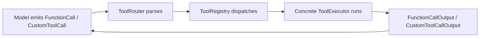
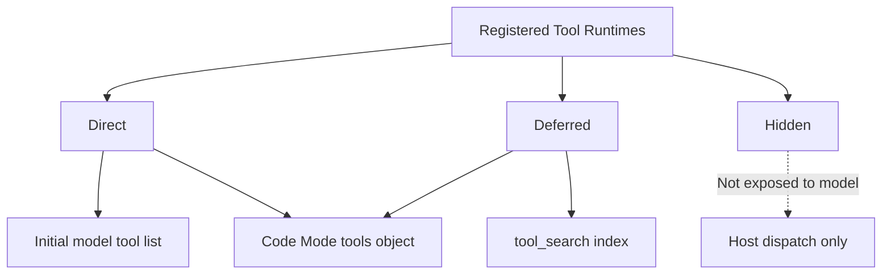
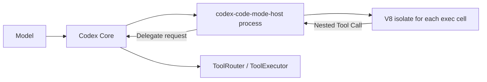
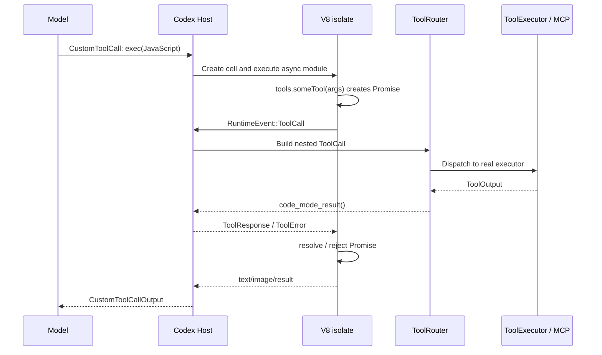
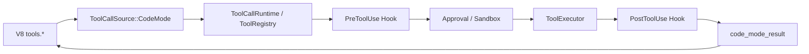

# Codex Tool Calling and the V8 Isolate Execution Pipeline

> I originally assumed Codex tool calling worked like it does in most agents: the model returns a tool name and arguments, the host executes the tool, and the result goes back to the model. Then `functions.exec`, `tools.*`, and `ALL_TOOLS` appeared in one session, and I realized that Codex was experimenting with another approach: letting the model write a small JavaScript program and apply its coding ability directly to tool orchestration.

## A Note on the Evidence

This article does not infer internal implementation details from the behavior observed in a single session. Every claim about Codex mechanisms is grounded in OpenAI's official open-source [`openai/codex`](https://github.com/openai/codex) repository. The source baseline is pinned to commit [`c888e8e75a9f0e90ce7d5517f8b9540832cbbf76`](https://github.com/openai/codex/tree/c888e8e75a9f0e90ce7d5517f8b9540832cbbf76) from July 12, 2026. Pinning the commit keeps the article's conclusions and source links aligned even as `main` changes.

One caveat matters up front: the source marks `CodeMode` and `CodeModeOnly` as `UnderDevelopment` and disables them by default. The supporting `CodeModeHost` is stable and enabled by default. This article therefore describes a capability that Codex is actively developing and that was enabled in this session; it does not claim that every Codex installation uses this tool-calling path by default. See the definitions in [`codex-rs/features/src/lib.rs`](https://github.com/openai/codex/blob/c888e8e75a9f0e90ce7d5517f8b9540832cbbf76/codex-rs/features/src/lib.rs#L92-L98) and the feature stage configuration at [`L853-L869`](https://github.com/openai/codex/blob/c888e8e75a9f0e90ce7d5517f8b9540832cbbf76/codex-rs/features/src/lib.rs#L853-L869).

## Codex Has Not Abandoned Traditional Tool Calls

Code Mode is an additional orchestration layer, not a wholesale replacement for the traditional tool protocol.

On the normal path, `FunctionCall`, client-executed `ToolSearchCall`, and `CustomToolCall` items in the model response are converted by `ToolRouter::build_tool_call` into a unified internal `ToolCall`. It contains the tool name, `call_id`, and one of several payload types. The source shows this directly in [`codex-rs/core/src/tools/router.rs#L113-L158`](https://github.com/openai/codex/blob/c888e8e75a9f0e90ce7d5517f8b9540832cbbf76/codex-rs/core/src/tools/router.rs#L113-L158):

```rust
match item {
    ResponseItem::FunctionCall { name, namespace, arguments, call_id, .. } => {
        let tool_name = ToolName::new(namespace, name);
        Ok(Some(ToolCall {
            tool_name,
            call_id,
            payload: ToolPayload::Function { arguments },
        }))
    }
    ResponseItem::CustomToolCall { name, namespace, input, call_id, .. } => {
        Ok(Some(ToolCall {
            tool_name: ToolName::new(namespace, name),
            call_id,
            payload: ToolPayload::Custom { input },
        }))
    }
    // ...
}
```

The `ToolRouter` then passes the call to an executor in the registry. The result is not disguised as ordinary chat text. It becomes a `FunctionCallOutput` or `CustomToolCallOutput` in the Responses protocol; the relevant branches are visible in [`codex-rs/core/src/tools/context.rs#L475-L499`](https://github.com/openai/codex/blob/c888e8e75a9f0e90ce7d5517f8b9540832cbbf76/codex-rs/core/src/tools/context.rs#L475-L499).

The fundamental Codex loop therefore remains:



What makes Code Mode different is that the model first calls a top-level custom tool named `exec`, which then makes one or more nested tool calls internally.

## Tools Are Not Merely Visible or Invisible

To understand Code Mode, we first need to understand Codex's tool exposure model.

`ToolExecutor` places a tool's descriptive `spec` and its actual `handle` implementation in the same runtime contract. It also defines four `ToolExposure` variants, documented clearly in [`codex-rs/tools/src/tool_executor.rs#L13-L68`](https://github.com/openai/codex/blob/c888e8e75a9f0e90ce7d5517f8b9540832cbbf76/codex-rs/tools/src/tool_executor.rs#L13-L68):

| Exposure | Meaning |
| --- | --- |
| `Direct` | Visible to the model in the initial tool list and also available as a nested tool when Code Mode is enabled |
| `Deferred` | Registered but omitted from the initial tool list until discovered later |
| `DirectModelOnly` | Callable directly by the model but excluded from the nested Code Mode tool surface |
| `Hidden` | Kept in the dispatch registry but not exposed to the model |

The crucial point is that **registration, initial visibility, discoverability, and executability are four separate concerns.**

`build_model_visible_specs_and_registry` adds only `Direct` and `DirectModelOnly` specs to the model request, while still building the registry from every runtime. See [`codex-rs/core/src/tools/spec_plan.rs#L233-L271`](https://github.com/openai/codex/blob/c888e8e75a9f0e90ce7d5517f8b9540832cbbf76/codex-rs/core/src/tools/spec_plan.rs#L233-L271). This is what makes it possible for a tool to be registered and dispatchable at runtime without placing its full schema in the initial context.

## Three Coexisting Tool Discovery Paths

The current source contains at least three related paths:

1. **Direct tool call**: the tool spec goes directly into the model request, and the model returns the tool name and arguments.
2. **`tool_search`**: `Deferred` tools first enter a search index; the model searches for them and then calls a matching tool.
3. **Code Mode**: the model calls `exec` and uses nested tools through `tools.*` in JavaScript.

`tool_search` did not disappear when Code Mode arrived. `append_tool_search_executor` collects search metadata from `ToolExposure::Deferred` tools and registers the search tool when candidates actually exist. See [`codex-rs/core/src/tools/spec_plan.rs#L959-L980`](https://github.com/openai/codex/blob/c888e8e75a9f0e90ce7d5517f8b9540832cbbf76/codex-rs/core/src/tools/spec_plan.rs#L959-L980).

The official App Server repository documentation also explains `deferLoading`: deferred tools remain registered and callable from `code_mode`, but they do not appear in the model's tool list for a normal turn. When `tool_search` is available, they can also be searched for and exposed. See [`codex-rs/app-server/README.md#L1555-L1568`](https://github.com/openai/codex/blob/c888e8e75a9f0e90ce7d5517f8b9540832cbbf76/codex-rs/app-server/README.md#L1555-L1568).

Code Mode and `tool_search` are therefore not simple substitutes. They are two different forms of progressive disclosure:



## `exec` Is Still a Tool

Codex does not let the model emit arbitrary code and then guess whether it should be executed. `exec` is itself a formally registered freeform tool.

Its input is constrained by a Lark grammar to raw JavaScript text, optionally preceded by a first-line `// @exec: {...}` pragma, rather than JSON arguments. See the constructor in [`codex-rs/core/src/tools/code_mode/execute_spec.rs#L6-L34`](https://github.com/openai/codex/blob/c888e8e75a9f0e90ce7d5517f8b9540832cbbf76/codex-rs/core/src/tools/code_mode/execute_spec.rs#L6-L34).

The outermost layer still uses the traditional protocol:

```text
Model → CustomToolCall(name = "exec", input = JavaScript) → Codex Host
```

The difference is that the `exec` payload is no longer a set of arguments for one tool. It is a program that describes how tools should be composed.

## V8 Does Not Necessarily Run Inside the Codex Core Process

To keep the main tool-calling path clear, the earlier explanation simplified `exec` to “the Codex runtime creates a V8 isolate.” In the current source, however, V8 does not necessarily run inside the Codex Core process. With `CodeModeHost` enabled, it runs in a separate `codex-code-mode-host` child process; otherwise it runs inside the Core process.

`ThreadManager` selects a session provider based on the `CodeModeHost` feature. It uses `ProcessOwnedCodeModeSessionProvider` when the feature is enabled and `InProcessCodeModeSessionProvider` otherwise. See the selection logic in [`codex-rs/core/src/thread_manager.rs#L336-L350`](https://github.com/openai/codex/blob/c888e8e75a9f0e90ce7d5517f8b9540832cbbf76/codex-rs/core/src/thread_manager.rs#L336-L350).



The standalone program lives in [`codex-rs/code-mode-host`](https://github.com/openai/codex/tree/c888e8e75a9f0e90ce7d5517f8b9540832cbbf76/codex-rs/code-mode-host). `ProcessOwnedCodeModeSessionProvider` creates remote sessions. If the host program is unavailable, the current implementation falls back to an in-process session instead of pretending startup succeeded or making the model handle a process-level error. See the fallback branch in [`codex-rs/code-mode/src/remote_session.rs#L67-L103`](https://github.com/openai/codex/blob/c888e8e75a9f0e90ce7d5517f8b9540832cbbf76/codex-rs/code-mode/src/remote_session.rs#L67-L103).

Thus, a “fresh V8 isolate” describes JavaScript execution isolation, while a “standalone Code Mode Host” describes process isolation between Codex Core and the V8 runtime. They are different layers.

## What Exactly Is Injected into V8

The official description of `exec` comes from [`codex-rs/code-mode-protocol/src/description.rs#L10-L35`](https://github.com/openai/codex/blob/c888e8e75a9f0e90ce7d5517f8b9540832cbbf76/codex-rs/code-mode-protocol/src/description.rs#L10-L35). The source explicitly states that:

- Each code snippet runs as an async module in a fresh V8 isolate.
- All nested tools live on the global `tools` object.
- There is no Node.js, filesystem, network access, or `console`.
- Unawaited promises are discarded when the script ends.
- `ALL_TOOLS` provides `{ name, description }` metadata for enabled nested tools.
- `text()`, `image()`, `store()`, `load()`, `notify()`, and `yield_control()` are host-injected helpers.

This is not merely a documentation convention. `install_globals` actually removes `console`, `Atomics`, `SharedArrayBuffer`, and `WebAssembly`, then installs `tools`, `ALL_TOOLS`, and the helpers on the V8 global object. See [`codex-rs/code-mode/src/runtime/globals.rs#L14-L46`](https://github.com/openai/codex/blob/c888e8e75a9f0e90ce7d5517f8b9540832cbbf76/codex-rs/code-mode/src/runtime/globals.rs#L14-L46).

`tools` and `ALL_TOOLS` are derived from the same `enabled_tools` collection. The former turns each entry into a callable function; the latter exposes only tool names and descriptions. See [`globals.rs#L49-L99`](https://github.com/openai/codex/blob/c888e8e75a9f0e90ce7d5517f8b9540832cbbf76/codex-rs/code-mode/src/runtime/globals.rs#L49-L99).

`ALL_TOOLS` is therefore neither another network service nor global knowledge that the model somehow possesses. It is simply a lightweight catalog inside the current V8 cell:

```js
const matches = ALL_TOOLS.filter(({ name, description }) =>
  `${name} ${description}`.toLowerCase().includes("knowledge")
)

text(matches)
```

If a deferred tool is not expanded in the `exec` description, the model can still locate it by name and description in the catalog, then call the corresponding `tools.*` method.

## Why `tools.someTool()` Returns a Promise

V8 is not connected directly to the shell, MCP servers, or the filesystem. The functions under `tools.*` are host callback proxies.

For each nested tool call, `tool_callback` does four things:

1. Converts the JavaScript arguments to JSON.
2. Creates a V8 `PromiseResolver`.
3. Stores the resolver in `pending_tool_calls` under the call ID.
4. Sends `RuntimeEvent::ToolCall` to the host and returns the Promise to JavaScript.

See [`codex-rs/code-mode/src/runtime/callbacks.rs#L13-L72`](https://github.com/openai/codex/blob/c888e8e75a9f0e90ce7d5517f8b9540832cbbf76/codex-rs/code-mode/src/runtime/callbacks.rs#L13-L72). The core logic can be abbreviated as:

```rust
let resolver = v8::PromiseResolver::new(scope)?;
let promise = resolver.get_promise(scope);

state.pending_tool_calls.insert(id.clone(), resolver);
event_tx.send(RuntimeEvent::ToolCall { id, name, kind, input });
retval.set(promise.into());
```

After receiving the event, the host executes the real tool through the existing `ToolCallRuntime` and `ToolRouter`. When the result comes back, it resolves or rejects the corresponding Promise. On receiving `ToolResponse` or `ToolError`, the V8 runtime performs a microtask checkpoint so that the async JavaScript can continue. The main loop that creates a new isolate, installs globals, executes the module, and handles tool results appears in [`codex-rs/code-mode/src/runtime/mod.rs#L168-L220`](https://github.com/openai/codex/blob/c888e8e75a9f0e90ce7d5517f8b9540832cbbf76/codex-rs/code-mode/src/runtime/mod.rs#L168-L220).

The complete path is therefore:



Nested calls do not bypass the original routing path. `call_nested_tool` prevents `exec` from calling itself, reconstructs the nested request as a `ToolCall`, and submits it to the same `ToolCallRuntime` with `ToolCallSource::CodeMode`. See [`codex-rs/core/src/tools/code_mode/mod.rs#L274-L316`](https://github.com/openai/codex/blob/c888e8e75a9f0e90ce7d5517f8b9540832cbbf76/codex-rs/core/src/tools/code_mode/mod.rs#L274-L316). Code Mode is therefore an orchestration layer above the existing tool system, not a backdoor around the tool registry.

## One Tool Output Has Two Consumer Paths

Code Mode can reduce model context while retaining structured processing. The key is not merely `text()`, but the different representations that `ToolOutput` offers to different consumers.

The `ToolOutput` trait requires `to_response_item()`, which generates a protocol object that goes directly into the model context. It also provides `code_mode_result()`, which generates the value returned to V8 JavaScript. The latter converts from the former by default, but individual tools can override it. See the interface in [`codex-rs/tools/src/tool_output.rs#L20-L52`](https://github.com/openai/codex/blob/c888e8e75a9f0e90ce7d5517f8b9540832cbbf76/codex-rs/tools/src/tool_output.rs#L20-L52).

MCP provides the clearest example. `McpToolOutput::to_response_item()` constructs a model-visible `FunctionCallOutput`, while `code_mode_result()` serializes the raw `CallToolResult` directly. The model-visible path also adds wall time, strips image detail, and truncates according to conversation-history policy. A source comment explicitly notes that the Code Mode consumer still receives the raw `CallToolResult`. See [`codex-rs/core/src/tools/context.rs#L81-L145`](https://github.com/openai/codex/blob/c888e8e75a9f0e90ce7d5517f8b9540832cbbf76/codex-rs/core/src/tools/context.rs#L81-L145).

```text
ToolExecutor
  └─ ToolOutput
      ├─ to_response_item()  → Model protocol, formatting, and truncation
      └─ code_mode_result()  → Structured JavaScript value inside V8
```

Code Mode can therefore inspect `content`, `structuredContent`, or `isError` inside V8, perform filtering, mapping, and aggregation, and then return only the necessary result to the model through `text()` or `image()`. This uses less context than placing every raw output in the context and asking the model to read it.

## Why Sequential and Parallel Execution Become Natural

With traditional tool calls, dependencies are usually spread across several model round trips: call A, read the result, then decide whether to call B.

Code Mode can express the dependency directly in JavaScript:

```js
const project = await tools.get_project({ id: "p_123" })

if (project.status === "active") {
  const result = await tools.get_activity({ projectId: project.id })
  text(result)
}
```

Independent reads can be written as:

```js
const [specs, guidelines] = await Promise.all([
  tools.read_specs({ project: "FylloCode" }),
  tools.read_guidelines({ project: "FylloCode" })
])

text({ specs, guidelines })
```

This should not be interpreted as “using `Promise.all` forces every tool to run in parallel.” The Code Mode dispatch worker starts a Tokio task for each nested call, as shown in [`codex-rs/core/src/tools/code_mode/delegate.rs#L93-L120`](https://github.com/openai/codex/blob/c888e8e75a9f0e90ce7d5517f8b9540832cbbf76/codex-rs/core/src/tools/code_mode/delegate.rs#L93-L120). But `ToolCallRuntime` still checks whether each tool declares `supports_parallel_tool_calls`. Calls that allow parallel execution acquire a read lock; calls that do not acquire a write lock. See [`codex-rs/core/src/tools/parallel.rs#L93-L156`](https://github.com/openai/codex/blob/c888e8e75a9f0e90ce7d5517f8b9540832cbbf76/codex-rs/core/src/tools/parallel.rs#L93-L156).

The model expresses that the tasks have no data dependency; the host retains final authority over concurrency admission.

## An `exec` Cell Does Not Have to Finish in One Call

By default, `exec` waits for the script to complete. A long-running task can instead call `yield_control()` to return accumulated output to the model while keeping the cell alive. The outer result then includes a cell ID, which the model can observe later through the top-level `wait` tool.

```text
exec starts cell
  → yield_control()
  → returns Script running with cell ID ...
  → cell keeps running
  → wait(cell_id)
      ├─ returns new output while cell remains alive
      ├─ returns final result and closes cell
      └─ terminate: true stops it explicitly
```

The `wait` arguments include `cell_id`, `yield_time_ms`, `max_tokens`, and `terminate`. Based on `terminate`, the handler calls either `wait` or `terminate` on the session. See [`codex-rs/core/src/tools/code_mode/wait_handler.rs#L21-L98`](https://github.com/openai/codex/blob/c888e8e75a9f0e90ce7d5517f8b9540832cbbf76/codex-rs/core/src/tools/code_mode/wait_handler.rs#L21-L98). The public descriptions of `exec` and `wait` live in [`codex-rs/code-mode-protocol/src/description.rs#L24-L43`](https://github.com/openai/codex/blob/c888e8e75a9f0e90ce7d5517f8b9540832cbbf76/codex-rs/code-mode-protocol/src/description.rs#L24-L43).

`store()` and `load()` provide a different kind of continuity. They save serializable values for later `exec` calls in the same session. What persists is a host-managed cell and serialized state, not an arbitrary JavaScript heap or a permanently running Node.js process.

## Why `CodeModeOnly` Can Reduce Context

In ordinary Code Mode, direct tools remain directly callable by the model and are also available as nested `tools.*` functions. `CodeModeOnly` goes further by hiding most ordinary tools from the model-visible list, leaving only `exec`, `wait`, and a small number of `DirectModelOnly` tools.

The source comment defines `CodeModeOnly` as limiting the model-visible tools to the `exec` and `wait` entry points. See [`codex-rs/features/src/lib.rs#L93-L98`](https://github.com/openai/codex/blob/c888e8e75a9f0e90ce7d5517f8b9540832cbbf76/codex-rs/features/src/lib.rs#L93-L98). The hiding condition in tool planning appears in [`codex-rs/core/src/tools/spec_plan.rs#L430-L441`](https://github.com/openai/codex/blob/c888e8e75a9f0e90ce7d5517f8b9540832cbbf76/codex-rs/core/src/tools/spec_plan.rs#L430-L441).

This saves schema volume in the model request, not tool execution capability. Many tools remain in the host registry and V8 `tools` object without being sent to the model as top-level tool definitions.

Code Mode Only does not entirely stop explaining nested tools to the model. In this mode, `build_exec_tool_description` appends TypeScript declarations and call examples for non-deferred tools to the `exec` description. Deferred tools receive only guidance telling the model to search through `ALL_TOOLS`. See [`codex-rs/code-mode-protocol/src/description.rs#L251-L319`](https://github.com/openai/codex/blob/c888e8e75a9f0e90ce7d5517f8b9540832cbbf76/codex-rs/code-mode-protocol/src/description.rs#L251-L319).

The optimization therefore reduces the cost of giving every tool its own top-level schema. It does not remove all tool knowledge from the context.

## The Security Boundary Is Not Delegated to the Model

Because the model can generate JavaScript, it is easy to mistake Code Mode for a Node.js REPL. The source shows otherwise:

- Every execution creates a fresh V8 isolate and context.
- There are no Node.js modules, filesystem access, network access, or `console`.
- Real capabilities are available only through host-injected `tools`.
- Which tools enter `tools` is controlled by `ToolExposure` and namespace exclusion rules.
- Nested calls still pass through `ToolRouter`, `ToolRegistry`, hooks, sandboxing, approval, and cancellation.
- `exec` cannot recursively call itself.
- Unawaited promises do not continue running after the isolate lifecycle ends.

The more precise call order is:



Before running a handler, `ToolRegistry` runs the `PreToolUse` hook, which can block the call or rewrite its input. After the handler finishes, it runs the `PostToolUse` hook, which can prevent the result from proceeding or replace the model-visible result with feedback. See the relevant branches in [`codex-rs/core/src/tools/registry.rs#L493-L539`](https://github.com/openai/codex/blob/c888e8e75a9f0e90ce7d5517f8b9540832cbbf76/codex-rs/core/src/tools/registry.rs#L493-L539) and [`L545-L663`](https://github.com/openai/codex/blob/c888e8e75a9f0e90ce7d5517f8b9540832cbbf76/codex-rs/core/src/tools/registry.rs#L545-L663).

Approval remains the responsibility of the concrete tool runtime. For example, an MCP call first runs `maybe_request_mcp_tool_approval`, which decides whether to enter the real call based on acceptance, acceptance for the session, rejection, or cancellation. See [`codex-rs/core/src/mcp_tool_call.rs#L226-L315`](https://github.com/openai/codex/blob/c888e8e75a9f0e90ce7d5517f8b9540832cbbf76/codex-rs/core/src/mcp_tool_call.rs#L226-L315). Sandboxing and escalation for shell-like tools also remain in their respective host runtimes, not in the V8 code.

The Approval / Sandbox node in the diagram does not mean every tool must show the same approval prompt. It means that each tool and the active policy remain responsible for permission decisions. JavaScript can only request capabilities already present under `tools`; it cannot approve itself on a tool's behalf.

V8 therefore does not grant system permissions. It provides an orchestration language that is familiar to the model, expressive enough for the task, and deliberately capability-limited.

## The Essential Difference from Traditional Agent Tool Calls

In the traditional pattern, the model primarily chooses the next action:

```text
Observe → choose tool A → wait → observe → choose tool B → wait
```

Code Mode lets the model submit a local execution strategy in one step:

```text
Observe → write a small orchestration program → host executes a multi-step tool graph → return filtered results
```

This change provides three direct benefits:

1. **Fewer model round trips**: deterministic sequences, conditions, and aggregation can stay inside one cell.
2. **Less context pollution**: JavaScript can filter or summarize tool outputs before returning only what matters through `text()`.
3. **Reuse of the model's coding ability**: `await`, `Promise.all`, conditional branches, loops, and error handling are natural tool-orchestration constructs.

It also introduces new complexity. Debugging must distinguish among the model's outer tool call, the V8 cell, nested calls, the real executor, and result adaptation. Errors can originate in JavaScript, schema conversion, host routing, permission approval, or an MCP server.

## My Interpretation

The most elegant part of Code Mode is not that “Codex can run JavaScript.” It is that Code Mode reuses the strongest prior capability of a coding agent.

Language models are already very good at writing small asynchronous programs. If tool calling can only express “tool name plus one JSON argument object,” the model's coding ability has little room to contribute at the orchestration layer. Code Mode maps the tool registry into a constrained SDK, allowing the model to express data dependencies, parallel relationships, conditional branches, and result trimming as code.

It does not eliminate traditional tool calls. The outer `exec` is still a custom tool call, and every inner `tools.*` invocation ultimately returns to the same `ToolRouter` and `ToolExecutor`. The innovation is the additional layer:

```text
The traditional tool protocol handles security, registration, dispatch, and result delivery
JavaScript Code Mode composes those tools
```

This moves Codex from having the model select tools one by one toward having the model generate a controlled tool execution graph.

## References

- [`codex-rs/code-mode-protocol/src/description.rs`](https://github.com/openai/codex/blob/c888e8e75a9f0e90ce7d5517f8b9540832cbbf76/codex-rs/code-mode-protocol/src/description.rs): generation of the descriptions for `exec`, `wait`, global helpers, and nested tools.
- [`codex-rs/code-mode/src/runtime/`](https://github.com/openai/codex/tree/c888e8e75a9f0e90ce7d5517f8b9540832cbbf76/codex-rs/code-mode/src/runtime): V8 isolates, global injection, and the bridge between Promises and runtime events.
- [`codex-rs/code-mode-host/`](https://github.com/openai/codex/tree/c888e8e75a9f0e90ce7d5517f8b9540832cbbf76/codex-rs/code-mode-host): the standalone Code Mode Host program and its process boundary.
- [`codex-rs/core/src/tools/code_mode/`](https://github.com/openai/codex/tree/c888e8e75a9f0e90ce7d5517f8b9540832cbbf76/codex-rs/core/src/tools/code_mode): adapters between Code Mode and Codex sessions, routing, and output protocols.
- [`codex-rs/core/src/tools/spec_plan.rs`](https://github.com/openai/codex/blob/c888e8e75a9f0e90ce7d5517f8b9540832cbbf76/codex-rs/core/src/tools/spec_plan.rs): planning for tool exposure, deferred loading, `tool_search`, and the Code Mode tool surface.
- [`codex-rs/core/src/tools/router.rs`](https://github.com/openai/codex/blob/c888e8e75a9f0e90ce7d5517f8b9540832cbbf76/codex-rs/core/src/tools/router.rs): the parsing and dispatch entry point from model response items to internal `ToolCall` values.
- [`codex-rs/core/src/tools/parallel.rs`](https://github.com/openai/codex/blob/c888e8e75a9f0e90ce7d5517f8b9540832cbbf76/codex-rs/core/src/tools/parallel.rs): tool concurrency admission, cancellation, and failure output.
