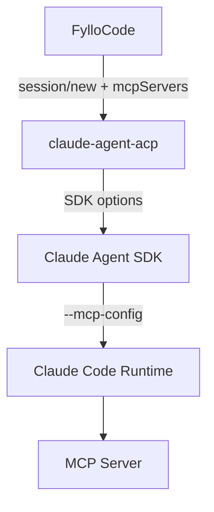

# The MCP Initialization Race in Claude ACP

For a while, Claude ACP could not reliably call the MCP servers injected by FylloCode. The error was blunt:

```text
<tool_use_error>Error: No such tool available: mcp__fyllo_specs__explore</tool_use_error>
```

The eventual fix was one environment variable:

```text
MCP_CONNECTION_NONBLOCKING=0
```

Finding that line required following the request through FylloCode, `claude-agent-acp`, the Claude Agent SDK, and the Claude Code runtime bundled with the SDK. One observation opened the case up: send a prompt immediately after creating a session and the tool was missing; wait about two minutes before sending the same prompt and it worked.

This article records that investigation. The evidence supports an initialization race in fresh sessions. Resuming a conversation after restarting the application exposes a second problem that the environment variable does not fix.

## One Fresh Session, Two Results

The first failure looked like a configuration mistake. FylloCode injects two bundled MCP servers when it creates an ACP session, including `fyllo-specs`. Claude ACP accepted the session, but the model reported that `mcp__fyllo_specs__explore` did not exist.

A misspelled server name, a failed stdio command, or a dropped ACP parameter should fail consistently. This did not.

I ran two fresh-session tests:

| Test | Action | Result |
| --- | --- | --- |
| A | Send the first message immediately after `newSession` and request `explore` | `No such tool available` |
| B | Wait about two minutes after `newSession`, then send the same message | The tool call succeeds |

Those two minutes changed the direction of the investigation. The MCP configuration had probably reached some layer of the stack, but the connection or tool registration was not ready when the first message arrived.

The “first prompt” here is not a special ACP initialization field. It is the first user message. `session/new` creates the session; model inference starts with `session/prompt`. If MCP connections start in the background, the first user message becomes the first request that can collide with that startup window.

## Checking FylloCode First

A timing difference does not prove that an upstream package is at fault. FylloCode could have passed the configuration late on an asynchronous path, or put an agent-level environment variable on the MCP child process instead.

I started by tracing `mcpServers` through the FylloCode session path:



`getBundledMcpServers` [builds the server list](https://github.com/Fioooooooo/FylloCode/blob/17481ebf0c45d1ef9739f5ca449da02192d1c818/src/main/services/session/chat/acp-session.ts#L147-L170) before the turn starts. FylloCode passes it to [`connection.newSession`](https://github.com/Fioooooooo/FylloCode/blob/17481ebf0c45d1ef9739f5ca449da02192d1c818/src/main/services/session/chat/acp-session.ts#L580-L584), and passes the same list through the [`resumeSession`](https://github.com/Fioooooooo/FylloCode/blob/17481ebf0c45d1ef9739f5ca449da02192d1c818/src/main/services/session/chat/acp-session.ts#L495-L514) and [`loadSession`](https://github.com/Fioooooooo/FylloCode/blob/17481ebf0c45d1ef9739f5ca449da02192d1c818/src/main/services/session/chat/acp-session.ts#L529-L549) recovery paths. The local log entry `bundledMcpServers=2` matched the code.

FylloCode had not omitted the parameter. The next question was whether the receiving adapter dropped it.

## Following claude-agent-acp into the SDK

The installed version was `claude-agent-acp 0.58.1`. Its dependency chain was:

| Layer | Installed version |
| --- | --- |
| `@agentclientprotocol/claude-agent-acp` | `0.58.1` |
| `@anthropic-ai/claude-agent-sdk` | `0.3.205` |
| Claude Code runtime bundled by the SDK | `2.1.205` |

The first two are recorded in [`v0.58.1/package.json`](https://github.com/agentclientprotocol/claude-agent-acp/blob/v0.58.1/package.json). The installed SDK package also contains a `claudeCodeVersion` field set to `2.1.205`. That field matters because the Agent SDK does not implement the whole MCP runtime itself. It launches the Claude Code executable shipped in the package.

The `claude-agent-acp` source did not show a missing handoff. Both `resumeSession` and `loadSession` enter `getOrCreateSession`, which passes `params.mcpServers` to `createSession`. That method converts ACP stdio, HTTP, and SSE entries into the SDK's `mcpServers` format. The relevant code is in [`v0.58.1/src/acp-agent.ts`](https://github.com/agentclientprotocol/claude-agent-acp/blob/v0.58.1/src/acp-agent.ts#L3471-L3688).

I also compared `claude-agent-acp 0.57.0` with `0.58.1`. The Claude Agent SDK moved from `0.3.202` to `0.3.205`, and the ACP SDK moved from `1.2.0` to `1.2.1`. The adapter's MCP mapping did not change with them. That pushed the main suspicion down into the runtime launched by the SDK.

The packaged SDK code completed the handoff. When a resume id is present it adds `--resume`; when `mcpServers` is non-empty it adds `--mcp-config`; then it launches the Claude Code runtime. Both arguments can be present in the version under inspection.

At this point FylloCode had sent the configuration, the adapter had converted it, and the SDK had assembled the runtime arguments. The remaining questions concerned how the runtime connects MCP servers and when it builds the model-visible tool list.

## 2.1.205 Was the Failing Version, Not the Starting Point

My first suspicion was that Agent SDK `0.3.204/0.3.205`, or their bundled runtime versions `2.1.204/2.1.205`, had just changed MCP behavior. The adjacent version numbers made that a reasonable place to start.

The Claude Code changelog pointed further back. Version `2.1.89` added `MCP_CONNECTION_NONBLOCKING=true` for headless `-p` mode, allowing the MCP connection wait to be skipped entirely. It also bounded connections supplied through `--mcp-config` to five seconds instead of waiting on the slowest server. The missing documentation for this behavior was later reported in [`anthropics/claude-code#41792`](https://github.com/anthropics/claude-code/issues/41792).

Runtime `2.1.205` was therefore the version at the scene, not the version that first introduced nonblocking startup. The SDK upgrade from `0.3.202` to `0.3.205` could still affect the observed behavior, but the startup policy itself goes back to runtime `2.1.89`.

That distinction saved time. Looking only at neighboring SDK releases would have encouraged me to find a change in the adapter diff that was not there.

## What the Runtime Reads

In this path, Claude Code is an executable inside the SDK package rather than TypeScript in the `claude-agent-acp` repository. Inspecting the installed package exposed three relevant environment variables:

```text
MCP_CONNECTION_NONBLOCKING
MCP_CONNECT_TIMEOUT_MS
MCP_SERVER_CONNECTION_BATCH_SIZE
```

The packaged runtime `2.1.205` reads `MCP_CONNECTION_NONBLOCKING`. With no value set, regular MCP connections follow the asynchronous path. Setting it explicitly to `0`, `false`, `no`, or `off` enables a bounded wait before the first turn continues. This is not an unlimited wait. If `MCP_CONNECT_TIMEOUT_MS` is unset, the limit is 5,000 milliseconds; unfinished connections continue in the background after that deadline.

This also settled where the variable belonged. The Claude Code runtime launched beneath `claude-agent-acp` reads it, so it must be present in the `claude-acp` agent process environment. Putting it only in the environment of FylloCode's MCP server would not expose it to the runtime.

## Upstream Reports Filled in the Shape of the Bug

The issue search was more useful once the query became specific: `headless`, `first prompt`, `deferred tools`, `resume`, and `No such tool available`.

Several reports matched parts of the local behavior:

- [`agentclientprotocol/claude-agent-acp#883`](https://github.com/agentclientprotocol/claude-agent-acp/issues/883) reports that a dynamically supplied stdio server in `session/new.mcpServers` never reaches the model's tool list. It was filed against `claude-agent-acp 0.59.0` and SDK `0.3.207`, showing that the symptom continued beyond the versions used here.
- [`anthropics/claude-code#43298`](https://github.com/anthropics/claude-code/issues/43298) describes deferred tools being frozen before remote MCP connections finish in headless mode. The servers eventually connect, but the tool snapshot for the prompt stays stale.
- [`anthropics/claude-code#43968`](https://github.com/anthropics/claude-code/issues/43968) is close to the later resume test: MCP tools exist on the first request, disappear after `--resume`, and direct calls return `No such tool available` without a useful connection error on stderr.

These reports were supporting evidence, not a substitute for the local trace. Their server types and versions differ. What they share is the failure shape: MCP configuration exists, connection or tool-snapshot timing goes wrong, and the model receives a tool list with entries missing.

## Closing with A/B Tests

I added `MCP_CONNECTION_NONBLOCKING=0` to the `claude-acp` process environment and repeated the tests:

| Experiment | Condition | Result |
| --- | --- | --- |
| A | Fresh session, default environment, prompt sent immediately | Fails because the tool is missing |
| B | Fresh session, default environment, wait about two minutes | Succeeds |
| C | Fresh session, `MCP_CONNECTION_NONBLOCKING=0`, prompt sent immediately | Succeeds |
| D | Environment variable set, restart FylloCode, resume an existing session | Resume succeeds, but the tool is still missing |

A, B, and C support the fresh-session diagnosis: the first prompt can enter the runtime before MCP tool registration finishes. A short startup wait avoids that window.

D split the incident into two bugs. FylloCode logged two MCP servers on recovery and `resumeSession` returned successfully, yet an `explore` call tens of seconds later still failed with `No such tool available`. That no longer looks like a connection that needs one more second. The resume path may drop dynamic MCP configuration, or it may freeze the tool snapshot before registration completes.

I considered raising `MCP_CONNECT_TIMEOUT_MS` to 30 seconds as a diagnostic. It could distinguish a connection that exceeds the default five seconds from a resume path that never updates its tool table. Thirty seconds is too long for every startup, though, and the experiment would still not be a suitable product fix, so I left it out.

## The Patch Stayed Small

FylloCode now sets one value only for the `claude-acp` agent process:

```ts
// TODO: Claude Code runtime 修复首轮 MCP 异步注册竞态后移除此临时兼容开关。
MCP_CONNECTION_NONBLOCKING: "0"
```

The patch is [`17481eb`](https://github.com/Fioooooooo/FylloCode/commit/17481ebf0c45d1ef9739f5ca449da02192d1c818). It does not affect other ACP agents and does not extend the timeout to 30 seconds. Its test verifies that an existing value is forced to `0` for `claude-acp`.

The patch makes one promise: a fresh Claude ACP session gets a bounded chance to register its MCP tools before the first user message is processed. The resume problem remains under observation at the upstream boundary.

## What I Would Keep from This Investigation

The most useful clue did not come from a source line. It came from narrowing an intermittent failure down to one repeatable difference: sending the first prompt immediately failed, while waiting two minutes worked. That turned what looked like malformed configuration into a timing problem.

The rest depended on leaving evidence at every layer: whether FylloCode sent the parameter, whether the adapter converted it, whether the SDK generated `--mcp-config`, when the runtime waited for connections, and when the model-visible tool list became fixed. Only after those questions had answers did the environment variable stop being a lucky guess.

The unresolved part matters too. Fresh sessions and resumed sessions produce the same error, but the A/B results say they should not be collapsed into one bug. The temporary fix stops where the evidence stops. A proper resume fix needs a clearer connection-status or tool-registration signal from upstream.
