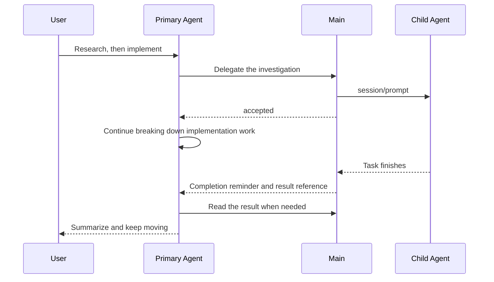

# fyllo-spawn: I Don't Want to Be the Go-Between for Every Agent

Once FylloCode could connect to ACP, I started switching Agents depending on the task.

When I land in a codebase I do not know, I ask an Agent that is good at reading code to map it out. If I need to check external material, I switch to another one for research. Once the direction is clear, I hand implementation to an Agent whose coding I trust more. Each step is fine on its own, and it is a lot more comfortable than betting everything on one model.

The trouble is in the handoffs.

I would open three conversations. When the first one finished, I would pick out a few conclusions and paste them into the second. The second would return a pile of links and opinions; I would filter those, then turn them into a task the third Agent could understand. If I wanted the first Agent to review the implementation, I had to explain the Proposal, the change scope, and the result all over again.

The Agents were doing the work. I was carrying messages between them.

That very ordinary annoyance is where `fyllo-spawn` came from. I wanted the primary Agent in the current chat to do that job instead. It already knows what the user is trying to solve, which files it has just read, and where the plan has reached. It is in a better position than I am to describe a small task clearly and bring the result back into the work at hand.

## This is not about opening more conversations

I want a user to be able to say something like this:

> Start Claude ACP for some investigation, use Gemini for research, then have Codex ACP implement it.

Or, after Codex has written a Proposal:

> Ask Claude ACP to review this Proposal and see whether it has any blocking issues.

Neither instruction contains a session ID, Agent configuration, or a prompt template. The user is expressing how they want to use different Agents. The primary Agent works out the rest: what to do first, what can be split out, who should receive it, and whether to follow up when a result comes back.

That is also why I did not put a "Delegate" button on the ACP Agents page. Clicking a button still asks the user to define the task boundary, reconstruct the context, and pick an Agent. The page does not understand the task in progress. The Agent in the conversation does.

`fyllo-spawn` is therefore an MCP server for the primary Agent, not a UI for manually opening child conversations. The primary Agent calls `available_agents` to see what is installed locally, then uses `prompt_to_agent` to send work out. It can create a spawned Session or continue asking the same Agent through an earlier `sessionId`.

At the ACP layer, the child Agent still receives an ordinary prompt. In FylloCode, that prompt belongs to a specific parent Session and Workspace. The primary Agent can check its status, read its result, or cancel it when needed, without exposing ACP-internal session IDs or local file paths.

## What the primary Agent should hand off

I do not want it to dump the entire parent conversation into a child Agent.

That would waste context, and the child does not need every piece of history anyway. A useful delegation should look like assigning work to a teammate: state the problem, the relevant places, the expected output, and the constraints. Leave unrelated conversation in the parent Session.

For example, the primary Agent might ask Claude ACP to do this:

```text
Read the current Proposal and the relevant implementation. Find issues that would block delivery.
Do not modify files. Return each issue as: the problem / why it blocks delivery / a suggested way to address it.
```

Claude's response does not become a fact by itself. It is review material for the primary Agent. The primary Agent still has to check it against the project: is the issue real, does the Proposal need to change, or did the reviewer miss some context?

That matters more than having several models vote on an answer. Child Agents work best on questions with a clear, separate finish line: reading code, researching, testing an assumption, or reviewing a document. The primary Agent, which has the broader context, decides what to change, how far to take it, and whether to continue.

## Why it has to run in the background

The first version of this idea was straightforward: the primary Agent made a tool call, waited for the child Agent to answer, and then continued.

Research and review do not always finish in a few seconds, though. While the primary Agent is blocked on one tool call, it cannot organize what it already knows or check something unrelated. The user only sees a chat that has stopped moving, which is not much better than switching to another terminal and waiting there.

`prompt_to_agent` now runs in the background by default. Once Main has persisted the task and sent the prompt to the target ACP Agent, it returns `accepted`. The primary Agent can keep moving, or send out another task that will not touch the same files. Main keeps the completed result, and the primary Agent receives a completion reminder before reading it with `check_session_status` and `read_response`.

The child's full response is not pushed straight into the primary Agent's context. A long investigation often contains plenty of process noise, and injecting all of it would crowd out the current task. The reminder says which delegation finished, its state, and whether a result can be read. The primary Agent decides how much to read and whether another Agent should check it.



## The UI shows the facts and stays out of the way

The bottom of the parent chat has an activity bar for spawned Sessions. It shows the Agent, task summary, state, and last update for each delegation. Opening one shows the original prompt, Activity, turn-organized records, and result references.

I did not give that panel controls for continuing, retrying, or cancelling work. Opening a detail view should only mean viewing it. A few clicks should not alter a task that is running. The primary Agent that created the delegation remains in control through MCP tools; Main owns the state and lifecycle.

There is a practical reason for this too: the window is not the source of truth. Close a window and the background task record remains; reopening it queries Main again. On the other hand, an application exit does not get dressed up as a task that is still running in the background. An unfinished turn is marked as interrupted. You can see why it did not finish, but FylloCode does not pretend it can resume from that point.

## The boundary matters more than the parallelism

Once several Agents can be delegated to at once, the tempting conclusion is that more parallel work must be better.

It is not. Every spawned Agent shares the Workspace directories fixed when the parent Session was created. FylloCode does not create a worktree for each delegation, provide file locks, or merge two sets of changes. Two Agents editing the same files only create conflicts and overwrite risk.

So I have kept the intended use deliberately narrow:

- Investigation, documentation reading, review, and test analysis can run in parallel.
- Implementation should run in parallel only after the file scopes have been separated.
- One spawned Session can have only one active turn.
- Child Agents do not receive `fyllo-spawn`, so they cannot spawn another layer underneath them.

The last constraint is not there because recursive delegation is impossible. I just do not want the first version to create a system with an unclear chain of responsibility. The user deals with one primary Agent. That Agent knows what it delegated. Every child task traces back to the same parent Session. That is enough to solve the problem I started with.

Permissions follow the same rule. A child Agent uses the `cwd` and extra directories fixed when the parent Session was created; delegation cannot grant it access to Projects added to the Workspace later. Child Agents also receive neither the FylloCode system reminder nor bundled MCP servers. They are Agents assigned a piece of work, not another primary Agent with the full FylloCode workflow at its disposal.

## What I am actually trying to remove

`fyllo-spawn` does not make technical decisions for people, and putting several Agents together does not guarantee a better answer.

What it removes is the work of sitting between conversations: waiting for a result, extracting a few paragraphs, changing windows, explaining the background again, and returning to see whether anything has finished. The user still decides which Agents they want to use and what they are trying to achieve. The primary Agent turns those choices into concrete delegations and brings their results back into one workflow.

For me, that is the next thing FylloCode should do after it supports several Coding Agents.
