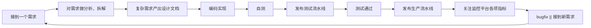

# 为什么要做 FylloCode

我是一个比较喜欢折腾的人，各种新工具、新应用出来后总想去试一试，了解它们想解决什么问题，以及准备用什么方式解决。

随着 Coding Agent 产品越来越多，我本机安装的 Agent 数量也越来越多，而且在使用过程中逐渐形成了自己的偏好。为了避免 *同源偏差*，我会跨 Agent 使用。比如一些跨模块的大范围改动，我会使用 `Claude Code` 做规划；一两个模块的改动，可能会使用 `Codex` 做规划；而具体任务实现时，可能会选择 `GLM`、`Kimi`、`Qwen` 这类国产模型，它们速度更快，指令遵循也不差。

这样多个 Agent + 不同模型配合起来，确实能让我获得比较高质量的任务结果。

但另一个问题也随之出现了。

## 终端开始失控

随着手上的需求越来越多，我会在 `Ghostty` 的 window 中开多个 Split Panel，每个 Panel 跑一个 Agent。同时搞多个项目时，还要多开 Terminal Window。

我是很喜欢命令行的，之前 `Arch Linux` 做了很多年的主力系统。但现在用 Agent 时间长了之后，我开始有些恶心，因为我会忘记这个 Panel 是哪个 Agent，以及它在做什么事情。

只能靠着我的记忆去判断：这个样式的是 `Claude Code`，这个样式的是 `Codex`，那个窗口里可能还跑着另一个项目的任务。

如果只是单纯“窗口太多”，那还算不上什么大问题，换一个更好的终端布局也许就能缓解。但真正让我觉得需要做点什么的，是这些 Agent 虽然都很强，却仍然散落在一个个独立的命令行会话里。

我需要不断重复发出类似的指令：

- `先审查涉及到的 xx 模块和 xx 模块的已有设计，考虑 xx 然后产出一个方案`
- `任务已经完成，把过程中做出的修改归纳总结到 xx 文档中`
- `参考项目现有规范，不要直接绕过已有的 IPC / storage / renderer 分层`

这些话本质上不是“需求”，而是我在反复补齐上下文、约束和工作流。

我认为既然 AI 时代已经到来，我们应该新事新办，而不是新瓶装旧酒，对着 Agent 还在发出以往的重复指令。所以我开始重新审视研发同学的日常工作流。

## 研发工作流本身是一个循环

大部分研发同学的工作流程大概是这样：

它看起来是一条线，但其实是一个循环。

每一次需求都会带来新的代码、新的取舍、新的经验，也可能带来新的问题。研发同学真正有价值的地方，不只是把这一次需求做完，而是把做需求过程中形成的判断、约束和知识沉淀下来，让下一次需求可以站在这一次的结果上继续往前走。

所以我想做的不是一个“更好看的终端”，也不是一个“把很多 Agent 放在一起聊天”的壳。

我想做的是：用工程化的约束 + Agent 的自主性，协助研发同学更快、更好地完成每一次闭环，并且让闭环之后产生的东西能够继续反哺项目。

在对现有工作流做了进一步抽象之后，FylloCode 的雏形就出来了。

## FylloCode 首先要接管这条工作流

FylloCode 需要具备几个基础能力：

1. 接收任务
2. 组织 Agent 对话，讨论和澄清需求
3. 基于讨论结果推进后续工作流
4. 在任务完成后，把有价值的信息沉淀回项目

接下来就是从产品层面考虑如何组织这些能力。

首先，这是一个大的工作流程。市面上目前已有的 Agent 工作流有很多，像 `spec-kit`、`superpower`、`GSD`、`OpenSpec` 等，它们各有优缺点，但我钟爱 `OpenSpec`。

原因也很简单：它除了有一套既定规范且支持扩展外，还有一个 CLI 可以从工程层面配合我把整套工作流建设起来。对我来说，一个工作流如果不能落到工程约束里，只停留在“建议你这么做”，最后很容易变成又一套靠人记忆维持的流程。

然后，我需要一套机制，能够让我方便地把本地的 Agent 组织起来。一开始我打算直接用 Agent CLI 的 headless 能力，甚至已经集成 `Claude Code` 做了尝试，但是考虑过后还是放弃了。

因为 FylloCode 的重点不应该是适配各种 CLI 的集成。如果把精力主要花在“这个 CLI 怎么启动、那个 CLI 输出怎么解析、另一个 CLI 的会话怎么恢复”上，产品很快就会被这些细节拖住。

一通搜索过后，我发现了 Zed 和 Intellij 联合推出的 `ACP`。虽然协议本身还不完善，也有一些缺点，但好在基础功能已经有了，而且越来越多的 Agent 在接入，所以可以拿来作为 Agent 连接层使用。

最后，也是很关键的部分：FylloCode 需要与外部的任务管理平台打通。

FylloCode 不应该做任务管理。现在已经有很多成型的产品了，它们经过多年的打磨，已经很完善了。FylloCode 只需要接入进来，把任务、代码、流水线、发布这些环节连接起来即可。

随着最近 skill + CLI 的概念火热，很多产品也开始通过这种方式把自己的入口暴露给 Agent。但在这个场景下，我却不太推崇完全依赖 skill 来集成。

因为像任务读取写入、代码 PR、流水线等功能，使用频率太高了。通过 skill 接入虽然看起来 *高大上*，但有一个重要缺陷：每一次 API 调用都需要耗费 token。而如果通过 API 接入，优点很明显：稳定、速度快、不消耗 token。

这些能力加在一起，FylloCode 至少可以先成为一个本地 Agent 的工作台。但这还不是我最想要的终点。

## 自动流转才是关键

我更希望 FylloCode 可以变成一个引领项目自进化的 Agent harness。

这里的重点不是“让 Agent 帮我写代码”，而是让 Agent 在一个被约束的研发系统里工作。它不是自由发挥，也不是每次都从零开始理解项目，而是会沿着项目已有的规范、设计、历史和知识继续往前走。

类比资深工程师，他们不会把一些规范约束、项目知识只记在脑子里。一个成熟的工程师会考虑如何把这些内容固化下来，指导小同学们在规范下做事，从而不会让项目跑偏。

Agent 也应该如此。

如果每次任务结束后，Agent 只是把代码改完，然后会话被关掉，那么大量有价值的信息就消失了。比如：

- 这次为什么选择了这个方案，而不是另一个方案
- 哪些模块边界不能被突破
- 哪些测试暴露了项目里的隐性约束
- 哪些重复出现的问题，应该沉淀成 guideline
- 哪些需求其实改变了项目能力边界，应该回到 spec 里

这些信息如果只存在于聊天记录里，本质上还是没有真正进入项目。下一次 Agent 接到类似任务时，仍然需要重新搜索、重新理解、重新犯错，然后由人再提醒一遍。

所以我希望 FylloCode 能把 `openspec archive + guidelines + lineage + knowledge` 自动流转起来。

`OpenSpec` 用来描述能力和行为边界，解决“这个项目应该做什么、做到什么程度”的问题。

`guidelines` 用来沉淀工程规范和项目约束，解决“在这个项目里应该怎么做”的问题。

`lineage` 用来记录关键任务、关键决策和演进脉络，解决“为什么当时这么做”的问题。

`knowledge` 用来承载更碎片但高频的项目知识，解决“下次遇到类似问题时，哪些上下文应该被自动带出来”的问题。

它们不应该是几个孤立的文档目录，而应该在每次任务里自动参与流转。

任务开始时，FylloCode 根据任务来源、涉及模块、历史变更和现有 spec，把相关上下文整理出来，交给 Agent。Agent 不需要靠一条很长的 prompt 去猜项目规则，而是一开始就站在项目当前状态上工作。

任务推进时，FylloCode 记录讨论、方案、代码变更、测试结果和人工反馈，把它们和任务本身关联起来。这样后续回看时，不是只能看到一个 commit，而是能看到这次变更背后的判断。

任务结束时，FylloCode 再反向判断：这次有没有新的规范需要补充？有没有设计决策需要进入 lineage？有没有能力变化需要归档到 OpenSpec？有没有高频知识应该沉淀为 knowledge？

只有这些内容流转起来，Agent 才不是一次性的代码生成器，而是一个会持续参与项目建设的工程协作者。

## 飞轮会从这里转起来

我理解的飞轮不是一个很玄的概念，而是一个很朴素的循环：

任务越多，沉淀越多；沉淀越多，下一次任务的上下文越准；上下文越准，Agent 做事越稳；做事越稳，人需要补充和纠偏的成本越低；成本越低，就越愿意把更多任务交给这个系统。

第一次做某类任务时，Agent 可能还需要大量搜索和确认。

第二次做类似任务时，FylloCode 已经知道这个模块的边界、常见坑、之前的取舍，以及哪些文档必须被参考。

第三次再做时，很多过去依赖人脑记忆的东西，就会变成系统自动拉取的上下文。

这就是我想要的飞轮。

它不是靠“模型突然变聪明”来获得收益，而是靠项目自己的知识资产不断变厚，让同一个 Agent 在这个项目里越来越懂这个项目。

这种收益对团队来说尤其重要。因为团队里永远会有人加入、有人切换模块、有人临时接手不熟悉的代码。过去这些信息往往散落在老同学的脑子里、群聊里、PR 评论里、某个已经没人看的文档里。

FylloCode 如果能把它们重新组织起来，并且在真正做任务时自动拿出来用，那项目就会慢慢拥有一种“记忆”。

这也是我说自进化的原因。

## 自进化不是让 AI 失控

我说的项目自进化，不是让 AI 随便改规范、随便重构、随便决定项目方向。

恰恰相反，自进化必须建立在工程约束之上。所有沉淀都应该可追踪、可审查、可回滚。Agent 可以提出“这条 guideline 需要更新”“这个 spec 应该补充一个场景”“这个模块的历史决策已经和现状不一致”，但最终是否接受，仍然应该进入明确的评审流程。

这样自进化才是健康的。

它不是把人的判断拿掉，而是把人的判断从大量重复提醒中解放出来。人不需要每次都告诉 Agent “这里不能这么做”“这个模块之前已经有约束”“这个问题上次踩过坑”，因为这些内容已经被系统沉淀，并且会在合适的时候自动出现。

人真正要做的是审查更高层的东西：这个方案是否更贴合业务？这个架构是否方便业务发展而扩展？这条规范是否值得固化？这个设计决策是否仍然成立？这次任务暴露的问题，是偶然问题，还是项目结构需要调整的信号？

当这个循环稳定之后，项目就不只是被动地接收需求、完成需求，而是会在每次需求之后变得更清楚一点：

- 更清楚自己的能力边界
- 更清楚自己的工程约束
- 更清楚哪些知识应该进入长期记忆
- 更清楚下一次任务应该如何开始

这就是我希望 FylloCode 最终做到的事情。

它接管的不是某一个 Agent，也不是某一条命令，而是研发工作流里那些过去依赖人脑、习惯和口口相传维持的部分。

到这里，FylloCode 的核心功能已经有了。剩下的，就是一步一步把它做出来。
