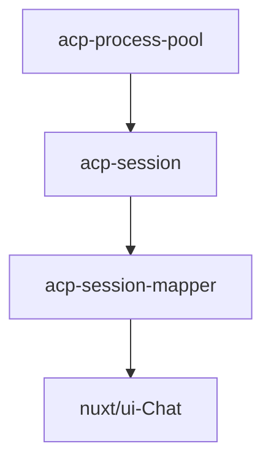

# 以ACP实现Agent连接层

> 这篇文章记录的是我给 FylloCode 在 Agent Runtime 接入层上的一次核心技术选型：为什么没有选择逐个适配 CLI，而是把 ACP 放在 Agent 连接层，同时在内部消息层留出解耦和回退空间。

## 初识 ACP

在玩 OpenClaw 的时候，我想用它来驱动 `Claude Code` 或 `Codex` 完成一些 Coding 任务，搜索方案时在 GitHub 找到了 OpenClaw 的 [acpx](https://github.com/openclaw/acpx)，进而发现了它只是一个 headless 的 ACP Client，底层使用 ACP 协议通过 JSON-RPC 2.0 与 Coding Agent 交互。

我做 FylloCode 的本意是让它驱动用户本地的 Coding Agent，常规来讲一般需要定义一个兼容层，然后逐个接入 CLI，并把每个 CLI 的个性化行为、参数都归一化到这个兼容层，由兼容层对外提供服务。如果这样来做的话，可以预想到的是 FylloCode 的大部分开发工作可能会落在这些 CLI 的兼容适配，但这并不应该是 FylloCode 的重心。

于是我又想到了 ACP，开始仔细研究它。

ACP 是由 Zed 最早推出，后面与 IntelliJ 一起合作推进，它确实做到了这种兼容层协议。基于 ACP 有两种身份，一种是 Agent，一种是 Client。

当前版本（v1）提供的基础功能包括：

**Agent 能力**

| 能力                    | 说明                                                                    |
|-----------------------|-----------------------------------------------------------------------|
| image                 | prompt 中支持图像                                                          |
| audio                 | prompt 中支持音频                                                          |
| embeddedContext       | prompt 中支持嵌入内容，比如文本块、文件                                              |
| MCP                   | 支持 MCP 连接（stdio、http、sse）                                             |
| additionalDirectories | 支持会话开始时附加目录，以扩展会话的有效工作目录                                              |
| authentication        | 在建立连接期间做身份验证，比如需要 login、或是配置 API-Key 等                                |
| session/new           | 创建新会话                                                                 |
| session/prompt        | client 发送用户内容                                                         |
| session/cancel        | 主动取消会话                                                                |
| session/update        | 会话过程中的数据更新，例如用户发送 prompt 后的流式数据、Agent 当前模式的变更、plan 列表、slash commands 等 |

**会话设置**

| 设置项   | 说明                                                                    |
|-------|-----------------------------------------------------------------------|
| mode  | 会话期间的模式，Agent 会返回支持的模式，比如 `YOLO`、`Accept Edits`、`Bypass Permissions`等 |
| model | 会话期间的模型，Agent 会返回支持的模型列表                                              |

ACP 同时也支持了文件系统和终端，让 Agent 可以直接把文件读写、命令执行直接交给 Client 来做。

ACP 也提供了 registry，所有支持 ACP 的 Agent 都可以提交进来，可以理解为它是一份官方维护的 Agent 列表。

在 4 月份的时候 ACP registry 中已经有 20+ Agent，截止到今天，已经有了近 40 个 Agent，而且还有很多已经支持 ACP 但未提交到 registry 的 Agent 产品。

这对 FylloCode 很关键，因为我并不想让它变成一个 CLI 适配器集合。只要 Agent 愿意走 ACP，FylloCode 就可以把更多精力放在会话组织、任务流转和上下文沉淀上，而不是反复处理不同 CLI 的启动参数和输出格式。

## 集成 ACP

ACP 看起来是个标准协议，而且也在持续更新，在权衡之后，决定给 FylloCode 直接接入 ACP + registry，来避免 CLI 的逐个集成。

ACP 天然适合池化，每个 Agent 建立一个连接，一个连接可以维护多个 session，在用户与 Agent 对话时，我们只需要拿到 `session/update` 事件，然后推送到渲染层即可。

这件事在 FylloCode 里不是一个简单的 SDK 调用。ACP Agent 是长期存活的外部进程，需要有进程池管理启动、退出、重试和清理；session 是业务层可感知的会话资源，需要从 Agent 进程生命周期中拆出来；而流式事件又要能被前端稳定消费，所以中间必须有一层 runtime 来处理连接、session、事件映射和错误收敛。

但是我并没有选择直接推送 ACP 消息，目的是为了做一次解耦，为了防止未来 ACP 更新不活跃或者废弃时，还有后路可退，所以我选择了一个中间层 `ai-sdk`。选择 `ai-sdk` 的原因也很简单，因为它同时支持服务层 + 渲染层：
- 服务层支持接入多个厂商的模型，这就意味着它自身的消息格式是中庸的，而且可扩展。未来也许会基于 `ai-sdk` 做一个 FylloCode 自己的 Agent；
- 渲染层支持 `React` 和 `Vue`，而且前段时间 Vercel 收购了 Nuxt，Nuxt 直接放出了一个 Chat UI 的套件，功能丰富，扩展性强。

这里如果直接把 ACP 消息透传到前端，短期看会更省事，但前端就会被 ACP 的事件结构绑死。后面无论是 ACP schema 变化，还是我想接入非 ACP 的 Agent，都会变成一次比较大的迁移。

所以现在接入路径就比较清晰了：

这条线串下来，核心逻辑很简单，而且退一万步讲，如果真的 ACP 出现了问题，我也可以快速回退，以 `ai-sdk` 直接接入 LLM 的方式支持下去。

目前 FylloCode 已经围绕这条链路实现了 ACP process pool、session 管理、`session/update` 到内部事件的映射，以及多 Agent 的 `tool_call` 兼容处理。也就是说，ACP 在 FylloCode 里已经进入核心会话链路的基础设施。

## 强人所难的 ACP Adapter

用了 ACP 两个月，我有明显的感觉，这就是传统 IDE 厂商的自救。他们希望借助于 ACP，号称用户可以不离开 IDE 就可以用上多种 Agent。如果他们下场做自己的 Agent，将会迎来腹背受敌：一面是 IDE 厂商的竞争，一面是 Agent 厂商的打压。所以 ACP 不失为一个好的方向。

我最开始给 FylloCode 接入 ACP 的时候还比较早，之前大家用的 Agent 无外乎 `Claude Code`、`Codex`、`Gemini CLI`、`OpenCode` 这几个，`Gemini CLI` 和 `OpenCode` 是开源的，它们很快就跟进了 ACP，而且支持度很高。但是另外两个老大哥始终没有原生支持，所以 ACP 官方直接做了两个 Adapter。

`Claude Agent` 是基于 `Claude Agent SDK` 实现的，`Codex ACP` 是基于 `Codex` 的 module 实现的，这两种方式其实有些不稳，功能会比官方的 Agent 要滞后，而且 `Claude` 发布公告，订阅用户使用 `Claude Agent SDK` 是另外的额度……

Adapter 的问题在于，它很难真正代表原生体验。上游 CLI 或 SDK 的能力一变，Adapter 就要跟着追；而且很多细节不是“能不能跑”的问题，而是“能不能稳定地表达 Agent 当前在做什么”的问题。对 Client 来说，这些差异最后都会变成 UI 状态、权限请求、工具调用展示上的兼容成本。

但是好在，目前越来越多的 Agent 原生支持了 ACP，像 `Qodercli` 和 `Kimi Code` 等，国产模型厂商还在持续发力，我们也不必被 Claude 一家锁死。

## “开放”的 ACP

ACP 太过开放了，为了不给 Agent 产品增加难度，协议 schema 中很多事件，甚至很多字段都是可选的。最让我受不了的是 `tool_call` 事件，ACP 协议对 `tool_call` 字段的定义几乎全部是可选的，除 `toolCallId` 和 `title` 以外，`status / kind / rawInput / rawOutput / content / locations` 均为可选，而且协议没有规定各字段出现的时机。这意味着各 Agent 的差异行为都是协议合法的，想获得好的体验 Client 必须自己做兼容。

我测试了 5 款 Agent：`Claude Agent`、`Codex ACP`、`Gemini CLI`、`OpenCode` 和 `Qodercli`，测试结果在[这里](https://github.com/Fioooooooo/FylloCode/tree/main/references/acp/tool-call-trace)。一句话，太乱了。迫不得已再给这些 `tool_call` 做一个兼容层。

这类问题单看协议字段可能只是小差异，但放到产品里就会很明显。比如同样是一次文件编辑，有的 Agent 会先给出工具标题，有的会先给出 diff，有的直到 completed 才补齐内容。如果 Client 不做额外整理，用户看到的就不是一个稳定的工具调用流程，而是一堆时序不一致的事件碎片。

最后我没有选择针对每个 Agent 写一串 if/else，而是把 `tool_call` 和 `tool_call_update` 统一当成字段位置不稳定的事件处理。无论 `rawInput`、`content`、`locations` 出现在 start 还是 update，都使用同一套提取逻辑；跨事件的补偿则交给下游 assembler 做 lazy-upsert，而不是让 mapper 自己维护状态。

这个边界对 Agent Runtime 很重要。mapper 只负责把单个 ACP 事件归一成内部事件，assembler 才负责把多个事件组装成用户能理解的消息。这样兼容逻辑不会堆成一个巨大的状态机，也方便后面继续接入新的 Agent。

## ACP 的未来

近期 ACP 开始规划 v2 版本的 RFDs 了，一些问题也在逐渐被优化，而且近期的会议中提到未来的 ACP 将是 “Not only for Editors”，意味着这个协议将会转向更加开放。

所以我对 ACP 的态度其实很矛盾：它确实解决了 FylloCode 最不想做的那部分工作，让我不用一个个去适配 CLI；但它现在也把很多兼容成本留给了 Client。对我来说，ACP 仍然值得押注，只是不能天真地把它当成一个已经完全稳定的标准。

如果只把 ACP 当 API，很多问题最后都会推到 UI 层爆出来。FylloCode 的做法是把它当成 Agent Runtime 的接入层：进程要能被治理，session 要能被管理，事件要能被归一，协议风险也要能被隔离。只有这些底层东西稳住，上层的 Agent 工作流才有继续扩展的空间。
