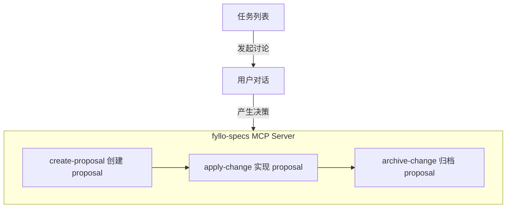

# Lineage：给 Agent 补上工程脉络

> 随着 Proposal 链路逐渐稳定，我开始需要 FylloCode 记录一件更重要的事情：一个需求是从哪里来的，中间经历了哪些讨论，为什么最后变成了这个设计，以及它最终落到了哪一次代码提交里。

对人来说，`git blame` 可以回答“这行代码是谁在什么时候改的”。但在 Agent 参与研发之后，这个答案不够用了。Agent 更需要知道的是：当时为什么要这样改？用户的原始任务是什么？讨论里排除了哪些方案？最终 Proposal 里写下了哪些决策？

这些信息如果只留在聊天记录、任务系统和 commit 里，就会散落在不同地方。下一次 Agent 想理解一段代码时，还是只能重新搜索、重新猜测、重新问人。

所以我想给 FylloCode 补上一条“因果链”。它把 Task、Chat Session、Proposal、Archive Commit 串起来，让一次需求从发起到落地的脉络可以被稳定查询。这条链路，我把它叫做 `Lineage`，也就是血缘或者脉络。

想构建出 Lineage，首先梳理一下 FylloCode 已有的流程：



FylloCode 推崇的是 `Task -> Proposal -> Apply -> Archive` 这条工作链路。Lineage 要做的，就是在这条链路里的关键节点发生跳转时，以 `工程化` 的方式把关键值稳定留下来。

::: tip 为什么强调工程化
Lineage 需要的是稳定写入和稳定读取。适合工程系统保证的事情，就不应该交给 Agent 的开放生成来做。Agent 更适合处理判断、分析和表达，链路完整性这类事情应该由系统以工程化的方式来实现。
:::

## Lineage 的数据结构

一个 Lineage 需要关联的有：

- 任务 ID
- 任务来源
- 会话 ID
- 会话产生的提案
- 提案提交时的 commit hash

这里有几个约束不能忽略：

1. 一个任务可能会发起多次对话讨论；
2. 一次对话可能拆出多个 Proposal；
3. 一个 Proposal 不一定来自已有任务，也可能来自一次开放聊天；
4. chat 起源的线索后面可以补建任务，但它的起源不能被改写。

所以 Lineage 的结构设计为：

```typescript
interface Lineage {
  id: string;
  origin: "task" | "chat";
  task: {
    ref: `${source}:${taskId}`;
    snapshot: TaskItem;
    capturedAt: string;
  } | null;
  links: {
    sessionId: string;
    createdAt: string;
    proposals: {
      changeId: string;
      createdAt: string;
      commitHash?: string;
    }[];
  }[];
  createdAt: string;
  updatedAt: string;
}
```

- `origin` 字段标记 Lineage 的初始来源于任务还是对话
- `task` 字段用 `ref` 同时标记任务来源与任务 ID，同时记录了任务快照
- `links` 则是任务关联的会话列表，记录会话 ID，与产生的提案
- `proposals` 中记录产生的 `changeId` 和最终提交的 commit hash

这里有一个比较重要的设计点：`origin` 一旦创建就不再变化。

比如一次开放聊天最后创建了本地任务，这条 Lineage 的 `task` 可以被回填，但 `origin` 仍然是 `chat`。这样后续查询时就能知道：这个任务是讨论之后补建的，而不是一开始就来自任务列表。

这个信息看起来很小，但对后续做分析会很有用。它可以区分“任务驱动的讨论”和“讨论沉淀出的任务”，这两类协作方式在 AI 时代会越来越常见。

## Subject 与 Index

Lineage 结构确定后，还需要一个索引文件。否则 Agent 已经知道一个 `taskRef`、`sessionId`、`changeId` 或 `commitHash` 时，仍然没办法快速找到对应的 Lineage。

所以我把 Lineage 拆成了两部分：

1. `Subject`：一条线索的权威数据；
2. `Index`：从 task、session、proposal、commit hash 反查 subjectId 的派生索引。

FylloCode 是本地优先的桌面应用，Lineage 又是项目级数据，所以它逻辑上按项目隔离。实际落点在 FylloCode 的 userData 里，大致结构是：

```text
projects/<encodedProjectId>/
  lineage/
    index.json
    subjects/
      <subject-id>.json
```

```typescript
interface LineageIndex {
  version: 1;
  tasks: Record<string, string>;
  sessions: Record<string, string>;
  proposals: Record<string, string>;
  commitHashes: Record<string, string>;
  updatedAt: string;
}

interface LineageSubject {
  id: string;
  origin: "task" | "chat";
  task: {
    ref: `${source}:${taskId}`;
    snapshot: TaskItem;
    capturedAt: string;
  } | null;
  links: {
    sessionId: string;
    createdAt: string;
    proposals: {
      changeId: string;
      createdAt: string;
      commitHash?: string;
    }[];
  }[];
  createdAt: string;
  updatedAt: string;
}
```

`subjects/*.json` 是权威源，`index.json` 是可以重建的派生物。这样做有两个好处：

1. 写入时可以把一条 Lineage 控制在一个 subject 文件里，降低并发写坏的风险；
2. index 损坏或缺失时，可以扫描 subjects 重建，不需要把 index 当成不可丢失的数据。

这也是我比较在意的一点：Lineage 是给未来 Agent 用的，不只是给当前页面展示用的。既然它会参与后续决策，就不能只是“能跑”，必须具备最基本的自愈能力。

## Lineage 的实现路径

数据结构定义好之后，按照我给 FylloCode 定义的主进程分层规范，需要补齐 lineage 对应的 `ipc`、`service`、`domain`、`infra`，再在渲染进程合适的位置发起调用。

最简单的一条链路是任务页发起讨论：

1. 用户从任务页发起 Chat Session；
2. 主进程创建或复用这个任务对应的 Lineage Subject；
3. 创建 Session 后，把 `sessionId` 挂到这个 Subject 上；
4. 后续 Proposal、Commit 再继续挂到同一条 Subject 上。

这部分并不复杂，真正麻烦的是另外三个问题：

1. Session 和 Proposal 要如何连起来？
2. 起源于开放对话的需求，如何反向创建本地任务？
3. Proposal 完成归档后，如何拿到对应的 commit hash？

### Session 连接 Proposal

Session 连接 Proposal 本身不是难事，难的是如何让 ACP Agent 与 FylloCode 稳定联动。

FylloCode 本身没有内置 Agent 能力，它通过 ACP 连接不同的 Agent。每个 Agent 都是独立的个体，ACP 只是通信协议。与此同时，创建 Proposal 的能力来自 `fyllo-specs` MCP Server，而我不希望这个 MCP Server 直接掺进 lineage 的业务逻辑里。

当时我主要考虑过三个方案：

| 方案 | 好处 | 问题                                          | 结论 |
| --- | --- |---------------------------------------------| --- |
| 拦截 ACP `tool_call` 事件 | 对 Agent 无感，链路最自然 | ACP 的 `tool_call` 字段太宽泛，不同 Agent 差异很大       | 放弃 |
| 增加一个 lineage MCP tool | 语义清楚，职责独立 | 需要额外 tool schema 注入，浪费 token，还依赖 Agent 记得调用 | 放弃 |
| 扩展 `create-proposal` | 能稳定拿到 `sessionId` 和 `changeId` | 不能把 lineage 业务塞进 MCP Server                 | 采用变种 |

这里放弃的是“让 Agent 额外调用一个 tool 来写入 Session-Proposal 关联”的方案；后续 `fyllo-cortex` 中新增的 `lineage` tool 是只读查询工具，用于从代码、commit 或 proposal 反查已有设计脉络。

第一个方案一开始看起来最合理。以工程化的方式解决工程化问题。但是测试之后发现，**ACP 对 tool_call 的定义太散了，没有足够规整的事件形态**。

同一个 tool，不同 Agent 调用时会传不同的参数，必填参数只有 `toolCallId` 和 `title`，根本没办法做稳定拦截。比如 Claude Agent 给的 title 是 `mcp__fyllo-specs__create-proposal`，Codex ACP 给的是 `fyllo-specs/create-proposal`，Gemini CLI 甚至会把 tool 调用拆成两个 `toolCallId`。

第二个方案的问题也很明显。一个低频 tool 也要在每次新 session 时把 description 和 schema 注入 context，这对用户来说就是额外 token 成本。而且还要通过 system-reminder 或 prompt injection 告诉 Agent：调用 `create-proposal` 后再调用另一个 tool。这个约定太依赖模型的指令遵循能力，一旦漏调用，Lineage 就断了。

最后落地的是第三个方案的变种：

`create-proposal` 内部不做任何 lineage 业务逻辑，只是在 Proposal 创建成功后，向 FylloCode 的 userData 写入一条 event。主进程监听这个 event，再由主进程调用 lineage service 把 `sessionId` 和 `changeId` 挂起来。

事件格式类似：

```json
{
  "server": "fyllo-specs",
  "tool": "create-proposal",
  "sessionId": "<session-id>",
  "changeId": "<changeId>",
  "createdAt": "<ISO Date>"
}
```

这样一来，MCP Server 只负责“把自己确实发生过的事情写成事件”，Lineage 的业务编排仍然留在 FylloCode 主进程里。

我也打算把它抽象成一套通用的 MCP event spool。未来如果其他 MCP tool 也需要和 FylloCode 主进程通信，可以复用同一套机制，而不是继续加临时通道。

### 事件消费的可靠性

既然用了文件事件，就必须把可靠性考虑清楚。这里我没有让 `fs.watch` 承担“准确投递”的职责，因为它本身并不是一个可靠消息队列。

现在的处理方式是：

1. 每个 event 一个 JSON 文件，避免并发写互相覆盖；
2. 写入时先写临时文件，再 rename，避免消费侧读到半截文件；
3. 主进程用 `fs.watch` 作为“有变化赶紧扫描”的信号；
4. 真正消费时始终 `readdir` 全量扫描事件目录；
5. 事件只有在成功消费后才删除；
6. 每次启动 watcher 时先扫描残留事件，补偿上次崩溃前没处理完的数据。

这套机制不复杂，但它解决了几个关键问题：并发、半写、重复通知、丢通知、崩溃恢复。

我对这类基础设施的要求是，不要追求看起来很高级，而是要在真实桌面应用里稳定。Lineage 这种数据一旦丢了，用户可能当时不会发现，但未来 Agent 追溯决策时就会出现空洞。

### Session 创建本地任务

为什么需要 Session 创建本地任务？

因为很多对话一开始只是一个 idea，并不是一个明确任务。用户可能先和 Agent 聊，聊到最后才发现这个东西值得做，应该创建 Proposal，也应该沉淀成一个任务。

这时我希望 Lineage 最终还是能落到一个实际任务上，哪怕这个任务是从 Session 反向创建出来的。但是否真的要创建任务，应该由用户决定，不能让 Agent 自动替用户创建。

这里需要的是 Agent 与 FylloCode UI 的交互能力。如果可以直接给 Agent 注入 FylloCode 的本地 tool，事情会简单很多。但 ACP 不支持这种 host tool 扩展，很多 Agent 产品应该也不会愿意支持这种强绑定能力。

最后我用了一种很“朴素”的方式：让 Agent 输出一个受控标签，FylloCode 解析这个标签，然后渲染成用户可确认的 UI。

FylloCode 的 Chat 消息渲染基于 `markstream-vue`，它支持自定义 Vue 组件解析自定义 HTML 标签。所以我定义了一个 `fyllo-action` 协议：

```html
<fyllo-action type="task.create">
  { "title": "补齐错误处理", "description": "整理异常分支" }
</fyllo-action>
```

这并不是让 Agent 直接控制 UI，恰恰相反，Agent 只能输出受控的 `type` 和严格 JSON payload。按钮、状态、handler、IPC channel 都由 FylloCode 自己控制。用户点击确认后，FylloCode 才会调用 `lineage:createSessionTask` 创建本地任务，并把这个任务回绑到当前 Session 的 Lineage Subject。

这里我接受用 system-reminder 去引导 Agent 输出 `<fyllo-action>`，原因是创建任务是一个可选动作。即使 Agent 没输出，主链路也不会断；用户只是少了一个快捷创建任务的入口。相比之下，Session 连接 Proposal 是必须稳定的，所以不能靠 prompt 约定。

### 如何获取 Proposal 对应的 commit hash

最后一个问题是 Proposal 对应的 commit hash。

这件事现在已经落地，但它是一个阶段性方案。原因是 commit hash 的变数太多了。虽然 `archive-change` 已经有自动 commit、自动 merge 等操作，可以在归档时拿到 commit hash，但后续 rebase、squash 或人工整理历史，都可能改变它。

所以目前采用的是懒存储：

1. 获取 Lineage 时，先检测对应 Proposal 是否已经归档；
2. 如果已经归档，就尝试查找归档目录记录的 commit hash；
3. 如果 Lineage 里还没有记录，就把它持久化下来；
4. 如果已经记录过，就不再覆盖。

这个方案优先保证读取侧最终一致，不强行宣称 commit hash 永远准确。未来要做得更完整，应该在 Archive 阶段把 commit hash 绑定做得更前置，并且补充 hash 失效后的校验与修复机制。

我现在更倾向于先承认这个边界，而不是在当前阶段把它做成完美方案。架构设计里很多时候需要先明确当前系统能保证什么，不能保证什么，后面再逐步补齐，而不是在开始时就锚定一个“最完美”的方案。

## Lineage 的意义

Lineage 表面上是在做一套数据结构和几条 IPC，实际想解决的是 Agent 参与研发后的“项目记忆”问题。

过去我们靠人记住很多东西：

- 这个需求最开始是谁提的；
- 当时为什么没有选另一个方案；
- 哪个边界是历史原因造成的；
- 哪次改动看起来小，但其实影响了后面的架构；
- 某个模块为什么不能随便重构。

这些内容如果只存在于人的记忆、聊天记录、PR 评论里，对 Agent 来说基本等于不存在。Agent 下一次进来，还是会从代码和 git 历史里重新拼图。

Lineage 想做的是把这些信息变成项目的一部分。它不替代代码，不替代 spec，也不替代 guideline，而是把它们按一次真实研发任务的脉络串起来。

以后当 Agent 想知道“这个接口为什么这样设计”时，它不应该只看到一行 blame。它应该能继续追到：

1. 这次改动来自哪个任务；
2. 用户和 Agent 当时讨论了什么；
3. Proposal 里写下了哪些取舍；
4. 最后是哪次 Archive 把它落到了主线；
5. 如果有后续任务，又是怎样在这条线上继续演进的。

这也是我做 FylloCode 时一直在想的事情：AI 时代的研发协作，不应该只是让 Agent 更快地写代码。更重要的是，项目能不能把每一次协作产生的判断沉淀下来，让下一次协作站在更好的上下文上。

Lineage 是这个方向里的一个基础能力。它不花哨，但我认为它很关键。因为只有当项目真的拥有可追溯的脉络，Agent 才有可能从一次性的执行者，慢慢变成理解项目演进的协作者。
