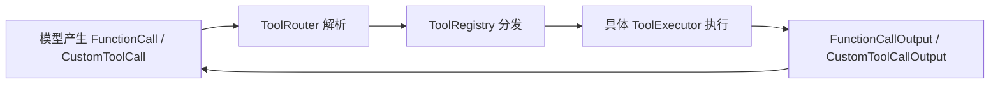
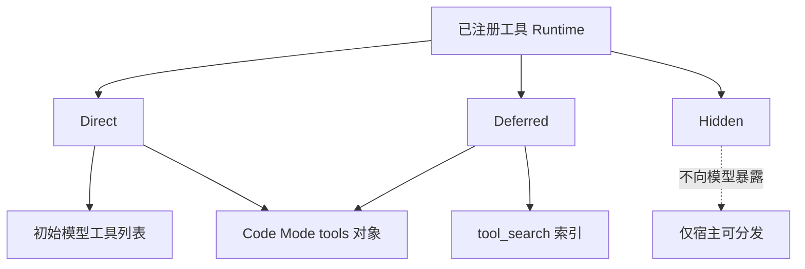
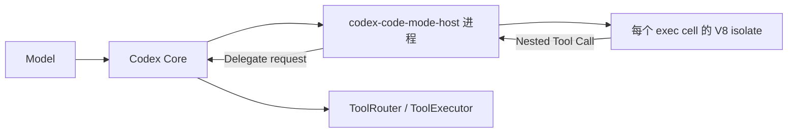
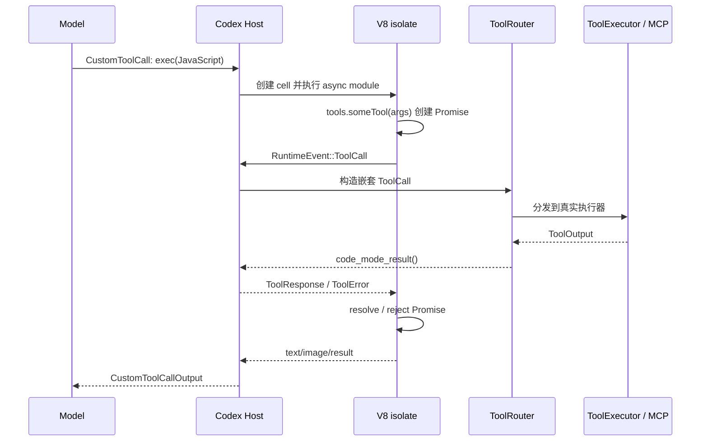
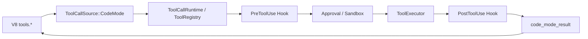

# Codex 工具调用机制与 V8 Isolate 执行链路

> 我原本以为 Codex 的工具调用与常见 Agent 一样：模型返回工具名和参数，宿主执行工具，再把结果送回模型。直到一次会话里出现 `functions.exec`、`tools.*` 和 `ALL_TOOLS`，我才意识到 Codex 正在尝试另一种方式：让模型写一小段 JavaScript，把代码能力直接用于工具编排。

## 先说明证据范围

本文不是根据一次会话现象反推内部实现。所有关于 Codex 的机制描述都以 OpenAI 官方开源仓库 [`openai/codex`](https://github.com/openai/codex) 为依据，源码基线固定为 2026 年 7 月 12 日的提交 [`c888e8e75a9f0e90ce7d5517f8b9540832cbbf76`](https://github.com/openai/codex/tree/c888e8e75a9f0e90ce7d5517f8b9540832cbbf76)。固定 commit 是为了避免 `main` 更新后，文章结论与链接指向不同版本的代码。

还需要提前强调：源码把 `CodeMode` 和 `CodeModeOnly` 标记为 `UnderDevelopment`，默认关闭；稳定且默认开启的是承载它的 `CodeModeHost`。因此，本文描述的是 Codex 当前正在开发、且本次会话确实启用的能力，而不是宣称所有 Codex 安装都默认采用这种工具调用方式。对应定义见 [`codex-rs/features/src/lib.rs`](https://github.com/openai/codex/blob/c888e8e75a9f0e90ce7d5517f8b9540832cbbf76/codex-rs/features/src/lib.rs#L92-L98) 和具体 feature stage 配置 [`L853-L869`](https://github.com/openai/codex/blob/c888e8e75a9f0e90ce7d5517f8b9540832cbbf76/codex-rs/features/src/lib.rs#L853-L869)。

## Codex 并没有抛弃传统 Tool Call

Code Mode 是新增的编排层，不是把传统工具协议全部推翻。

在普通路径中，模型响应里的 `FunctionCall`、客户端执行的 `ToolSearchCall` 和 `CustomToolCall` 会被 `ToolRouter::build_tool_call` 转换成统一的内部 `ToolCall`。其中包含工具名、`call_id` 和不同类型的 payload。源码可以直接在 [`codex-rs/core/src/tools/router.rs#L113-L158`](https://github.com/openai/codex/blob/c888e8e75a9f0e90ce7d5517f8b9540832cbbf76/codex-rs/core/src/tools/router.rs#L113-L158) 看到：

```rust
match item {
    ResponseItem::FunctionCall { name, namespace, arguments, call_id, .. } => {
        let tool_name = ToolName::new(namespace, name);
        Ok(Some(ToolCall {
            tool_name,
            call_id,
            payload: ToolPayload::Function { arguments },
        }))
    }
    ResponseItem::CustomToolCall { name, namespace, input, call_id, .. } => {
        Ok(Some(ToolCall {
            tool_name: ToolName::new(namespace, name),
            call_id,
            payload: ToolPayload::Custom { input },
        }))
    }
    // ...
}
```

随后，`ToolRouter` 将调用交给注册表中的执行器。执行结果不是伪装成普通聊天文本，而是转换成 Responses 协议中的 `FunctionCallOutput` 或 `CustomToolCallOutput`；这部分分支可以在 [`codex-rs/core/src/tools/context.rs#L475-L499`](https://github.com/openai/codex/blob/c888e8e75a9f0e90ce7d5517f8b9540832cbbf76/codex-rs/core/src/tools/context.rs#L475-L499) 核对。

因此，Codex 的基础闭环依旧是：



Code Mode 的特别之处，是它让模型先调用一个名为 `exec` 的顶层 custom tool，再由 `exec` 内部发起若干嵌套工具调用。

## Tool 不只有“可见”和“不可见”

理解 Code Mode 之前，需要先理解 Codex 的工具暴露模型。

`ToolExecutor` 把工具的描述 `spec` 与真实执行器 `handle` 放在同一份 runtime contract 中。它还定义了四种 `ToolExposure`，源码注释非常明确，见 [`codex-rs/tools/src/tool_executor.rs#L13-L68`](https://github.com/openai/codex/blob/c888e8e75a9f0e90ce7d5517f8b9540832cbbf76/codex-rs/tools/src/tool_executor.rs#L13-L68)：

| Exposure | 含义 |
| --- | --- |
| `Direct` | 初始工具列表对模型可见；启用 Code Mode 时也可作为嵌套工具 |
| `Deferred` | 已注册但不进入初始工具列表，等待后续发现 |
| `DirectModelOnly` | 只允许模型直接调用，不进入 Code Mode 的嵌套工具表面 |
| `Hidden` | 保留在分发注册表中，但不暴露给模型 |

这里最重要的是：**注册、初始可见、可发现、可执行是四个不同问题。**

`build_model_visible_specs_and_registry` 只把 `Direct` 或 `DirectModelOnly` 的 spec 放入模型请求，却仍使用全部 runtime 构造注册表。源码见 [`codex-rs/core/src/tools/spec_plan.rs#L233-L271`](https://github.com/openai/codex/blob/c888e8e75a9f0e90ce7d5517f8b9540832cbbf76/codex-rs/core/src/tools/spec_plan.rs#L233-L271)。这就是“工具已经注册并可被运行时分发，但完整 schema 不一定出现在初始 context”能够成立的基础。

## 三条并存的工具发现路径

从当前源码看，Codex 至少存在三条相关路径：

1. **Direct tool call**：工具 spec 直接进入模型请求，模型直接返回工具名和参数。
2. **`tool_search`**：`Deferred` 工具先进入搜索索引，模型搜索后再调用匹配工具。
3. **Code Mode**：模型调用 `exec`，在 JavaScript 中通过 `tools.*` 使用嵌套工具。

`tool_search` 并没有因为 Code Mode 出现而消失。`append_tool_search_executor` 会收集 `ToolExposure::Deferred` 的搜索信息，并在确实存在候选项时注册搜索工具，见 [`codex-rs/core/src/tools/spec_plan.rs#L959-L980`](https://github.com/openai/codex/blob/c888e8e75a9f0e90ce7d5517f8b9540832cbbf76/codex-rs/core/src/tools/spec_plan.rs#L959-L980)。

App Server 的官方仓库文档也说明了 `deferLoading` 的语义：延迟工具保持注册，可被 `code_mode` 调用，但不会出现在普通 turn 的模型工具列表；当 `tool_search` 可用时，它们也能被搜索并暴露。见 [`codex-rs/app-server/README.md#L1555-L1568`](https://github.com/openai/codex/blob/c888e8e75a9f0e90ce7d5517f8b9540832cbbf76/codex-rs/app-server/README.md#L1555-L1568)。

所以，Code Mode 与 `tool_search` 不是简单的替代关系，而是两种不同的 progressive disclosure：



## `exec` 本身仍然是一个 Tool

Codex 并不是让模型随意输出一段代码并猜测是否应该执行。`exec` 自己是一个正式注册的 freeform tool。

它的输入使用 Lark grammar 约束为原始 JavaScript 文本，可选第一行 `// @exec: {...}` pragma，而不是 JSON 参数。对应构造函数见 [`codex-rs/core/src/tools/code_mode/execute_spec.rs#L6-L34`](https://github.com/openai/codex/blob/c888e8e75a9f0e90ce7d5517f8b9540832cbbf76/codex-rs/core/src/tools/code_mode/execute_spec.rs#L6-L34)。

也就是说，最外层仍是传统协议：

```text
模型 → CustomToolCall(name = "exec", input = JavaScript) → Codex Host
```

只是 `exec` 的 payload 不再是“某个工具的一组参数”，而是一段描述工具组合关系的程序。

## V8 未必运行在 Codex Core 进程内

前文为了突出工具调用主链路，将 `exec` 简化为“Codex 运行时创建 V8 isolate”。但在当前源码中，V8 不一定运行在 Codex Core 进程内：启用 `CodeModeHost` 时，它运行在独立的 `codex-code-mode-host` 子进程中；否则才运行在 Core 进程内。

`ThreadManager` 会根据 `CodeModeHost` feature 选择 session provider：启用时使用 `ProcessOwnedCodeModeSessionProvider`，否则才使用 `InProcessCodeModeSessionProvider`。选择逻辑见 [`codex-rs/core/src/thread_manager.rs#L336-L350`](https://github.com/openai/codex/blob/c888e8e75a9f0e90ce7d5517f8b9540832cbbf76/codex-rs/core/src/thread_manager.rs#L336-L350)。



这个独立程序位于 [`codex-rs/code-mode-host`](https://github.com/openai/codex/tree/c888e8e75a9f0e90ce7d5517f8b9540832cbbf76/codex-rs/code-mode-host)。`ProcessOwnedCodeModeSessionProvider` 负责创建远端 session；如果 host program 不存在，当前实现会回退到进程内 session，而不是直接假装创建成功或让模型处理进程错误。回退分支见 [`codex-rs/code-mode/src/remote_session.rs#L67-L103`](https://github.com/openai/codex/blob/c888e8e75a9f0e90ce7d5517f8b9540832cbbf76/codex-rs/code-mode/src/remote_session.rs#L67-L103)。

因此，“fresh V8 isolate”描述的是 JavaScript 的执行隔离；“独立 Code Mode Host”描述的是 Codex Core 与 V8 runtime 之间的进程隔离。它们不是同一个层次。

## V8 中究竟注入了什么

`exec` 的官方描述来自 [`codex-rs/code-mode-protocol/src/description.rs#L10-L35`](https://github.com/openai/codex/blob/c888e8e75a9f0e90ce7d5517f8b9540832cbbf76/codex-rs/code-mode-protocol/src/description.rs#L10-L35)。源码明确写明：

- 每段代码在新的 V8 isolate 中作为 async module 执行；
- 所有嵌套工具位于全局 `tools` 对象；
- 没有 Node.js、文件系统、网络和 `console`；
- 脚本结束时，未等待的 Promise 会被丢弃；
- `ALL_TOOLS` 提供启用的嵌套工具 `{ name, description }` 元数据；
- `text()`、`image()`、`store()`、`load()`、`notify()` 和 `yield_control()` 等是宿主注入的 helper。

这不是文档层的约定而已。`install_globals` 真正删除了 `console`、`Atomics`、`SharedArrayBuffer` 和 `WebAssembly`，再把 `tools`、`ALL_TOOLS` 及 helper 设置到 V8 global；见 [`codex-rs/code-mode/src/runtime/globals.rs#L14-L46`](https://github.com/openai/codex/blob/c888e8e75a9f0e90ce7d5517f8b9540832cbbf76/codex-rs/code-mode/src/runtime/globals.rs#L14-L46)。

`tools` 与 `ALL_TOOLS` 来自同一份 `enabled_tools`：前者把每项变成可调用函数，后者只输出工具名和描述。实现见 [`globals.rs#L49-L99`](https://github.com/openai/codex/blob/c888e8e75a9f0e90ce7d5517f8b9540832cbbf76/codex-rs/code-mode/src/runtime/globals.rs#L49-L99)。

因此，`ALL_TOOLS` 不是另一个网络服务，也不是模型凭空拥有的全局知识。它只是当前 V8 cell 内的一份轻量目录：

```js
const matches = ALL_TOOLS.filter(({ name, description }) =>
  `${name} ${description}`.toLowerCase().includes("knowledge")
)

text(matches)
```

如果某个延迟工具未在 `exec` 的说明中展开，模型仍可以先在目录里按名称和描述找到它，再调用同名的 `tools.*` 方法。

## `tools.someTool()` 为什么会返回 Promise

V8 并没有直接连接 shell、MCP Server 或文件系统。`tools.*` 是一组宿主回调代理。

每次调用嵌套工具时，`tool_callback` 会完成四件事：

1. 把 JavaScript 参数转换为 JSON；
2. 创建一个 V8 `PromiseResolver`；
3. 将 resolver 按本次调用 ID 保存到 `pending_tool_calls`；
4. 向宿主发送 `RuntimeEvent::ToolCall`，并把 Promise 返回给 JavaScript。

对应源码见 [`codex-rs/code-mode/src/runtime/callbacks.rs#L13-L72`](https://github.com/openai/codex/blob/c888e8e75a9f0e90ce7d5517f8b9540832cbbf76/codex-rs/code-mode/src/runtime/callbacks.rs#L13-L72)。核心代码可以缩写成：

```rust
let resolver = v8::PromiseResolver::new(scope)?;
let promise = resolver.get_promise(scope);

state.pending_tool_calls.insert(id.clone(), resolver);
event_tx.send(RuntimeEvent::ToolCall { id, name, kind, input });
retval.set(promise.into());
```

宿主拿到事件后，通过原来的 `ToolCallRuntime` 和 `ToolRouter` 执行真实工具；结果回来时，再 resolve 或 reject 对应 Promise。V8 runtime 收到 `ToolResponse` 或 `ToolError` 后执行 microtask checkpoint，让 async JavaScript 继续运行。新建 isolate、安装 globals、执行 module 和处理工具结果的主循环见 [`codex-rs/code-mode/src/runtime/mod.rs#L168-L220`](https://github.com/openai/codex/blob/c888e8e75a9f0e90ce7d5517f8b9540832cbbf76/codex-rs/code-mode/src/runtime/mod.rs#L168-L220)。

完整路径因此是：



值得注意的是，嵌套调用不会绕过原有路由。`call_nested_tool` 会拒绝 `exec` 调用自身，然后把嵌套请求重新构造成 `ToolCall`，并以 `ToolCallSource::CodeMode` 交给同一个 `ToolCallRuntime`。见 [`codex-rs/core/src/tools/code_mode/mod.rs#L274-L316`](https://github.com/openai/codex/blob/c888e8e75a9f0e90ce7d5517f8b9540832cbbf76/codex-rs/core/src/tools/code_mode/mod.rs#L274-L316)。因此，Code Mode 是既有工具系统上方的编排层，而不是一条绕过工具注册表的后门。

## 同一个 Tool Output 有两个消费方向

Code Mode 能在减少模型 context 的同时保留结构化处理能力，关键不只是 `text()`，还在于 `ToolOutput` 为不同消费者提供了不同表示。

`ToolOutput` trait 要求实现 `to_response_item()`，用于生成直接进入模型上下文的协议对象；同时提供 `code_mode_result()`，用于生成返回 V8 JavaScript 的值。后者默认从前者转换，但具体工具可以覆盖它。接口定义见 [`codex-rs/tools/src/tool_output.rs#L20-L52`](https://github.com/openai/codex/blob/c888e8e75a9f0e90ce7d5517f8b9540832cbbf76/codex-rs/tools/src/tool_output.rs#L20-L52)。

MCP 是最清楚的例子。`McpToolOutput::to_response_item()` 会构造模型可见的 `FunctionCallOutput`；`code_mode_result()` 则直接序列化原始 `CallToolResult`。模型可见路径还会添加 wall time、清理图像 detail，并按 conversation history 的策略截断；源码注释明确说明 Code Mode consumer 仍然取得原始 `CallToolResult`。见 [`codex-rs/core/src/tools/context.rs#L81-L145`](https://github.com/openai/codex/blob/c888e8e75a9f0e90ce7d5517f8b9540832cbbf76/codex-rs/core/src/tools/context.rs#L81-L145)。

```text
ToolExecutor
  └─ ToolOutput
      ├─ to_response_item()  → 模型协议、格式化与截断
      └─ code_mode_result()  → V8 中的结构化 JavaScript 值
```

于是 Code Mode 可以先在 V8 内读取 `content`、`structuredContent` 或 `isError`，完成过滤、映射和聚合，最后只通过 `text()` 或 `image()` 把必要结果送回模型。这比“先把所有原始输出塞进 context，再让模型阅读”更节省上下文。

## 串行和并行为什么变得自然

传统 tool call 中，依赖关系通常分散在多次模型往返里：调用 A，读取 A 的结果，再决定是否调用 B。

Code Mode 可以直接使用 JavaScript 表达依赖：

```js
const project = await tools.get_project({ id: "p_123" })

if (project.status === "active") {
  const result = await tools.get_activity({ projectId: project.id })
  text(result)
}
```

互不依赖的读取则可以写成：

```js
const [specs, guidelines] = await Promise.all([
  tools.read_specs({ project: "FylloCode" }),
  tools.read_guidelines({ project: "FylloCode" })
])

text({ specs, guidelines })
```

这里不能简单理解为“写了 `Promise.all` 就强制所有工具并行”。源码中，Code Mode dispatch worker 会为每个嵌套调用启动 Tokio task，见 [`codex-rs/core/src/tools/code_mode/delegate.rs#L93-L120`](https://github.com/openai/codex/blob/c888e8e75a9f0e90ce7d5517f8b9540832cbbf76/codex-rs/core/src/tools/code_mode/delegate.rs#L93-L120)；但 `ToolCallRuntime` 仍会检查每个工具是否声明 `supports_parallel_tool_calls`。允许并行的调用取得读锁，不允许并行的调用取得写锁，见 [`codex-rs/core/src/tools/parallel.rs#L93-L156`](https://github.com/openai/codex/blob/c888e8e75a9f0e90ce7d5517f8b9540832cbbf76/codex-rs/core/src/tools/parallel.rs#L93-L156)。

也就是说，模型负责表达“这些任务没有数据依赖”，宿主仍保留最终并发准入权。

## `exec` Cell 不一定在一次调用内结束

`exec` 默认会等待脚本完成，但长任务可以调用 `yield_control()`，先把已经积累的输出返回模型，同时让 cell 保持运行。此时外层结果会带有 cell ID，模型之后通过顶层 `wait` 工具继续观察。

```text
exec 启动 cell
  → yield_control()
  → 返回 Script running with cell ID ...
  → cell 继续运行
  → wait(cell_id)
      ├─ 返回新增输出，cell 仍存活
      ├─ 返回最终结果并关闭 cell
      └─ terminate: true 主动终止
```

`wait` 的参数包含 `cell_id`、`yield_time_ms`、`max_tokens` 和 `terminate`；handler 根据 `terminate` 决定调用 session 的 `wait` 还是 `terminate`。实现见 [`codex-rs/core/src/tools/code_mode/wait_handler.rs#L21-L98`](https://github.com/openai/codex/blob/c888e8e75a9f0e90ce7d5517f8b9540832cbbf76/codex-rs/core/src/tools/code_mode/wait_handler.rs#L21-L98)。`exec` 与 `wait` 的公开说明则位于 [`codex-rs/code-mode-protocol/src/description.rs#L24-L43`](https://github.com/openai/codex/blob/c888e8e75a9f0e90ce7d5517f8b9540832cbbf76/codex-rs/code-mode-protocol/src/description.rs#L24-L43)。

`store()` / `load()` 解决的是另一类连续性：它们保存可序列化值，供同一 session 后续的 `exec` 调用读取。持续的是宿主管理的 cell 和 serialized state，不是把任意 JavaScript heap 或一个 Node.js 进程永久保留下来。

## `CodeModeOnly` 为什么能减少 context

在普通 Code Mode 中，direct 工具仍可由模型直接调用，同时也能作为 `tools.*` 嵌套工具。`CodeModeOnly` 则进一步把大多数普通工具从模型可见列表隐藏，只保留 `exec`、`wait` 以及少量 `DirectModelOnly` 工具。

源码中的注释直接将 `CodeModeOnly` 定义为“把模型可见工具限制为 `exec`、`wait` 入口”，见 [`codex-rs/features/src/lib.rs#L93-L98`](https://github.com/openai/codex/blob/c888e8e75a9f0e90ce7d5517f8b9540832cbbf76/codex-rs/features/src/lib.rs#L93-L98)。工具规划阶段的隐藏条件位于 [`codex-rs/core/src/tools/spec_plan.rs#L430-L441`](https://github.com/openai/codex/blob/c888e8e75a9f0e90ce7d5517f8b9540832cbbf76/codex-rs/core/src/tools/spec_plan.rs#L430-L441)。

这样做节省的不是工具执行能力，而是模型请求里的 schema 体积。大量工具仍在宿主注册表和 V8 的 `tools` 对象中，只是不必全部作为顶层 tool definition 发送给模型。

不过，Code Mode Only 并非完全不向模型解释嵌套工具。`build_exec_tool_description` 会在该模式下把非延迟工具的 TypeScript 声明和调用示例拼入 `exec` 描述；延迟工具只提供一段引导，提示模型通过 `ALL_TOOLS` 搜索。实现见 [`codex-rs/code-mode-protocol/src/description.rs#L251-L319`](https://github.com/openai/codex/blob/c888e8e75a9f0e90ce7d5517f8b9540832cbbf76/codex-rs/code-mode-protocol/src/description.rs#L251-L319)。

因此它减少的是“每个工具都占用一个顶层 schema”的成本，而不是让所有工具知识彻底从 context 消失。

## 安全边界没有交给模型

看到模型能够生成 JavaScript，很容易误以为它获得了一个 Node.js REPL。源码显示并非如此：

- 每次执行创建新的 V8 isolate 和 context；
- 没有 Node.js module、文件系统、网络和 `console`；
- 真实能力只能通过宿主注入的 `tools` 获得；
- 可进入 `tools` 的工具受 `ToolExposure` 和 namespace 排除规则控制；
- 嵌套调用仍经过 `ToolRouter`、`ToolRegistry`、hook、sandbox、approval 和 cancellation；
- `exec` 不能递归调用自身；
- 未等待的 Promise 在 isolate 生命周期结束时不会继续偷偷运行。

更准确的调用顺序是：



`ToolRegistry` 在执行 handler 前运行 `PreToolUse` hook：hook 可以阻止调用，也可以重写输入；handler 完成后再运行 `PostToolUse` hook，后者可以阻止结果进入后续链路或用 feedback 替换模型可见结果。对应分支见 [`codex-rs/core/src/tools/registry.rs#L493-L539`](https://github.com/openai/codex/blob/c888e8e75a9f0e90ce7d5517f8b9540832cbbf76/codex-rs/core/src/tools/registry.rs#L493-L539) 和 [`L545-L663`](https://github.com/openai/codex/blob/c888e8e75a9f0e90ce7d5517f8b9540832cbbf76/codex-rs/core/src/tools/registry.rs#L545-L663)。

Approval 由具体工具 runtime 继续处理。例如 MCP 调用会先执行 `maybe_request_mcp_tool_approval`，根据接受、会话内接受、拒绝或取消决定是否进入真实调用，见 [`codex-rs/core/src/mcp_tool_call.rs#L226-L315`](https://github.com/openai/codex/blob/c888e8e75a9f0e90ce7d5517f8b9540832cbbf76/codex-rs/core/src/mcp_tool_call.rs#L226-L315)。Shell 类工具的 sandbox 和 escalation 也仍位于各自的宿主 runtime，而不是 V8 代码中。

图中的 Approval / Sandbox 不是说所有工具必然弹出同一种审批，而是表示权限决策仍由具体工具与当前策略负责。JavaScript 只能请求调用 `tools` 中已有的能力，不能替工具批准自己。

所以 V8 的作用不是赋予系统权限，而是提供一门模型熟悉、表达力足够强、同时能力受限的编排语言。

## 与传统 Agent Tool Call 的本质差别

传统模式中，模型主要负责选择下一项动作：

```text
观察 → 选择工具 A → 等待 → 观察 → 选择工具 B → 等待
```

Code Mode 允许模型一次提交一个局部执行策略：

```text
观察 → 编写小型编排程序 → 宿主执行多步工具图 → 返回筛选后的结果
```

这个变化带来三项直接收益：

1. **更少的模型往返**：确定性的串行、条件和聚合可以留在一次 cell 内完成。
2. **更少的 context 污染**：JavaScript 可以先筛选或汇总工具输出，只通过 `text()` 返回必要内容。
3. **复用模型的代码能力**：`await`、`Promise.all`、条件分支、循环和异常处理天然就是工具编排结构。

但它也增加了新的复杂度：调试时必须区分模型外层 tool call、V8 cell、嵌套调用、真实执行器和结果适配；错误也可能分别来自 JavaScript、schema 转换、宿主路由、权限审批或 MCP Server。

## 我的理解

Code Mode 最漂亮的地方，不是“Codex 可以运行 JavaScript”，而是它重新利用了 Coding Agent 最强的先验能力。

语言模型已经非常擅长写小段异步代码。如果工具调用永远只能表达“工具名 + 一份 JSON 参数”，那么模型的代码能力在调度层几乎没有发挥空间。Code Mode 则把工具注册表映射为一个受限 SDK，让模型用代码表达数据依赖、并行关系、条件分支和结果裁剪。

它没有取消传统 tool call。相反，最外层 `exec` 依然是 custom tool call，内层每一次 `tools.*` 最终也会回到同一套 `ToolRouter` 和 `ToolExecutor`。真正的新意是多加了一层：

```text
传统工具协议负责安全、注册、分发和结果回传
JavaScript Code Mode 负责组合这些工具
```

这使 Codex 从“模型逐个选择工具”向“模型生成受控的工具执行图”迈出了一步。

## 参考资料

- [`codex-rs/code-mode-protocol/src/description.rs`](https://github.com/openai/codex/blob/c888e8e75a9f0e90ce7d5517f8b9540832cbbf76/codex-rs/code-mode-protocol/src/description.rs)：`exec`、`wait`、全局 helper 与嵌套工具说明的生成。
- [`codex-rs/code-mode/src/runtime/`](https://github.com/openai/codex/tree/c888e8e75a9f0e90ce7d5517f8b9540832cbbf76/codex-rs/code-mode/src/runtime)：V8 isolate、global 注入、Promise 与 runtime event 桥接。
- [`codex-rs/code-mode-host/`](https://github.com/openai/codex/tree/c888e8e75a9f0e90ce7d5517f8b9540832cbbf76/codex-rs/code-mode-host)：独立 Code Mode Host 程序及其进程边界。
- [`codex-rs/core/src/tools/code_mode/`](https://github.com/openai/codex/tree/c888e8e75a9f0e90ce7d5517f8b9540832cbbf76/codex-rs/core/src/tools/code_mode)：Code Mode 与 Codex session、router、输出协议之间的适配。
- [`codex-rs/core/src/tools/spec_plan.rs`](https://github.com/openai/codex/blob/c888e8e75a9f0e90ce7d5517f8b9540832cbbf76/codex-rs/core/src/tools/spec_plan.rs)：工具暴露、延迟加载、`tool_search` 与 Code Mode tool surface 的规划。
- [`codex-rs/core/src/tools/router.rs`](https://github.com/openai/codex/blob/c888e8e75a9f0e90ce7d5517f8b9540832cbbf76/codex-rs/core/src/tools/router.rs)：模型响应到内部 `ToolCall` 的解析和分发入口。
- [`codex-rs/core/src/tools/parallel.rs`](https://github.com/openai/codex/blob/c888e8e75a9f0e90ce7d5517f8b9540832cbbf76/codex-rs/core/src/tools/parallel.rs)：工具并发准入、取消和失败输出。
