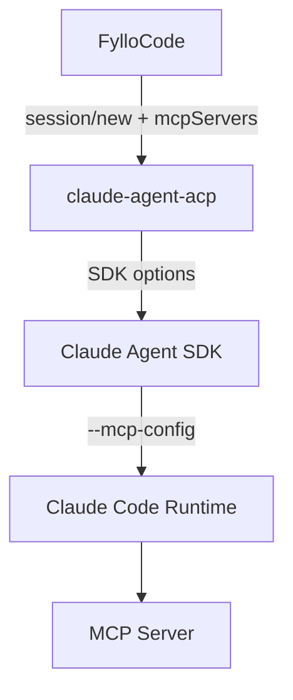

# Claude ACP 的 MCP 初始化竞态

Claude ACP 有一段时间无法稳定调用 FylloCode 注入的 MCP Server。报错很直接：

```text
<tool_use_error>Error: No such tool available: mcp__fyllo_specs__explore</tool_use_error>
```

最后的修复只有一行环境变量：

```text
MCP_CONNECTION_NONBLOCKING=0
```

但找到这一行，先后经过了 FylloCode、`claude-agent-acp`、Claude Agent SDK 和 SDK 内置的 Claude Code Runtime。中间还有一个很有用的现场观察：新会话建好后立刻发消息，工具不存在；等两分钟再发，工具又回来了。

这篇文章记录整个排查过程。现在能确认的是，新会话确实遇到了 MCP 异步连接和首轮 prompt 之间的竞态。应用重启后的会话恢复还有另一个问题，临时开关没有解决它。

## 同一个新会话，两种结果

最初的问题很像配置错误。FylloCode 会在创建 ACP session 时注入两个内置 MCP Server，其中包括 `fyllo-specs`。Claude ACP 接受了 session，模型却说没有 `mcp__fyllo_specs__explore` 这个工具。

如果 server 名写错、stdio 启动失败，或者 ACP 参数没有传过去，结果应该一直失败。但实际情况不是这样。

我做了两次新会话测试：

| 测试 | 操作 | 结果 |
| --- | --- | --- |
| A | `newSession` 后立即发送第一条消息，要求调用 `explore` | `No such tool available` |
| B | `newSession` 后等待约两分钟，再发送同样的消息 | 调用成功 |

这两分钟改变了排查方向。MCP 配置大概率已经进入某一层，只是在第一条消息到达时，连接或工具注册还没有完成。

这里的“第一条 prompt”并不是什么特殊的 ACP 初始化字段。它就是用户发出的第一条消息。`session/new` 建立 session，真正的模型推理要等到 `session/prompt`。如果 MCP 在后台连接，那么第一条用户消息也就成了第一个会撞上初始化窗口的请求。

## 先从自己写的代码查起

时间差只能说明存在时序问题，不能证明问题在上游。FylloCode 也可能在某个异步路径里晚传了配置，或者把给 Agent 的环境变量错放到了 MCP 子进程。

我先沿着 FylloCode 的会话链路查 `mcpServers`：



`getBundledMcpServers` 在 turn 开始前[构造 server 列表](https://github.com/Fioooooooo/FylloCode/blob/17481ebf0c45d1ef9739f5ca449da02192d1c818/src/main/services/session/chat/acp-session.ts#L147-L170)，新建 session 时直接传给 [`connection.newSession`](https://github.com/Fioooooooo/FylloCode/blob/17481ebf0c45d1ef9739f5ca449da02192d1c818/src/main/services/session/chat/acp-session.ts#L580-L584)。恢复路径也把同一份列表传给 [`resumeSession`](https://github.com/Fioooooooo/FylloCode/blob/17481ebf0c45d1ef9739f5ca449da02192d1c818/src/main/services/session/chat/acp-session.ts#L495-L514) 和 [`loadSession`](https://github.com/Fioooooooo/FylloCode/blob/17481ebf0c45d1ef9739f5ca449da02192d1c818/src/main/services/session/chat/acp-session.ts#L529-L549)。日志里的 `bundledMcpServers=2` 也和代码一致。

FylloCode 没有遗漏这组参数。接下来要看接收方有没有吞掉它。

## 从 claude-agent-acp 追到 SDK

复现时安装的是 `claude-agent-acp 0.58.1`。它的依赖关系是：

| 层 | 实际版本 |
| --- | --- |
| `@agentclientprotocol/claude-agent-acp` | `0.58.1` |
| `@anthropic-ai/claude-agent-sdk` | `0.3.205` |
| SDK 内置 Claude Code Runtime | `2.1.205` |

前两项可以从 [`v0.58.1/package.json`](https://github.com/agentclientprotocol/claude-agent-acp/blob/v0.58.1/package.json) 核对。SDK package 自己还带了一个 `claudeCodeVersion` 字段，值为 `2.1.205`。这很关键，因为 Claude Agent SDK 并不自己实现完整的 MCP Runtime，它最终还是拉起随包分发的 Claude Code 可执行程序。

`claude-agent-acp` 的源码也没有露出参数丢失。`resumeSession` 和 `loadSession` 都进入 `getOrCreateSession`，再把 `params.mcpServers` 交给 `createSession`。`createSession` 将 ACP 的 stdio、HTTP 和 SSE 配置转换成 SDK 的 `mcpServers`。对应代码可以从 [`v0.58.1/src/acp-agent.ts`](https://github.com/agentclientprotocol/claude-agent-acp/blob/v0.58.1/src/acp-agent.ts#L3471-L3688) 查看。

我又比较了 `claude-agent-acp 0.57.0` 和 `0.58.1`。SDK 从 `0.3.202` 升到了 `0.3.205`，ACP SDK 从 `1.2.0` 升到了 `1.2.1`，但 adapter 的 MCP 映射逻辑没有跟着改。这个结果把嫌疑继续往下推到了 SDK 启动的 runtime。

SDK 的打包代码提供了最后一段连接：当 `resume` 存在时加入 `--resume`，当 `mcpServers` 非空时加入 `--mcp-config`，然后启动 Claude Code Runtime。也就是说，在我们检查的版本里，这两个参数可以同时出现。

到这里，链路变成了：FylloCode 传了，adapter 收到了，SDK 也组装了启动参数。剩下的主要嫌疑是 Runtime 如何连接 MCP，以及它在什么时候生成给模型看的工具列表。

## 2.1.205 是现场版本，不是变化起点

最开始我怀疑 SDK `0.3.204/0.3.205`，或者它们内置的 Runtime `2.1.204/2.1.205` 刚改过 MCP 逻辑。版本号挨得太近，这是很自然的猜测。

Claude Code 的 changelog 给出了更早的时间点。`2.1.89` 有这样一项变更：在 headless `-p` 模式加入 `MCP_CONNECTION_NONBLOCKING=true`，可以完全跳过 MCP 连接等待；通过 `--mcp-config` 传入的 server 最多等待 5 秒，不再被最慢的 server 一直阻塞。这个行为后来也因为文档缺失被单独报告在 [`anthropics/claude-code#41792`](https://github.com/anthropics/claude-code/issues/41792)。

所以 `2.1.205` 是我们复现问题时运行的版本，不是非阻塞机制最早出现的版本。SDK 从 `0.3.202` 升到 `0.3.205` 仍可能改变表现，但“启动不再一直等 MCP”至少从 Runtime `2.1.89` 就已经存在。

这个区分很重要。如果只盯着相邻的 SDK 版本，很容易在 adapter 的 diff 里找一个并不存在的改动。

## Runtime 里真正读取了什么

Claude Code Runtime 在这里是 SDK 包内的可执行文件，不是 `claude-agent-acp` 仓库里的 TypeScript。顺着包内容继续查，可以找到三个环境变量：

```text
MCP_CONNECTION_NONBLOCKING
MCP_CONNECT_TIMEOUT_MS
MCP_SERVER_CONNECTION_BATCH_SIZE
```

Runtime `2.1.205` 的打包代码会读取 `MCP_CONNECTION_NONBLOCKING`。没有设置时，普通 MCP 连接走异步路径；显式设置为 `0`、`false`、`no` 或 `off` 时，连接仍然不是无限等待，而是在首轮继续之前执行一次有上限的等待。`MCP_CONNECT_TIMEOUT_MS` 未设置时，这个上限是 5000 毫秒。超过期限后，后台连接还会继续。

这也解释了为什么环境变量应该放在 `claude-acp` 的进程环境中。真正读取它的是 `claude-agent-acp` 随后启动的 Claude Code Runtime。把它只塞进 FylloCode MCP Server 自己的 `env`，Runtime 根本看不到。

## 上游 issue 把几块证据拼上了

这时再搜索 issue，关键词已经不再是笼统的“MCP 不可用”，而是 `headless`、`first prompt`、`deferred tools`、`resume` 和 `No such tool available`。

几个报告和现场很接近：

- [`agentclientprotocol/claude-agent-acp#883`](https://github.com/agentclientprotocol/claude-agent-acp/issues/883) 报告通过 `session/new.mcpServers` 动态传入的 stdio MCP 完全没有进入模型工具列表。报告版本是 `claude-agent-acp 0.59.0`、SDK `0.3.207`，说明问题没有停在我们使用的 `0.58.1`。
- [`anthropics/claude-code#43298`](https://github.com/anthropics/claude-code/issues/43298) 记录了 headless 模式下 deferred tools 在远程 MCP 连接完成前被冻结。server 后来连上了，当前 prompt 看到的工具快照却没有更新。
- [`anthropics/claude-code#43968`](https://github.com/anthropics/claude-code/issues/43968) 的 resume 场景更接近后续测试：第一次请求有 MCP 工具，`--resume` 后只剩内置工具，直接调用返回 `No such tool available`，stderr 也没有连接失败信息。

这些 issue 不能代替本地证据。它们使用的 MCP 类型和版本并不完全一致，但描述了同一个故障形状：MCP 配置存在，连接或工具快照的时机不对，模型最后拿到了一份缺工具的列表。

## 用 A/B 实验收尾

把 `MCP_CONNECTION_NONBLOCKING=0` 注入 `claude-acp` 进程后，我重新做了测试：

| 实验 | 条件 | 结果 |
| --- | --- | --- |
| A | 新会话，默认环境，立即发送第一条 prompt | 失败，工具不存在 |
| B | 新会话，默认环境，等待约两分钟后发送 | 成功 |
| C | 新会话，设置 `MCP_CONNECTION_NONBLOCKING=0`，立即发送 | 成功 |
| D | 设置环境变量，重启 FylloCode，resume 已有会话 | resume 成功，但工具仍不存在 |

A、B、C 足以支持新会话的判断：首轮 prompt 抢在 MCP 工具注册完成前进入 Runtime。让 Runtime 在启动阶段短暂等待，可以避开这个窗口。

D 又把问题拆成了两件事。FylloCode 的日志明确记录了恢复时传入两个 MCP Server，`resumeSession` 也返回成功，但几十秒后调用 `explore` 仍然得到 `No such tool available`。这已经不太像“再等一秒就好”，更像 resume 路径丢掉了动态 MCP 配置，或者在连接完成前冻结了工具快照。

我考虑过把 `MCP_CONNECT_TIMEOUT_MS` 提高到 30 秒，借此区分“连接超过 5 秒”和“resume 根本没有更新工具表”。但 30 秒对于每次启动太长，而且它仍只是诊断，不是合适的产品修复，所以没有加。

## 最后只保留一个很小的补丁

FylloCode 最终只对 `claude-acp` 的启动环境设置：

```ts
// TODO: Claude Code runtime 修复首轮 MCP 异步注册竞态后移除此临时兼容开关。
MCP_CONNECTION_NONBLOCKING: "0"
```

补丁在 [`17481eb`](https://github.com/Fioooooooo/FylloCode/commit/17481ebf0c45d1ef9739f5ca449da02192d1c818)。它不修改其他 ACP Agent，也不把等待时间扩大到 30 秒。测试覆盖了已有环境变量被强制改成 `0` 的情况。

这个补丁只承诺一件事：让 Claude ACP 的新会话在第一条用户消息到来时，已经有机会完成 MCP 工具注册。resume 的问题还在上游边界内继续观察。

## 这次排查留下的东西

这次最有用的线索不是某段源码，而是从偶发失败，最终定位到是“立刻发失败，等两分钟成功”。它把一个看起来像参数错误的问题变成了时序问题。

后面的工作也没有直接跳到上游背锅。每一层都要留下证据：FylloCode 是否传参，adapter 是否转换，SDK 是否生成 `--mcp-config`，Runtime 在何时等待连接，模型工具列表又在何时冻结。等这些问题逐个回答以后，一行环境变量才不再是碰运气。

还有一个没有解决的问题也应该留下。新会话和 resume 看起来相似，报错也一样，但 A/B 实验已经说明它们不能合并成同一个 bug。临时修复停在证据能够支持的位置，剩下的等上游给出更明确的连接状态或工具注册信号。
