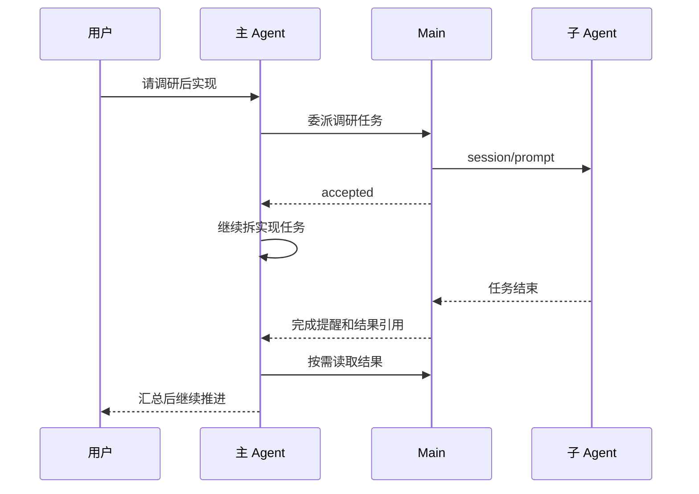

# fyllo-spawn：我不想再坐在几个 Agent 中间传话

FylloCode 接入 ACP 之后，我很自然地开始按任务换 Agent。

碰到一个陌生项目，先找擅长读代码的 Agent 摸清楚情况；要确认外部资料时，再换一个去做 research；方案定下来以后，再让我更信任它实现能力的 Agent 写代码。单独看每一步都没问题，而且比只盯着一个模型舒服得多。

问题出在步骤之间。

我会开三个会话，等第一个会话结束，挑出几段结论复制到第二个会话；第二个会话给出一堆链接和判断，我再筛一遍，写成第三个会话能看懂的任务。实现完成后，如果想让最开始那个 Agent review，还得把 Proposal、改动范围和实现结果再交代一次。

Agent 在干活，我在中间搬运消息。

`fyllo-spawn` 就是从这个很具体的不爽开始的。我想让当前正在聊天的主 Agent 去做这件事。它已经知道用户要解决什么问题，刚读过哪些文件，计划推进到哪里。它比我更适合把一个小任务说明白，再把结果接回当前任务。

## 不是多开几个会话

我希望用户可以这样说：

> 拉起 Claude ACP 做个调研，然后用 Gemini 去做个 research，最后用 Codex ACP 去做实现。

也可以在 Codex 写完 Proposal 后补一句：

> 去和 Claude ACP review 这篇提案，查看是否有阻塞问题。

这两句话里没有 session ID、Agent 配置或 prompt 模板。用户说的是自己想怎样使用不同 Agent，剩下的交给主 Agent 判断：先做哪件事，哪一段工作可以拆出去，发给谁，子任务的结果回来后要不要继续追问。

这也是我没有把它做成 ACP Agents 页面里一个“委派”按钮的原因。用户点按钮时，仍然要自己先想好任务边界、补足上下文，再选一个目标 Agent。真正了解当前任务的不是那个页面，而是正在进行对话的主 Agent。

所以 `fyllo-spawn` 是一个给主 Agent 用的 MCP server，不是一个让用户手动开子会话的 UI 功能。主 Agent 先通过 `available_agents` 看看本机装了什么，再用 `prompt_to_agent` 发起任务。它可以新建一个 spawned Session，也可以拿着之前的 `sessionId` 继续问同一个 Agent。

从 ACP 的角度看，子 Agent 收到的还是一条普通 prompt；从 FylloCode 的角度看，这条 prompt 有明确的父会话和 Workspace 归属。这样主 Agent 能查状态、读结果、必要时取消，而不用把 ACP 内部的 session ID 或本地文件路径交出来。

## 主 Agent 应该交出去什么

我不希望它把整个主会话原样塞给子 Agent。

一方面，这样太浪费 context；另一方面，子 Agent 并不需要知道所有来龙去脉。一个好的委派应该像同事间分任务：说清楚问题、相关位置、预期产出和限制，其他不相关的对话留在主会话里。

例如，主 Agent 可以让 Claude ACP 做下面这类事情：

```text
阅读当前 Proposal 和相关实现，找出会阻塞落地的问题。
不要修改文件。按“问题 / 为什么是阻塞项 / 建议处理方式”返回。
```

Claude 的输出不会自动变成事实。它只是主 Agent 拿到的一份 review 材料。主 Agent 仍然要结合项目现状判断：这个问题是不是真的存在，应该改 Proposal，还是只是 reviewer 对上下文理解不完整。

这点比“让不同模型互相投票”重要得多。子 Agent 最适合做的是一个能单独验收的小问题，例如读代码、查资料、验证假设、review 某份文档。最终怎么改、改多少、要不要继续推进，留给了解全局的主 Agent。

## 为什么一定要后台跑

最初做这个功能时，同步等待的路径很好理解：主 Agent 发一个 tool call，等子 Agent 回答，再继续说话。

但调研和 review 不会总在几十秒内结束。主 Agent 卡在一次 tool call 上时，既不能继续整理已有信息，也不能先做另一个无关的检查。用户看到的只是一个不动的主会话，和自己手动切到另一个终端等结果没什么区别。

现在 `prompt_to_agent` 默认走后台。Main 把任务持久化、把 prompt 交给目标 ACP Agent 后就返回 `accepted`。主 Agent 可以继续推进自己的工作，或者同时派出另一个没有文件冲突的子任务。完成后的结果仍然由 Main 保存，主 Agent 收到完成提醒后再通过 `check_session_status` 和 `read_response` 读取。

这里没有把子 Agent 的全文直接塞进主 Agent 的 context。长调研常常包含大量过程信息，强行注入只会挤掉当前任务的上下文。完成提醒只告诉主 Agent：哪个委派结束了，状态是什么，是否有可读的结果。要读多少、是否需要让另一个 Agent 交叉检查，由它自己决定。



## UI 只负责把事实摆出来

主会话底部会有一个 spawned Session 活动栏。每次委派的 Agent、任务摘要、状态和更新时间都在里面；点开后能看原始 prompt、Activity、按 turn 保存的记录和结果引用。

我没有让这个面板承担续聊、重试、取消这些动作。打开一个详情应该只是查看，不应该因为点了几下就改变一个正在运行的任务。真正的控制仍然由发起委派的主 Agent 通过 MCP tool 完成，状态和生命周期由 Main 管。

这样做还有一个现实原因：窗口不是事实来源。窗口关了以后，后台任务的记录还在；重新打开时，界面再向 Main 查询。反过来，应用进程退出以后，任务也不会被包装成“还在后台运行”。未完成的 turn 会被标记为中断，之后可以看见它为什么没有完成，但不能假装从断点续跑。

## 并行的边界比并行本身重要

做了多 Agent 委派以后，最容易产生的错觉是：既然能同时派几个，那就应该尽量同时派几个。

实际上，所有 spawned Agent 都共享父 Session 创建时的 Workspace 目录。FylloCode 不会给每次委派创建 worktree，也没有文件锁，更不会替你合并两份改动。两个 Agent 同时改同一组文件，最后只会多出冲突和彼此覆盖的风险。

所以我给它定的使用场景很窄：

- 调研、读文档、review、测试分析，可以并行；
- 实现任务只有在文件范围已经拆开时才适合并行；
- 同一个 spawned Session 同时只能跑一个 turn；
- 子 Agent 不拿到 `fyllo-spawn`，不能继续往下派生一层。

最后一条不是因为递归派生做不出来，而是我不想在第一版就制造一个无法看清责任链的系统。用户只需要面对一个主 Agent；主 Agent 知道自己派了哪些任务；每个子任务都能追溯到同一个父会话。到这里已经足够解决我最初的问题。

权限也沿用这个思路。子 Agent 使用父 Session 创建时固定的 `cwd` 和附加目录，不能借委派拿到后来加入 Workspace 的 Project。子 Agent 不会得到 FylloCode 的 system reminder 或 bundled MCP。它是被交办一项工作的 Agent，不是另一个拥有完整 FylloCode 工作流权限的主 Agent。

## 我想省掉的到底是什么

`fyllo-spawn` 不负责替人做技术决策，也不保证多个 Agent 放在一起就能得到更好的答案。

它省掉的是我坐在几个会话中间的那部分工作：等一个结果、摘几段内容、换一个窗口、重新解释背景、再回来确认有没有完成。用户仍然决定想用谁、要达成什么；主 Agent 负责把这些选择变成一段段可以执行的委派，并把结果重新放回同一条工作流。

对我来说，这才是 FylloCode 支持多种 Coding Agent 之后，下一步应该做的事。
