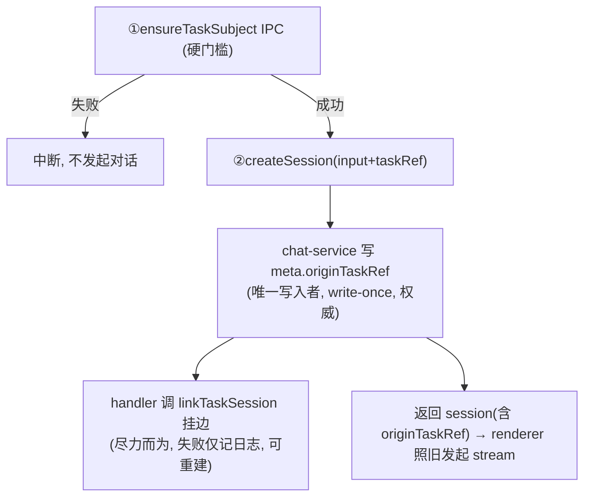

## Context

主进程 `services/lineage`（`src/main/services/lineage/lineage-service.ts`）已实现完整的 subject 聚合根、index 派生反查、查询投影与幂等写入 API，但**零调用、零 IPC 暴露**——它是一套孤立能力。

当前"发起讨论"链路：`task.vue#startChatFromTask`（`src/renderer/src/pages/task.vue:138`）调用 `sessionStore.beginDraftSession()` + `chatStore.sendMessage([taskPrompt])`。其中 `sendMessage`（`src/renderer/src/stores/chat.ts:322`）的 draft 分支调用 `sessionStore.createSession`，最终经 `chat:createSession` IPC 进入主进程 `chat-service.createSession`（`src/main/services/chat/chat-service.ts:57`），由 `newSessionId()` 生成 sessionId 并落盘 session meta。

关键约束（均经代码核实）：

- **sessionId 在主进程 createSession 内部生成**，renderer 在调 sendMessage 时拿不到。
- draft 分支含 probe 预热复用逻辑（`carryProbe`，`chat.ts:354-389`），不可被旁路复制。
- stream 走独立流式通道（`ChatStreamChannels` / `makeStreamChannel`），与 `createSession` 这个普通 invoke 正交。
- reminder 通过 `reminderContext` 流入 `AcpSession`（`acp-session.ts:599`），stream handler 在 `onReady` 内 `loadSessionMeta` 后 `new AcpSession`（`chat.ts:233,262`）——`changeId` 即走此路径，是 `taskRef` 的同构先例。
- 第三方集成 task 只拉取"开发中"状态，一旦关闭就拉取不到——这是 lineage subject 必须存 `taskSnapshot` 全量快照的根因（`project-lineage-model` spec 已确立）。

## Goals / Non-Goals

**Goals:**

- 把 task → session 关联做成 lineage 知识图谱的稳定入口：subject 创建是硬门槛，失败即中断发起。
- session 出身任务信息（`originTaskRef`）作为 session 自身不可变属性持久化在 session meta，write-once，唯一写入者明确。
- 新会话 system-reminder 能感知"当前讨论针对一个已存在 task"。
- 对话页顶部吸顶展示关联任务来源 + 标题，第三方 task 关闭后仍可展示。
- 单次 createSession IPC 内闭合 session 与 lineage 边的写入，消除两次 IPC 之间的进程往返窗口。

**Non-Goals:**

- 不提供 ACID 事务原子性（session-store 与 lineage-store 是两套独立 JSON 存储，物理上无法事务）。一致性模型为最终一致 + 可重建。
- 不接管 stream：编排边界止于 session meta 落盘 + lineage 边落盘，stream 仍由 renderer 照旧发起。
- 不在本次纳入 `getBySession` / `getByProposal` 的 renderer 暴露（除吸顶所需的 `getByTask`）。
- 不在 session meta 冗余存储 task 的 title / source（避免改名漂移）。
- 不改动 `listSessions` 的返回——继续只返回 meta，零 lineage 依赖。

## Decisions

### 决策 1：编排点落在 `chat-service.createSession` + IPC handler，而非独立 lineage handler

考虑了三种编排落点：

- **(A) 独立 lineage handler 做二段式关联**：renderer 建完 session 后单独调 lineage IPC 挂边。否决——为单 IPC 它得自己建 session，从而被迫复制 draft/probe carry 逻辑，或往 stream 方向膨胀。
- **(B) createSession 内部直接 import lineage**：否决——污染 chat 领域 service，使 chat 单测被迫拖上 lineage 存储。
- **(C，选中) 分层编排**：`chat-service.createSession` 只负责 write-once 写 `meta.originTaskRef`（一个普通字符串字段，**不 import lineage**）；`ipc/chat.ts` 的 createSession handler 作为编排层，拿到返回的 session 后调 `lineageService.linkTaskSession`。

选 C 的理由：IPC handler 的职责本就是"校验入参 + 编排 service"，让它认识 chat 和 lineage 两个 service 完全正当；而两个领域 service 彼此零依赖，各自纯净可测。单 IPC、sessionId 可用、不碰 stream、不动 probe carry 全部满足。

### 决策 2：`originTaskRef` 是 session meta 的 write-once 权威字段，lineage 边是派生

一致性债务的根源是"同一事实有两个独立写入者"。解法不是同步两份，而是指定唯一权威写入者 + 让另一处变派生。

按字段所有权划分单一权威源：

| 事实                     | 唯一权威写入者                            | 另一处角色                                                     |
| ------------------------ | ----------------------------------------- | -------------------------------------------------------------- |
| session 出身于哪个 task  | `meta.originTaskRef`（write-once 不可变） | lineage 的 task→session 边是派生，`rebuildIndex` 从 metas 重建 |
| task 快照内容 / 跨实体图 | lineage subject                           | meta 不碰                                                      |

`originTaskRef` write-once 且不可变 → 不存在"持续同步"负担，唯一风险窗口收敛到创建那一次写入。从类型层钉死 write-once：把 `originTaskRef` 加入 `SessionMetaPatch` 的 `Omit` 列表（与 `sessionId` / `createdAt` 并列），编译器直接禁止任何 patch 改它。

考虑过的替代——**纯 lineage 源（meta 不加字段，reminder/吸顶都查 `getBySession`）**：否决。会让 chat reminder 热路径硬依赖 lineage 查询，且 lineage 边写失败时 reminder 与吸顶双双失去关联且无备份。meta 权威则保留了指针可重建。

### 决策 3：meta 只存 `taskRef` 字符串主键，title/source 从 lineage subject 快照取

`LineageTaskRef = ${TaskSource}:${string}`（`src/shared/types/lineage.ts:5`），形如 `yunxiao:STORY-42`，是 task 在图谱里的稳定主键（`index-derive.ts:13`、`lineage-service.ts:128` 均用它做幂等 key）。

- meta 只存这个不可变主键，不冗余 title（改名不漂移）。
- 吸顶展示的 source 可直接从 ref 字符串解析；title 必须从 **lineage subject 的 `LineageTaskSnapshot.snapshot`** 取——因为第三方 task 关闭后 `taskApi.getTask` 会返回空，唯有 lineage 快照在发起讨论那一刻拍下了全量 `TaskItem`。
- 两个粒度用同一 ref 串起来：第①步 `ensureTaskSubject` 收完整 `LineageTaskSnapshot`（renderer 从 `TaskItem` 构造），meta / createSession schema / reminderContext 只流转 `taskRef` 字符串。

### 决策 4：吸顶数据懒加载，复刻 session messages 缓存模式

`selectSession`（`session.ts:488`）已是"点击时才 loadMessages 并 loadedSessionIds.add 缓存"的懒加载。task 信息走同一模式：session store 新增 `taskInfoBySessionId` 内存缓存，`selectSession` 时若 `originTaskRef` 存在且未缓存，调 `lineage:getByTask` 取 subject 快照、缓存、展示。切换已加载 session 零请求。

`listSessions` 不动：继续只返回含 `originTaskRef` 的 meta，不触发任何 lineage 查询。

### 决策 5：三层稳定性等级

| 层                 | 稳定性             | 失败后果                                         |
| ------------------ | ------------------ | ------------------------------------------------ |
| subject 节点（①）  | 硬门槛，失败即中断 | 图谱入口建不出 → lineage 不可信，必须拦住        |
| meta.originTaskRef | 权威 write-once    | session 出身事实源，必写成功                     |
| task→session 边    | 尽力而为           | 边缺失可从 meta 重建，吸顶/reminder 靠 meta 照常 |

三个事实三个唯一写入者，无任何字段被两处改写。失败模式全良性：①失败→中断无残留；①成功②失败→孤儿 subject（`ensureTaskSubject` 幂等，下次复用）；meta 写成功边写失败→边可重建。

## Risks / Trade-offs

- **chat 的 createSession 契约感知 taskRef** → 这是单 IPC 编排无法消除的数据过境（sessionId 在内部生成）。代价仅为一个可选入参 + meta 一个可选字段，chat-service 不 import lineage，领域耦合挡在 service 层之外。
- **subject 创建成为发起讨论的阻塞点** → 若 lineage 写盘故障，用户无法从任务发起讨论。这是有意的设计（图谱入口不稳就坏了根基）；通过 `ensureTaskSubject` 幂等 + 失败 toast 提示 + 不残留缓解。
- **lineage 边与 meta 短暂不一致** → 边写失败时图谱反查（`getByTask`）会缺这条 session，但吸顶/reminder 不受影响（走 meta）。Mitigation：边可由 `rebuildIndex` 从所有 session metas 的 originTaskRef 重建（重建逻辑本次不强制实现，但模型支持）。
- **第三方 task 关闭后吸顶 title 来源** → 必须走 lineage 快照而非实时 `getTask`，否则关闭后吸顶瞎掉。已在决策 3 固化。
- **session meta schema 扩展的向后兼容** → 旧 session 无 `originTaskRef`，读取时为 `undefined`，吸顶不展示、reminder 不注入 task 感知，行为降级正常。

## Migration Plan

- session meta 为增量字段扩展，旧文件读取 `originTaskRef` 为 `undefined`，无需迁移脚本。
- lineage index 本身可重建（`project-lineage-model` 已确立"index 格式变更不需迁移脚本"）。
- 无回滚顾虑：移除本变更后旧 session 的 `originTaskRef` 字段被忽略，lineage subjects 保留为孤立数据。

## Resolved Decisions

以下两点已确定，apply 阶段无需再做选择：

- **`rebuildIndex` 不新增逻辑**：本次 SHALL NOT 为 `rebuildIndex` 新增"从 session metas 回填缺失边"的逻辑，仅依赖现有的 subjects 目录扫描重建。task→session 边写失败时，依靠 `linkTaskSession` 的幂等性在后续操作中自然补齐即可；从 session metas 主动回填属未来增强，不在本次范围。
- **吸顶 title 只取 lineage 快照**：吸顶 title SHALL 仅取自 lineage subject 的 `LineageTaskSnapshot.snapshot.title`，SHALL NOT 引入"实时 `getTask` 优先、快照兜底"的二级策略。快照在发起讨论那一刻已拍下全量 `TaskItem`，数据足够；只用快照既一致又简单，且天然覆盖第三方 task 关闭的场景。
