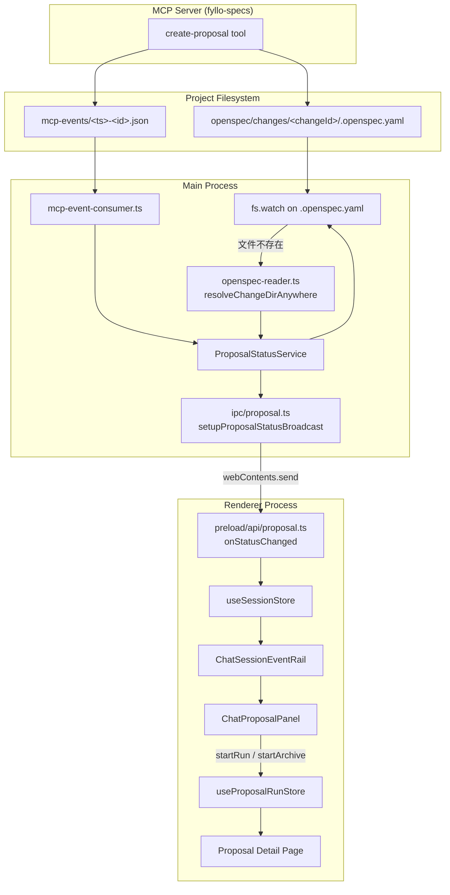

## Context

FylloCode 的 Chat 页面当前由左侧 `ChatSidebar`、中间 `ChatContainer`（消息流 + 输入框）和右侧 `ChatSessionEventRail` 组成。`ChatSessionEventRail` 目前只展示 ACP 执行计划（`ChatPlanPanel`），没有与 proposal 生命周期关联。

proposal 的创建、实现、归档流程已经存在：

- `create-proposal` 是 `fyllo-specs` MCP server 的 tool，写入 `openspec/changes/<changeId>/` 与 `mcp-events/*.json` spool 文件。
- 实现由 `proposal:apply` 触发，`apply-run-service.ts` 创建 run 并将 `.openspec.yaml` 的 `status` 改为 `applying`。
- 归档由 `proposal:archive` 触发，将 change 目录移动到 `openspec/changes/archive/<YYYY-MM-DD>-<changeId>/`。
- renderer 通过 Pinia store 管理状态，已有 `useProposalStore`、`useProposalRunStore`、`useSessionStore`。
- 主进程已有通过 `webContents.send` 主动推送事件的模式（`chat:probe:update`、`acp:statusUpdated` 等）。

本设计在现有架构上新增一层 proposal 状态监听与广播机制，把状态变化实时反映到 Chat EventRail。

## Goals / Non-Goals

**Goals：**

1. 当前 Chat session 关联的 proposal 状态（creating / draft / applying / archived）实时展示在 `ChatSessionEventRail`。
2. 状态变化由主进程主动推送到 renderer，renderer 不轮询。
3. 用户可在 `ChatSessionEventRail` 中对 `draft` proposal 点击“开始实现”并选择 workflow。
4. 用户可在 `ChatSessionEventRail` 中对“实现已完成”的 proposal 点击“归档”。
5. 支持 linked worktree：proposal 在 main worktree 或任意 `.worktrees/*` 中创建、移动、归档，状态都能正确推导。

**Non-Goals：**

1. 不在 `ChatSessionEventRail` 中展示 apply/archive 的流式执行日志或消息详情。
2. 不修改现有 `proposal:apply`、`proposal:archive` 的内部执行逻辑。
3. 不新增 proposal 详情页之外的 run 管理功能。
4. 不处理跨项目 proposal 的展示（只展示当前项目当前 session 关联的 proposal）。

## Architecture



## Decisions

### Decision 1：主进程使用 `webContents.send` 主动推送，而不是 renderer 轮询

**Rationale：**

- proposal 状态变化频率低（秒/分钟级），不需要轮询。
- 主进程是状态变化的唯一可靠来源（文件系统、apply/archive 服务都在主进程）。
- 项目已有成熟模式：`chat:probe:update`、`acp:statusUpdated` 都是主进程 push。
- 轮询会增加 IPC 开销，且无法保证实时性。

### Decision 2：状态变化通过 `fs.watch` 监听 `.openspec.yaml`，而不是在 apply/archive 服务中埋点

**Rationale：**

- 避免在 `apply-run-service.ts`、archive 流程、MCP tool 等多处散落 emit 逻辑。
- `.openspec.yaml` 是 proposal 状态的唯一权威来源，监听它可以覆盖所有状态变更路径。
- 未来新增状态变更方式时，只要改写 `.openspec.yaml` 就能自动被感知。

**Trade-off：**

- archive 流程会移动目录，原路径 watcher 会失效，需要额外的回退查找逻辑（见 Decision 3）。
- 如果一个 session 关联大量 proposal，会挂多个 watcher；但 proposal 数量通常可控，且 watcher 在 proposal 归档/删除后会清理。

### Decision 3：watcher 失效时，回退查找 main worktree + linked worktree + archive

**Rationale：**

- 用户明确提案需要考虑 linked worktree。
- `resolveChangeDir` 已覆盖 main active、main archive、worktree active，但未覆盖 worktree archive。
- 新增 `resolveChangeDirAnywhere` 统一处理所有位置，确保移动、归档、跨 worktree 都能定位。

**查找顺序：**

1. `<projectPath>/openspec/changes/<changeId>`
2. `<projectPath>/openspec/changes/archive/<changeId>`
3. `<projectPath>/.worktrees/<name>/openspec/changes/<changeId>`（遍历所有 worktree）
4. `<projectPath>/.worktrees/<name>/openspec/changes/archive/<changeId>`（遍历所有 worktree）

### Decision 4：EventRail 只展示状态与操作，不展示执行日志

**Rationale：**

- 执行日志的展示位置已经存在：`ProposalApplySidePanel` 在 proposal 详情页。
- 在狭窄的 rail 中展示流式日志会挤压 chat 主区域，且与现有 plan rail 的简洁风格不一致。
- 用户可以从 rail 点击 proposal 条目进入详情页查看完整日志。

### Decision 5：从 rail 发起实现/归档复用 `useProposalRunStore`

**Rationale：**

- `useProposalRunStore.startRun(projectId, changeId, workflowId)` 已经完整处理 apply 发起、runMeta 创建、stage stream 启动。
- `useProposalRunStore.startArchive(projectId, changeId)` 已经完整处理 archive 流程。
- 复用它们可以避免重复实现 IPC 调用和流式消费逻辑。
- 启动后状态变化仍由 fs.watch 感知并推送到 rail，形成闭环。

## Detailed Data Flow

### creating → draft

1. Agent 调用 `create-proposal`。
2. MCP server 创建 `openspec/changes/<changeId>/`，写入 `.openspec.yaml`（`status: creating`）。
3. MCP server 写入 `mcp-events/<timestamp>-<nanoid>.json`。
4. 主进程 `mcp-event-consumer.ts` 的 `fs.watch` 发现新文件，读取 `McpProposalEvent`。
5. `mcp-event-consumer.ts` 调用 lineage 服务建立 `sessionId ↔ changeId` 绑定。
6. `mcp-event-consumer.ts` 调用 `proposalStatusService.watchProposal(projectPath, changeId, sessionId)`。
7. `ProposalStatusService` 对 `.openspec.yaml` 启动 `fs.watch`。
8. MCP server 完成文件写入后更新 `.openspec.yaml` 为 `status: draft`。
9. `fs.watch` 触发，`ProposalStatusService` 读取并解析 `draft`。
10. `ProposalStatusService` emit 事件给 IPC broadcast 层。
11. `setupProposalStatusBroadcast` 调用 `webContents.send(ProposalChannels.statusChanged, payload)`。
12. renderer `useSessionStore` 收到事件，更新 `sessionProposals[sessionId]`。
13. `ChatSessionEventRail` / `ChatProposalPanel` 重新渲染，状态从 creating 变为 draft。

### draft → applying

1. 用户在 `ChatProposalPanel` 点击“开始实现”，选择 workflow。
2. `ChatProposalPanel` 调用 `proposalRunStore.startRun(projectId, changeId, workflowId)`。
3. `startRun` 调用 `proposalApi.apply({ projectId, changeId, workflowId })`。
4. 主进程 `createApplyRun()` 更新 `.openspec.yaml` 为 `status: applying`。
5. `fs.watch` 触发，`ProposalStatusService` 解析到 `applying`，广播。
6. EventRail 更新为 applying。

### applying → archived

1. apply 完成后，`proposalRunStore.runMeta.status === "done"`。
2. 用户在 `ChatProposalPanel` 点击“归档”。
3. `ChatProposalPanel` 调用 `proposalRunStore.startArchive(projectId, changeId)`。
4. 主进程 archive 流程将目录移动到 `openspec/changes/archive/<YYYY-MM-DD>-<changeId>/`。
5. 原路径 `.openspec.yaml` watcher 检测到文件不存在。
6. `ProposalStatusService` 调用 `resolveChangeDirAnywhere(projectPath, changeId)`。
7. 在 archive 目录找到，解析 `status`，广播 `archived`。
8. EventRail 更新为 archived，或根据配置从活跃列表移出。

### removed

1. 用户手动删除 proposal 目录。
2. 原路径 watcher 检测到文件不存在。
3. `resolveChangeDirAnywhere` 在所有位置都找不到。
4. `ProposalStatusService` 清理 watcher，emit `removed` 事件（payload 中 status 为 `removed`，需扩展类型或从列表中删除）。
5. renderer 从 `sessionProposals` 中移除该条目。

## Component & State Design

### `ProposalStatusService`（主进程，新建）

位置：`src/main/services/proposal/proposal-status-service.ts`

核心 API：

```ts
interface ProposalStatusService {
  watchProposal(projectPath: string, changeId: string, sessionId: string): void;
  unwatchProposal(changeId: string): void;
  unwatchAll(): void;
  onStatusChanged(listener: (payload: ProposalStatusChangedPayload) => void): () => void;
}
```

内部维护：

```ts
Map<
  changeId,
  {
    watcher: FSWatcher;
    projectPath: string;
    sessionId: string;
    currentStatus: ProposalStatus;
    currentPath: string;
  }
>;
```

行为：

- `watchProposal`：先读取当前状态，启动 watcher，注册到 map。
- watcher 回调：尝试读取 `.openspec.yaml`；失败则调用 `resolveChangeDirAnywhere` 重新定位；再失败则 emit removed。
- 状态变化时 emit `ProposalStatusChangedPayload`。
- 同一 changeId 重复 watch 时，先关闭旧 watcher 再启动新 watcher（防御性）。

### `useSessionStore`（renderer，扩展）

新增字段：

```ts
sessionProposals: Ref<Record<string, ProposalMeta[]>>;
// key: sessionId, value: 该 session 关联的 proposals，按创建时间倒序
```

新增行为：

- 在 store 初始化时订阅 `proposalApi.onStatusChanged`。
- 收到事件后，找到对应 `sessionId` 的数组，更新或插入 proposal。
- 切换 `activeSession` 时，如果该 session 的 proposals 未加载，从 `useProposalStore` 初始化一次。

### `ChatProposalPanel`（renderer，新建）

位置：`src/renderer/src/components/chat/event/ChatProposalPanel.vue`

Props：

```ts
proposals: ProposalMeta[]
```

内部使用：

- `useProjectStore()` 获取 `currentProject.id`
- `useWorkflowStore()` 获取 `customTemplates`
- `useProposalRunStore()` 调用 `startRun` / `startArchive`

每行渲染：

- 标题（`proposal.title`）
- changeId（可省略或 tooltip）
- 状态 badge（使用与 `ProposalDetailHeader.vue` 一致的 `statusConfig`）
- 操作按钮：
  - `draft` → `UDropdownMenu` 展示 workflows，选择后调用 `startRun`
  - `applying` + run done → “归档”按钮，调用 `startArchive`
  - 其他状态 → 无操作，或显示“查看详情”跳转

### `ChatSessionEventRail`（renderer，修改）

在现有 `ChatPlanPanel` 之后新增 `ChatProposalPanel` 区块：

```vue
<ChatPlanPanel :entries="planEntries" />
<ChatProposalPanel :proposals="sessionProposals" />
```

## Edge Cases

| 场景                                         | 行为                                                                                        |
| -------------------------------------------- | ------------------------------------------------------------------------------------------- |
| 用户切换 session                             | `ChatSessionEventRail` 随 `activeSession.id` 切换，展示对应 `sessionProposals`              |
| 进入已有 proposal 的旧 session               | 从 `useProposalStore` / lineage 初始化历史 proposals，再订阅后续变化                        |
| create-proposal 时 mcp-event-consumer 未启动 | 需要确保进入 chat 页面时启动 consumer；如果 consumer 已在运行则复用                         |
| 同一 changeId 出现在多个 session             | lineage 绑定以创建时的 sessionId 为准；同一 proposal 只归属一个 session                     |
| apply 过程中页面关闭                         | 主进程 watcher 继续运行，apply 继续执行；用户重新打开应用后进入对应 session/chat 可恢复状态 |
| worktree 被删除                              | `resolveChangeDirAnywhere` 找不到，emit removed                                             |
| `.openspec.yaml` 临时写入不完整              | 解析失败时忽略本次变化，等待下一次 watch 触发                                               |

## Risks / Trade-offs

| Risk                                                   | Mitigation                                                                                           |
| ------------------------------------------------------ | ---------------------------------------------------------------------------------------------------- |
| 一个 session 下 proposal 过多导致 watcher 过多         | proposal 数量通常 < 100；watcher 在归档/删除后清理；如未来出现性能问题可改为目录级 watcher           |
| fs.watch 在某些 OS/文件系统上不稳定                    | 使用 Node.js `fs.watch` 已满足项目现有 mcp-event-consumer 需求；如不稳定可降级为 `fs.watchFile` 轮询 |
| archive 后原 watcher 失效到新 watcher 建立之间状态延迟 | 回退查找是同步/快速操作，延迟通常在毫秒级；UI 可先保持原状态，收到事件后更新                         |
| 从 rail 启动 apply 后用户留在 chat 页面                | 执行日志不展示在 rail，但状态会实时更新；用户可点击条目进入详情页查看日志                            |
| 用户从 rail 选择 workflow 时 customTemplates 未加载    | 在 `pages/chat.vue` 进入时预加载 workflows，或按钮 loading 时触发加载                                |

## Open Questions

1. **removed 状态的 payload 形式**：`ProposalStatus` 当前只有 `creating | draft | applying | archived`。对于已删除的 proposal，建议 payload 中增加 `removed: true` 字段，或从列表中直接移除。推荐直接移除，因为“已删除”不是一个需要长期展示的状态。
2. **archived 是否保留在 EventRail**：建议保留但置灰/折叠，或提供“显示已归档”开关。默认保留最近 3 个 archived，超出折叠。
3. **creating 状态是否可取消**：当前 MCP tool 不支持取消 creating，因此 UI 不展示取消按钮。
