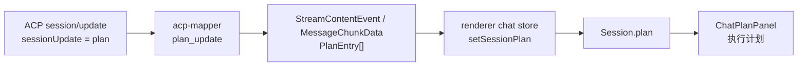

## Context

当前调用链从主进程接收 ACP `session/update` 的 `sessionUpdate === "plan"` 开始：

问题不在上游 ACP 协议字段，而在 FylloCode 内部把这条运行时状态继续称为 plan。FylloCode 已经有正式 `create-plan` tool 和 `plan.create` action，二者是可审阅、可编辑、可批准、会进入 lineage 的轻量规划方案。ACP `plan` 则是 Agent 当前 turn 的全量运行时安排快照，不持久化、不进入 lineage、不由用户编辑。

## Goals / Non-Goals

**Goals:**

- 从 `acp-mapper` 接收到 ACP `sessionUpdate === "plan"` 后，FylloCode 内部统一使用 Agenda 命名。
- 让共享类型、事件判别值、store action、session 字段、composable 返回值、组件名、测试名和 UI 文案形成同一套词汇。
- 明确残留边界：上游协议字面值 `sessionUpdate: "plan"` 可以保留，FylloCode 自有 plan 工具链必须保留。
- 用搜索验收约束防止遗漏旧内部命名。

**Non-Goals:**

- 不修改 ACP SDK 或协议定义；上游仍叫 `plan`。
- 不修改 `create-plan` MCP tool、`plan.create` action、Plan Slideover、lineage plan、`PlanDocument`、session `plans/` 文件。
- 不改变 Agenda 的运行时语义：仍全量替换、不持久化、不进入 message assembler、不进入 `session.messages`。
- 不迁移历史 archived OpenSpec change 文档；历史变更记录可以保留当时的 plan 术语。

## Decisions

### 决策 1：协议边界保留 `plan`，内部事件改为 `agenda_update`

`acp-mapper.mapSessionUpdate` 的 switch 仍保留 `case "plan"`，因为这是 ACP 协议输入。该分支之后产出的 `SessionEvent` 改为 `{ kind: "agenda_update"; entries: AgendaEntry[] }`。对应归一化函数改为 `normalizeAgendaEntries`，常量改为 `AGENDA_PRIORITIES` / `AGENDA_STATUSES`。

备选：把 UI 叫 Agenda，但内部继续 `plan_update`。否决，因为这会继续让共享类型、测试和调用链保留冲突命名，不能满足“不要遗漏”的目标。

### 决策 2：共享类型使用 `AgendaEntry`，session 字段使用 `agentAgenda`

`AgendaEntry` 只描述 ACP Agent 推送的运行时条目：`content`、`priority`、`status`。`Session.plan` 改为 `Session.agentAgenda`，比 `agenda` 更明确所有权在 Agent，不是用户日程或 FylloCode 规划方案。

备选：使用 `TodoEntry` / `Session.todo`。否决，因为 Todo 的用户心智更接近可编辑、可勾选、长期追踪的待办事项，容易与 FylloCode task 混淆。

### 决策 3：组件和 UI 采用 `ChatAgentAgendaPanel` / “行动清单”

组件文件 `src/renderer/src/components/chat/event/ChatPlanPanel.vue` 改为 `ChatAgentAgendaPanel.vue`。事件栏内部 prop 从 `planEntries` 改为 `agentAgendaEntries`，面板标题从“执行计划”改为“行动清单”。

备选：UI 标题显示 “Agent Agenda”。否决，当前事件栏相关文案均使用简体中文，`chat-event-rail-panel-style` 已要求 panel 标题使用中文。

### 决策 4：搜索验收采用“禁止旧内部命名 + 明确允许残留”

实施完成后必须执行面向遗漏的搜索。以下旧内部命名在 `src/`、`test/`、`openspec/specs/`、`guidelines/` 中不应再出现：

- `PlanEntry`
- `plan_update`
- `ChatPlanPanel`
- `setSessionPlan`
- `Session.plan`
- `activeSession.plan`
- `session.plan`
- `planEntries`
- “执行计划”（仅指 ACP runtime agenda UI，不含历史 archive 文档）

允许残留：

- `src/main/services/chat/acp-mapper.ts` 中的 `case "plan"` / `sessionUpdate === "plan"` 协议边界。
- ACP 引用资料或 archived OpenSpec change 中的历史术语。
- FylloCode 自有 `create-plan`、`plan.create`、lineage plan、Plan Slideover、`PlanDocument`、session `plans/` 相关命名。

## Risks / Trade-offs

- [遗漏旧命名] → 在 tasks 中加入 `rg` 内容搜索与 `rg --files` 文件名搜索，且要求测试名同步改名。
- [误改 FylloCode plan 工具链] → proposal、design、tasks 明确 Non-Goals 和允许残留；实施时不得重命名 lineage/plan-tool 相关 API。
- [跨进程事件名变更导致编译但运行遗漏] → `StreamContentEvent` 和 `MessageChunkData` 仍通过 TypeScript 联合类型做穷尽检查；renderer/main/tests 同步更新。
- [spec capability 名仍含 `chat-plan-display`] → 本次通过 delta 修改该既有 capability 的要求内容，不在同一变更中重命名 OpenSpec capability 目录，避免把运行时调用链重命名与 OpenSpec 历史能力迁移混为一谈。

## Migration Plan

无数据迁移。Agenda 仍不落盘，旧 session meta 中也不存在 `plan` 字段需要迁移。实现回滚只需把内部命名和 UI 文案恢复为旧 plan 命名，不会留下持久化状态。

## Open Questions

无。
