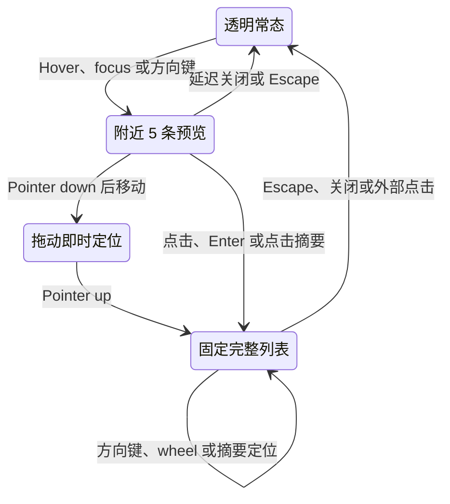

## Context

`ChatContainer.vue` 已通过 `absolute left-2 top-4` 将 `ChatPromptTimeline` 覆盖在消息滚动区左侧，timeline 当前并不占用消息列宽度。无限增长来自 `ChatPromptTimelineNav.vue` 内部：组件以 `LINE_STEP_PX = 6` 为每个 `ChatPromptTimelineItem` 生成一条横线，并在总高度超出宿主时让 rail 自身滚动；active 和 preview 还会改变对应横线的长度与颜色。

`usePromptTimeline.ts` 已独立负责 user prompt anchor 测量、35% 阅读参考线、requestAnimationFrame scroll 合并、平滑导航锁定和 reduced-motion 降级。这些行为没有造成视觉密度问题，应继续复用。`references/designs/chat-prompt-timeline/prototype/adaptive-timeline-scrubber.html` 已验证将视觉导览刻度与真实 prompt 数据分离后，短对话、几十轮长对话、连续 pointer 映射、固定完整列表和滚动定位可以共存。

正式实现必须继续遵守 `guidelines/UiDesign.md`：使用 Nuxt UI/Tailwind 语义 token；hover 只改变背景或边界，不增加 hover shadow、transform 或一次性全局 CSS。

## Goals / Non-Goals

**Goals:**

- 将可见导览刻度限制在 2–10 个，并使超过 10 条 prompt 的 timeline 高度固定。
- 在可见刻度与真实 prompt 不再一一对应时，仍让整条 rail 连续映射到全部 prompt。
- 保持 timeline 为绝对定位悬浮层，不压缩消息滚动区、消息内容最大宽度或 composer。
- 以透明常态和轻量交互底板兼顾低干扰与复杂消息背景上的可辨识度。
- 用同一个 popover 支持附近 5 条单行预览和可固定、可滚动的完整 user prompt 列表。
- 保留 pointer、drag、wheel、keyboard、reduced-motion 与 active 阅读同步的可访问导航能力。

**Non-Goals:**

- 不改变 user prompt 的投影、附件摘要、system reminder 过滤或 timeline 的两个 item 显示门槛。
- 不移除或重写 `usePromptTimeline.ts` 的 active 阅读参考线、offset 缓存、ResizeObserver 和导航锁定。
- 不修改 Session、message、IPC、preload 或持久化数据结构。
- 不新增 timeline 固定侧栏、横向布局占位、全局样式 token、外部依赖或列表虚拟化。
- 不把交互原型中的独立说明文案、演示场景切换器或 hover shadow 带入产品组件。

## Decisions

### 1. 视觉导览刻度与真实 prompt index 分离

`ChatPromptTimelineNav.vue` 继续接收完整 `items`，但只派生 `guideCount = min(items.length, 10)` 个视觉刻度：

- `2 <= items.length <= 10`：每条 prompt 对应一个刻度，刻度数量与 rail 高度随数量有限增长。
- `items.length > 10`：固定渲染 10 个均匀分布的导览刻度，rail 使用固定最大高度。
- 建议沿用原型参数：短列表刻度步长 `14px`、最小 rail 高度 `36px`、长列表高度 `164px`。这些值保持在组件局部常量中，不新增全局 spacing token。

每个导览刻度都是 neutral、等长且不响应 active/preview 样式。真实 active index 通过独立 teal thumb 的纵向比例表达：`activeIndex / (items.length - 1)`。这样保留当前阅读反馈，同时避免刻度在 hover 或滚动时跳动。

备选方案是继续一条 prompt 对应一条可滚动横线；它能直接表达精确数量，但正是长对话无限增长和局部滚动的来源，因此不采用。另一个备选是完全移除 active 同步；这会失去阅读位置反馈并浪费现有稳定的 offset 缓存，故不采用。

### 2. 整条 rail 使用归一化坐标映射完整数据

pointer 不再依据 `LINE_STEP_PX` 或 `scrollTop` 计算 index，而使用 rail 当前矩形：

`ratio = clamp((clientY - rect.top) / rect.height, 0, 1)`

`index = round(ratio * (items.length - 1))`

因此可见刻度只是方向提示，刻度之间没有 dead zone，超过 10 条 prompt 时也不会损失任何 item。pointer move 只更新 preview 和 popover；pointer 按下后拖动才持续发出 `immediate` 定位；没有发生拖动的 pointerup 发出 `smooth` 定位并固定完整列表。wheel 以 preview index 为基准逐条移动并使用 `immediate` 定位，便于高密度数据的细调。

组件继续使用 pointer capture，并在 pointerup、pointercancel 和卸载时释放 dragging 状态。导航仍通过现有 `PromptTimelineNavigationIntent` 交给 `usePromptTimeline.ts`，不复制消息滚动计算。

### 3. Active、preview 与 pinned selection 分开建模

- `activeIndex`：由 `activeItemId` 推导，只驱动 teal thumb 和非交互时的无障碍当前值。
- `previewIndex`：由 hover、wheel 或键盘移动，驱动 popover 选中摘要；不改变任何导览刻度。
- `pinned`：区分临时附近预览和固定完整列表；固定后 `previewIndex` 同时是列表选中项。
- `dragging`：只控制 immediate 定位和交互底板，不改变 popover 数据来源。

滚动消息导致 active 改变时，不强制覆盖正在进行的 preview 或 pinned selection；用户结束交互并关闭 popover 后，下一次 focus 以 active index 初始化 preview。这样阅读位置和用户正在检查的摘要不会互相抢状态。

### 4. 单一 Popover 支持 transient 与 pinned 两种状态

继续使用受控 `UPopover` 和 portal，不创建第二个 overlay：

- **Transient**：hover/focus 时展示以 `previewIndex` 为中心、边界处自动补齐的最多 5 条摘要。
- **Pinned**：点击 rail、点击 transient 摘要或按 Enter 后展示全部 `items`；内容区使用 `max-h-72 overflow-y-auto`（约 `288px`）独立滚动。
- 两种状态的摘要行都固定单行，使用 `truncate`/ellipsis；可显示两位或按实际位数扩展的 prompt ordinal。Header 可显示当前/总数和“固定完整列表”或“关闭”操作。
- selected 行仅使用 `bg-primary/10 text-default`，不得增加左侧 border；所有行保持相同内边距，避免选中时文字横向跳动。
- pinned 状态改变 `previewIndex` 后，通过选中行 ref 或 `data-item-id` 调用 `scrollIntoView({ block: "nearest" })`，确保键盘、wheel 或点击后的选中项在列表 viewport 内。
- transient 状态沿用关闭延迟，允许 pointer 从 rail 移到 portal 内容；pinned 状态只在 Escape、关闭操作、外部点击或受控 popover 关闭事件时退出。

完整列表直接渲染现有 prompt items。目标是几十轮对话，且消息列表本身已经包含这些 turn；当前无需引入虚拟化或新的依赖。

### 5. 悬浮表面不参与 Chat 布局

保留 `ChatContainer.vue` 现有 absolute host，不新建 `.timeline-column`、grid column 或固定宽度侧栏。`ChatPromptTimelineNav.vue` 的局部外层使用约 `w-11` 的透明 hit area：

- 默认：`bg-transparent border-transparent shadow-none`。
- hover、focus-within、dragging：使用 `bg-default/80` 和 `border-default/50` 一类语义 surface；不改变尺寸、位置或 shadow。
- Popover：继续使用 Nuxt UI 默认实体 surface 和浮层 shadow，确保摘要可读。

该选择让 timeline 在静止时接近当前悬浮横线，仅在用户明确交互时提供背景分组。相比永久白色 capsule，它更少遮挡消息；相比始终完全透明，它在复杂内容下更容易识别命中区。

### 6. Rail 使用 slider 语义和单一键盘入口

rail 继续是唯一 Tab 停靠点，但改用 `role="slider"` 表达连续 scrubber：

- `aria-valuemin="1"`、`aria-valuemax=items.length`。
- 非交互时 `aria-valuenow` 表达 active prompt；preview 或 pinned 时表达当前 preview。
- `aria-valuetext` 使用“第 N 条 prompt，共 M 条”，不依赖纯视觉刻度数量。
- ArrowUp/ArrowDown 移动一条，Home/End 到边界，Enter 使用标准定位语义并进入 pinned，Escape 关闭 popover。
- pinned 时方向键更新 selected row 并保持其可见；摘要 button 仍可通过 pointer 或后续 Tab 操作定位。

`prefers-reduced-motion` 继续由 `usePromptTimeline.ts` 将 smooth 降级为 auto。视觉过渡只使用短时颜色/背景/边界 transition，并在 reduced motion 下关闭非必要 transition。

### 7. 测试围绕纯映射和可观察状态更新

优先在 `test/renderer/src/components/chat-prompt-timeline-nav.spec.ts` 通过组件 props 和 stubbed `getBoundingClientRect` 验证：

- 8 条 prompt 渲染 8 个导览刻度，24/61 条只渲染 10 个且 rail 高度相同。
- rail 顶部、中间、刻度间隙和底部映射到正确真实 index。
- active thumb 比例更新，但 guide classes 不因 active/preview 改变。
- 透明常态与 hover/focus/dragging 语义背景 class。
- transient 5 行、pinned 全量、单行 truncation、最大高度滚动、无 selected 左边框。
- pointer、wheel、keyboard、关闭延迟、pointer capture 和选中行可见性。

`test/renderer/src/components/chat-container.spec.ts` 只验证 absolute host 和消息列结构未被改变。`usePromptTimeline.ts` 的现有测试继续证明 active/reference-line 与 smooth/immediate 行为；除非实现发现回归，不重写该 composable。

## Interaction State

## Risks / Trade-offs

- [高 prompt 数量下每条对应的物理像素减少] → 保留 wheel、键盘和 pinned 完整列表作为逐条精调路径；当前目标是几十轮对话，不为假设性的超大列表引入虚拟化。
- [绝对悬浮层可能覆盖窄窗口左侧消息内容] → 保持约 `44px` 的窄透明 hit area、沿用现有 `left-2` 宿主位置，并验证窄窗口无横向滚动；不通过固定列换取避让。
- [active 与 preview 分离可能让用户误解 teal thumb] → teal 始终只表示阅读位置，popover selected 只表示交互选择，两个状态使用不同表面且不改变 guide ticks。
- [portal popover 的 pointer leave 容易闪退] → 复用现有关闭延迟和 rail/content 双侧 enter/leave 协调；pinned 状态不响应 transient close timer。
- [完整列表渲染增加 DOM 节点] → 只在用户主动 pinned 时渲染，关闭后恢复最多 5 行；目标规模下不引入额外依赖。

## Migration Plan

这是 renderer 局部替换，无数据迁移或发布顺序要求。实现时先更新组件测试，再替换 `ChatPromptTimelineNav.vue` 的逐 item 横线与 popover 状态，最后运行 renderer 定向测试、Web typecheck 和 lint。若出现不可接受的交互回归，可回退该组件和对应测试；`usePromptTimeline.ts`、消息数据与持久化状态不需要回滚。

## Open Questions

无。视觉密度、悬浮表面、active thumb、popover 两种状态和选中样式均以已确认原型及本设计中的项目规范适配为准。
