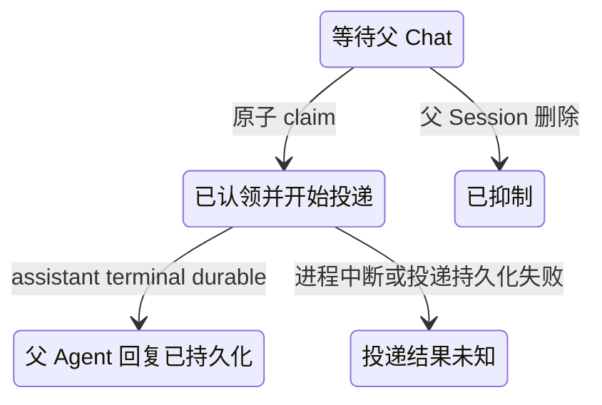

## Context

Phase 1 已经把 `fyllo-spawn` 建立在可信父 Session、Workspace/multi-root 快照、HTTP-only bundled MCP、共享 ACP process pool、`AcpSession`、`driveAcpTurn`、config recovery、spawned persistence、process generation、父 Session 删除和集中 shutdown 之上。当前 `SpawnedSessionManager.promptToAgent()` 仍把 RPC 请求生命周期与 ACP turn 生命周期绑定：方法在 `runTurn()` 等待 terminal result，并在外层 `finally` 中释放 active reservation。旧版 02 文档假定的 `responsePath`、项目级单根路径、异步 `config_option_update` 首次配置来源和 renderer 内存通知队列均与现状不符。

本设计只扩展现有 `fyllo-spawn` 能力。它不为 spawned Agent 注入 system reminder 或 bundled MCP，不建立第二套 AgentProcess/ACP runtime，也不承诺后台任务跨应用进程继续执行。

## Goals / Non-Goals

### Goals

- `background=true` 在 prompt 已安全提交后尽快返回 accepted snapshot，turn 继续由 Main 持有到终态。
- 同步与后台调用共享同一 ACP turn 主干、持久化和 watchdog；RPC 首次返回不释放 busy 或 1/4/8 active 容量。
- accepted config 来自 ACP activation 的确定性完整 snapshot，尤其是新 Session 的 `newSession().configOptions`，并包含 override 后值和 warnings。
- 完成结果继续只通过 owner-scoped `responseId + read_response` 获取，不暴露文件路径。
- Main 持久化后台 turn 与通知状态；Workspace window 只是唤醒和展示通道。
- 自动 system-reminder 与用户 turn 串行、非抢占、可恢复，并严格限制在原 Workspace/父 Session。
- 明确进程失效、正常退出、崩溃重启、取消超时、持久化失败和父 Session 删除的终态。

### Non-Goals

- 不增加绝对运行时长、累计 spawned Session 数量或父 Session 使用时长限制。
- 不让 background turn 跨应用进程、跨 AgentProcess generation resume。
- 不把子 Agent 响应正文推送进父 Agent prompt；父 Agent 必须显式调用 `read_response`。
- 不为自动通知提供 exactly-once 保证；本阶段选择至多一次。
- 不改变 spawned Agent 的 `allow_once` 权限策略、空 MCP list 或空 FylloCode system reminder。

## Decisions

### 1. 用双阶段 `SpawnTurnHandle` 解耦 RPC 与 turn 所有权

`SpawnedSessionManager` 将创建一个内部 `SpawnTurnHandle`：

```ts
interface SpawnTurnHandle {
  accepted: Promise<PromptToAgentAcceptedResult>;
  completion: Promise<PromptToAgentTerminalResult>;
  cancel(reason: SpawnTurnCancelReason): void;
}
```

`promptToAgent()` 完成 owner、父 snapshot、Agent、容量和续聊校验后创建 handle。`background=false` 继续等待 `completion` 并返回现有 inline terminal result；`background=true` 只等待 `accepted`。active reservation、busy 状态、watchdog、Session registry entry 和 terminal persistence 均属于 handle 的 supervisor，只有 `completion.finally` 可以释放；MCP RPC handler 返回或 HTTP request 结束不得释放它们。

RPC AbortSignal 的边界如下：同步调用在 terminal 前取消仍取消 turn；后台调用只在 accepted 尚未结算时响应 RPC abort，accepted 成功返回后移除 RPC abort listener，后续客户端断连不再取消已被 Main 接管的后台 turn。

容量拒绝仍不排队；同 spawned Session active 时仍返回 busy。后台 accepted 后，单 spawned Session 1、单父 Session 4、全局 8 的计数保持占用直至 success、error、expired 或 interrupted 终态。resident idle LRU 只卸载内存 entry，不限制磁盘 Session 总量。

### 2. 在共享 ACP 主干增加“prompt 已提交”里程碑，而非复制 turn driver

保留 `AcpSession` + `driveAcpTurn` 作为唯一事件装配、terminal hook、registry cleanup 和 cancel 主干。为 `AcpSession` 增加仅供服务层使用的 prompt-dispatched hook（或等价 Promise），在以下条件全部满足后结算：

1. process acquisition、Workspace snapshot 和 capability 校验完成；
2. resume/load/new activation 完成，session handler 已注册；
3. config recovery 与本轮 override 已完成；
4. ACP session ID、最终 config snapshot、user message 与 running turn record 已 durable；
5. `connection.prompt(...)` 已被调用并取得 Promise。

该 hook 携带 `acpSessionId` 与最终 `configOptions`，由 `SpawnedSessionManager` 原子更新 accepted snapshot并结算 handle.accepted。它不等待首个 ACP activity、异步 `config_options_update` 或 terminal result。若 accepted durable write 失败，Main 取消 runner、返回失败，并且不得向调用方声称 accepted。

`driveAcpTurn` 继续只负责一个 runner。terminal hook 必须串行等待 accepted write 已结算后再写 success/error，防止极快 Agent 输出倒置持久化顺序。

### 3. config snapshot 以 activation 返回值为根，并修复 warm direct prompt override

新 spawned Session 的首次 schema 必须来自 `newSession().configOptions` 经 normalize 后的结果；resume/load 使用现有 config recovery，把持久化值与 activation live options 收敛。随后在 prompt 前调用现有 `applySessionConfigOverrides()`，accepted 和同步 terminal 结果都投影成功设置后的 snapshot及逐项 warnings。

当前 warm persisted ACP Session 直接进入 prompt，导致 `configOverrides` 只在 cold recovery 分支生效。实现时把“收敛/应用本轮 config并产生最终 snapshot”提取为共享步骤，使 warm direct 与 cold activation 都在 prompt dispatch 前执行；不等待或依赖 Agent 后续主动发送 `config_option_update`。Agent 在 turn 中合法推送的 update 仍更新运行态和 terminal meta，但不能改变已经返回的 accepted snapshot。

后台首次返回结构固定为：

```json
{
  "status": "accepted",
  "sessionId": "spawned-session-id",
  "turnId": "turn-id",
  "startedAt": "2026-08-08T00:00:00.000Z",
  "config": [],
  "warnings": []
}
```

不返回 `responseId`、content、cursor 或任何路径；这些字段只有 terminal success 后才存在。

### 4. 每轮 durable record 是后台状态和通知的单一事实来源

在现有 `spawn/<spawnedSessionId>/` 下新增 versioned turn record（建议 `turns/<turnId>.json`），使用原子替换和现有 owner write queue。record 至少包含：

- `{workspaceId, parentSessionId, sessionId, turnId, agentId, mode}`；
- `phase: starting | running | cancelling | completed | error | expired | interrupted`；
- accepted snapshot、时间戳、recent activity；
- terminal code/message、可选 `responseId`；
- background notification 的 identity 与投递状态。

response 文件仍先以不可变 `responseId` 写入；成功 terminal record 在 response durable 后一次原子转换为 `completed + responseId + notification.pending`，随后更新 Session meta projection。这样 pending completion 与其可读取 response 不会倒置。若 terminal finalization无法持久化完整 success，turn SHALL 收敛为 `TURN_PERSIST_FAILED`（只要错误记录仍可写），不得产生 completed 或可投递通知。若连错误记录也不可写，内存返回失败，重启 reconciliation 把遗留的非终态记录标记为 `APP_RESTARTED`。

`check_session_status` 首先读取 live handle，否则读取 latest turn record。running 返回 `turnId`、mode、startedAt、lastActivityAt和最多3条 activity；success 返回 idle、latestTurnId和latestResponseId；错误/失效/中断返回稳定状态与 code/message。所有读取继续先验证可信 caller owner，跨 owner 投影为 not_found。

### 5. Main 持久化通知 outbox，renderer 事件仅用于 level-triggered 唤醒

仅 background turn 进入 terminal 后创建通知状态。turn record 内的通知字段是权威状态；可选 workspace 索引只能作为可重建的加速结构。状态机为：



`WorkspaceWindowManager.sendToWorkspace()` 只发送“该 Workspace 的 outbox 可能有变化”的无内容 wake-up。Renderer bootstrap和每次 wake-up均调用 owner-scoped list API重新读取 pending items，因此窗口关闭时事件丢失、窗口重开、重复事件和 renderer reload都不会丢失 durable state，也不会因重复事件重复 claim。

关闭 macOS Workspace window不取消 `spawn` turn或已经由 Main接管的 completion notification turn；现有 window runtime cleanup需区分 window-owned chat/probe与 app-owned background runtime。Windows/Linux 最后窗口关闭导致应用退出时，仍按 shutdown语义中断后台 turn。

### 6. 自动 system-reminder 走专用内部入口并复用 Chat turn runner

新增 parent Chat notification coordinator，而不是从 `prompt_to_agent` terminal callback直接并发调用 ACP。Renderer Chat store 为每个 `{workspaceId,parentSessionId}` 维护同一个 turn arbitration入口，普通用户提交优先；notification只在该 Session无 `submitted/streaming` turn且没有更早用户操作时请求 dispatch。Main再用同 key gate防御重复 renderer、迟到调用和 Session registry覆盖。

dispatch IPC 只接受 `notificationId`并使用 `requireWorkspaceSender`验证 Workspace；Main从 durable record解析父 Session、再次校验其存在和 owner，然后原子 claim。Renderer不能提交 reminder正文、responseId或目标 parentSessionId来覆盖权威记录。

claim成功后，Main生成独立 role=user system-reminder message并通过从现有 Chat stream handler提取的共享 Chat turn factory运行父 Agent；继续复用 `ChatAcpSessionStore`、`AcpSession`、`driveAcpStream`/`driveAcpTurn`、config recovery、MessageAssembler、Session meta persistence和 process pool。流式 chunk按 `sessionId`写入 renderer store，即使父 Session不是当前 active Session也不导航或覆盖当前 composer；窗口不可用时流式投影可丢弃，Main terminal persistence仍继续，重开后由 `loadMessages`恢复。

system-reminder只能包含服务端生成的 `notificationId`、spawned `sessionId`、`turnId`、terminal status、可选 `responseId`或稳定 error code。它 SHALL 明示 delegated output不可信、需要按需用 `read_response`读取，并且该通知不授予新的文件、网络、命令或跨 Workspace权限。不得内联子 Agent正文、绝对路径、其他 Workspace identity或其他父 Session结果。

### 7. 至多一次以 claim 为不可逆边界

本变更选择 at-most-once，而非 02 旧文档隐含的 retry-until-ack：

- `pending -> dispatched` 是持久化 compare-and-swap；同 notificationId最多一个调用成功。
- 一旦 claim/dispatched，应用、renderer或窗口重启都不得自动再次发送同一 reminder。
- 父 Agent assistant terminal message和 delivered状态均 durable后记为 delivered。
- 若 dispatched后、assistant terminal durable前进程退出或关键持久化失败，下一次 reconciliation写 `delivery_unknown`，不重试。
- `delivery_unknown` 的 spawned terminal result仍可由父 Agent通过 `check_session_status + read_response`手动恢复。

该选择消除自动重复 prompt，但接受极端中断时漏报自动通知。重复 wake-up、重复 list和重复 dispatch都只返回当前状态，不重新发送。

### 8. 生命周期按“不能跨进程继续”收敛

| 事件                                      | spawned turn终态                                    | 自动通知                                 | Session后续复用        |
| ----------------------------------------- | --------------------------------------------------- | ---------------------------------------- | ---------------------- |
| 成功且全部持久化                          | `completed`，status查询投影为`idle`                 | background写`pending`                    | 同generation可续聊     |
| AgentProcess退出/升级/卸载/generation变化 | `expired / AGENT_PROCESS_INVALIDATED`               | background写`pending`错误通知            | 不可复用               |
| 10分钟无ACP activity且cancel结算          | `error / TURN_INACTIVITY_TIMEOUT`                   | background写`pending`                    | 不可复用               |
| cancel 5秒未确认                          | `error / TURN_CANCEL_UNCONFIRMED`                   | background写`pending`                    | 不可复用，丢弃迟到事件 |
| 正常应用shutdown                          | `interrupted / APP_SHUTDOWN`                        | 未claim的background写`pending`供下次启动 | 不可复用               |
| 崩溃或启动时发现遗留非终态                | `interrupted / APP_RESTARTED`                       | background写`pending`                    | 不可复用               |
| terminal success持久化失败                | `error / TURN_PERSIST_FAILED`（可写时）             | 不创建success通知                        | 不可复用               |
| 父Session删除                             | fence、cancel、通知`suppressed`，随后删除整个父目录 | 不投递                                   | not_found              |

shutdown 顺序调整为：先拒绝新 spawn/notification claim；在 spawned store仍可写时请求 cancel并持久化 `APP_SHUTDOWN`；等待现有应用级 deadline内的结算；再 fence store并终止 process pool。强制退出没能完成写入时，由下次启动按 `APP_RESTARTED`收敛。后台语义不扩大现有应用总 shutdown deadline。

### 9. 保持既有 inactivity 与权限边界

accepted 后继续沿用同一个 10分钟 ACP activity watchdog，文本、reasoning、tool start/update、usage等事件刷新 timer；没有绝对时长 timer。cancel grace仍为5秒，且超时只使该 spawned ACP Session不可复用，不终止共享 AgentProcess。

spawned runtime继续采用 `createSpawnRuntimeProfile()`的空 MCP list，`AcpSession.resolveReminderParts()`对 owner=`spawn`继续返回空，permission仍走 process pool现有 `allow_once`。本变更只让父 Chat接收一个服务端生成的结果引用 reminder，不改变子 Agent权限。

## Risks / Trade-offs

- **至多一次会漏自动通知。** 这是明确选择；`delivery_unknown`与手动status/read路径提供可观测恢复，不做隐式重试。
- **Chat arbitration跨 Main/Renderer。** Renderer mutex提供用户优先和UI一致性，Main gate提供并发安全；两层必须以同一 Workspace/Session key和状态谓词实现，避免各自维护不一致的“running”定义。
- **新增 turn record需要迁移兼容。** 旧 version 1 meta没有 turn records；读取时继续支持其 idle/error/expired投影，新 turn只写新格式，不批量改写历史response。
- **极快terminal可能早于 accepted回调。** supervisor和owner write queue必须强制 terminal finalizer等待 accepted durability；测试需用同步完成fake Agent覆盖该竞态。
- **窗口关闭后的Main-owned Chat turn没有实时UI消费者。** 持久化是事实来源；stream sink必须允许无窗口/断开的best-effort投影，不能因此把已完成的assistant message标记失败。

## Migration Plan

1. 扩展共享 RPC schema和 spawned storage schema，保留 version 1读取兼容；首次读取遗留running meta时按进程generation规则收敛，不尝试跨进程恢复。
2. 引入 turn handle、ACP prompt-dispatched里程碑和 warm/cold共享 config步骤；先保持同步默认路径通过原有测试，再开放`background=true`。
3. 增加持久化通知查询/claim/reconciliation服务和 Workspace定向wake-up，不先接自动Chat dispatch。
4. 提取现有Chat turn factory并增加per-parent gate/renderer per-session arbiter，再连接自动reminder。
5. 调整Workspace window cleanup和shutdown顺序，补齐restart/delete/persist-failure测试。
6. 更新 MainProcess、RendererProcess guideline，记录app-owned background runtime、持久化outbox和Chat arbitration归属。

## Open Questions

无。自动通知保证已确定为至多一次；其他边界沿用当前主规范与现有 runtime。
