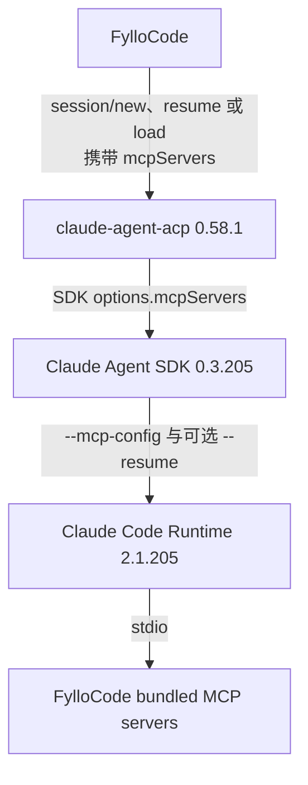

# Claude ACP MCP 初始化竞态与后续验证

> 最后核验：2026-07-21
>
> 相关博客：[Claude ACP 的 MCP 初始化竞态](../../docs/zh/blog/2026-07-21-claude-acp-mcp-initialization-race.md)
>
> 当前状态：新会话已有临时 workaround；应用重启后的 resume 问题尚未解决。

## 文档用途

这份文档保存 Claude ACP 无法稳定加载 FylloCode MCP Server 的排查证据和复查方法。后续升级 `claude-agent-acp`、Claude Agent SDK 或其内置 Claude Code Runtime 后，应先读本文，再判断：

1. `MCP_CONNECTION_NONBLOCKING=0` 是否还需要保留；
2. 应用重启后的 ACP session resume 是否已经能稳定恢复动态注入的 MCP 工具；
3. 当前故障发生在 FylloCode、`claude-agent-acp`、Agent SDK，还是 Claude Code Runtime。

不要因为上游 issue 被关闭、changelog 写了“fixed”，或者单次手工测试成功，就直接删除 workaround。

## 当前结论

### 已确认

- FylloCode 在新建、resume 和 load ACP session 时都会传入 bundled MCP servers。
- `claude-agent-acp 0.58.1` 会把 ACP `mcpServers` 转换成 Claude Agent SDK 的 `mcpServers`。
- Claude Agent SDK `0.3.205` 会同时为恢复会话和动态 MCP 配置生成 `--resume` 与 `--mcp-config` 参数。
- SDK `0.3.205` 内置 Claude Code Runtime `2.1.205`。
- Runtime `2.1.205` 默认允许普通 MCP 连接异步进行；`MCP_CONNECTION_NONBLOCKING=0` 会恢复一次有上限的启动等待。
- 未显式设置 `MCP_CONNECT_TIMEOUT_MS` 时，这次等待的默认上限是 5000 ms。超过上限后，连接仍可在后台继续。
- `MCP_CONNECTION_NONBLOCKING=0` 必须进入 `claude-acp` 进程环境。只把它放进某个 MCP Server 的子进程环境没有作用。
- 本地 A/B 实验中，设置该变量后，新会话可以在创建后立即调用 FylloCode MCP 工具。
- 同一个 workaround 没有修复应用重启后的 resume。日志显示 FylloCode 已传入两个 MCP servers 且 `resumeSession` 成功，但工具仍返回 `No such tool available`。

### 证据支持，但尚未定位到确切代码分支

- 新会话问题是第一条 prompt 与 MCP 连接、工具注册之间的竞态。
- resume 问题更接近以下两种情况之一：
  - Runtime 的 resume 路径丢失或忽略动态 `--mcp-config`；
  - MCP 后来连接成功，但模型可见的 deferred tool snapshot 已经冻结且没有刷新。

### 不能据此断言

- 不能断言问题由 Runtime `2.1.204` 或 `2.1.205` 首次引入。`2.1.205` 只是本次复现的现场版本。
- 不能把新会话和 resume 归并成同一个 bug。它们错误文本相同，但 workaround 的结果不同。
- 不能把 `resumeSession succeeded` 当作 MCP 已恢复的证明。它只说明 session 恢复请求成功。

## 原始症状

新建 Claude ACP session 后立即要求 Agent 调用 `fyllo-specs/explore`，返回：

```text
<tool_use_error>Error: No such tool available: mcp__fyllo_specs__explore</tool_use_error>
```

关键观察：

| 场景                                           | 结果       |
| ---------------------------------------------- | ---------- |
| `newSession` 后立即发送第一条 prompt           | 工具不存在 |
| `newSession` 后等待约两分钟再发送同一条 prompt | 工具可用   |

这里的“第一条 prompt”是用户发出的第一条消息，不是特殊的 ACP 初始化字段。ACP `session/new` 创建 session；真正触发模型推理的是后续 `session/prompt`。

## 依赖链与故障现场版本



现场安装版本：

| 层                                      | 版本      | 核验方式                                        |
| --------------------------------------- | --------- | ----------------------------------------------- |
| `@agentclientprotocol/claude-agent-acp` | `0.58.1`  | adapter `package.json`                          |
| `@agentclientprotocol/sdk`              | `1.2.1`   | adapter dependencies                            |
| `@anthropic-ai/claude-agent-sdk`        | `0.3.205` | adapter dependencies                            |
| SDK 内置 Claude Code Runtime            | `2.1.205` | Agent SDK `package.json` 的 `claudeCodeVersion` |

`claude-agent-acp 0.57.0` 使用 Agent SDK `0.3.202`，`0.58.1` 使用 `0.3.205`。比较这两个 tag 时，没有发现 adapter 的 ACP MCP 映射逻辑随版本升级而改变。主要变化是依赖版本更新。

公开版本证据：

- [`claude-agent-acp v0.57.0/package.json`](https://github.com/agentclientprotocol/claude-agent-acp/blob/v0.57.0/package.json)
- [`claude-agent-acp v0.58.1/package.json`](https://github.com/agentclientprotocol/claude-agent-acp/blob/v0.58.1/package.json)

## 分层排查证据

### 1. FylloCode

相关实现：

- [`src/main/services/session/chat/acp-session.ts`](../../src/main/services/session/chat/acp-session.ts)
- [`src/main/infra/process/acp-process-pool.ts`](../../src/main/infra/process/acp-process-pool.ts)

确认项：

- `getBundledMcpServers` 在 turn 开始前构造 MCP 列表。
- `connection.newSession({ cwd, mcpServers })` 创建新 session。
- `connection.resumeSession({ sessionId, cwd, mcpServers })` 恢复 session。
- `connection.loadSession({ sessionId, cwd, mcpServers })` load session。
- 诊断日志会记录 `persistedSession=yes/no` 和 `bundledMcpServers=<count>`。

固定 commit 上的代码位置：

- [构造 bundled MCP server 列表](https://github.com/Fioooooooo/FylloCode/blob/17481ebf0c45d1ef9739f5ca449da02192d1c818/src/main/services/session/chat/acp-session.ts#L147-L170)
- [new session 传入 `mcpServers`](https://github.com/Fioooooooo/FylloCode/blob/17481ebf0c45d1ef9739f5ca449da02192d1c818/src/main/services/session/chat/acp-session.ts#L580-L584)
- [resume 传入 `mcpServers`](https://github.com/Fioooooooo/FylloCode/blob/17481ebf0c45d1ef9739f5ca449da02192d1c818/src/main/services/session/chat/acp-session.ts#L495-L514)
- [load 传入 `mcpServers`](https://github.com/Fioooooooo/FylloCode/blob/17481ebf0c45d1ef9739f5ca449da02192d1c818/src/main/services/session/chat/acp-session.ts#L529-L549)

因此，本次排查没有发现 FylloCode 漏传 server 列表。

### 2. claude-agent-acp

在 `v0.58.1` 中：

- `resumeSession` 和 `loadSession` 都进入 `getOrCreateSession`；
- `getOrCreateSession` 把 `params.mcpServers` 继续交给 `createSession`；
- `createSession` 把 ACP stdio、HTTP 和 SSE server 转换为 SDK 的 `mcpServers`；
- SDK options 最后包含合并后的 `mcpServers`。

源码：[claude-agent-acp v0.58.1 `acp-agent.ts`](https://github.com/agentclientprotocol/claude-agent-acp/blob/v0.58.1/src/acp-agent.ts#L3471-L3688)

本次排查没有发现 adapter 在新建或恢复路径吞掉 MCP 参数。

### 3. Claude Agent SDK

SDK `0.3.205` 的打包代码会：

- 当 resume id 存在时添加 `--resume <id>`；
- 当 `mcpServers` 非空时添加 `--mcp-config <json>`；
- 使用 SDK options 中的 `env` 启动内置 Claude Code Runtime。

在本次检查的版本里，`--resume` 和 `--mcp-config` 可以同时出现。SDK 在这条链路中主要负责参数组装和启动 Runtime，实际 MCP 连接与工具注册发生在 Runtime。

### 4. Claude Code Runtime

Runtime `2.1.205` 打包代码中存在：

```text
MCP_CONNECTION_NONBLOCKING
MCP_CONNECT_TIMEOUT_MS
MCP_SERVER_CONNECTION_BATCH_SIZE
```

本地检查到的逻辑：

- `MCP_CONNECTION_NONBLOCKING` 未设置时，普通 MCP server 走 fully async 路径；
- 值为 `0`、`false`、`no` 或 `off` 时，不走 fully async；
- 非异步路径使用 `MCP_CONNECT_TIMEOUT_MS` 作为等待上限；
- `MCP_CONNECT_TIMEOUT_MS` 缺省为 5000 ms；
- 到期仍未就绪时继续处理 prompt，后台连接不终止。

Claude Code changelog 显示，这类启动策略并不是 `2.1.205` 才出现。`2.1.89` 已经加入 `MCP_CONNECTION_NONBLOCKING=true`，用于在 headless `-p` 模式完全跳过 MCP 等待，同时把 `--mcp-config` server 的等待限制在 5 秒。相关文档缺失后来记录在 [`anthropics/claude-code#41792`](https://github.com/anthropics/claude-code/issues/41792)。

## 上游 issue

状态会变化，复查时必须重新打开 issue 和 changelog，不能只看下表的历史状态。

| Issue                                                                                                            | 与本问题的关系                                                                                                 | 2026-07-21 状态                  |
| ---------------------------------------------------------------------------------------------------------------- | -------------------------------------------------------------------------------------------------------------- | -------------------------------- |
| [`agentclientprotocol/claude-agent-acp#883`](https://github.com/agentclientprotocol/claude-agent-acp/issues/883) | `session/new.mcpServers` 动态注入的 stdio MCP 没有进入模型工具列表；报告版本为 adapter `0.59.0`、SDK `0.3.207` | Open，无评论                     |
| [`anthropics/claude-code#43298`](https://github.com/anthropics/claude-code/issues/43298)                         | headless 模式在远程 MCP 连接完成前冻结 deferred tool list                                                      | Closed；报告称约从 `2.1.81` 回归 |
| [`anthropics/claude-code#43968`](https://github.com/anthropics/claude-code/issues/43968)                         | `--resume` 后 MCP 工具全部消失，直接调用得到 `No such tool available`，且没有诊断信息                          | Closed as duplicate              |
| [`anthropics/claude-code#41792`](https://github.com/anthropics/claude-code/issues/41792)                         | 记录 `MCP_CONNECTION_NONBLOCKING` 和 `--mcp-config` 等待语义缺少公开文档                                       | Closed as resolved               |
| [`anthropics/claude-code#36833`](https://github.com/anthropics/claude-code/issues/36833)                         | 早期 headless session 不加载 Claude AI connector MCP tools                                                     | Closed；曾被标记在 `2.1.83` 修复 |

`#36833` 的早期修复不代表当前问题已解决。`#43298`、`#43968` 和 adapter `#883` 都发生在更晚版本，故障形态也更接近本次现场。

## A/B 实验结果

| 实验 | 条件                                                  | 结果                      | 能说明什么                          |
| ---- | ----------------------------------------------------- | ------------------------- | ----------------------------------- |
| A    | 新会话，默认环境，立即发送第一条 prompt               | 工具不存在                | 默认启动存在竞态                    |
| B    | 新会话，默认环境，等待约两分钟后发送                  | 工具可用                  | 配置不是永久丢失；时间会改变结果    |
| C    | 新会话，设置 `MCP_CONNECTION_NONBLOCKING=0`，立即发送 | 工具可用                  | bounded wait 能避开新会话初始化窗口 |
| D    | 设置该变量，重启 FylloCode，resume 已有会话           | resume 成功，工具仍不存在 | resume 是另一个问题或另一条时序路径 |

实验 C 由用户手工启动 dev 环境验证。实验 D 在同一 workaround 下进行。

## 当前 workaround

提交：[`17481eb fix(acp): wait for claude mcp startup`](https://github.com/Fioooooooo/FylloCode/commit/17481ebf0c45d1ef9739f5ca449da02192d1c818)

实现位于 [`acp-process-pool.ts`](../../src/main/infra/process/acp-process-pool.ts)：

```ts
function applyAgentSpawnWorkarounds(agentId: string, spec: AgentSpawnSpec): AgentSpawnSpec {
  if (agentId !== "claude-acp") return spec;

  return {
    ...spec,
    env: {
      ...spec.env,
      // TODO: Claude Code runtime 修复首轮 MCP 异步注册竞态后移除此临时兼容开关。
      MCP_CONNECTION_NONBLOCKING: "0",
    },
  };
}
```

设计边界：

- 仅对 Agent ID `claude-acp` 生效；
- 覆盖 registry 和 custom distribution 的启动 spec；
- 强制覆盖已有的同名变量，避免外部值把 workaround 改回异步；
- 不影响其他 ACP Agent；
- 没有设置 `MCP_CONNECT_TIMEOUT_MS=30000`；
- 测试覆盖已有值为 `1` 时最终仍得到 `0`。

## resume 问题的本地证据

应用重启后的测试观察到：

1. FylloCode 启动新的 `claude-acp` 进程；
2. 对已有会话开始 turn，日志为 `persistedSession=yes; bundledMcpServers=2`；
3. 直接 prompt 因进程重启、内存 session 不存在而进入 recovery；
4. FylloCode 调用 `resumeSession`，同时传入 `cwd` 和两个 `mcpServers`；
5. `resumeSession` 成功返回；
6. 后续调用 `mcp__fyllo_specs__explore` 仍返回 `No such tool available`；
7. 从 resume 成功到工具失败已经过去数十秒，不能只用“刚启动还没连上”解释。

这说明 FylloCode 与 ACP adapter 的“session 已恢复”状态不能代表 Runtime 的 MCP 工具表已经恢复。

## 后续复查前的准备

新 Agent 开始复查时应先做只读调查：

1. 阅读本文和关联 blog；
2. 阅读当前 [`acp-process-pool.ts`](../../src/main/infra/process/acp-process-pool.ts)，确认 workaround 仍存在且没有被改写；
3. 阅读当前 [`acp-session.ts`](../../src/main/services/session/chat/acp-session.ts)，确认 new、resume、load 路径仍传入 `mcpServers`；
4. 查明 FylloCode 实际启动的是哪个 `claude-agent-acp`，不要只看仓库依赖或 npm latest；
5. 记录 adapter、ACP SDK、Agent SDK 和 bundled Runtime 四个实际版本；
6. 比较当前 adapter 与已知版本的 MCP mapping、resume 和 SDK options 组装逻辑；
7. 检查 Claude Code changelog；
8. 重新查看上游相关 issue 的状态、评论、关联修复和复现版本。

如果需要启动 FylloCode dev 或执行构建，必须先取得用户本轮的明确授权。不要把“请验证一下”自动解释成构建授权。

## 验证环境变量是否仍有必要

### 控制变量

- 使用同一台机器、同一项目和同一 MCP server 配置；
- 每轮都确保 `claude-acp` 和其 Runtime 进程完全退出，避免复用已经连好的进程；
- 第一条用户消息固定为直接调用一个确定存在的工具，例如 `fyllo-specs/explore`；
- 不要在 prompt 内部 `sleep`。如果工具快照已经冻结，prompt 内等待不能验证启动阶段行为；
- 记录每轮的版本、时间点、session id、`bundledMcpServers` 数量和工具结果。

### A 组：保留 workaround

1. 保持 `MCP_CONNECTION_NONBLOCKING=0`；
2. 冷启动应用和 Claude ACP；
3. 创建新会话；
4. `newSession` 返回后立即发送第一条 prompt；
5. 让 Agent 直接调用 `fyllo-specs/explore`；
6. 重复至少 5 次，竞态明显时建议 10 次。

这一组用于确认当前基线没有退化。

### B 组：临时移除 workaround

1. 在隔离分支或临时 worktree 中移除 `MCP_CONNECTION_NONBLOCKING=0`；
2. 其他条件与 A 组相同；
3. 每轮冷启动后立即发送第一条 prompt；
4. 重复次数与 A 组相同；
5. 保存失败时的主进程日志和 Claude ACP stderr。

不要直接在正式修改中删除 workaround 后只跑一次成功用例。先把删除当作实验变量。

### 删除 workaround 的判定条件

只有同时满足以下条件，才可以建议删除：

- B 组至少 5 次冷启动全部成功，最好 10 次；
- 每次都是 `newSession` 后立即发出第一条 prompt，没有人为等待；
- Agent 实际执行 MCP tool，而不是只声称工具存在；
- FylloCode 日志确认使用了预期的动态 bundled MCP server；
- 上游版本或代码存在可以解释结果变化的修复证据；
- 回归测试覆盖移除后的 spawn env 行为；
- resume 仍单独评估，不用新会话成功替代 resume 结论。

如果 B 组出现一次 `No such tool available`，当前 workaround 仍有必要。

## 验证 resume 是否稳定修复

### 单轮流程

1. 冷启动 FylloCode 和 `claude-acp`；
2. 创建一个全新的会话；
3. 在该会话中成功调用 `fyllo-specs/explore`，确认初始 MCP 正常；
4. 记录 FylloCode session id 与 ACP session id；
5. 完全退出 FylloCode，确认 ACP agent 和 Claude Code Runtime 进程结束；
6. 重新启动 FylloCode；
7. 打开同一个对话并发送第一条恢复后的消息；
8. 让 Agent 立即调用同一个 MCP tool；
9. 检查日志是否依次出现：
   - `persistedSession=yes`
   - `bundledMcpServers=2`（或当时的预期数量）
   - `attempting resumeSession`
   - `resumeSession succeeded`
10. 确认没有走 `loadSession` 或 fresh `newSession` fallback。fallback 成功不能证明 resume 已修复。

### 稳定修复的判定条件

- 至少 5 轮“创建、调用、退出、重启、resume、再次调用”全部成功；
- 每轮确认实际采用 `resume_session` 策略；
- resume 后第一次 MCP 调用即可成功，不依赖等待几十秒或重试；
- server 数量、名称和启动配置与 resume 请求一致；
- 日志或 Runtime 事件能证明 MCP server 已 connected，或者工具确实进入模型可见列表；
- 不再出现静默省略 MCP server 的情况；
- 如果上游声称修复，测试版本不低于该修复版本。

### 仍需区分的失败类型

| 现象                                            | 更可能的方向                           |
| ----------------------------------------------- | -------------------------------------- |
| MCP 子进程没有启动                              | 配置、spawn、权限或路径问题            |
| MCP 子进程启动并完成 `tools/list`，模型仍无工具 | Runtime tool registry 或 snapshot 问题 |
| `resumeSession` 失败并 fallback                 | ACP session 恢复或持久化问题           |
| `resumeSession` 成功但工具缺失                  | Runtime resume + dynamic MCP 问题      |
| 等待后新会话恢复，resume 始终不恢复             | 两条独立初始化路径，不应合并诊断       |

## 可选的 30 秒诊断实验

曾考虑临时设置：

```text
MCP_CONNECT_TIMEOUT_MS=30000
```

这个实验只用于区分：

- MCP 连接需要超过默认 5 秒；
- resume 路径根本没有把动态 MCP 工具放进可见列表。

用户已决定当前不采用这个处理，因为 30 秒启动等待太长。除非后续明确需要做诊断，并再次获得用户同意，否则不要把它加入产品代码。

解释结果时也要谨慎：30 秒成功只能说明延长等待改变了结果，不能自动证明上游已经修复；30 秒仍失败则更支持配置被忽略或工具快照冻结。

## 后续 Agent 可直接使用的任务描述

```text
先完整阅读 references/acp/Claude-ACP-MCP-Initialization-Race.md 和关联 blog。
检查当前实际安装的 claude-agent-acp、Claude Agent SDK 与 bundled Claude Code Runtime 版本，
重新查看文档列出的上游 issue 和 Claude Code changelog。先做只读调查并报告证据。

在得到我对 dev/构建和临时实验的明确授权后，按文档的 A/B 流程验证：
1. MCP_CONNECTION_NONBLOCKING=0 是否仍是新会话首轮工具可用的必要条件；
2. 应用重启后的 resume 是否能稳定恢复 FylloCode 动态注入的 MCP 工具。

不要因为单次成功或上游 issue 关闭就删除 workaround。新会话至少重复 5 次，
resume 至少重复 5 轮，并分别给出结论。
```

## 最终决策表

| 新会话无 workaround | resume | 处理建议                                          |
| ------------------- | ------ | ------------------------------------------------- |
| 不稳定              | 不稳定 | 保留当前 workaround，resume 继续跟踪              |
| 稳定                | 不稳定 | 可提出删除 workaround，但 resume 仍按独立问题处理 |
| 不稳定              | 稳定   | 保留 workaround；重新核对两条路径和测试隔离       |
| 稳定                | 稳定   | 可删除 workaround，并补齐新会话与 resume 回归测试 |

任何代码删除都应在实验完成后单独提交，提交说明应包含测试版本和重复次数，方便以后再次判断行为是否回归。
