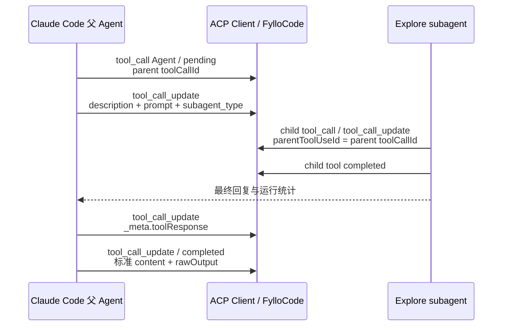

# Claude Code subagent ACP 流程

> 本文基于 2026-07-21 的单次成功样本 [`claude-subagent.log`](./claude-subagent.log) 整理。它是供 FylloCode 后续适配取材的观察记录，不是新的行为契约；规范约束仍以 `openspec/specs/subagent-call-inspector/spec.md` 为准。

## 快速结论

Claude Code 把一次 subagent 运行表示为一个 `_meta.claudeCode.toolName: "Agent"` 的父工具调用。subagent 内部工具仍作为独立 ACP `tool_call` 发出，并用私有字段 `parentToolUseId` 指向父 Agent 工具，因此三份样本中只有 Claude 可以直接恢复完整的父子工具树。

| 问题             | 本样本中的答案                                                                  | 证据                     |
| ---------------- | ------------------------------------------------------------------------------- | ------------------------ |
| 什么消息开始调用 | `tool_call`，`_meta.claudeCode.toolName === "Agent"`                            | 日志第 40 行             |
| 调用根 ID        | 父 Agent 工具的 `toolCallId`                                                    | 第 40 行                 |
| name / 展示标题  | 后续 update 的 `title` 或 `rawInput.description`                                | 第 42 行                 |
| subagent type    | `rawInput.subagent_type: "Explore"`；完成时可由 `toolResponse.agentType` 复核   | 第 42、78 行             |
| 内部工具如何识别 | 子工具 `_meta.claudeCode.parentToolUseId` 等于父 Agent `toolCallId`             | 第 48、50、60、66、72 行 |
| 如何标记完成     | 父 Agent 的标准 `tool_call_update.status === "completed"`                       | 第 80 行                 |
| 完成后输出       | 标准 `content` / `rawOutput` 中的最终回复；前一条私有 `toolResponse` 还提供统计 | 第 78、80 行             |

## 生命周期



## 1. 调用开始

第 40 行首先建立父工具：

```json
{
  "sessionUpdate": "tool_call",
  "toolCallId": "toolu_bdrk_0198QYDoXtk1LPWStq9UJkd2",
  "title": "Task",
  "kind": "think",
  "status": "pending",
  "rawInput": {},
  "_meta": { "claudeCode": { "toolName": "Agent" } }
}
```

对 FylloCode 而言，可靠 marker 是“当前 adapter 已明确属于 Claude Code”且 `toolName === "Agent"`。`title: "Task"`、`kind: "think"` 或 prompt 文本都不足以跨 agent 判定 subagent。

第 42 行仍使用同一个 `toolCallId`，补齐实际任务信息：

```json
{
  "sessionUpdate": "tool_call_update",
  "toolCallId": "toolu_bdrk_0198QYDoXtk1LPWStq9UJkd2",
  "title": "定位 ACP 事件映射相关代码",
  "rawInput": {
    "description": "定位 ACP 事件映射相关代码",
    "prompt": "...",
    "subagent_type": "Explore",
    "run_in_background": false
  },
  "_meta": { "claudeCode": { "toolName": "Agent" } }
}
```

这条 update 没有显式 `status`，所以组装时必须增量合并，不能因为字段缺失而清除 start 已建立的运行状态或 marker。

## 2. name、type 与身份

- 展示名称：本样本可使用 `title` 或 `rawInput.description`，两者都是“定位 ACP 事件映射相关代码”。
- Agent 类型：运行前来自 `rawInput.subagent_type`，原始值为 `Explore`；完成时 `_meta.claudeCode.toolResponse.agentType` 再次给出 `Explore`。
- 调用身份：整个运行以父 Agent 工具的 `toolCallId` 为根。
- 内部 agent ID：完成时私有 `toolResponse.agentId` 提供 `a7a82a51b4449bda4`。现有 OpenSpec 明确不应把该内部 ID 复制到公开 subagent 摘要，因此它只能作为日志诊断信息，不能作为持久化或展示契约。
- Model：`toolResponse.resolvedModel` 在完成前的私有 update 中出现，本样本值为 `claude-sonnet-5`。

## 3. 内部工具调用

subagent 的五次 Bash 调用各有独立 `toolCallId`。父子关系不靠事件相邻位置，而靠子工具的：

```json
{
  "_meta": {
    "claudeCode": {
      "toolName": "Bash",
      "parentToolUseId": "toolu_bdrk_0198QYDoXtk1LPWStq9UJkd2"
    }
  }
}
```

本样本还证明 `parentToolUseId` 可能延迟到达：

- 第一条 Bash 的 start（第 46 行）没有 `parentToolUseId`，第 48 行 update 才补上。
- 第二条 Bash 的 start（第 50 行）已经带 `parentToolUseId`。
- 后续三条 Bash（第 60、66、72 行）在 start 就带父 ID。

因此实时和持久化 assembler 都需要按 `toolCallId` 增量合并 `parentToolCallId`；不能要求 start 一定包含父关系，也不能用日志连续性把工具归入最近的 Agent 调用。

每个子工具仍遵循自己的 ACP 生命周期：`tool_call` 建立，零到多条 `tool_call_update` 更新，最终以该子工具的 `status: "completed"` 收尾。本样本中的私有 `toolResponse` update 与标准 completed update 可能分开发送，不能把没有 status 的私有 update 当成新工具。

## 4. 完成判定与最终输出

第 78 行先发一条只含 `_meta.claudeCode.toolResponse` 的父工具 update。它包含：

- `status: "completed"`；
- `content` 中的 subagent 最终回复；
- `agentType`、`resolvedModel`；
- `totalDurationMs`、`totalTokens`、`totalToolUseCount`；
- `toolStats`；
- `usage`、`agentId` 等不应直接进入公开摘要的额外字段。

第 80 行随后发标准 ACP completed update：

```json
{
  "sessionUpdate": "tool_call_update",
  "toolCallId": "toolu_bdrk_0198QYDoXtk1LPWStq9UJkd2",
  "status": "completed",
  "content": [{ "type": "content", "content": { "type": "text", "text": "..." } }],
  "rawOutput": [{ "type": "text", "text": "..." }],
  "_meta": { "claudeCode": { "toolName": "Agent" } }
}
```

FylloCode 应以父工具的标准 `status` 作为最终工具状态，以标准 `content` / `rawOutput` 作为最终回复来源；第 78 行的私有 `toolResponse` 用于提前补充 Claude 专属运行摘要。后续缺少摘要的 completed update 不应清除已提取统计。

统计只允许消费当前规范白名单中的字段。特别是 `totalTokens` 只用于 subagent 详情，不能累加到会话 token usage，也不能用 `toolResponse.usage` 替代会话级 ACP done usage。

## 5. FylloCode 适配依据

建议 Claude adapter 遵循以下顺序：

1. 在 Claude agent 上遇到 `toolName === "Agent"` 时，立即为父工具写入 subagent marker，不等待第一个子工具。
2. 用父 `toolCallId` 作为根调用 ID，增量合并 `title`、`description`、prompt、type、status 和摘要。
3. 将子工具 `parentToolUseId` 映射为 `parentToolCallId`；允许该字段在 update 阶段延迟出现。
4. 只把同一 assistant message 内、ID 唯一且无循环的关系投影为工具树；不安全关系降级为普通工具。
5. 保留标准 content 的所有文本块及顺序；私有响应只提取规范白名单统计，不复制任意未知字段。

## 未覆盖场景

本样本没有覆盖 `failed`、取消、后台运行、多个并行 subagent、subagent 再派生 subagent、跨消息父引用或重复 ID。不能从本日志推断这些场景的 Claude 私有字段与时序。
