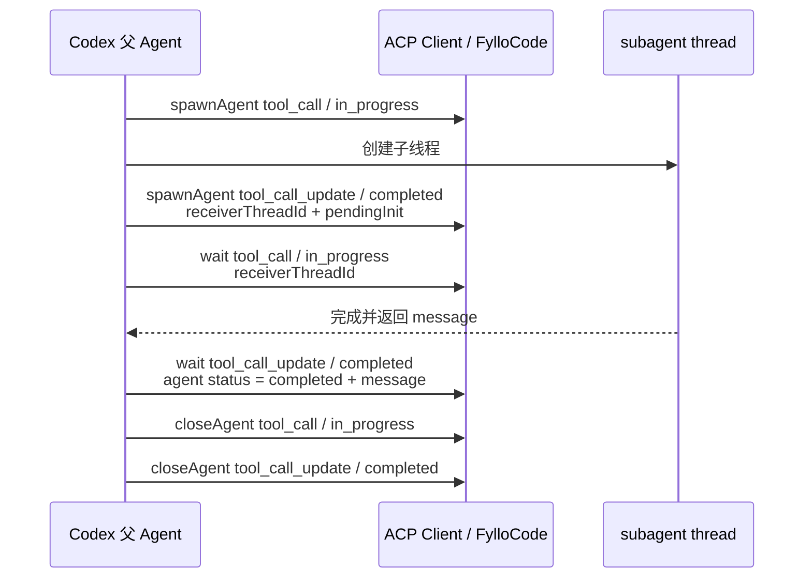

# Codex subagent ACP 流程

> 本文基于 2026-07-21 的单次成功样本 [`codex-subagent.log`](./codex-subagent.log) 整理。它描述当前 Codex ACP 的 collaboration 扩展形态，仅供 FylloCode 后续适配取材，不是跨 agent 协议。

## 快速结论

Codex 没有用一个父工具包住整个 subagent 生命周期，而是依次暴露三个父 Agent 协调工具：`spawnAgent`、`wait`、`closeAgent`。逻辑 subagent 需要通过 `receiverThreadId` 跨这三个工具关联；`spawnAgent` 工具完成时子线程仍可能只是 `pendingInit`，真正完成信号出现在后续 `wait` 的 `agentsStates` 中。

| 问题              | 本样本中的答案                                                     | 证据           |
| ----------------- | ------------------------------------------------------------------ | -------------- |
| 什么消息开始调用  | collaboration tool 为 `spawnAgent` 的 `tool_call`                  | 日志第 220 行  |
| subagent 稳定身份 | spawn update 返回的 `receiverThreadIds[0]`                         | 第 222 行      |
| name / type       | 本样本没有结构化 name 或 type                                      | 第 220、222 行 |
| 内部工具如何识别  | 本样本未暴露子线程内部工具，不能恢复工具树                         | 第 220-391 行  |
| 如何标记完成      | `wait` update 中目标线程 `agentsStates[id].status === "completed"` | 第 334 行      |
| 完成后输出        | 同一 agent state 的 `message`                                      | 第 334 行      |
| close 的含义      | `closeAgent` 是完成后的资源收尾，不是首次完成信号                  | 第 389、391 行 |

## 生命周期



## 1. spawnAgent：开始与取得子线程 ID

第 220 行开始创建 subagent：

```json
{
  "sessionUpdate": "tool_call",
  "toolCallId": "call_80wp4DK6KNOHogPairU7MNl5",
  "title": "spawnAgent",
  "kind": "other",
  "status": "in_progress",
  "rawInput": {
    "prompt": "...",
    "senderThreadId": "019f83f7-b7ab-7e93-a890-5c84e1281fe4",
    "receiverThreadIds": [],
    "agentsStates": {},
    "model": "",
    "reasoningEffort": "medium",
    "status": "inProgress"
  },
  "_meta": {
    "codex": {
      "collaboration": {
        "tool": "spawnAgent",
        "senderThreadId": "019f83f7-b7ab-7e93-a890-5c84e1281fe4",
        "receiverThreadIds": []
      }
    }
  }
}
```

在 start 时还没有子线程 ID。FylloCode 可以把这条 `toolCallId` 当作“创建动作”的临时根，但不能把它当成 subagent thread ID。

第 222 行完成创建动作并返回：

```json
{
  "sessionUpdate": "tool_call_update",
  "toolCallId": "call_80wp4DK6KNOHogPairU7MNl5",
  "status": "completed",
  "rawInput": {
    "receiverThreadIds": ["019f83f8-2dd6-75e3-8bc6-a232dcbb5953"],
    "agentsStates": {
      "019f83f8-2dd6-75e3-8bc6-a232dcbb5953": {
        "status": "pendingInit",
        "message": null
      }
    },
    "model": "gpt-5.5",
    "reasoningEffort": "high",
    "status": "completed"
  }
}
```

这里有两层不同状态：

- 外层 ACP `status: "completed"`：`spawnAgent` 工具已经完成。
- `agentsStates[receiverThreadId].status: "pendingInit"`：subagent 本身尚未完成，甚至仍在初始化。

因此不能在第 222 行把 subagent 卡片标为完成。

## 2. name、type 与身份

- 父线程：`senderThreadId`。
- 子线程：创建完成后返回的 `receiverThreadIds[]`。本样本只有一个值 `019f83f8-2dd6-75e3-8bc6-a232dcbb5953`，它是关联 wait/close 生命周期的稳定键。
- 展示名称：本样本没有 `name`、`description` 或类似字段。`title: "spawnAgent"` 是协调工具名，不是 subagent 名称。
- Agent 类型：本样本没有结构化 type。prompt 中的“只读探索子 Agent”是自然语言要求，不能被解析成稳定类型。
- Model / reasoning：spawn update 提供 `model: "gpt-5.5"` 和 `reasoningEffort: "high"`，它们描述执行配置，不是身份或 type。

如果 UI 需要在 name/type 缺失时展示标签，应使用明确的通用缺省文案；不能从 prompt 自由文本猜测一个类型。

## 3. wait：等待、完成与最终输出

第 332 行启动新的协调工具 `wait`。它有自己的 `toolCallId`，并通过 `receiverThreadIds` 指向刚创建的子线程：

```json
{
  "sessionUpdate": "tool_call",
  "toolCallId": "call_g83ehT8kbED4iXxfIm5hvfER",
  "title": "wait",
  "status": "in_progress",
  "rawInput": {
    "senderThreadId": "019f83f7-b7ab-7e93-a890-5c84e1281fe4",
    "receiverThreadIds": ["019f83f8-2dd6-75e3-8bc6-a232dcbb5953"],
    "agentsStates": {}
  },
  "_meta": {
    "codex": {
      "collaboration": {
        "tool": "wait",
        "receiverThreadIds": ["019f83f8-2dd6-75e3-8bc6-a232dcbb5953"]
      }
    }
  }
}
```

第 334 行是本样本中真正的 subagent 完成证据：

```json
{
  "sessionUpdate": "tool_call_update",
  "toolCallId": "call_g83ehT8kbED4iXxfIm5hvfER",
  "status": "completed",
  "rawInput": {
    "receiverThreadIds": ["019f83f8-2dd6-75e3-8bc6-a232dcbb5953"],
    "agentsStates": {
      "019f83f8-2dd6-75e3-8bc6-a232dcbb5953": {
        "status": "completed",
        "message": "1) 我检查了什么\n\n..."
      }
    }
  }
}
```

完成判定需要同时定位目标 `receiverThreadId`，再读取对应 state 的 `status`。最终回复位于同一个 state 的 `message`，而不在标准 ACP `content` 或 `rawOutput` 中。

外层 wait 工具 `status: "completed"` 只表示本次等待调用结束；在一般实现中，仍应优先检查每个目标线程自己的 state，尤其是一次 wait 可能关联多个 receiver 的场景。本样本没有覆盖多 receiver。

## 4. closeAgent：资源收尾

第 389 行启动 `closeAgent`，第 391 行完成。两条事件继续携带相同 `receiverThreadId`。完成 update 再次复制了目标线程的 `status: "completed"` 和 `message`。

这一步发生在 wait 已经取得结果之后，因此本样本支持的语义是“关闭/释放已完成 agent”，不是“subagent 首次完成”。FylloCode 可以把它记录为生命周期收尾，但不应等到 close 才展示结果，也不应把 close 工具状态覆盖 agent 自身状态。

## 5. 内部工具调用的可观测性

从 spawn（第 220 行）到 close 完成（第 391 行），父会话 ACP 日志中没有带该 `receiverThreadId` 的 read、search、execute 等子线程内部 `tool_call`。最终 `message` 虽然说检查了 `package.json`、`README.md`、目录结构和 git 状态，但这些自然语言不能证明每个动作对应了什么工具事件。

因此本样本只能展示：

- 创建 subagent；
- 子线程身份与状态；
- 等待和关闭动作；
- 最终 message。

不能据此构造 Claude 式内部工具活动树，也不能把 `wait` / `closeAgent` 当成 subagent 内部工具；它们是父 Agent 发起的协调工具。

## 6. FylloCode 适配依据

建议 Codex adapter 使用两级模型：

1. 工具级：每个 `spawnAgent`、`wait`、`closeAgent` 仍按自己的 `toolCallId` 组装 ACP 工具事件。
2. subagent 级：创建完成后用 `receiverThreadId` 建立逻辑 subagent 记录，并跨多个协调工具增量合并状态和 message。
3. 识别 collaboration tool 时同时要求当前 adapter 属于 Codex，并读取 `_meta.codex.collaboration.tool`；不要只匹配 title。
4. `spawnAgent` completed 只结束创建动作；subagent 状态从 `agentsStates[receiverThreadId]` 取得。
5. `message` 缺失时显示结果不可用，不从父 Agent 后续自然语言回复反推。
6. 没有结构化 name/type 时保留缺失状态，不解析 prompt 生成伪结构化值。

## 未覆盖场景

本样本没有覆盖 spawn 失败、subagent 初始化失败、运行中进度状态、超时、取消、interrupt、多个 receiver、并行 subagent、嵌套派生、follow-up 消息或未执行 close。对应状态枚举与时序需要新增日志后再确认。
