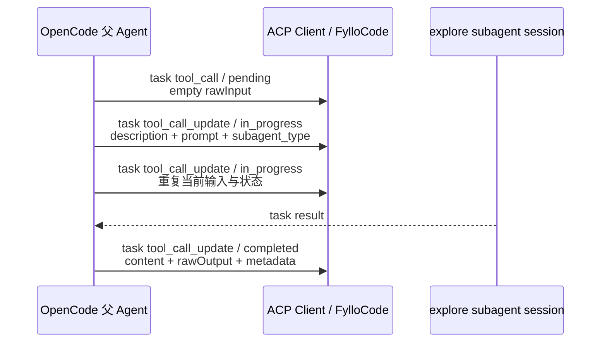

# OpenCode subagent ACP 流程

> 本文基于 2026-07-21 的单次成功样本 [`opencode-subagent.log`](./opencode-subagent.log) 整理。它记录 OpenCode 当前 `task` 工具的 ACP 表现，仅供 FylloCode 后续 adapter 设计取材，不应推广为其他 agent 的通用规则。

## 快速结论

OpenCode 把整个 subagent 运行封装在同一个 `task` tool call 中：先用空 input 的 `pending` start 建立工具，后续 update 补齐 description、prompt 与 `subagent_type`，最终同一个 `toolCallId` 进入 `completed` 并返回带 `<task>` 包装的结果。该父会话日志没有暴露 subagent 内部工具调用。

| 问题                      | 本样本中的答案                                                        | 证据          |
| ------------------------- | --------------------------------------------------------------------- | ------------- |
| 什么消息开始调用          | title 为 `task` 的 `tool_call / pending`                              | 日志第 178 行 |
| 何时能可靠确认是 subagent | 第一次 update 出现结构化 `rawInput.subagent_type`                     | 第 180 行     |
| name / 展示标题           | `rawInput.description`，并同步成为 update `title`                     | 第 180 行     |
| subagent type             | `rawInput.subagent_type: "explore"`                                   | 第 180 行     |
| 内部工具如何识别          | 本样本没有独立子工具事件，不能恢复工具树                              | 第 178-184 行 |
| 如何标记完成              | 同一工具的外层 `status === "completed"`                               | 第 184 行     |
| 完成后输出                | 标准 `content` 与 `rawOutput.output`；后者另带 session/model metadata | 第 184 行     |

## 生命周期



## 1. 调用开始与延迟确认

第 178 行建立工具：

```json
{
  "sessionUpdate": "tool_call",
  "toolCallId": "call_00_nYiqQIeSZDaEVirl13mf5135",
  "title": "task",
  "kind": "think",
  "status": "pending",
  "rawInput": {},
  "locations": []
}
```

这条 start 没有供应商 `_meta`、subagent type、子会话 ID 或 prompt。它证明一次名为 `task` 的工具已经开始，但仅凭通用 title 和 kind 不足以在多 agent 基线中安全断言它一定是 subagent。

第 180 行使用同一 `toolCallId` 补齐结构化输入并进入运行中：

```json
{
  "sessionUpdate": "tool_call_update",
  "toolCallId": "call_00_nYiqQIeSZDaEVirl13mf5135",
  "title": "Sub-agent ACP event test",
  "kind": "think",
  "status": "in_progress",
  "rawInput": {
    "description": "Sub-agent ACP event test",
    "subagent_type": "explore",
    "prompt": "..."
  }
}
```

在没有更稳定 OpenCode tool identity 扩展的前提下，这是本样本中第一次能通过结构化字段确认 subagent 语义的事件。FylloCode 可以先把第 178 行作为普通工具增量保存，再在第 180 行由 OpenCode 专属 adapter 增强为 subagent marker；不能因为 title 为 `task` 就对所有 agent 启用私有语义。

第 182 行再次发送内容相同的 `in_progress` update。assembler 应做幂等增量合并，不能重复创建卡片或清除既有字段。

## 2. name、type 与身份

- 展示名称：`rawInput.description` 与 update `title` 都是 `Sub-agent ACP event test`。
- Agent 类型：`rawInput.subagent_type`，原始值为小写 `explore`。
- 根调用身份：完整 ACP 工具生命周期使用同一个 `toolCallId`。
- 子会话身份：直到 completed update，`rawOutput.metadata.sessionId` 才出现。本样本为 `ses_07c05dbb1ffeQyKTbisEcXmaGt`。
- 父会话身份：completed update 的 `rawOutput.metadata.parentSessionId` 为 `ses_07c063799ffewv2ca0v2LxIUMW`。
- Model：completed metadata 提供 `{ "providerID": "deepseek", "modelID": "deepseek-v4-flash" }`。

`description` 适合展示，`subagent_type` 适合类型标签，`sessionId` 适合完成后的诊断或关联；三者不能互相替代。

## 3. 内部工具调用的可观测性

第 180 行进入运行中后，到第 184 行完成前，除了一条重复的 task update，没有独立 read、search、execute 等 `tool_call`，也没有 Claude `parentToolUseId` 或 Codex `receiverThreadId` 形式的内部活动关联字段。

最终回复称 subagent 执行了文件匹配和文本搜索，但这只是结果文本，不能用于重建工具种类、调用次数、输入输出或时间顺序。因此 FylloCode 在当前证据下只能展示一个封装式 subagent 卡片，内部工具活动应显示为不可用，而不是根据回复生成伪造记录。

## 4. 完成判定

第 184 行是唯一完成事件：

```json
{
  "sessionUpdate": "tool_call_update",
  "toolCallId": "call_00_nYiqQIeSZDaEVirl13mf5135",
  "title": "Sub-agent ACP event test",
  "status": "completed",
  "content": [
    {
      "type": "content",
      "content": {
        "type": "text",
        "text": "<task id=\"ses_...\" state=\"completed\">..."
      }
    }
  ],
  "rawOutput": {
    "output": "<task id=\"ses_...\" state=\"completed\">...",
    "metadata": {
      "parentSessionId": "ses_07c063799ffewv2ca0v2LxIUMW",
      "sessionId": "ses_07c05dbb1ffeQyKTbisEcXmaGt",
      "model": {
        "providerID": "deepseek",
        "modelID": "deepseek-v4-flash"
      },
      "truncated": false
    }
  }
}
```

完成可由三处交叉观察：

1. 外层 ACP `status: "completed"`；
2. 文本包装 `<task state="completed">`；
3. 标准 content 和 `rawOutput.output` 都已经带回 `<task_result>`。

FylloCode 应优先使用外层 ACP status 作为工具终态，因为它是无需解析供应商文本的结构化字段。XML-like `<task>` 包装属于结果载荷，可作为 OpenCode 专属诊断证据，但不应成为唯一完成判定，也不应进入 agent 无关 mapper。

## 5. 最终输出

相同结果在第 184 行出现两次：

- 标准 `content[0].content.text`；
- 私有形态 `rawOutput.output`。

两者都包含：

```xml
<task id="ses_07c05dbb1ffeQyKTbisEcXmaGt" state="completed">
  <task_result>...</task_result>
</task>
```

标准 content 应作为正常工具输出保留。`rawOutput.metadata` 提供标准 content 没有的父子 session、model 与 `truncated` 信息，可由 OpenCode adapter选择性提取。不要因为 output 重复而把两个副本连续展示，也不要在 agent 无关层按 `<task_result>` 文本内容推断任意工作流副作用。

本样本 `truncated: false`，说明返回结果未被标记截断；它不代表所有完成结果都有该字段，也不能据此推断截断时的补取协议。

## 6. FylloCode 适配依据

建议 OpenCode adapter 遵循以下顺序：

1. 按标准 ACP `toolCallId` 保存第 178 行的 pending 普通工具。
2. 第 180 行出现结构化 `subagent_type` 后，再为同一工具增量写入 subagent marker、description、prompt、type 与运行状态。
3. 对重复 in-progress update 做幂等合并，不创建新的 subagent 实例。
4. 以外层 ACP status 判定终态；标准 content 作为最终回复，`rawOutput.metadata` 只做 OpenCode 专属的窄字段增强。
5. 没有内部子工具事件时保持“未记录/不可用”，不从最终回复的动作描述推算统计。
6. 如果未来要解析 `<task>` 包装，应在 OpenCode adapter 内单独验证格式和失败降级，不能把 XML-like 文本解析放入通用 ACP mapper。

## 未覆盖场景

本样本没有覆盖 `failed`、取消、后台 task、并行 task、嵌套 task、运行中进度内容、内部工具透传、`truncated: true` 或缺少 metadata。相关判断需要新增原始日志后再补充。
