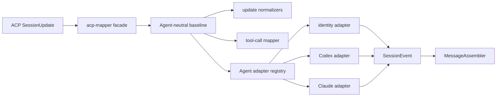

# ACP session update 映射架构

> 基于 claude-acp、codex-acp、gemini、qodercli、opencode 的实测事件，以及 ACP v1 tool-call 文档。

## 背景

ACP 只稳定规定 `toolCallId` 和 start `title`，其余 tool-call 字段大多可选，出现时机也由 Agent 决定。FylloCode 因此需要同时处理两类问题：

- ACP 公共字段的防御性归一化，例如 input、content、diff、locations 和 status。
- 已通过真实事件确认的 Agent 展示差异，例如 Codex terminal 元数据、Claude Code MCP 工具名。

这两类逻辑不能继续混在 `acp-mapper.ts`。否则每增加一个 Agent 优化，中央 switch 都会同时增长协议判断、Agent 判断和展示规则。

## 当前分层

### `acp-mapper.ts`

- 是其他 chat service 使用的稳定 facade。
- 保留 `mapSessionUpdate(update, context)` 以及既有 normalizer re-export。
- 只负责记录日志、按 `sessionUpdate` 分发、解析 Agent adapter，并输出 `SessionEvent | null`。
- 不包含 Agent id 集合、Agent 元数据解析或 Agent 专属标题规则。

### `acp-mapper/update-normalizers.ts`

- 处理 commands、agenda、config options。
- 提取 tool input、文本 content、diff 和 locations。
- 处理只依赖 ACP 字段矛盾的通用兼容，例如 `completed + rawOutput.error` 降级为 failed。
- 不读取 `agentId`。

### `acp-mapper/tool-call-mapper.ts`

- 创建 `tool_call_start` 与 `tool_call_update` 的 Agent 无关基线事件。
- 对字段出现时机不作假设；start 和 update 都独立提取自身携带的字段。
- 保持无状态，不追踪 started/terminated toolCallId。

### `acp-mapper/agent-adapters/`

- `types.ts` 限制 adapter 只能把 thought、tool-call start/update 映射为同类事件或 `null`。
- `registry.ts` 显式注册稳定 Agent id 与别名；未注册 Agent 使用 identity adapter。
- `codex.ts` 处理 Codex thought、原生/MCP 工具名、edit title 和 terminal 元数据。
- `claude.ts` 从 ACP title 归一 Claude Code `mcp__server__tool`，并独立处理 `parentToolUseId`；不再读取历史 `_meta.claudeCode.toolName`。

## 映射顺序

1. facade 根据 context 的 `agentId` 解析一次 adapter。
2. 普通 message、usage、commands、plan、config updates 直接映射。
3. thought 先创建普通 `reasoning_delta`，再交给 adapter 做窄范围文本修正。
4. tool call 先由基线 mapper 提取所有通用字段，再交给 adapter 增强名称、标题、状态或 Agent 元数据。
5. adapter 不重新实现 input/diff/locations 等公共提取。

## 为什么保持无状态

早期方案计划让 `AcpMapper` 记录 tool call 是否已 start，并为 Gemini 孤儿 update 合成 start。该方案已经被实际实现取代：`MessageAssembler` 在收到不存在对应卡片的 update 时，会用 update 自带的 title、kind 和 input 惰性建卡。

继续在 mapper 保存第二份 tool-call 生命周期会带来以下问题：

- ACP session cleanup、恢复和 replay 需要同步重置 mapper 状态。
- mapper 与 assembler 可能对 started/terminated 状态产生不同判断。
- 单个 `SessionUpdate` 不再稳定映射为单个 `SessionEvent`，调用侧和测试复杂度上升。

因此，mapper 只做单事件映射，跨事件合并归 `MessageAssembler` 所有。

## 增加 Agent 展示优化

1. 先保存并分析该 Agent 的真实 ACP 事件，确认字段形态和时序。
2. 能仅依赖 ACP 公共语义处理的兼容，放入基线 normalizer/mapper，并覆盖未知 Agent。
3. 依赖特定 Agent 元数据或稳定怪癖的展示增强，放入独立 adapter。
4. 在 registry 注册明确的 Agent id；不要用 title 或 toolCallId 启发式猜测 Agent。
5. 为 adapter 添加聚焦测试，并补充“其他 Agent 不触发该规则”的负例。
6. 不因新增 adapter 修改 `SessionEvent` 或 renderer 契约；若确有必要，先走 OpenSpec Proposal。

## 语义边界

ACP tool-call 数据只用于工具活动展示和已验证的窄范围兼容。它不能作为宿主侧语义工作流决策的稳定来源：字段可选、时序不一致，且不同 Agent 对 MCP、skill 与子代理的表达方式不同。

需要 FylloCode 承接的 Agent 声明式动作应使用受校验的 Fyllo Action；不要通过 tool name、title 或 rawInput 猜测并触发任务、通知、Proposal 或其他副作用。

## 测试结构

- `acp-mapper.spec.ts`：facade 与非 tool-call update。
- `acp-mapper/tool-call-mapper.spec.ts`：Agent 无关的 tool-call 基线。
- `acp-mapper/agent-adapters/codex.spec.ts`：Codex 展示规则。
- `acp-mapper/agent-adapters/claude.spec.ts`：Claude Code 展示规则。
- `acp-mapper/agent-adapters/registry.spec.ts`：Agent id 别名与 identity fallback。
- `message-assembler.spec.ts`：跨事件组装、孤儿 update 建卡和输出合并。
