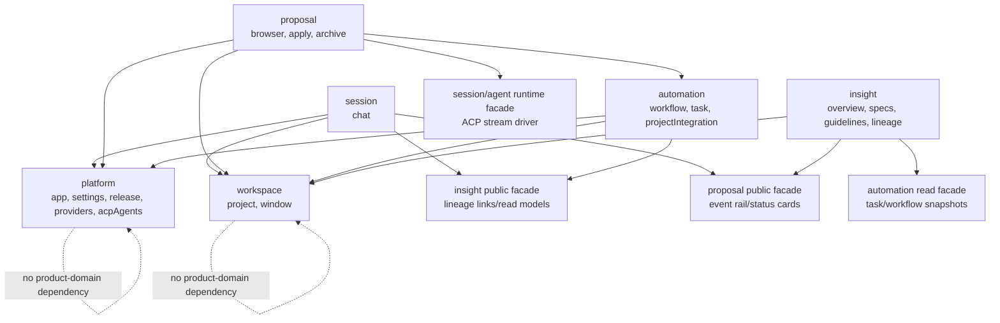

# 领域重构参考设计

创建时间：2026-07-08
状态：参考设计草案

本文档记录 FylloCode 以领域优先进行重构的目标架构。它是参考设计，不是 OpenSpec proposal。由于目标方案会改变公开的 preload API 形状、IPC channel 字符串、模块所有权边界，以及 renderer store 的依赖规则，业务代码变更前必须先走正式 OpenSpec proposal。

## 目标

将 FylloCode 从目前偏扁平的按功能区划分结构，重构为领域优先结构。跨进程 API 应清晰命名为：

```ts
window.api.<domain>.<area>.<action>()
```

同一套领域分类应贯穿主进程 IPC handler、共享 IPC contract、preload API、renderer API wrapper、主进程 service，以及 renderer store。但这只要求第一层领域语言一致，不要求 renderer store 与 main service 保持同形目录。页面和组件不应直接组合无关领域的 store；当某个功能需要跨领域行为时，组合逻辑应放在拥有该行为的领域 store 或 service 内部。

## 核心决策

### 1. 领域是第一层契约边界

目标领域如下：

| 领域         | 职责                                                          | 目标 area                                              |
| ------------ | ------------------------------------------------------------- | ------------------------------------------------------ |
| `platform`   | 不绑定具体项目工作流的全局应用能力和集成能力                  | `app`, `settings`, `release`, `acpAgents`, `providers` |
| `workspace`  | 项目标识、项目窗口、launcher/project context                  | `project`, `window`                                    |
| `session`    | Chat session、chat streaming、draft probe、message attachment | `chat`                                                 |
| `proposal`   | Proposal 浏览、proposal 状态、apply/archive run               | `browser`, `apply`, `archive`                          |
| `insight`    | 治理/read-model 视图和 lineage/provenance                     | `overview`, `specs`, `guidelines`, `lineage`           |
| `automation` | 项目工作执行和 workflow 配置                                  | `workflow`, `task`, `projectIntegration`               |

相对早期草案的重要映射调整：

- `acp-agents` 属于 `platform`，不属于 `session`。
- 现有 integration 代码应拆分：
  - 全局 provider connection/registry/probe/resource 能力进入 `platform.providers`。
  - 项目级 stage/resource mounting 进入 `automation.projectIntegration`。
- 现有 `proposal.ts` 和 `proposal-apply.ts` 不应变成 `window.api.proposal.proposal.*`。目标 area 是 `browser`、`apply` 和 `archive`。
- `platform.release` 是目标 public area，但它不是当前公开 API 的纯迁移。当前 release check 通过 settings 暴露，因此正式 proposal 必须明确选择 release 是继续保留为 `platform.settings.checkLatestRelease(...)`，还是变成 `platform.release.checkLatestRelease(...)`。

### 2. 公开 API 形状会有意改变

当前形状：

```ts
window.api.chat.listSessions(...)
window.api.proposal.list(...)
window.api.acpAgents.getRegistry(...)
```

目标形状：

```ts
window.api.session.chat.listSessions(...)
window.api.proposal.browser.list(...)
window.api.platform.acpAgents.getRegistry(...)
```

这是行为契约变更。正式 proposal 必须更新或创建 renderer/preload contract 相关的 OpenSpec requirement。

release check 需要单独处理。当前 `release-version-service` 是从 settings IPC/API 路径调用，而不是通过独立的 preload 或 renderer `release` API 调用。如果目标保留 `platform.release`，它就是一个有意新增的 public API area，必须被 spec、contract test 和迁移说明覆盖。如果团队希望行为契约差异最小，则应把公开方法继续放在 `platform.settings` 下，只把主进程 service 移到 `platform/release`。

### 3. IPC channel 字符串编码 domain 和 area

当前 channel 示例：

```ts
"chat:listSessions";
"proposal:stageStream";
"settings:get";
```

目标 channel 示例：

```ts
"session:chat:listSessions";
"proposal:apply:stageStream";
"platform:settings:get";
```

每个 request/response channel 和 event channel 都应遵循：

```text
<domain>:<area>:<action>
```

stream port 和 cancel channel 也应包含相同的 domain/area：

```text
session:chat:stream:message
session:chat:stream:port
session:chat:stream:cancel
proposal:apply:stageStream
proposal:apply:stageStream:port
proposal:apply:stageStream:cancel
```

### 4. Service 和 store 共享领域，但不强制同形

service 和 store 都应移动到领域目录下，但两者的内部形状不应强制一一对应。service 是主进程用例编排层，应该按 IO 能力、use case 和 domain/infra 组合边界拆分；renderer store 是 UI 状态、页面 workflow 和可复用交互状态的 owner，应该按 renderer ownership 建模。

分层规则：

| 层                           | 是否镜像 `window.api.<domain>.<area>` | 说明                                                                    |
| ---------------------------- | ------------------------------------- | ----------------------------------------------------------------------- |
| `src/shared/ipc/**`          | 是                                    | 跨进程 contract，应清晰对应 domain/area/channel。                       |
| `src/preload/api/**`         | 是                                    | contextBridge public contract，应对应 `window.api`。                    |
| `src/renderer/src/api/**`    | 是                                    | renderer transport wrapper，应镜像 preload contract。                   |
| `src/main/services/**`       | 否，只共享 domain                     | 按主进程用例、IO 能力和 infra 组合拆分，可比 public API 更细。          |
| `src/renderer/src/stores/**` | 否，只共享 domain                     | 按 UI/workflow state 和页面复用边界拆分，不跟随 service tree 机械复制。 |

service 示例：

```text
src/main/services/platform/acp-agent/acp-agent-service.ts
src/main/services/platform/settings/settings-service.ts
src/main/services/platform/release/release-version-service.ts
src/main/services/workspace/project/project-service.ts
src/main/services/session/chat/chat-service.ts
src/main/services/proposal/browser/proposal-service.ts
src/main/services/proposal/apply/apply-run-service.ts
src/main/services/insight/lineage/lineage-service.ts
src/main/services/automation/task/task-service.ts
src/main/services/automation/workflow/workflow-service.ts
```

renderer store 示例。注意这些 store 不是 service tree 的镜像，而是 renderer workflow/state owner：

```text
src/renderer/src/stores/platform/acp-agents.ts
src/renderer/src/stores/platform/settings.ts
src/renderer/src/stores/platform/providers.ts
src/renderer/src/stores/workspace/project.ts
src/renderer/src/stores/session/session.ts
src/renderer/src/stores/session/chat.ts
src/renderer/src/stores/proposal/browser.ts
src/renderer/src/stores/proposal/run.ts
src/renderer/src/stores/insight/overview.ts
src/renderer/src/stores/insight/specs.ts
src/renderer/src/stores/insight/guidelines.ts
src/renderer/src/stores/insight/lineage.ts
src/renderer/src/stores/automation/task.ts
src/renderer/src/stores/automation/workflow.ts
src/renderer/src/stores/automation/project-integration.ts
```

具体示例：

| 场景                         | 不推荐                                                                                             | 推荐                                                                                                                                          |
| ---------------------------- | -------------------------------------------------------------------------------------------------- | --------------------------------------------------------------------------------------------------------------------------------------------- |
| release check                | 因为有 `src/main/services/platform/release` 就强制建 `src/renderer/src/stores/platform/release.ts` | 如果 release 只是 settings 页的一个 action，放在 `platform/settings.ts` store；只有存在独立 release UI 状态时才建 `platform/release.ts`       |
| proposal apply/archive       | 为了匹配 `proposal/apply` 和 `proposal/archive` API，强制拆两个几乎相同的 run store                | public API 保持 `proposal.apply` / `proposal.archive`，renderer 可用 `proposal/run.ts` 管理共享 run UI 状态，并在内部区分 apply/archive       |
| session/chat                 | 因为 main 里有多个 chat service helper，就在 renderer 建多个同名 store                             | renderer 可保留 `session/session.ts` 管理当前会话 workflow，`session/chat.ts` 管理 chat list/message 状态，必要时再拆 `session/event-rail.ts` |
| provider/project integration | 让一个 renderer store 同时承担 settings provider 配置和项目 integration mapping                    | `platform/providers.ts` 管理全局 provider UI 状态；`automation/project-integration.ts` 管理项目级 integration UI 状态                         |

根级 `src/renderer/src/stores/index.ts` 作为 renderer 非 store 代码的统一导入入口。实现时采用和 IPC registry 类似的两级出口：每个 `src/renderer/src/stores/<domain>/index.ts` 只导出本 domain 的 public store entry points，根级 `src/renderer/src/stores/index.ts` 只 re-export 六个 domain barrel。

领域所有权不再靠 import path 体现，lint 只约束稳定入口形状：renderer 非 store 代码从 root barrel 导入 store，不能从 `@renderer/stores/<domain>` 深路径导入；store 模块内部不能导入 root barrel，以避免 `stores/index.ts` 造成循环依赖；跨 store 组合时使用目标 domain barrel 或明确的直接 store module。页面具体能组合哪些 store 不维护文件级白名单，复杂组合应通过 review 收敛到 owner store action。

### 5. 本地持久化兼容性是契约

这次重构会改变代码所有权和公开传输名称，但不能意外改变本地磁盘数据。桌面端用户已经在稳定的 app data 路径下拥有持久化状态，移动模块不应意味着移动其存储文件、JSON key 或 schema。

实现前必须盘点的已知持久化存储包括：

- `integrations/credentials` 下的 provider credential。
- `integrations/connections.json` 下的 provider connection state。
- 每个项目 `integrations/config.json` 下的 project integration config。
- `window-state` 下的 window state。
- 每个项目 `lineage` 目录下的 lineage index 和 subject 文件。
- task、workflow、apply-run、session、MCP event，以及 ACP process/cache state。

规则：

- storage path、key name 和 JSON format 保持不变，除非 proposal 明确定义迁移。
- 任何被重命名的 storage module 都必须保留现有 storage constant，或增加经过测试的 read-through/write-forward migration。
- Phase 0 必须在 IPC channel inventory 旁边加入 persistence compatibility inventory。
- Phase 1 必须为任何移动 path 或 schema constant 的 storage module 增加聚焦的回归测试。

### 6. 页面不直接跨越领域 store 边界

页面和组件规则：

- 页面只 import 自己所属领域的 store。
- layout-level shell component 可以 import `workspace` 和 `platform` store。
- shared presentational component 不应 import domain store，除非它被明确归属到某个领域。
- 如果页面需要其他领域的行为，自己的领域 store 应暴露一个 action，并在内部组合其他领域 store。
- 某个领域 store 不得直接 import 另一个领域的 renderer API wrapper。renderer API wrapper 是传输 adapter，不是应用编排边界。
- 非 wrapper 的 renderer 代码只能调用自己所属领域的 API wrapper；跨领域行为应调用目标领域拥有的 public store/facade/action。

示例：

- `/task` 属于 `automation`。它不应直接 import `session` 或 `insight` store 来打开 linked conversation。`automation.task` 应暴露类似 `openLinkedSession(...)` 的 action，并在内部组合 `insight.lineage` 和 `session.session`。
- `/chat` 属于 `session`。chat event component 不应直接 import `proposal` store。`session.session` 或 `session.eventRail` store 应在内部组合 proposal state。
- `/settings` 属于 `platform`。它应使用 `platform.settings`、`platform.acpAgents` 和 `platform.providers`。它不应直接 import `automation.projectIntegration`。
- `/integration` 属于 `automation`。它应使用 `automation.projectIntegration`；该 store 可以在内部组合 `platform.providers` 来访问 provider manifest/resource。
- `session` store 不应直接 import `proposalApi` 或 `lineageApi`。它们应组合 public `proposal` 或 `insight.lineage` store/service facade，或暴露一个接受收窄 facade dependency 的 `session` action。
- `task.vue` 不应直接 import `lineageApi`。该查询应放在 `automation.task` 内，或放在组合 `insight.lineage` 的专用 automation facade 内。

### 7. 现有 `src/main/domain` 必须重新映射

仓库已经有 `src/main/domain`，但当前 taxonomy 是：

```text
src/main/domain/
  acp/
  chat/
  lineage/
  workflow/
```

这不是目标六领域 taxonomy。不要把当前目录盲目嵌套到名称相近的目标领域下。每个文件都必须按所有权重新映射：

| 当前路径                              | 目标 owner                                 | 说明                                                                                                                             |
| ------------------------------------- | ------------------------------------------ | -------------------------------------------------------------------------------------------------------------------------------- |
| `domain/acp/agent-kind-map.ts`        | `platform/acp-agent`                       | ACP agent kind 知识属于 platform-level。                                                                                         |
| `domain/chat/acp-session-store.ts`    | `session/chat` 或 shared stream runtime    | chat/apply/archive runtime store 使用的 interface。保持纯粹，但不要隐藏 proposal runtime ownership。                             |
| `domain/chat/acp-session-recovery.ts` | `session/chat` 或 shared stream runtime    | 纯 chat/ACP recovery helper。                                                                                                    |
| `domain/chat/message-assembler.ts`    | `session/chat` 或 shared stream runtime    | `services/chat/message-assembler.ts` 当前 re-export 该文件；迁移应移除或有意保留一个 compatibility re-export，不要制造重复实现。 |
| `domain/chat/session-events.ts`       | `session/chat` 或 shared stream runtime    | chat 和 proposal apply/archive stream 使用。                                                                                     |
| `domain/chat/system-reminder-wrap.ts` | `session/chat` 或 `platform/agent-runtime` | 纯 helper，但被 chat 之外的 agent runtime flow 使用。最终 owner 应跟随 proposal 中选择的 runtime abstraction。                   |
| `domain/lineage/*`                    | `insight/lineage`                          | 纯 lineage projection/index/subject 知识。                                                                                       |
| `domain/workflow/yaml-parser.ts`      | `automation/workflow`                      | workflow parsing 属于 automation。                                                                                               |

proposal 必须显式包含这份映射。否则迁移可能只移动 IPC/services/stores，却留下 taxonomy 过期的 pure domain layer。

### 8. Proposal area 有独立公开边界

`proposal.browser`、`proposal.apply` 和 `proposal.archive` 是 public API area，但不一定对应三个完全隔离的内部 runtime。

目标公开边界：

| Public area        | 拥有内容                                                                         | API 示例                                                                  |
| ------------------ | -------------------------------------------------------------------------------- | ------------------------------------------------------------------------- |
| `proposal.browser` | proposal list/detail/spec-delta/status watch/read model                          | `list`, `readFile`, `getSpecDeltas`, `watch`, `onStatusChanged`           |
| `proposal.apply`   | apply run creation、stage stream、stage cancellation、apply run history/messages | `apply`, `stageStream`, `stageStreamCancel`, `loadRun`, `loadRunMessages` |
| `proposal.archive` | archive stream、archive cancellation、archive run history/messages               | `archive`, `archiveCancel`, `loadArchive`, `loadArchiveMessages`          |

现有 `src/main/ipc/proposal-apply.ts` 同时处理 apply 和 archive。重构时可以保留一个共享内部 runtime module，例如：

```text
src/main/services/proposal/runtime/
```

或：

```text
src/main/domain/proposal/runtime/
```

该 runtime 可以包含共享的 ACP stream plumbing、run store、reminder prepending 和 message replay helper。关键要求是公开 preload/renderer API 和 IPC channel 要按 `apply` 与 `archive` 拆开，而共享内部逻辑必须被明确命名为 shared runtime，不能被复制，也不能隐藏在某一个 public area 内。

### 9. Insight 拥有 lineage state，但不拥有其他领域的 command

`insight` 并非严格只读，因为 lineage 本身是持久化 project state。它可以拥有会修改 lineage-owned file 和 projection 的 command。

允许的 `insight.lineage` command：

- 维护 lineage subject 和 index。
- 将 task reference 链接到 session。
- 存储 lineage plan document 和 approval state。
- 存储 proposal/session/task relationship snapshot。

创建或修改其他领域 primary state 的 command 应移动到该领域：

- 创建 local task 属于 `automation.task`。
- 创建/删除/更新 chat session 属于 `session.chat`。
- 创建/apply/archive proposal 属于 `proposal`。
- 修改 workflow definition 属于 `automation.workflow`。

当前 lineage 行为例如 `createSessionTask` 应在 proposal 中拆分：task creation 部分移到 automation action，lineage domain 记录最终 relationship/snapshot。这样 `insight` 仍然能承担 governance/provenance state，但不会变成所有领域的 command hub。

### 10. 主进程跨领域 service 调用只走 domain `_public`

主进程 service 层需要一个可被 lint 强制的跨领域调用边界。目标规则是：跨领域调用只能 import 目标领域根目录下的 `_public`，不能直接 import 目标领域的 area service、internal module 或 area-level facade。

```text
src/main/services/<domain>/
  _public/
    index.ts              # 该 domain 唯一允许被其他 domain import 的 service 出口
  <area>/
    <area-service>.ts     # IPC/use case service，服务本 domain 的 IPC 或本 domain 内部调用
    internal.ts           # 本 area/domain 内部底层实现
    <area>-facade.ts      # 可选：完整业务动作的 owner-domain 编排，不能被跨 domain 直接 import
```

允许的跨领域调用：

```ts
// src/main/services/proposal/apply/apply-service.ts
import { driveSessionStream } from "@main/services/session/_public";
```

禁止的跨领域调用：

```ts
import { driveAcpStream } from "@main/services/session/chat/acp-stream-driver";
import { applySessionFacade } from "@main/services/session/chat/chat-facade";
```

`_public` 不是 area facade，也不是 IPC service。它是该 domain 显式允许其他 domain 复用的 lower-level capability 出口。它可以 re-export 底层能力的稳定 wrapper，但不应 `export *` 泄漏整个 internal module。

`area-facade.ts` 仍然可以存在，但它只代表 owner domain 内部的完整业务动作编排。若其他 domain 需要调用这个完整动作，也必须通过 `service/<domain>/_public` 中的显式 export 进入，而不是直接 import `service/<domain>/<area>/<area>-facade.ts`。这样 lint 只需要允许一个跨领域入口：`@main/services/<target-domain>/_public`。

选择规则：

- 其他 domain 只是需要本 domain 的底层能力时：放到 `service/<domain>/_public`。
- 某个完整业务动作的 owner 是本 domain，且内部需要跨 area 编排时：可以在本 domain 内建 `<area>-facade.ts`，再按需要由 `_public` 显式导出窄方法。
- 如果只是把 `internal.ts` 包一层再给其他 domain 用：不要建 facade，直接在 `_public` 中暴露有名字的稳定 wrapper。
- `_public` 只能存在于 `service/<domain>/_public`，不能存在于 `service/<domain>/<area>/_public`。
- `_public` 自身不得 import 其他 product domain 的 service，否则 cycle 只是被移动到 `_public` 层。

示例：

```text
src/main/services/session/
  _public/index.ts
  chat/acp-stream-driver.ts
  chat/session-registry.ts
  chat/chat-service.ts

src/main/services/proposal/
  apply/apply-service.ts
  archive/archive-service.ts
```

`proposal.apply` 需要复用 session stream runtime 时，调用 `session/_public`；它不直接 import `session/chat/acp-stream-driver.ts`。

```ts
// src/main/services/session/_public/index.ts
import { driveAcpStream } from "../chat/acp-stream-driver";
import { sessionRegistry } from "../chat/session-registry";

export function driveSessionStream(input: DriveSessionStreamInput) {
  return driveAcpStream(input);
}

export function getSessionRuntime(owner: SessionOwner) {
  return sessionRegistry.get(owner);
}
```

对于 command owner 更明确的场景，例如 lineage 需要创建 task，应让 task creation 属于 `automation.task`，由 `automation/_public` 暴露窄的 command wrapper；`insight.lineage` 只记录 relationship/snapshot。

## 目标依赖模型

目标规则不是“领域之间永远不能调用”。目标规则是：

- 页面不直接组合无关领域 store。
- 低层 service/store 应避免双向 import。
- 主进程 service 跨领域调用只允许 import 目标领域的 `service/<domain>/_public`。
- `area-facade.ts` 是 owner domain 内部编排文件；需要跨领域调用时必须经由该 domain 的 `_public` 显式导出。
- 如果某个 workflow 必须存在循环，循环必须处于 orchestration boundary，并且要记录 mutation owner。



解释：

- `platform` 和 `workspace` 是基础领域。它们不应依赖 product domain。
- product domain 可以依赖 `workspace` 来获取 project/window context。
- product domain 可以依赖 `platform` 来获取 app-level provider、settings、agent 和 release/app 能力。
- `insight` 是 read-model/governance domain。它可以通过 read facade 或持久化 snapshot 聚合其他领域的数据，但不应拥有会修改其他领域 primary state 的 command。
- product domain 之间的循环只允许作为有文档记录的 orchestration cycle 存在，不能变成任意的低层 import cycle。

已知跨领域循环及目标处理：

| 循环                    | 今天为什么存在                                                               | 目标处理                                                                                                                                |
| ----------------------- | ---------------------------------------------------------------------------- | --------------------------------------------------------------------------------------------------------------------------------------- |
| `session -> insight`    | chat session 会链接 lineage subject/task。                                   | 保留：session 可以调用 `insight.lineage` facade 来维护 lineage-owned link/snapshot。                                                    |
| `session -> proposal`   | chat event rail 展示 proposal card/status。                                  | 保留在 composition 层：session UI/store 可以消费 proposal public read facade。若 UI 组合开始承载流程语义，应收敛到 owner store action。 |
| `proposal -> session`   | apply/archive 复用 ACP session streaming/runtime 概念。                      | 保留为显式 runtime dependency，或抽取 pure agent-stream runtime helper。不要用假的文件拆分隐藏它。                                      |
| `automation -> insight` | task 页面需要 linked session/lineage projection。                            | 通过调用 insight read facade 的 `automation.task` action 保留；页面若出现复杂 lineage 编排，应收敛到 automation store action。          |
| `insight -> automation` | lineage 当前可以创建 session task，overview 也可能汇总 task/workflow state。 | 拆分 command：task creation/mutation 移到 automation；insight 存储 lineage state，并可以读取 automation snapshot/facade。               |
| `insight -> proposal`   | overview/lineage 汇总 proposal status 和 link。                              | 以通过 proposal read facade 或已存 proposal link snapshot 的只读聚合方式保留。                                                          |

实现应优先打破直接双向 service import。若必须保留临时 bridge，需在 proposal task 和测试中标记。

## 目标目录结构

### Shared Contract

保持 shared contract 显式且按领域分组。

```text
src/shared/
  ipc/
    platform/
      app.channels.ts
      app.schemas.ts
      settings.channels.ts
      settings.schemas.ts
      providers.channels.ts
      providers.schemas.ts
      acp-agents.channels.ts
      acp-agents.schemas.ts
    workspace/
      project.channels.ts
      project.schemas.ts
      window.channels.ts
      window.schemas.ts
    session/
      chat.channels.ts
      chat.schemas.ts
    proposal/
      browser.channels.ts
      browser.schemas.ts
      apply.channels.ts
      apply.schemas.ts
      archive.channels.ts
      archive.schemas.ts
    insight/
      overview.channels.ts
      overview.schemas.ts
      specs.channels.ts
      specs.schemas.ts
      guidelines.channels.ts
      guidelines.schemas.ts
      lineage.channels.ts
      lineage.schemas.ts
    automation/
      workflow.channels.ts
      workflow.schemas.ts
      task.channels.ts
      task.schemas.ts
      project-integration.channels.ts
      project-integration.schemas.ts
    index.ts
  types/
    platform/
    workspace/
    session/
    proposal/
    insight/
    automation/
    index.ts
```

确切文件名可以在 proposal drafting 阶段调整，但 channel 和 schema ownership 应保持 domain-local。避免继续把巨大的 `types/channels.ts` 作为主要编辑面。迁移过程中可以保留临时 compatibility export。

### Main IPC

```text
src/main/ipc/
  _kit/
  platform/
    app.ts
    settings.ts
    providers.ts
    acp-agents.ts
  workspace/
    project.ts
    window.ts
  session/
    chat.ts
  proposal/
    browser.ts
    apply.ts
    archive.ts
  insight/
    overview.ts
    specs.ts
    guidelines.ts
    lineage.ts
  automation/
    workflow.ts
    task.ts
    project-integration.ts
  index.ts
```

`index.ts` 仍然是注册根。它应从领域路径 import，并保持确定性的 handler registration。

### Preload API

```text
src/preload/api/
  platform/
    app.ts
    settings.ts
    release.ts
    providers.ts
    acp-agents.ts
  workspace/
    project.ts
    window.ts
  session/
    chat.ts
  proposal/
    browser.ts
    apply.ts
    archive.ts
  insight/
    overview.ts
    specs.ts
    guidelines.ts
    lineage.ts
  automation/
    workflow.ts
    task.ts
    project-integration.ts
```

`src/preload/index.ts` 暴露：

```ts
const api = {
  platform: {
    app: appApi,
    settings: settingsApi,
    release: releaseApi,
    providers: providersApi,
    acpAgents: acpAgentsApi,
  },
  workspace: {
    project: projectApi,
    window: windowApi,
  },
  session: {
    chat: chatApi,
  },
  proposal: {
    browser: proposalBrowserApi,
    apply: proposalApplyApi,
    archive: proposalArchiveApi,
  },
  insight: {
    overview: overviewApi,
    specs: specsApi,
    guidelines: guidelinesApi,
    lineage: lineageApi,
  },
  automation: {
    workflow: workflowApi,
    task: taskApi,
    projectIntegration: projectIntegrationApi,
  },
};
```

最终状态不应保留旧的扁平 `window.api.chat` / `window.api.proposal` alias，除非 proposal 有意定义临时兼容期。

`platform/release.ts` 取决于 proposal 是否选择 `window.api.platform.release.checkLatestRelease(...)` 作为最终 contract。如果 proposal 选择更小的公开 API 差异，则 release check 继续放在 `platform/settings.ts` 下，同时仍将主进程 release service 移到 `src/main/services/platform/release`。

### Renderer API Wrapper

renderer wrapper 镜像 preload：

```text
src/renderer/src/api/
  platform/
  workspace/
  session/
  proposal/
  insight/
  automation/
```

renderer 代码仍应调用 wrapper，而不是直接调用 `window.api`。wrapper 成为唯一直接使用 `window.api.<domain>.<area>` 的代码。

### Main Service

service 按领域分组，同时保留聚焦的模块：

```text
src/main/services/
  platform/
    _public/
    acp-agent/
    providers/
    release/
    settings/
  workspace/
    _public/
    project/
  session/
    _public/
    chat/
  proposal/
    _public/
    browser/
    apply/
    archive/
  insight/
    _public/
    guidelines/
    lineage/
    overview/
    specs/
  automation/
    _public/
    integration/
    task/
    workflow/
```

现有 `release` service 应移动到 `platform` 下，因为 release check 是 app-global。现有 `integration/provider-*` service 应拆分或重命名，使 provider connection 行为属于 `platform.providers`，project stage/resource mounting 属于 `automation.projectIntegration`。

移动 release service 是实现所有权变更。创建 public `platform.release` preload/renderer area 是独立的行为契约选择，不能描述成单纯的文件移动。

每个 service domain 可以有一个根级 `_public` 目录，作为唯一允许其他 service domain import 的出口。领域内 area service 可以 import 本领域内部文件；跨领域 import 只能指向目标 domain 的 `_public`。`_public` 必须显式 export 稳定方法，不使用 `export *` 暴露整个 area internal module。

### Pure Main Domain Helper

`src/main/domain` 继续作为 pure、side-effect-free knowledge 的位置。它也需要遵循目标 taxonomy：

```text
src/main/domain/
  platform/
    acp-agent/
  session/
    chat/
  proposal/
    runtime/
  insight/
    lineage/
  automation/
    workflow/
```

共享 ACP stream helper 是放在 `session/chat` 还是 `proposal/runtime`，应在 proposal drafting 阶段决定。关键规则是每个 helper 必须有唯一 owner，并且不能在相似文件名背后隐藏重复实现。

### Renderer Store

renderer store 按领域分组，但领域下的 store 文件按 UI 状态和 workflow ownership 建模，不按 main service 或 public API area 机械同形。component/page 应从领域路径 import domain store。public re-export 可以保留，但 code review 应把领域路径视为所有权信号。

```text
src/renderer/src/stores/
  platform/
    index.ts
  workspace/
    index.ts
  session/
    index.ts
  proposal/
    index.ts
  insight/
    index.ts
  automation/
    index.ts
  index.ts
```

当前 store 大致映射如下：

| 当前 store                                | 目标                                                                              |
| ----------------------------------------- | --------------------------------------------------------------------------------- |
| `acp-agents.ts`                           | `platform/acp-agents.ts`                                                          |
| `settings.ts`                             | `platform/settings.ts`                                                            |
| `integration.providers.ts`                | `platform/providers.ts`                                                           |
| `project.ts`                              | `workspace/project.ts`                                                            |
| `chat.ts`                                 | `session/chat.ts`                                                                 |
| `session.ts`                              | `session/session.ts`                                                              |
| `proposal.ts`                             | `proposal/browser.ts`                                                             |
| `proposal-run.ts`                         | `proposal/run.ts`，或拆分为 `proposal/apply.ts` 和 `proposal/archive.ts`          |
| `overview.ts`                             | `insight/overview.ts`                                                             |
| `specs.ts`                                | `insight/specs.ts`                                                                |
| `guidelines.ts`                           | `insight/guidelines.ts`                                                           |
| 当前在 pages/components 中的 lineage 调用 | 新建 `insight/lineage.ts`                                                         |
| `workflow.ts`                             | `automation/workflow.ts`                                                          |
| `task.ts`                                 | `automation/task.ts`                                                              |
| `integration.ts`                          | `automation/integration-catalog.ts`，或合并进 `automation/project-integration.ts` |

store 拆分示例：

- `platform/release.ts` 不是必需文件。若 release check 只服务 settings 页，就作为 `platform/settings.ts` 的 action；只有出现独立 release banner、更新状态缓存或 release 页面时，才单独建 release store。
- `proposal/run.ts` 可以作为 apply/archive 的共享 UI run store。即使 transport 层是 `proposal.apply` 和 `proposal.archive`，renderer 也可以用一个 store 统一处理 run status、message list、cancel state 和 replay state。
- `session/session.ts` 可以组合当前项目、当前 chat session、lineage link 和 proposal event rail 的 renderer workflow；它不需要拆成与 `chat-service.ts`、`session-registry.ts`、`session-probe-service.ts` 同名的多个 store。
- `automation/project-integration.ts` 和 `platform/providers.ts` 应按页面/状态所有权拆开，而不是跟随 main service 中 provider-resource、provider-service、yunxiao-service 的内部拆分。

## 交付策略

使用一个 umbrella OpenSpec proposal 定义领域 taxonomy、公开 contract、持久化兼容规则、依赖边界和必要的 spec delta。但不要把它理解成可以做一次 monolithic Apply。

实现应拆成可回滚的 Apply batch：

1. Proposal/spec/storage inventory 和 contract test。
2. Shared IPC channel/schema 和 preload shape test。
3. Main IPC handler 加 main service/domain move。
4. Preload API 和 renderer API wrapper 迁移。
5. Renderer store/page 迁移和跨领域 orchestration 清理。
6. Static guard、guideline 更新和最终验证。

每个 batch 都必须让仓库保持可构建状态，并通过约定的 verification gate。如果 FylloCode workflow 需要更小 review 单元，保留 umbrella proposal 作为架构父级，并为实质改变行为契约的高风险 batch 创建 child proposal。

## 迁移计划

### Phase 0：正式化 contract

实现前创建 OpenSpec proposal。

proposal 必须定义：

- 新的 `window.api.<domain>.<area>` contract。
- 新的 `<domain>:<area>:<action>` IPC channel 格式。
- 最终 domain taxonomy 和 area mapping。
- 是否临时保留任何 legacy flat preload API 或 legacy channel 字符串。
- page/store 依赖规则。
- service/store 目录所有权规则，包括 store 不强制与 service 同形的规则。
- service 跨领域调用规则：跨 domain import 只能指向 `service/<target-domain>/_public`。
- pure `src/main/domain` 映射。
- 对现有跨领域循环的精确处理。
- release API 选择：为最小化 public API delta 使用 `platform.settings.checkLatestRelease(...)`，或把 `platform.release.checkLatestRelease(...)` 作为新 public area。
- persistence compatibility inventory：模块移动时必须保持稳定的每个现有 storage path、JSON key、schema 和迁移要求。

定稿 scope 前也要做全库 grep：

```bash
rg -n "chat:|proposal:|lineage:|task:|workflow:|settings:|project:|window:|overview:|specs:|guidelines:|integration:|integrations:|acp:" openspec src test references guidelines
```

在 OpenSpec specs、references、tests、comments 或 docs 中找到的每个旧 channel 字符串都必须归类为：

- 会随 proposal 改变的 contract text。
- 实现期间会改变的 test fixture/code。
- 保持不变的 historical/archive text。
- 无关文本。

定稿 scope 前也要 grep persistent storage root 和 constant：

```bash
rg -n "getDataSubPath|lineage|subjects|connections.json|credentials|config.json|window-state|apply-runs|sessions|workflows|tasks|mcp-events|acp" src/main test/main openspec references guidelines
```

每个 persistent path 或 schema reference 都必须归类为：

- 不受重构影响。
- 代码移动但保持 storage-compatible。
- 被显式 migration 覆盖。
- 保持不变的 historical/archive text。
- 无关文本。

### Phase 1：移动代码前增加 contract test

增加在目标未实现时会失败的测试。

必须覆盖：

- `src/preload/index.ts` 暴露的 domain namespace 与目标完全一致。
- 每个 `window.api.<domain>.<area>` object 包含预期 method。
- final-state test 不引用 `window.api.<area>`。
- channel constant snapshot 为 `<domain>:<area>:<action>` 字符串。
- main IPC registration 对每个目标 channel 只注册一次。
- 除非 proposal 包含显式 migration，否则现有持久化数据 path 和 schema constant 仍解析到同样的磁盘位置。
- release check 只通过选定的 public area 暴露。

这很重要，因为当前 preload test 覆盖了一些单独 API 文件，但没有覆盖完整的 `window.api` shape。

### Phase 2：移动 shared IPC contract

先移动 channel 和 schema，因为每一层都会 import 它们。

规则：

- 修改 channel string value，使其包含 domain 和 area。
- 优先使用 domain-local channel file，而不是一个大的 root channel file。
- 移动 shared type 时保持 type-only import 有效。
- 除非 proposal 明确要求，不改变 payload schema。

预期示例：

```ts
export const SessionChatChannels = {
  listSessions: "session:chat:listSessions",
  streamMessage: "session:chat:stream:message",
  streamPort: "session:chat:stream:port",
  streamCancel: "session:chat:stream:cancel",
} as const;

export const PlatformAcpAgentChannels = {
  getRegistry: "platform:acp-agents:getRegistry",
  registryUpdated: "platform:acp-agents:registryUpdated",
} as const;
```

### Phase 3：移动 main IPC handler

将 `src/main/ipc` handler 移入领域目录，并更新 import 指向新的 shared contract 路径。

在启用更严格的 IPC layering rule 前，清理所有直接从 `@main/infra/*` 做 value import 的情况，约定的 logger 例外除外。当前已知的 IPC infra 直接 import 至少包括：

- chat stream runtime store 和 attachment/reminder storage。
- proposal apply/archive runtime store 和 ID generation。
- acp agent process/cache/custom-agent storage。
- integration provider connection storage。
- proposal watcher project loading。
- guidelines browser project loading。

这些应在收紧 ESLint guard 前移到 domain service 后面。

### Phase 4：移动并拆分 service

使用 `git mv` 将 service 移入领域目录以保留历史。同时也用 `git mv` 移动对应测试，保持 `test/main/services/**` 与 `src/main/services/**` 对齐。

移动期间不要做无关 service rewrite。只有领域所有权确实模糊时才拆分行为：

- 将 provider connection/registry 行为拆到 `platform/providers`。
- 将 project integration stage/resource mounting 拆到 `automation/project-integration`。
- workflow loading 保留在 `automation/workflow`。
- release version checking 保留在 `platform/release`。
- lineage storage/projection 保留在 `insight/lineage`，但当目标领域 action 可用时，避免直接 command mutation task/session/proposal internals。
- 按六领域映射将 pure helper 移到 `src/main/domain/**` 下，并将对应测试移到 `test/main/domain/**` 下。
- 解决 `services/chat/message-assembler.ts` 和 `domain/chat/message-assembler.ts` 的重复问题，确保只有一个真实实现；迁移期间最多保留一个简短 compatibility re-export。
- 移动 storage-backed service 时保留所有现有 storage path 和 persisted JSON shape。如果 path 或 schema 必须改变，先停止，并把 migration 加入 proposal 后再继续实现。
- 为每个需要被跨领域复用的 service domain 建立根级 `_public/index.ts`。跨领域复用的能力先移动或包装到 `_public`，再更新调用方；不要让调用方直接 import 目标 domain 的 area/internal 文件。
- 如需 `area-facade.ts`，它只能作为 owner domain 内部编排文件存在。其他 domain 需要调用时，由该 domain 的 `_public` 显式导出窄方法。

### Phase 5：移动 preload API 并改变 `window.api`

将 preload API 文件移入领域目录，更新 `src/preload/index.ts` 和 `src/preload/index.d.ts`。
将现有 `test/preload/api/**` 文件移到匹配的领域路径，并在移除 flat alias 前增加 `src/preload/index.ts` shape contract test。
应用 Phase 0 的 release API 决策：要么把 release check 保留在 `platform.settings` 下，要么创建新的 `platform.release` public area，并提供显式 spec 和测试。

这是主要的 contract-breaking phase：

- final state 中移除 flat namespace。
- 使用 contract test 验证 runtime 和 type shape。
- 将 proposal status、ACP agent event 等 event listener API 更新到领域路径。

### Phase 6：移动 renderer API wrapper

将 renderer wrapper 移入领域目录，并更新每个 wrapper，使其调用 `window.api.<domain>.<area>`。

此阶段之后，不应再有对 `window.api.chat`、`window.api.proposal`、`window.api.task` 或 `window.api.acpAgents` 等 flat namespace 的直接引用。

### Phase 7：移动 renderer store 并统一 store 入口

将 store 移到领域目录。然后更新 renderer 非 store 代码，使直接 store import 统一来自 `@renderer/stores` root barrel。
按需要将 renderer 测试移动到 `test/renderer/src/stores/**`、`test/renderer/src/pages/**` 和 component test 路径下。文件 rename 或嵌套时用 `git mv` 保留历史。
不要根据 main service tree 机械创建同名 store。迁移 store 时先判断它拥有的是哪类 UI/workflow state，再决定领域内文件形状。

需要解决的已知当前跨领域示例：

- `src/renderer/src/pages/task.vue` 直接使用 lineage/session/chat store 或 API。将有业务流程语义的 orchestration 移到 `automation.task`，或专用 automation store action。
- `session` store 当前组合 chat、lineage、proposal、acp-agent、chat store、project store 和 proposal store。若它代表 chat-session workflow，可以继续在 `session` 领域内组合，但要暴露更清晰的内部边界。
- `acp-agents` store 应移动到 `platform`；session/chat store 可以在内部组合它。
- settings 相关 provider UI 应使用 `platform.providers`。
- automation integration 页面应使用 `automation.projectIntegration`，该 store 可以组合 `platform.providers`。
- domain store 不得直接 import 其他领域的 renderer API wrapper。例如 `session` 不应 import `proposalApi` 或 `lineageApi`。这些调用应通过 public domain store/facade 路由。
- 不应为了匹配 `platform.release` service 或 API 而强制创建 release store；不应为了匹配 `proposal.apply` / `proposal.archive` API 而强制拆分共享 run store。

### Phase 8：增加 static guard

代码移动完成后更新 ESLint rule。

最低 guard：

- renderer non-wrapper code 不能直接调用 `window.api`。
- renderer 非 store 代码不能从 `@renderer/stores/<domain>` 深路径导入 store，应统一从 `@renderer/stores` root barrel 导入。
- renderer store 模块不能导入 `@renderer/stores` root barrel；跨 store 组合使用目标 domain barrel 或直接 store module。
- domain store 不能 import 无关领域的 renderer API wrapper。
- main service 跨 domain import 只能指向 `@main/services/<target-domain>/_public` 或其子路径。
- main service 禁止直接 import 其他 domain 的 area/internal/facade 文件，例如 `@main/services/session/chat/**`。
- 禁止出现 `src/main/services/<domain>/<area>/_public/**`；`_public` 只能存在于 service domain 根目录。
- `src/main/services/<domain>/_public/**` 禁止 import 其他 product domain 的 service，避免把 cycle 移到 `_public`。
- `src/main/services/<domain>/_public/**` 禁止 `export *`，必须显式 export 跨领域可用的稳定方法。
- main IPC handler 不能 value-import `@main/infra/*`，logger 和明确记录的 stream-runtime exception 除外。
- `src/main/domain` 保持 pure。
- `src/main/infra` 仍不能依赖 service 或 IPC。

可实现的 lint 检测形态：

```text
files: src/main/services/<source-domain>/**
disallow import: @main/services/<target-domain>/**
unless:
  target-domain == source-domain
  or import path matches @main/services/<target-domain>/_public/**
```

```text
files: src/main/services/*/_public/**
disallow import: @main/services/<other-domain>/**
disallow syntax: ExportAllDeclaration
```

```text
files: src/main/services/*/*/_public/**
error: area-level _public is not allowed
```

后续可以用 `eslint-plugin-import` 或另一个本地 ESLint rule 增加 cycle detection，但这需要增加依赖或自定义规则，应有意控制 scope。

### Phase 9：更新 guideline

至少更新：

- `guidelines/Architecture.md`
- `guidelines/MainProcess.md`
- `guidelines/RendererProcess.md`
- `guidelines/Testing.md`，如果 test location 改变
- `guidelines/QualityGates.md`，如果 lint tooling 改变

guideline 应记录：

- 六领域 taxonomy。
- `window.api.<domain>.<area>` 是唯一 public preload shape。
- `<domain>:<area>:<action>` channel naming。
- service 和 store 的领域目录所有权。
- 主进程 service 跨领域 import 只能通过 `service/<domain>/_public`，并由 lint 强制。
- store 共享 domain taxonomy，但不要求与 service tree 同形。
- page/store 跨领域规则。
- 允许的 domain dependency graph 和例外。

## 验收标准

以下全部成立时，重构才算完成：

- `window.api` root 只暴露 domain namespace。
- 没有 renderer wrapper 调用 `window.api.<area>`。
- IPC channel 字符串使用 `<domain>:<area>:<action>`。
- shared IPC contract 编写在 domain-local file 下。
- main IPC handler 按领域分组。
- main service 按领域分组。
- main service 跨领域调用只通过目标 domain 根级 `_public`，没有直接 import 其他 domain area/internal/facade 文件。
- service domain 的 `_public` 显式 export 稳定方法，不使用 `export *`，且自身不依赖其他 product domain service。
- pure main domain helper 按六领域 taxonomy 重新映射。
- renderer store 按领域分组，并按 UI/workflow ownership 建模，不要求与 main service tree 或 public API area 一一对应。
- `acp-agents` 位于 `platform` 下。
- provider connection state 位于 `platform.providers` 下。
- project integration state 位于 `automation.projectIntegration` 下。
- 现有 persisted storage path、key 和 JSON format 保持兼容，或每个有意变更都有经过测试的 migration。
- release check 只通过显式选择的最终 public area 暴露，不存在 `platform.settings` / `platform.release` 双重含义。
- proposal public area 拆为 `browser`、`apply` 和 `archive`，即使它们共享一个明确命名的 internal runtime。
- `insight.lineage` 拥有 lineage state，而 task/session/proposal mutation 通过 owner domain 路由。
- renderer 非 store 代码从 `@renderer/stores` root barrel 导入 store，不从 `@renderer/stores/<domain>` 深路径导入；具体能组合哪些 store 不维护文件级白名单。
- domain store 不直接 import 无关领域 API wrapper。
- 跨领域 orchestration 位于 owner store/service 中。
- lint 规则会阻止不符合 `_public` 约束的跨领域 service import。
- IPC handler 不直接 value-import infra capability，批准的例外除外。
- test directory 镜像迁移后的 source directory。
- OpenSpec specs 和非归档 docs 不再把旧 channel 字符串作为 active contract text 引用。
- 实现拆分为有文档记录、可回滚的 Apply batch，而不是一次不中断的 monolithic refactor。
- `pnpm lint`、`pnpm typecheck`、`pnpm test` 和 `pnpm build` 通过。

## 验证命令

在新的 worktree session 中运行项目命令前，先准备一次本地环境：

```bash
sh scripts/prepare-worktree-env.sh
```

然后验证：

```bash
pnpm lint
pnpm typecheck
pnpm test
pnpm build
```

实现期间的定向验证：

```bash
pnpm exec vitest run --project main test/preload
pnpm exec vitest run --project main test/main/ipc
pnpm exec vitest run --project main test/main/services
pnpm exec vitest run --project renderer test/renderer/src/stores
pnpm exec vitest run --project renderer test/renderer/src/pages
```

build/dev startup 后的手动 smoke coverage：

- launcher 和 project window bootstrap
- `/chat`
- `/proposal`
- `/task`
- `/integration`
- `/overview`
- `/specs`
- `/guidelines`
- `/settings`
- chat stream start/cancel
- proposal apply/archive stream
- ACP agent registry/status event
- proposal status watcher event

## 未决风险

### API 和 channel 兼容性

同时改变 `window.api` shape 和 channel string 是应用内部的硬契约破坏。由于 renderer 访问已经集中在 wrapper 中，这件事可控，但必须在变更前建立 preload contract test。

### 持久化兼容性

重构不应仅因为模块移动就改变本地磁盘数据。provider credential/connection、project integration config、window state、lineage、session、task、workflow、apply run、MCP event 和 ACP state 的 storage path 与 JSON schema 必须先盘点并保持兼容，除非 proposal 包含显式 migration。

### Release API 面

将 release check 移到 `src/main/services/platform/release` 下是直接的，但暴露 `window.api.platform.release` 相对当前基于 settings 的 API 是一个新的 public API area。proposal 必须选择一个 public area，并避免 final state 暴露重复 release API。

### Proposal area 命名

避免 `proposal.proposal`。推荐拆分为：

- `proposal.browser`
- `proposal.apply`
- `proposal.archive`

如果实现发现 apply/archive 耦合过高，可以保留一个 internal service module，但对外暴露两个 public API area。

### Integration 拆分

现有 integration area 混合了全局 provider connection state 和 project-level integration mapping。必须拆分它，才能让 `/settings` 作为 platform 页面、`/integration` 作为 automation 页面，同时避免直接跨领域 store import。

### Insight 作为 read model

`insight` 会聚合其他领域的状态。这对 overview 和 governance view 这样的 read model 是可以接受的，但 mutation 应流经拥有 command 的领域。

### Static guard 粒度

ESLint `no-restricted-imports` 可以强制很多 path rule，但 domain dependency rule 可能变得冗长。先从高价值 guard 开始，只有团队接受依赖/tooling 成本后再增加 cycle detection。

### `_public` 出口漂移

`service/<domain>/_public` 会成为跨领域复用的唯一入口，因此它有变成“内部实现批量出口”的风险。通过禁止 `export *`、禁止 area-level `_public`、禁止 `_public` 依赖其他 product domain service，并要求所有跨领域 import 只走根级 `_public`，可以把这个约定变成 lint 约束。

### Apply 体量

本次重构触及的 source 和 test tree 足够大，若做一次不中断的 Apply，回滚粒度会很差。使用 umbrella proposal 达成架构共识，然后按更小的、经过验证的 batch 执行。

## 推荐 proposal 形态

当该设计进入实现阶段时，创建一个 umbrella OpenSpec proposal 来承载架构和契约决策。它的 task list 应按 phase 和可回滚 Apply batch 分组：

1. 定义 domain contract 和 specs。
2. 在 OpenSpec/specs/docs/tests 中 grep 旧 channel 字符串，并分类每个引用。
3. 盘点 persistent storage path/schema，并判断是否需要 migration。
4. 决定 release check 是 `platform.settings.checkLatestRelease(...)` 还是 `platform.release.checkLatestRelease(...)`。
5. 增加 preload/channel/storage contract test。
6. 移动 shared IPC contract，并更新 channel string。
7. 移动 main IPC handler。
8. 移动 service，建立每个 domain 的 `_public` 出口，并拆分 provider/project integration 所有权。
9. 将 pure `src/main/domain` helper 移入六领域 taxonomy。
10. 移动 preload API，并暴露最终的 `window.api.<domain>.<area>` shape。
11. 移动 renderer API wrapper。
12. 移动 store，按 UI/workflow ownership 确定领域内形状，并解决 page-level 和 store-level 跨领域 import。
13. 随 source file 移动镜像测试，并补足 coverage gap。
14. 增加 lint guard，包括跨领域 API wrapper restriction 和跨领域 service 只能 import `service/<domain>/_public` 的规则。
15. 更新 guideline，并运行完整验证。

考虑到 blast radius，这不应作为无跟踪的直接 refactor 实施。它应走 Proposal -> Apply，但 Apply 工作应拆成文档中定义的 batch。如果 proposal 系统无法清晰表达 batch-level checkpoint，则为高风险 batch 创建 child proposal，而不是用一个 monolithic implementation step。
