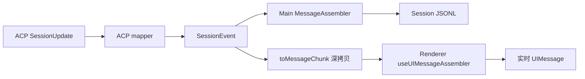

# Session 分享页数据前置设计

调研时间：2026-08-07

状态：调研归档，后续功能形态待定，尚未形成行为契约

关联原型：`README.md`、`prototype/session-share.html`

## 1. 执行摘要

### 1.1 当前判断

现有 Session meta 与 `<sessionId>.messages.jsonl` 足以生成一个可读的基础分享页，包括：

- 标题、Agent、Session mode、轮数和 Session 级 Token/Cost。
- User/Assistant 对话时间线。
- Text、Reasoning 与 Tool 的原始 part 顺序。
- Tool identity、kind、input/output、子 Agent 父子关系和部分运行摘要。
- `messageId + toolCallId` Evidence 指针。
- System Reminder 剥离、原始 JSONL SHA-256 和导出时脱敏。

但现有数据不足以生成可信的完整工作报告，尤其不能可靠回答：

- Tool 是成功、失败还是被中断。
- 每次编辑影响了哪些文件、产生了多少行变化。
- 哪些命令失败、exit code 是什么、stderr 是什么。
- Session 和每轮实际工作了多久、使用了多少 Token/Cost。
- Session 最终留下了哪些 Git 净变更，哪些修改后来被回退。
- 每轮实际使用的模型、配置与输入资源版本。

主要原因不是 Share Page 解析能力不足，而是审计数据在 Stream → Message → JSONL 链路中被降维或没有建立历史快照。

### 1.2 产品范围结论

本轮调研后的产品判断是：完整 Session Share Page 暂不作为近期独立功能推进。原型同时承担了对话回放、工作报告与审计记录三种职责；为了复刻其全部效果而建设完整事件账本、Repository 快照、资源归档和阶段分析，当前投入与已确认的用户价值不匹配。

用户更关心的是：

- 当前对话完成了什么。
- 修改了哪些文件。
- 关联任务整体进展如何。

因此更值得优先演进的是 FylloCode 内的只读 `Session Outcome`，而不是完整过程回放。未来如果需要分享，应让内部 Vue 预览和自包含只读 HTML 复用同一份结果模型；PDF 只能作为浏览器打印产生的次级静态副本，不作为主要载体。

Agent agenda 明确保持轻量运行时状态，不做持久化，也不作为 Outcome 或任务进度的数据来源。任务进度的正式含义尚未收敛；在此之前，只展示可靠的关联 Task 状态或 Proposal checklist，不从对话、Tool 数量或 agenda 推算百分比。

### 1.3 潜在实施依赖

如果未来仍要实现完整工作报告，其数据基础应分三阶段推进：

1. **补齐 Tool 与 Turn 审计**：避免现有 Stream 字段在两套 assembler 中丢失。
2. **补齐 Repository 与输入资源锚点**：建立“最终改了什么”的可信来源。
3. **实现 SessionShareModel 与 HTML 导出**：对旧 Session 保持降级兼容。

不建议先实现完整页面再反向修改持久化格式。页面会迫使数据层长期依赖文本猜测，随后还要为旧、新两套语义返工。

这些阶段是依赖关系，不代表已经排期或承诺实施完整 Share Page。Tool 失败状态、`diff/locations` 和中断输出等问题即使不实现 Share Page，也应按其对现有 Chat 与历史记录正确性的价值独立评估。

### 1.4 数据可信度分级

Share Page 的每个派生字段都应携带来源：

| Provenance         | 含义                                                   |
| ------------------ | ------------------------------------------------------ |
| `persisted`        | 来自 Session meta、Message JSONL 或版本化审计记录      |
| `repository`       | 来自已验证的 Git/Proposal base/head 或其他代码状态锚点 |
| `external-current` | 导出时联查到的外部对象当前状态，不代表历史状态         |
| `derived`          | 由规则或 Agent 总结生成，不是原始事实                  |
| `unavailable`      | 无法获得，不进行文本猜测                               |

## 2. Share Page 的数据需求

原型把分享页定位为“以对话为骨架的工作报告”，而不是聊天记录复刻。

### 2.1 概览头

需要：

- Session 标题。
- Agent identity 与实际模型。
- Session mode。
- Workspace/Project 显示信息。
- 实际活跃耗时。
- 对话轮数。
- Tool kind 聚合统计。
- Token 与 Cost。

当前可直接获得标题、`agentId`、mode、轮数和 Session 级 usage。模型、历史 Workspace 名称、活跃耗时和精确统计仍有缺口。

### 2.2 成果面板

需要：

- 写入类文件列表，read 不进入成果面板。
- 文件操作类型：add/update/delete。
- 每个文件的修改次数。
- 可用的逐次 diffstat 与有限 snippet。
- 关键命令及成功/失败结果。
- 回退标记与被回退改动的处理。
- 指向 Git/Proposal 最终净变更的可信引用。

这是当前缺口最大的区域。历史 JSONL 通常没有结构化 change summary、location、exit code 或 repository base/head。

### 2.3 对话时间线

需要：

- User prompt 与 Assistant text 叙事。
- Reasoning 默认隐藏、按需显示。
- Text 与 Tool 的交错顺序。
- Tool kind 分组、input/output 详情和 Evidence。
- 子 Agent 父子关系与统计。
- 每轮结果、耗时、Token/Cost。
- 关键轮与常规轮折叠。

现有 JSONL 可以较好支持内容时间线；结果、耗时、成本和中断状态需要新增 Turn/Tool audit。

### 2.4 审计脚注

需要：

- 原始 JSONL SHA-256。
- 导出时间和生成器版本。
- 脱敏操作清单。
- 输出截断说明与完整内容 hash。
- 数据来源和不可用字段说明。
- Reasoning 导出风险提示。

其中 hash、导出时间和脱敏清单可在导出时生成；“完整输出 hash”只能覆盖实际持久化的内容，不能证明上游没有提前截断。

### 2.5 当前可用性总览

| 分享页字段                     | 当前状态                           | 目标状态                     |
| ------------------------------ | ---------------------------------- | ---------------------------- |
| 标题、Agent、mode、轮数        | 可直接读取                         | 保持                         |
| Token / Cost                   | 只有 Session 聚合口径              | 增加 per-turn snapshot       |
| Text / Reasoning 时间线        | 可按 parts 原序还原                | 保持                         |
| Tool identity / input / output | 大部分可读取，Agent 间存在差异     | 明确完整性标记               |
| Tool kind 统计                 | 可聚合，但子 Agent 可能重复或漏计  | 定义唯一口径                 |
| Tool 成功 / 失败 / 中断        | 不可靠                             | 结构化持久化                 |
| Evidence                       | 可由 `messageId + toolCallId` 生成 | 保持                         |
| 修改文件、diffstat、snippet    | 通常不可用                         | 由 Tool audit changes 提供   |
| 命令 exit code / stderr        | 不可用或已合并                     | 结构化保存                   |
| Session/轮次活跃耗时           | 不可用                             | Turn audit                   |
| 最终 Git 净变更                | 无历史 base/head                   | Repository anchor            |
| 阶段、关键轮、回退原因         | 只能推导                           | 标记为 `derived`             |
| 附件与 Workspace 文件原文      | JSONL 不自包含                     | Resource manifest / snapshot |
| 原始记录 SHA-256               | 导出时可计算                       | 保持                         |

## 3. 当前数据链路

### 3.1 Stream 到 Message



`src/main/services/session/chat/session-event-mapper.ts#toMessageChunk` 只过滤 Main-only 的 `done`、`error` 和 `session_id_resolved`；其他 `SessionEvent` 会经 JSON 深拷贝投影为 `MessageChunkData`。

因此只要 `diff`、`locations`、`status` 或 `outputDelta` 存在于 Tool event，它们就已经跨 MessagePort 到达 Renderer。当前丢失点位于 Main/Renderer 两套 assembler，而不是 IPC contract。

### 3.2 Session meta

`src/main/infra/storage/session-store.ts#SessionMeta` 当前包含：

- `sessionId`
- `acpSessionId`
- `agentId`
- `sessionMode`
- `title`
- `turnCount`
- `tokenUsage`
- `createdAt` / `updatedAt`
- 可选 `originTaskRef`、`workspaceSnapshot`、配置、命令列表与 Action state

Session meta 是最终状态快照，不是历史事件账本。

### 3.3 Message JSONL

`appendMessage()` 将每条 AI SDK `UIMessage<MessageMeta>` 作为一行 JSON 追加到 `<sessionId>.messages.jsonl`。当前通常保留：

- Message：`id`、`role`、`parts`、`metadata.sessionId`、`metadata.createdAt`
- Text part：User prompt 与 Assistant 叙述
- Reasoning part：Agent thought 内容
- Dynamic Tool part：`toolCallId`、`toolName`、`title`、`state`、`input`、`output`、`toolMetadata`
- Tool metadata：`toolKind`、可选 `parentToolCallId`、可选 `subagent`

FylloCode 注入的 System Reminder 也会作为 User text part 持久化，但使用完整 `<system-reminder>...</system-reminder>` 包裹。导出时可以可靠识别并隐藏正文，只保留“已注入上下文”的说明。

### 3.4 Tool 字段保留矩阵

| Stream 字段        | 已到 Renderer | Renderer assembler      | Main assembler / JSONL  |
| ------------------ | ------------- | ----------------------- | ----------------------- |
| `toolCallId`       | 是            | 保留                    | 保留                    |
| `toolName`         | 是            | 保留                    | 保留                    |
| `title`            | 是            | 保留                    | 保留                    |
| `toolKind`         | 是            | 写入 metadata           | 写入 metadata           |
| `input`            | 是            | 保留                    | 保留                    |
| `content`          | 是            | 终态作为 output         | 终态作为 output         |
| `outputDelta`      | 是            | 暂存为 `liveOutput`     | 只在内存 Map 累计       |
| `status`           | 是            | completed/failed 被合并 | completed/failed 被合并 |
| `diff`             | 是            | 忽略                    | 忽略                    |
| `locations`        | 是            | 忽略                    | 忽略                    |
| `parentToolCallId` | 是            | 保留                    | 保留                    |
| `subagent`         | 是            | 增量合并                | 增量合并                |

### 3.5 Control event

以下事件会传给 Renderer，但 Chat store 会在调用 assembler 前拦截：

| Event                       | Renderer                  | Main 持久化       | 历史损失                           |
| --------------------------- | ------------------------- | ----------------- | ---------------------------------- |
| `usage_update`              | 覆盖 active Session usage | 覆盖 Session meta | 无 per-turn 历史                   |
| `available_commands_update` | 覆盖命令列表              | 覆盖 Session meta | 只有最终 capability                |
| `config_options_update`     | 覆盖 config options       | 覆盖 Session meta | 无配置/模型切换历史                |
| `agenda_update`             | 覆盖运行时 agenda         | 按设计不持久化    | 轻量运行时状态，不作为历史数据缺口 |
| `session_info_update`       | 更新标题                  | 覆盖 Session meta | 只有最终标题                       |

这些行为适合当前 Chat UI 的状态投影，但不足以支持历史工作报告。

## 4. 缺口清单

### 4.1 Stream/Assembler 丢失

#### Tool terminal status

ACP Tool update 使用 `in_progress | completed | failed`。AI SDK 6 的 `DynamicToolUIPart.state` 支持 `output-available` 与 `output-error`，但当前两套 assembler 都采用：

| ACP status    | 当前 state         | 问题                                |
| ------------- | ------------------ | ----------------------------------- |
| `in_progress` | `input-available`  | 只能表达未终结                      |
| `completed`   | `output-available` | 正常                                |
| `failed`      | `output-available` | 与成功不可区分，错误文本进入 output |

子 Agent 的 `toolMetadata.subagent.status` 只适用于确认过的子 Agent 父 Tool，不能替代普通 Tool 状态。

#### Diff 与 locations

`src/shared/types/stream-event.ts` 已定义：

```ts
interface ToolCallDiff {
  path: string;
  newText: string;
  oldText?: string;
}

interface ToolCallLocation {
  path: string;
  line?: number;
}
```

ACP mapper 会从 Tool start/update 提取它们，但两套 assembler 都没有写入 part 或 metadata。

Renderer `tool_call_update` 的 `needsUpdate` 也没有包含 `diff` 和 `locations`，导致：

- 只携带 diff/location 的 in-progress update 被整体忽略。
- terminal update 即使带有 diff/location，也不会进入最终 part。
- 实时 UI 与历史 JSONL 同时丢失。

#### 中断时的 partial output

Renderer 将 `outputDelta` 累计到 `toolMetadata.liveOutput`，实时 UI 能够显示。Main assembler 只在内存 `toolOutputDeltas` Map 中累计；收到 completed/failed 后才写入 `output`。

如果发生 error、cancel 或应用退出，`flush()` 会清空 Map，导致用户实时看见过的部分输出不进入 JSONL。

### 4.2 Session 与 Turn 审计缺失

#### Outcome

`src/main/services/session/chat/chat-service.ts#toSession` 重载 Session 时固定投影为 `status: "ended"`。它只表示当前没有活跃 ACP Session，不代表成功完成。

当前无法在历史记录中可靠区分：

- completed
- failed
- cancelled
- interrupted
- User message 已提交但没有 Assistant 最终回复

Stream-level error 只发送给当前 Renderer；cancel 只 flush 部分消息并注销运行时 Session，没有写入 Turn outcome。

#### 时间

当前只有 Session `createdAt/updatedAt` 与 Message `metadata.createdAt`：

- `updatedAt - createdAt` 是日历跨度，包含跨轮空闲时间。
- Assistant message 时间通常接近首个内容事件，不是完成时间。
- Tool 没有 start/end timestamp。
- 没有阶段或暂停区间。

不能可靠展示 Session 活跃耗时、每轮耗时、首 Token 延迟、Tool duration 或阶段耗时。

#### Token 与 Cost

Session meta 只有聚合 usage。普通轮次没有 input/output Token、Cost 或 usage snapshot；子 Agent `totalTokens` 只用于其详情，不能累加或替代 Session usage。

#### 事件时序与并发

JSONL 保存最终 parts，不保存原始事件日志。Part 顺序可以表达 Tool 首次出现的大致顺序，但不能恢复：

- 精确开始/结束时间
- Tool 是否并行以及重叠时长
- 中间 update 的到达顺序
- Tool retry 或状态反复
- output delta 与其他事件的精确交错

### 4.3 命令执行证据缺失

Codex adapter 会读取 terminal exit code 来补偿 ACP status，但映射后的事件不保存 exit code；stdout 与 stderr 在最终回退路径中也会被合并。

其他 Agent 的 input/output 形状不完全一致。当前无法跨 Agent 稳定获得：

- exit code
- stdout/stderr 边界
- 实际 cwd
- duration
- timeout / signal / cancel 原因
- output 是否已被上游截断

因此原型中的关键命令 `✓/✗` 和“失败时多保留 stderr”不能仅靠现有 JSONL可靠实现。

### 4.4 Repository 状态缺失

`SessionWorkspaceSnapshot` 保存 Workspace/Folder identity、路径、cwd 和 additional directories，但没有：

- Git HEAD commit
- branch
- staged/unstaged/untracked 摘要
- Session 起点和终点状态

导出时读取当前 Git 状态只能说明“现在”，不能证明它与 Session 结束时一致。

#### 最终净变更

逐次 Tool diff 的相加不等于最终净变更：

- 同一文件可能多次覆盖。
- 用户或外部进程可能同时修改。
- Agent 可能通过命令写文件。
- 修改可能被部分或整体回退。
- Session 后 worktree 可能继续变化。

要回答“这次会话最终留下了什么”，需要每个 Folder 的起点/终点 repository anchor，或关联到具有明确 base/head 的 Proposal/commit。

#### 回退范围

当前没有 edit 与 revert 的结构化因果关系，也没有 Session base commit。只能从命令、Assistant 文本或反向 diff 推导回退，无法确定哪些 diffstat 应从成果面板排除。

### 4.5 Agent 与配置历史缺失

Session meta 保存 `agentId` 和最终 config options，但没有每轮不可变快照。当前无法完整还原：

- resolved model
- 模型/配置切换历史
- Agent/provider 版本
- 每轮 MCP/tool capability
- Tool 所属的 activation 配置

概览可以稳定展示 Agent identity；具体模型不能从最终配置反推整个 Session。

### 4.6 输入资源与外部对象缺失

#### 上传附件

JSONL 只保存 `attachmentId`、media type 与 filename；实际二进制位于 Session 附件目录。单独复制 JSONL 无法生成真正自包含的 HTML。Main 导出服务可以读取仍存在的附件，但需要处理缺失、hash、size、内嵌上限和脱敏。

#### Workspace 文件

`workspace_file` part 保存 Folder/worktree/path 引用，不保存提交时内容。文件后来被修改、重命名或删除后，无法恢复用户当时提交给 Agent 的版本。

#### 外部 URI

历史 `file://`、resource link 或外部 URI 可能已经不存在、无权限或发生变化。导出模型必须区分“引用存在”与“内容已内嵌”。

#### Workspace 显示名称

Session Workspace snapshot 有 `workspaceId` 和 Folder 名称，但没有创建时的 Workspace 显示名称。重命名后只能查询当前名称。

#### Task、Proposal、Action 与 Knowledge

JSONL 可能包含相关文本或 Fyllo Action，Session meta 也可能包含最新 Action state，但没有外部对象在每轮当时的完整快照。

导出时联查的 Task/Proposal/Knowledge 状态只能标成 `external-current`，不能冒充 Session 历史事实。

### 4.7 只能推导的展示信息

以下内容没有结构化事实来源：

- 阶段划分
- 关键轮选择
- 方案切换与决策点
- 回退识别与原因
- 常规轮一句结论
- 从 Tool 文本猜测文件、命令和动作
- 从测试输出提取通过/失败数量
- 从 Assistant 最终回复总结成果

原型允许阶段使用启发式或导出时 Agent 总结，因此这些不是绝对阻塞项，但必须标成 `derived`。

## 5. 目标数据契约草案

本章结构仅作为后续 Proposal 的讨论起点，不代表已确认的存储格式。实现前需要决定它们进入 Session meta、Message metadata、独立 audit JSONL，还是版本化 sidecar。

### 5.1 Tool audit

不建议给 `DynamicToolUIPart` 增加非 AI SDK 标准顶层字段。建议继续使用 `toolMetadata: JSONObject`，增加带版本的 FylloCode envelope，并在 shared 层提供显式类型、schema 和读取 helper。

```ts
interface FylloToolAuditMetadata {
  version: 1;
  status: "in_progress" | "completed" | "failed" | "interrupted";
  startedAt?: string;
  completedAt?: string;
  locations?: Array<{
    path: string;
    line?: number;
  }>;
  changes?: Array<{
    path: string;
    operation?: "add" | "update" | "delete";
    added?: number;
    removed?: number;
    snippet?: Array<{
      kind: "add" | "delete" | "context";
      text: string;
    }>;
    contentHash?: string;
  }>;
  command?: {
    cwd?: string;
    exitCode?: number;
    durationMs?: number;
    stdoutHash?: string;
    stderrHash?: string;
    outputComplete?: boolean;
  };
}
```

建议的 AI SDK state 映射：

```text
ACP in_progress -> input-available
ACP completed   -> output-available
ACP failed      -> output-error + errorText
```

AI SDK 没有 `interrupted` state，因此仍需要 `fylloAudit.status` 表达 Session cancel、error 或 shutdown 留下的未终结 Tool。

### 5.2 Turn audit

```ts
interface SessionTurnAudit {
  version: 1;
  turnId: string;
  userMessageId: string;
  assistantMessageId?: string;
  startedAt: string;
  firstResponseAt?: string;
  completedAt?: string;
  outcome: "completed" | "failed" | "cancelled" | "interrupted";
  usage?: {
    inputTokens?: number;
    outputTokens?: number;
    cost?: { amount: number; currency: string };
  };
  agent?: {
    agentId: string;
    resolvedModel?: string;
    configSnapshot?: Record<string, unknown>;
  };
}
```

### 5.3 Repository anchor

```ts
interface SessionRepositoryAnchor {
  version: 1;
  folderId: string;
  worktreePath: string;
  capturedAt: string;
  headCommit?: string;
  branch?: string;
  dirtySummary?: {
    staged: string[];
    unstaged: string[];
    untracked: string[];
  };
}
```

起点和终点 anchor 应分别保存，并明确非 Git Folder、路径缺失或捕获失败的降级状态。路径不能代替 Folder identity。

### 5.4 Input resource manifest

```ts
interface SessionInputResourceRecord {
  version: 1;
  messageId: string;
  kind: "attachment" | "workspace-file" | "external-resource";
  displayName: string;
  mediaType?: string;
  contentHash?: string;
  byteSize?: number;
  snapshotStatus: "embedded" | "referenced" | "missing" | "redacted";
}
```

### 5.5 SessionShareModel

最终导出中间模型应只消费稳定的持久化契约，不直接解析 Agent 私有字段。每个可能来自外部或推导的数据块应带 provenance 和缺失原因。

推荐分层：

```text
SessionShareModel
├── meta
├── repositories
├── changes
├── commands
├── phases (derived)
├── turns
│   ├── prompt
│   ├── blocks
│   └── audit
└── exportAudit
```

## 6. 兼容、安全与统计口径

### 6.1 旧 Session 降级

旧 JSONL 无法无损补回已丢失字段。导出器必须：

- 继续渲染 Text、Reasoning、Tool input/output 和 Evidence。
- 缺失 Tool result status 时显示“结果状态不可用”，不能从 output 文本强判。
- 没有 changes 时隐藏 diffstat，不能把猜测值显示为零。
- 没有 repository anchor 时不显示历史净变更。
- 附件或外部资源缺失时保留引用摘要，不让整份导出失败。
- 所有推导结果标记 `derived`。

### 6.2 不直接持久化完整 oldText/newText

ACP `ToolCallDiff` 可能包含完整文件。每次编辑原样写入 JSONL 会导致：

- 大文件和重复编辑显著膨胀。
- 敏感内容被重复复制。
- 脱敏面扩大。
- Share Page 实际只使用有限 snippet、diffstat 与 hash。

建议事件到达时计算受限 change summary。只有明确需要完整逐次 diff 审计时，再单独评估 patch 存储、大小上限、压缩和访问控制。

### 6.3 净变更来源

Share Page 必须区分：

- **逐次修改累计**：来源为 Tool audit。
- **最终净变更**：来源为 Git/Proposal repository anchor。

当权威来源不可用时，不应把累计值标成净 diffstat。

### 6.4 Tool 与子 Agent 统计

当前可能同时存在普通 Tool parts、子 Agent 后代 Tool parts、父 Tool `subagent.toolStats`，以及只存在于上游摘要的未展开调用。

建议口径：

1. 优先统计实际持久化的 Tool parts。
2. 已逐条持久化的子 Tool 不再叠加父摘要同类计数。
3. 只有上游明确包含未展开调用时，才把差额记为“上游汇总”。
4. 缺失字段不推算为零，并标注统计覆盖范围。

### 6.5 输出完整性

原型采用“头 30 行 + 尾 10 行 + 完整内容 hash”。需要区分：

- 导出层对已持久化完整内容进行的展示截断。
- Agent/transport 在进入 FylloCode 前已经发生的上游截断。
- error/cancel 导致只保存 partial output。

只有第一种可以声明“完整内容可由 hash 指认”。后两种必须标记 `outputComplete: false` 或 unknown。

### 6.6 导出安全

User 输入、Agent 输出、命令输出、代码和 Reasoning 都是不可信或敏感数据：

- 静态 markup 必须统一 HTML escape / Markdown sanitize。
- 内嵌 JSON 至少将 `<` 编码为 `\u003c`，避免提前闭合 `<script>`。
- 路径相对化、用户名、凭据、Token 和环境变量值进入显式脱敏阶段。
- 输出截断后保留针对实际持久化内容的 hash。
- 完整 Reasoning 默认隐藏，但仍随 HTML 导出；入口必须明确提示风险。
- 外部资源默认只引用，内嵌需要类型、大小和敏感性策略。

## 7. 潜在分阶段实施路线

本章记录的是未来若继续建设完整工作报告时的技术依赖顺序，不代表当前产品承诺。近期更有价值的方向是先把与现有 Chat、Session 历史正确性直接相关的能力拆出独立评估，再决定是否需要 Outcome 面板或 HTML 分享。

### 阶段 A：Tool 与 Turn 审计基础

目标：让实时 UI 与历史 JSONL 对同一 Stream 产生一致、可审计的结果。

工作项：

1. 在 shared 层定义版本化 Tool audit metadata 类型与 schema。
2. 明确 failed → `output-error + errorText`，同时保留 audit status。
3. 为 error/cancel/shutdown 定义 `interrupted` 与 partial output 语义。
4. 将 `locations` 和受限 changes 从 Stream 合并进 Main assembler。
5. 同步 Renderer assembler。
6. 建立两套 assembler 的共享字段矩阵测试。
7. 覆盖 start/update 增量合并、孤儿 update、成功、失败、中断与历史重载。
8. 保存 Turn outcome、关键时间点和可用 usage/model snapshot。
9. 验证 Codex、Claude Code 与其他 Agent 的差异和降级路径。

完成条件：

- 同一 Stream 在实时 UI 与重载 JSONL 后产生相同 Tool 审计字段。
- 失败与中断不再显示成成功。
- diff/location-only update 不再丢失。
- interrupted Tool 的 partial output 有明确保留与完整性规则。

### 阶段 B：Repository 与输入资源锚点

目标：建立最终成果和输入材料的历史证据。

工作项：

1. 定义每个 Folder 的 Session 起点/终点 repository anchor。
2. 处理非 Git Folder、missing path、branch 切换和 capture 失败。
3. 定义上传附件、Workspace 文件和外部 URI 的 resource manifest。
4. 决定 Workspace 文件只保存 hash 还是受限内容快照。
5. 定义 Workspace 名称及 Task/Proposal 等外部对象的历史/current 呈现。
6. 固化 Tool/子 Agent 统计去重规则。

完成条件：

- Share Page 能区分逐次修改和最终净变更。
- 输入资源的 embedded/referenced/missing/redacted 状态可解释。
- external-current 数据不会冒充历史事实。

### 阶段 C：Share Page 导出

目标：基于稳定数据契约生成可读、可审计、自包含或受控引用的 HTML。

工作项：

1. 定义并验证版本化 `SessionShareModel`。
2. 实现旧 Session 降级转换器。
3. 实现阶段聚类、关键轮和摘要的 derived pipeline。
4. 实现静态 HTML 预渲染与内嵌 JSON。
5. 实现脱敏、截断、hash 和资源内嵌策略。
6. 增加导出 IPC、文件保存和用户风险提示。
7. 验证无 JavaScript、浅色/深色、大型 Session 和恶意内容场景。

完成条件：

- 禁用 JavaScript 后核心报告仍可读。
- 原始事实、repository 事实、当前外部状态和 derived 内容可区分。
- 旧 Session 不因缺失新字段而导出失败。
- 页面统计与时间线来自同一中间模型，不产生样例中的汇总/节选不一致。

### Track 判断

Tool 状态、diff/location、Turn audit、Repository anchor 和资源快照会改变 Session 持久化格式、历史重载行为或数据边界，属于行为契约变更，应通过 OpenSpec Proposal 设计和实施。

Share Page 本身也是新的用户可见导出能力，建议在前置持久化契约收敛后作为后续 Proposal，或在同一 Proposal 中明确拆分阶段，避免页面实现先于数据契约。

## 8. 证据附录

### 8.1 核心代码位置

| 主题                       | 代码位置                                                            | 当前事实                                                              |
| -------------------------- | ------------------------------------------------------------------- | --------------------------------------------------------------------- |
| Stream contract            | `src/shared/types/stream-event.ts`                                  | 定义 Tool status、diff、locations、subagent 和 control events         |
| ACP Tool 映射              | `src/main/services/session/chat/acp-mapper/tool-call-mapper.ts`     | 从 ACP 提取 input、diff、locations、status                            |
| Codex adapter              | `src/main/services/session/chat/acp-mapper/agent-adapters/codex.ts` | 使用 exit code 推导状态，最终不保留 exit code；可能合并 stdout/stderr |
| IPC Stream 投影            | `src/main/services/session/chat/session-event-mapper.ts`            | 除 Main-only 事件外，结构化深拷贝到 Renderer                          |
| Main assembler             | `src/main/domain/session/chat/message-assembler.ts`                 | 持久化消息；忽略 diff/locations；合并 terminal status                 |
| Renderer assembler         | `src/renderer/src/composables/useUIMessageAssembler.ts`             | 构建实时消息；忽略 diff/locations；维护 liveOutput                    |
| Chat control events        | `src/main/ipc/session/chat.ts`                                      | usage/config/commands/title 覆盖 meta；agenda 不持久化                |
| Renderer Chat store        | `src/renderer/src/stores/session/chat.ts`                           | 在 assembler 前处理 control events 与临时 stream error                |
| Session store              | `src/main/infra/storage/session-store.ts`                           | Session meta 与 Message JSONL 读写                                    |
| Session runtime projection | `src/main/services/session/chat/chat-service.ts`                    | 重载默认 status 为 ended                                              |
| System Reminder            | `src/main/infra/storage/message-reminder-store.ts`                  | 将 Reminder prepend 到最后一条 User message                           |
| Workspace snapshot         | `src/shared/types/workspace.ts`                                     | 无 Git HEAD/branch/dirty state                                        |
| Attachment store           | `src/main/infra/storage/attachment-store.ts`                        | 二进制独立于 JSONL 保存                                               |

### 8.2 已确认的关键事实

1. `diff` 和 `locations` 已存在于 shared Stream contract。
2. ACP mapper 已尝试提取这两个字段。
3. `toMessageChunk()` 会把它们发送给 Renderer。
4. Renderer assembler 不读取它们，且 diff/location-only update 不触发更新。
5. Main assembler 同样不读取它们，因此 JSONL 丢失。
6. 两套 assembler 都把普通 Tool failed 映射成 `output-available`。
7. Renderer 能暂时展示 `liveOutput`，Main 在中断 flush 时可能丢失 partial output。
8. usage/config/commands/title 只保留最终快照，agenda 明确不持久化。
9. Session meta 不是 Turn/事件账本，也不是 Repository 状态快照。
10. 旧 JSONL 无法无损补回以上已丢失字段。
