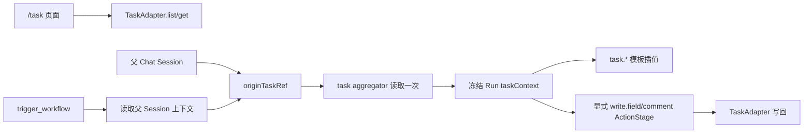

# Workflow Engine Phase 3 — Provider 写回与结构可视化

状态：draft（阻塞问题已收敛，待独立 Proposal）
日期：2026-08-25（初稿）；2026-09-06（决策收敛）

本文档是 Phase 3 的当前设计基线，供后续独立会话创建 Proposal 使用。完整讨论过程记录在 [phase3-blocker-discussion-log.md](phase3-blocker-discussion-log.md)，仅用于追溯；实现和 Proposal 应以本文档为准，不需要跨文件拼凑结论。

本文档已经收敛了范围、边界和主要运行语义，但不代表 Proposal 已创建或已获批准。Proposal 阶段仍需把具体 scenario、共享类型、错误码、测试文件和实现任务落到代码级别；这些展开不得重新打开本文档已经排除的方案。

## 0. 已收敛的设计结论

| 议题                           | Phase 3 当前结论                                                                                                                                                                                                       |
| ------------------------------ | ---------------------------------------------------------------------------------------------------------------------------------------------------------------------------------------------------------------------- |
| 任务读取与 workflow 写回的关系 | `/task` 页面继续通过现有第三方 API/`TaskAdapter` 读取任务；workflow 不新增“读取任务”ActionStage。只有用户在 YAML 中显式声明 `write.field` 或 `write.comment` ActionStage 时，workflow 才写回任务。                     |
| Phase 3 v1 可执行 ActionOp     | `exec` 继续沿用 Phase 1；新增并实际落地 `write.field`、`write.comment`。其中 `write.comment` 需要在实现前核实云效评论 API。                                                                                            |
| 合法但暂不执行的 ActionOp      | `git.branch`、`git.commit`、`webhook`、`scm.open-pr`、`write.relation`、`notify` 可以继续作为定义态 schema 的合法表达，但本阶段 `trigger_workflow` preflight 统一返回 `WORKFLOW_FEATURE_NOT_IMPLEMENTED`，不创建 Run。 |
| 旧 tracker op                  | 删除 `tracker.transition`、`tracker.comment`，不做运行时自动转换。当前没有线上用户，不做旧 workflow 定义迁移。                                                                                                         |
| `requires: [task]`             | `write.field`/`write.comment` 必须依赖当前父 Chat Session 的 `originTaskRef`。Agent 不能在 trigger 参数中自带 task id；缺少任务上下文时拒绝创建 Run。                                                                  |
| 任务读取时机                   | trigger preflight 通过现有 task aggregator/adapter 读取一次任务，并把 `taskRef`、provider 和模板所需字段冻结到 Run snapshot；后续 stage、重启和恢复不重复读取第三方 API。                                              |
| Provider 抽象                  | 复用现有 `TaskAdapter`，在同一 adapter 上增加 capability 和可选写入方法；不创建平行 ProviderAdapter、ProviderRegistry 或插件系统。                                                                                     |
| Provider 能力校验              | 只在 `trigger_workflow` 创建 Run 前做 runtime preflight；保存 definition、`propose_workflow` 和 Workflow Editor 只做结构/schema 校验。                                                                                 |
| 状态字段值                     | `write.field` 的 `field` 使用 provider capability 声明的字段名；`value` 使用 provider 原生值，例如云效状态 id。v1 不增加“语义状态名 → provider 状态 id”映射配置。                                                      |
| 幂等                           | `write.field`/`write.comment` 的 ActionStage 必须声明 `idempotencyKey`。使用 workflow 级成功记录，命中跳过、成功后记录、失败不记录；不引入 claim/lock/pending、分布式事务或 provider exactly-once。                    |
| 凭证                           | 所有继续使用现有同步 credential store 的 provider 改用 `safeStorage` envelope。旧明文文件按无效凭证处理，不迁移、扫描、删除或自愈；用户重新连接时覆盖。                                                                |
| YAML 图视图                    | 只放在 `/workflow` Workflow Editor，作为 YAML/图视图 Tab 的只读结构审阅。复用现有 Mermaid，不改 Phase 2 Proposal Review 时间线，也不扩展 Run Inspector。                                                               |

## 1. 定位与范围

Phase 3 承接：

- Phase 1 的 Workflow Engine、Run 状态机、Action 执行、确认、恢复和生命周期边界；
- Phase 2 的 workflow proposal、确认卡片、definition 沉淀和 `trigger_workflow` 作为唯一 runtime preflight 入口。

Phase 3 只解决两件事：

1. 给 workflow 增加少量可控的第三方任务写回能力；
2. 给复杂 workflow definition 增加结构可视化，降低阅读拓扑的成本。

产品分工保持清晰：

- **进入（读）**：任务页面和 workflow trigger 使用现有第三方 API/`TaskAdapter` 读取任务，目标是广覆盖、低耦合；
- **退出（写）**：只有显式 ActionStage 才写回第三方平台，目标是少量高频动作的可靠执行、确认和幂等。

本阶段不选第二个 provider，不做通用任务平台配置中心，也不把第三方任务读取包装成 workflow stage。

## 2. 与 Phase 1、Phase 2 和现有契约的关系

### 2.1 Phase 1 execution profile 的替换

当前 OpenSpec workflow-engine spec 中的 Phase 1 profile 仍描述“ActionStage 只支持 `exec`”，并把 `idempotencyKey` 标为未实现。Phase 3 Proposal 必须在同一个 `openspec/specs/workflow-engine/spec.md` 中追加/修改 execution profile，明确：

- `exec` 仍可执行；
- `write.field`、`write.comment` 成为 Phase 3 v1 新增的可执行 op；
- `write.*` 需要 `requires: [task]` 和任务上下文；
- `write.field`、`write.comment` 首次真正启用 `idempotencyKey` 规则；
- 其他仍在 schema 中的 op 允许保存但在 trigger preflight 被拒绝。

Proposal 不能继续只写“Phase 1 仅支持 exec”，否则会与 Phase 3 profile 形成矛盾。

### 2.2 旧 `tracker.*` 不兼容转换

`tracker.transition` 和 `tracker.comment` 被 `write.field`、`write.comment` 替代。它们从新 definition contract 中移除，不增加运行时转换、别名解析或版本兼容层。

当前功能没有线上用户，因此本阶段不迁移旧 definition、不迁移旧 tracker 字段、不设计回滚脚本。旧文件若仍存在，也不应被自动改写成新的 `write.*` definition；用户需要使用新 schema 保存新的 definition。

### 2.3 Phase 2 UI 与 runtime 边界保持不变

- `propose_workflow` 继续负责 proposal 所有权、YAML/schema 基础校验和 proposal 落盘，不负责 provider capability preflight；
- `trigger_workflow` 继续是创建 Run 前的唯一 runtime preflight 入口；
- Proposal Review 继续使用 Phase 2 的完整 YAML 展示和竖向时间线；
- Workflow Run Inspector 继续展示 Run、决策、transcript 和 Action output；
- Phase 3 图视图不迁移或改造上述两个宿主。

## 3. Definition contract 与 Phase 3 execution profile

### 3.1 ActionOp 形状

Phase 3 Proposal 应在共享 workflow 类型和 definition schema 中收敛为以下形状：

```ts
type ActionOp =
  // Phase 1 已支持，本阶段保持原有执行语义
  | { type: "exec"; command: string; cwd?: string }
  // Phase 3 v1 新增，target 绑定当前任务
  | { type: "write.field"; target: "task"; field: string; value: string }
  | { type: "write.comment"; target: "task"; body: string }
  // 定义态可以表达，但 Phase 3 v1 trigger preflight 不执行
  | { type: "git.branch"; name: string }
  | { type: "git.commit"; message: string }
  | { type: "webhook"; url: string; method?: "POST" | "PUT"; body: string }
  | { type: "scm.open-pr"; title: string; body?: string; base: string }
  | { type: "write.relation"; target: "task"; relation: string; ref: string }
  | { type: "notify"; channel: string; recipient: string; body: string };
```

`target: "task"` 是当前唯一合法的 `TrackerRef`。它表示“当前 workflow 绑定的任务”，不在 YAML 中写 provider、space id 或具体工作项 id；真实 provider 和 taskRef 由父 Session 上下文和 Run snapshot 提供。

### 3.2 可执行与 unsupported 的区分

定义态合法不等于当前 runtime 可执行：

| ActionOp                                | Phase 3 v1 行为                                                                                                                 |
| --------------------------------------- | ------------------------------------------------------------------------------------------------------------------------------- |
| `exec`                                  | 继续使用 Phase 1 的 child process、cwd、日志、确认和 pass/fail 语义。                                                           |
| `write.field`                           | 通过 TaskAdapter 写 provider 字段；必须有任务上下文、支持的 field 和 `idempotencyKey`。                                         |
| `write.comment`                         | 通过 TaskAdapter 写任务评论；必须有任务上下文、provider 支持评论和 `idempotencyKey`。云效 endpoint 核实失败时保持 unsupported。 |
| `git.branch`、`git.commit`              | 保留为 schema 表达，但本 Proposal 不实现，trigger preflight 返回 `WORKFLOW_FEATURE_NOT_IMPLEMENTED`。                           |
| `webhook`、`scm.open-pr`                | 保留为 schema 表达，但本 Proposal 不实现，trigger preflight 返回 `WORKFLOW_FEATURE_NOT_IMPLEMENTED`。                           |
| `write.relation`、`notify`              | 保留为 schema 表达，但当前没有对应 provider/API，trigger preflight 返回 `WORKFLOW_FEATURE_NOT_IMPLEMENTED`。                    |
| `tracker.transition`、`tracker.comment` | 从新 schema 移除，不转换、不执行。                                                                                              |

unsupported definition 可以保存，便于 Proposal/Editor 展示和未来扩展；但 unsupported preflight 必须在创建 Run、ACP session 或 Action process 之前返回结构化错误，并带 stage/feature 定位。

### 3.3 `requires: [task]` 与 ActionStage 校验

以下规则属于 Phase 3 v1 的 runtime contract：

- `write.field` 和 `write.comment` 出现时，definition 必须声明 `requires: [task]`；
- `target` 只能是 `task`；
- `write.field` 的 `field` 必须通过 provider 的 `writableFields` capability 校验；
- `write.field` 和 `write.comment` 所在的 ActionStage 必须声明 `idempotencyKey`；
- 缺少任务上下文、provider 不支持目标能力或缺少 key 时，trigger preflight 拒绝且不创建 Run；
- `exec` 不因为本阶段而强制增加 `idempotencyKey`。

## 4. 任务上下文：读取仍由 API/TaskAdapter 完成

### 4.1 读取链路

`/task` 页面继续使用现有的第三方 API 和 `TaskAdapter.list/get`。Workflow Engine 不增加一个“读取第三方任务”的 ActionOp，也不把任务读取做成用户可编排的 stage。

当 workflow 声明 `requires: [task]` 时，trigger 只是在运行前复用已有 task aggregator 读取一次目标任务：



### 4.2 trigger 与 snapshot 规则

1. `trigger_workflow` 从 Main 信任的父 Chat Session 读取 `originTaskRef`；Agent 不能在 trigger 参数中传入 task id，也不能从 workspace 全局状态猜当前任务。
2. 若 definition 需要 task 但父 Session 没有 `originTaskRef`，返回结构化上下文错误，不创建 Run。
3. 有 taskRef 时调用现有 task aggregator 读取一次任务。任务不存在、读取失败或 provider 未配置时，返回对应结构化错误，不创建 Run。
4. 读取成功后，将以下内容冻结到 `WorkflowRunSnapshot.taskContext`：`taskRef`、`provider`、`title`、`description`、可用的 `url` 以及模板实际需要的其他只读字段。
5. `task.*` 模板从冻结的 `taskContext` 读取；重启、恢复和后续 stage 不重新调用第三方 API。
6. `target: task` 在执行时从 `taskContext` 解析 provider/taskRef，再由 task aggregator 路由到对应 adapter。

读取快照只用于模板和确定目标，不承诺检测外部任务变化，也不增加 refresh、TTL、轮询、自动重试或中途重新绑定。

## 5. Provider capability 与 `TaskAdapter`

### 5.1 单一 adapter 抽象

任务展示和 workflow 写回共享同一个 `TaskAdapter`。Proposal 不新建平行写接口、不新建 ProviderRegistry，也不让 workflow runner 直接 import 云效 adapter。

```ts
interface ProviderCapabilities {
  readonly providerId: string;
  readonly writableFields: string[];
  readonly supportsComment: boolean;
}

interface TaskAdapter {
  list(workspaceId: string): Promise<TaskItem[]>;
  get(taskId: string, workspaceId: string): Promise<TaskItem | null>;
  capabilities(): ProviderCapabilities;
  writeField?(workspaceId: string, taskRef: string, field: string, value: string): Promise<void>;
  writeComment?(workspaceId: string, taskRef: string, body: string): Promise<void>;
}
```

`writableFields` 是 provider 级静态能力声明，用于说明 adapter 支持哪些字段名；它不是项目级自定义字段发现，也不承担语义状态映射。`supportsComment` 只表达评论写入能力是否已交付。

### 5.2 aggregator 与 provider 实现边界

现有 task aggregator 增加两个窄代理：

- `writeTaskField(workspaceId, taskRef, field, value)`；
- `writeTaskComment(workspaceId, taskRef, body)`。

代理复用已有 taskRef 路由，保留完整 `workspaceId` 作用域，并在 adapter 没有对应可选方法时返回明确 unsupported 错误。Workflow Action Runner 只调用 aggregator/service 的窄入口，不直接依赖 `yunxiao-task-adapter.ts`。

provider 的最小实现边界：

- **云效**：声明支持的字段列表；`writeField` 连接现有 `updateWorkitem`；`writeComment` 只有在实现前确认官方评论 endpoint、请求和响应形状后才实现。
- **local/GitHub**：声明空 `writableFields` 和 `supportsComment: false`，不假实现可选写入方法。
- **第二个真实 provider**：不在本阶段选型。等云效读写链路跑通后，再用“复用 adapter 的边际成本”决定是否扩展。

### 5.3 字段值不做语义映射

`write.field` 的 `field` 使用 provider capability 声明的字段名，例如 `status`；`value` 使用 provider 原生值，例如云效对应项目的 status id：

```yaml
requires: [task]
stages:
  - id: update-status
    kind: action
    op:
      type: write.field
      target: task
      field: status
      value: "100010"
    idempotencyKey: "status:{{task.id}}:100010"
```

v1 不新增“待测试”这类语义名称到 provider id 的映射文件、映射 UI 或额外查询。不同项目的原生 id 可能不同，这是本阶段为保持简单边界接受的限制。

### 5.4 capability preflight

`trigger_workflow` 在读取任务后、创建 Run 前：

- 对每个 `write.field` 检查 `field ∈ capabilities.writableFields`；
- 对每个 `write.comment` 检查 `supportsComment === true`；
- 对 unsupported op、缺 task context、缺 `idempotencyKey` 返回带 stage/feature refs 的结构化错误；
- 任一检查失败都不创建 Run。

保存 definition、`propose_workflow` 和 Workflow Editor 不做 provider 能力检查，因为它们不应把“当前 provider 能否执行”混入定义态校验。

## 6. Provider Action 运行时与幂等

### 6.1 运行时结果复用现有 Action 状态机

在现有 `workflow-action-runner.executeAction()` 增加 `write.field` 和 `write.comment` 分支：

- provider 调用开始、成功、失败和错误消息写入现有 Action log；
- 成功复用 `action-completed: pass`；
- provider 异常复用 `action-completed: fail`，由现有 state machine 处理 `next.pass`/`next.fail`；
- 继续使用已有 `startedAt`、`endedAt`、`logPath` 等状态字段，不新增 provider-specific error/retryable 状态；
- `confirm`、Run 重启、取消和 fail 回边沿用 Phase 1 语义；
- 不做 provider-specific retry、HTTP cancel 或 rollback。

`idempotencyKey` 属于 ActionStage，不属于 ActionOp。Action Runner 在启动 `write.*` stage 时解析 key，完成去重后再使用现有 Action 完成事件推进 Run。

### 6.2 存储格式

幂等记录是 Workspace-owned workflow 数据，路径为：

```text
workspaceDataDir(workspaceId)/workflows/<workflow-id>/idempotency.json
```

文件是扁平 JSON map：

```ts
type IdempotencyRecords = Record<
  string,
  {
    executedAt: string;
    runId: string;
    stageId: string;
  }
>;
```

使用现有 `writeFileAtomicSync` 原语写回完整记录。不保存 provider response、操作参数、pending/claimed 状态或额外事务元数据。

### 6.3 命中、成功与失败

- Stage 启动时对 `idempotencyKey` 做现有模板插值，得到 `resolvedKey`；不额外 hash、normalize 或引入 key registry。
- 已存在记录时跳过 provider 调用，在 Action log 记录“幂等键命中，跳过执行”，直接把 stage 视为 `pass` 并按 `next.pass` 推进。
- 未命中时调用 provider；只有 provider 成功后才写入 `{ executedAt, runId, stageId }`，再按 `pass` 推进。
- provider 失败时不写入记录，沿用现有 fail transition；后续重试仍可调用 provider。
- Run 重启时继续读取同一 workflow 级文件；已有成功记录仍然命中。

这是一种“成功记录后的本地去重”，不承诺：

- 两个并发 Run 不会同时读到未命中的 key；
- provider API 真实只执行一次；
- 应用崩溃在 provider 成功和本地记录写入之间时能够自动判断并修复；
- 自动清理过期记录。

本阶段不引入锁、claim/pending 状态、两阶段提交、分布式事务或 provider 幂等协议。workflow 作者应为可能产生重复外部副作用的操作选择合适的 key；本地 `exec` 不强制要求 key。

## 7. Provider credentials：新的 `safeStorage` envelope

### 7.1 存储契约

所有继续使用 `provider-credential-store.ts` 的 provider 共用新的同步存储格式。文件路径和 `loadCredentials`、`saveCredentials`、`clearCredentials` 的同步 API 保持不变；只改变文件内容：

```json
{
  "encrypted": "<base64-of-safeStorage-encryptString-output>"
}
```

保存时：

1. 检查 `safeStorage.isEncryptionAvailable()`；
2. 不可用时直接抛错，不写明文；
3. 对 `JSON.stringify(credentials)` 调用 `safeStorage.encryptString`；
4. 将加密结果转为 base64，并使用现有原子写入。

读取时，以下情况统一返回 `{}`，沿用现有 provider“未连接”语义：

- 文件不存在；
- safeStorage 不可用；
- 文件是旧明文 JSON，没有 `encrypted` 字段；
- envelope 损坏、base64 无法解码或解密失败；
- 解密后的 JSON 无法解析为凭证对象。

### 7.2 兼容边界

当前没有线上用户，因此不做旧凭证迁移。旧明文文件不扫描、不删除、不自愈，也不增加 `version`、备份文件或 migration script；用户重新连接 provider 时，`saveCredentials` 原子覆盖当前文件。

## 8. YAML 图视图：只读结构审阅

### 8.1 宿主与职责

图视图只放在 `/workflow` Workflow Editor 中，编辑区域增加 YAML / 图视图 Tab：

- YAML Tab 继续负责 definition CRUD；
- 图视图只负责展示已解析 `WorkflowDefinition` 的拓扑；
- Proposal Review 继续使用 Phase 2 竖向时间线；
- Run Inspector 继续展示执行状态和运行详情；
- 图视图不读取 Run snapshot，不触发执行，不改变 definition。

### 8.2 Mermaid 转换规则

实现只需要一个 definition-to-Mermaid 转换函数和一个展示组件，复用项目已有 `mermaid` 依赖，不引入 `vue-flow`、`dagre` 或 `cytoscape`。

- 每个 stage 一个节点，标签显示 `stage.name`，缺失时回退 `stage.id`，并显示 kind 标识；
- `pass` transition 使用实线箭头；
- `fail` transition 使用虚线箭头；
- `maxLoops` 作为边标签显示；
- Mermaid 自动布局回边，不手工计算曲线或循环计数；
- 不在节点中展示完整 prompt、op 或 gate 详情，详细内容仍回到 YAML Tab；
- stage id 使用已通过 schema 校验的标识；用户可见的 stage name 和 transition label 只做生成 Mermaid 所需的最小字符转义。

图视图只接受解析成功的 definition：YAML 解析失败或 Mermaid 渲染失败时显示简单错误状态，不从无效 YAML 猜测拓扑。

### 8.3 v1 交互边界

v1 是纯展示：

- 不点击节点跳转 YAML 行或时间线；
- 不弹出 stage 详情；
- 不在图上决策、拖拽或编辑；
- 不做 Run 当前节点高亮。

需要验证的最小测试包括 stage id、中文/特殊字符 label、pass/fail 连线、回边 `maxLoops` 和渲染失败。

## 9. 所有权、存储与生命周期边界

Phase 3 不改变 Phase 1/2 已有的 Workflow Engine owner：

- `workflow-engine.ts` 仍是 trigger、active Run 冲突、per-Run 串行队列、snapshot persistence、wake、reconcile 和 shutdown 的唯一 owner；
- `workflow-action-runner.ts` 只执行 Action，不维护第二套 Run 状态机；
- workflow definitions、Run、transcript、Action output 和 idempotency records 都属于当前 `workspaceId`；
- definition 继续使用随机 `workflowId` 和 `workspaceDataDir(workspaceId)/workflows/<workflow-id>/definition.yaml`；
- 不恢复 built-in template、global staging、按 name 发现或 copy-on-save；旧全局文件保持 inert；
- provider credential 由 infra store 所有，workflow service 不直接读写文件或 Electron API；
- provider 调用通过 main services/TaskAdapter 聚合层完成，IPC handler、renderer 和 domain 不直接接触外部 API。

Renderer 继续遵守两个状态边界：Workflow Editor 只管理 definition CRUD，Workflow Run Inspector 只管理 Run list/detail/decision；图视图属于 Editor 的 definition 投影，不复制 Run store 或 durable 状态。

## 10. Proposal 必须覆盖的实现切片

后续独立 Proposal 应至少覆盖以下切片，并在同一 Proposal 中保持上述 owner 边界：

1. **Shared contract 与 schema**：移除 `tracker.*`；加入 `write.field`/`write.comment` 及 Phase 3 execution profile；明确 unsupported op、`requires: [task]` 和 ActionStage `idempotencyKey` 规则。
2. **Task context**：让 Session execution context 暴露 `originTaskRef`；trigger 读取一次任务并冻结 `WorkflowRunSnapshot.taskContext`；补齐 `task.*` 插值和无上下文错误。
3. **TaskAdapter 写回**：增加 `ProviderCapabilities`、Workspace-scoped `writeTaskField/writeTaskComment` 代理和云效 `writeField`；实现前核实评论 API，核实失败时关闭 `supportsComment`。
4. **Action runtime**：在现有 Action Runner 中接入两个 write op，复用现有 action state/log/pass/fail/confirmation/recovery 语义。
5. **Idempotency storage**：增加 workflow 级 `idempotency.json` 读取、成功后原子写入、命中跳过和 Action log；明确不做并发 exactly-once。
6. **Credential store**：保持同步接口，改为 `safeStorage` envelope；测试旧明文、损坏文件、不可用和 round-trip，不写迁移脚本。
7. **Workflow Editor graph**：增加 YAML/图视图 Tab、definition-to-Mermaid 转换和错误态；不改 Proposal Review/Run Inspector。
8. **分层测试**：遵守 `guidelines/Testing.md`，分别覆盖 domain parser/preflight/state machine、main service/runner、storage、TaskAdapter/provider、IPC/preload 以及 renderer Editor graph。

### 10.1 实现前唯一外部验证项

云效工作项评论 API 的 endpoint、请求字段和认证方式必须在实现前核实。结果处理固定如下：

- API 可用：云效声明 `supportsComment: true`，交付 `write.comment`；
- API 不可用或无法确认：云效声明 `supportsComment: false`，trigger preflight 拒绝 `write.comment`，但不影响 `write.field`；
- 不因为评论 API 缺口引入模拟接口、通用 HTTP fallback 或新的 provider 协议。

这只是实现前能力验证，不是 Proposal 阶段的设计分歧。

## 11. 非目标

本阶段明确不做：

- 旧 workflow/凭证数据迁移、启动扫描、自动清理或自愈；
- `tracker.*` 运行时兼容转换；
- 第二个 provider 选型和通用 provider 配置 UI；
- provider 状态语义映射、字段发现和项目级能力管理；
- `write.relation`、`notify`、`scm.open-pr`、`git.*`、`webhook` 的 runtime 实现；
- provider-specific retry、远程取消、回滚、分布式锁和 exactly-once 事务；
- 图上编辑、拖拽、节点点击定位、Run 高亮和 Proposal/Run UI 合并；
- 命令模板注册表或另一套 exec/webhook 白名单。Phase 2 已确定的完整 YAML 审阅和 `confirm` 语义仍是 `exec`/`webhook` 的安全边界。
