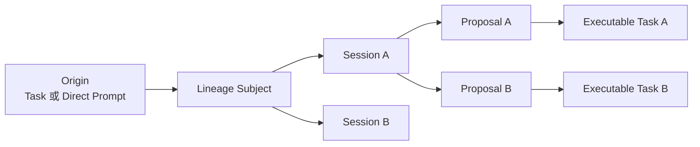

# Project Lineage Model

> 设计讨论稿。本文档用于沉淀 Task、Session、Proposal 之间的项目级关联模型，不是当前实现契约。若后续进入落地阶段，应通过 OpenSpec change 固化行为、共享类型、持久化 schema、迁移策略和测试要求。

## 背景

FylloCode 的研发流程以 `Task -> Proposal -> Apply -> Archive` 为主线，但当前 Task 有两个入口：

- `/task` 页面：本地任务与第三方集成任务。
- `/chat` 页面：用户通过 direct prompt 直接发起的任务。

目标是建立项目级 lineage 数据模型，将广义 Task、Chat Session、OpenSpec Proposal 串起来，使 FylloCode 能回答：

- 某个 task 关联过哪些 session 和 proposal。
- 某个 session 最初来自哪个 task 或 prompt，后来产出了哪些 proposal。
- 某个 proposal 来自哪次 session，以及对应哪个执行 task。
- 一个模糊需求在同一次或多次 session 中如何逐步澄清，并拆分成多个 proposal。

Apply 和 Archive 仍然只操作 proposal，不直接参与 lineage 建模。lineage 通过 proposal 的 `changeId` 反查即可。

## 核心判断

Lineage 不应直接把所有关系分散写入 `TaskItem`、`SessionMeta`、`ProposalMeta`。推荐使用项目级关联索引，并引入 `Subject` 作为聚合根。

- `Subject` 表示一个“原始需求线索”。
- `Task` 保持“可执行工作单元”的语义。
- `Session` 表示围绕该需求线索发生过的讨论。
- `Proposal` 表示从讨论中沉淀出的实现方案。

因此，一个模糊 direct prompt 可以先形成一个 `Subject`，随着讨论推进拆成多个 proposal；每个 proposal 可以再对应一个派生本地 task。



## 存储布局

建议在项目级数据目录下新增 lineage 目录：

```text
data/projects/<encodedProjectPath>/lineage/
├── index.json
└── subjects/
    ├── <subjectId>.json
    └── <subjectId>.json
```

设计原则：

- `index.json` 只做快速定位，不承载完整 lineage。
- `subjects/<subjectId>.json` 承载一个需求线索下的完整聚合数据。
- 写入时读 JSON、修改对象、原子写回，保持文件始终是合法 JSON；不要把 JSON 片段直接追加到文件末尾。
- 时间字段使用 ISO 8601 字符串。
- 持久化字段 key 使用 camelCase。

## ID 来源

Lineage 自己只生成 `subjectId`。其他 id 尽量复用现有系统的权威 id。

| 字段        | 来源              | 说明                                                              |
| ----------- | ----------------- | ----------------------------------------------------------------- |
| `projectId` | 现有项目模型      | 当前任务模型使用项目 id 表达项目归属。                            |
| `subjectId` | lineage 新生成    | 建议 opaque id，如 `lin-subj-${generateId()}`。                   |
| `taskId`    | 任务系统          | 本地任务由任务服务生成；外部任务由 adapter 生成稳定 id。          |
| `taskKey`   | lineage 派生      | `${source}:${taskId}`，用于跨来源定位任务。                       |
| `sessionId` | Chat session      | 复用现有 session id。                                             |
| `changeId`  | OpenSpec proposal | 始终是 OpenSpec `changeName`，也是 lineage 中 proposal 的主身份。 |

归档后的 proposal 在 lineage 中仍使用原始 `changeId`，即 OpenSpec `changeName`。归档目录名如 `2026-06-07-add-login-fix` 是文件系统细节，不进入 lineage schema。读取归档 proposal 时，调用侧应先归一化为原始 `changeId` 再查询 lineage。

## Index Schema

`index.json` 用于从 task、session、proposal 快速定位 subject。

```ts
type IsoDateString = string;
type ProjectId = string;
type SubjectId = string;
type SessionId = string;
type ChangeId = string;
type TaskSource = "local" | "yunxiao" | "github";
type TaskKey = `${TaskSource}:${string}`;

interface ProjectLineageIndex {
  version: 1;
  updatedAt: IsoDateString;

  // taskKey -> subjectIds。数组保留未来手动拆分/重新归类空间。
  taskSubjects: Record<TaskKey, SubjectId[]>;

  // 一个 session 默认归属一个 subject。
  sessionSubjects: Record<SessionId, SubjectId>;

  // changeId 始终为 OpenSpec changeName，不存归档目录名。
  proposalSubjects: Record<ChangeId, SubjectId>;
}
```

示例：

```json
{
  "version": 1,
  "updatedAt": "2026-06-07T10:30:00.000Z",
  "taskSubjects": {
    "local:task-login-bug": ["lin-subj-a1b2"],
    "yunxiao:yunxiao:space-1:12345": ["lin-subj-c3d4"]
  },
  "sessionSubjects": {
    "session-20260607-091000": "lin-subj-a1b2"
  },
  "proposalSubjects": {
    "add-login-failure-fix": "lin-subj-a1b2"
  }
}
```

## Subject Schema

`subjects/<subjectId>.json` 是一个需求线索的完整聚合。

```ts
interface LineageSubjectDocument {
  version: 1;
  id: SubjectId;
  projectId: ProjectId;

  // 面向 UI 的需求线索标题/摘要，可由来源 task 或 direct prompt 派生。
  title: string;
  summary?: string;

  // 最早来源。
  origin: LineageOrigin;

  // 聚合内容。
  tasks: LineageTaskRef[];
  sessions: LineageSessionRef[];
  proposals: LineageProposalRef[];

  createdAt: IsoDateString;
  updatedAt: IsoDateString;
}
```

### Origin

```ts
type LineageOrigin =
  | {
      kind: "task";
      taskKey: TaskKey;
    }
  | {
      kind: "directPrompt";
      sessionId: SessionId;
      messageId?: string;
      promptSnapshot: string;
    };
```

### Task Ref

```ts
interface LineageTaskRef {
  // origin：原始任务；derived：由 proposal 自动生成的执行任务；related：未来手动关联。
  role: "origin" | "derived" | "related";

  taskKey: TaskKey;
  source: TaskSource;
  taskId: string;

  // 若该 task 是某个 proposal 的执行任务，则记录对应 changeId。
  proposalChangeId?: ChangeId;

  snapshot: {
    title: string;
    description?: {
      format: "plain_text" | "markdown" | "html";
      content: string;
    };
    sourceDisplay?: string;
    sourceUrl?: string;
    capturedAt: IsoDateString;
  };

  createdAt: IsoDateString;
}
```

### Session Ref

```ts
interface LineageSessionRef {
  sessionId: SessionId;

  // taskPage：从 /task 发起；chatDirect：从 /chat prompt 发起；manualLink：未来手动关联。
  source: "taskPage" | "chatDirect" | "manualLink";

  // 如果这次 session 是从某个 task 发起，保留 taskKey。
  taskKey?: TaskKey;

  snapshot?: {
    title?: string;
    agentId?: string;
    firstMessageId?: string;
    createdAt?: IsoDateString;
  };

  createdAt: IsoDateString;
}
```

### Proposal Ref

```ts
interface LineageProposalRef {
  // OpenSpec changeName。归档后依旧保持这个值。
  changeId: ChangeId;

  // 哪次讨论产生了这个 proposal。
  sessionId: SessionId;

  // 这个 proposal 对应的执行任务。可能是 origin task，也可能是 derived local task。
  taskKey?: TaskKey;

  createdVia: "taskDiscussion" | "taskDiscussionDerivedTask" | "directChatAutoTask" | "manualLink";

  workspace?: {
    mode: "linked" | "main";
    path: string;
  };

  snapshot?: {
    title?: string;
    status?: "creating" | "draft" | "applying" | "archived";
  };

  createdAt: IsoDateString;
  updatedAt: IsoDateString;
}
```

## 示例：从 task 发起一次讨论并创建 proposal

`lineage/index.json`：

```json
{
  "version": 1,
  "updatedAt": "2026-06-07T09:35:00.000Z",
  "taskSubjects": {
    "local:task-login-bug": ["lin-subj-login-bug"]
  },
  "sessionSubjects": {
    "session-20260607-091000": "lin-subj-login-bug"
  },
  "proposalSubjects": {
    "add-login-failure-fix": "lin-subj-login-bug"
  }
}
```

`lineage/subjects/lin-subj-login-bug.json`：

```json
{
  "version": 1,
  "id": "lin-subj-login-bug",
  "projectId": "Users_tao_Work_projects_FylloCode",
  "title": "修复登录失败问题",
  "origin": {
    "kind": "task",
    "taskKey": "local:task-login-bug"
  },
  "tasks": [
    {
      "role": "origin",
      "taskKey": "local:task-login-bug",
      "source": "local",
      "taskId": "task-login-bug",
      "snapshot": {
        "title": "修复登录失败问题",
        "description": {
          "format": "plain_text",
          "content": "用户反馈登录后跳回首页。"
        },
        "sourceDisplay": "本地",
        "capturedAt": "2026-06-07T09:10:00.000Z"
      },
      "createdAt": "2026-06-07T09:10:00.000Z"
    }
  ],
  "sessions": [
    {
      "sessionId": "session-20260607-091000",
      "source": "taskPage",
      "taskKey": "local:task-login-bug",
      "snapshot": {
        "title": "修复登录失败问题",
        "agentId": "codex-acp",
        "createdAt": "2026-06-07T09:10:00.000Z"
      },
      "createdAt": "2026-06-07T09:10:00.000Z"
    }
  ],
  "proposals": [
    {
      "changeId": "add-login-failure-fix",
      "sessionId": "session-20260607-091000",
      "taskKey": "local:task-login-bug",
      "createdVia": "taskDiscussion",
      "workspace": {
        "mode": "linked",
        "path": "/Users/tao/Work/projects/FylloCode/.worktrees/add-login-failure-fix"
      },
      "snapshot": {
        "title": "Add Login Failure Fix",
        "status": "draft"
      },
      "createdAt": "2026-06-07T09:35:00.000Z",
      "updatedAt": "2026-06-07T09:35:00.000Z"
    }
  ],
  "createdAt": "2026-06-07T09:10:00.000Z",
  "updatedAt": "2026-06-07T09:35:00.000Z"
}
```

## 示例：direct prompt 拆分成多个 proposal

```json
{
  "version": 1,
  "id": "lin-subj-github-integration",
  "projectId": "Users_tao_Work_projects_FylloCode",
  "title": "GitHub 集成能力",
  "summary": "从一次模糊 direct prompt 发起，讨论后拆分为任务同步和 PR Review 两个 proposal。",
  "origin": {
    "kind": "directPrompt",
    "sessionId": "session-20260607-080000",
    "messageId": "msg-001",
    "promptSnapshot": "我们能不能把 GitHub 集成进来，任务、PR 都能处理？"
  },
  "tasks": [
    {
      "role": "derived",
      "taskKey": "local:task-github-sync",
      "source": "local",
      "taskId": "task-github-sync",
      "proposalChangeId": "add-github-task-provider",
      "snapshot": {
        "title": "实现 GitHub Issue/PR 任务同步",
        "description": {
          "format": "plain_text",
          "content": "从 GitHub 拉取 Issue/PR 并映射为 FylloCode 任务。"
        },
        "sourceDisplay": "本地",
        "capturedAt": "2026-06-07T08:20:00.000Z"
      },
      "createdAt": "2026-06-07T08:20:00.000Z"
    },
    {
      "role": "derived",
      "taskKey": "local:task-github-pr-review",
      "source": "local",
      "taskId": "task-github-pr-review",
      "proposalChangeId": "add-github-pr-review-flow",
      "snapshot": {
        "title": "实现 GitHub PR Review proposal 流程",
        "description": {
          "format": "plain_text",
          "content": "围绕 GitHub PR 创建讨论 session，并生成 review 相关 proposal。"
        },
        "sourceDisplay": "本地",
        "capturedAt": "2026-06-07T08:28:00.000Z"
      },
      "createdAt": "2026-06-07T08:28:00.000Z"
    }
  ],
  "sessions": [
    {
      "sessionId": "session-20260607-080000",
      "source": "chatDirect",
      "snapshot": {
        "title": "GitHub 集成能力",
        "agentId": "codex-acp",
        "firstMessageId": "msg-001",
        "createdAt": "2026-06-07T08:00:00.000Z"
      },
      "createdAt": "2026-06-07T08:00:00.000Z"
    }
  ],
  "proposals": [
    {
      "changeId": "add-github-task-provider",
      "sessionId": "session-20260607-080000",
      "taskKey": "local:task-github-sync",
      "createdVia": "directChatAutoTask",
      "workspace": {
        "mode": "linked",
        "path": "/Users/tao/Work/projects/FylloCode/.worktrees/add-github-task-provider"
      },
      "snapshot": {
        "title": "Add Github Task Provider",
        "status": "draft"
      },
      "createdAt": "2026-06-07T08:20:00.000Z",
      "updatedAt": "2026-06-07T08:20:00.000Z"
    },
    {
      "changeId": "add-github-pr-review-flow",
      "sessionId": "session-20260607-080000",
      "taskKey": "local:task-github-pr-review",
      "createdVia": "directChatAutoTask",
      "workspace": {
        "mode": "linked",
        "path": "/Users/tao/Work/projects/FylloCode/.worktrees/add-github-pr-review-flow"
      },
      "snapshot": {
        "title": "Add Github Pr Review Flow",
        "status": "draft"
      },
      "createdAt": "2026-06-07T08:28:00.000Z",
      "updatedAt": "2026-06-07T08:28:00.000Z"
    }
  ],
  "createdAt": "2026-06-07T08:00:00.000Z",
  "updatedAt": "2026-06-07T08:28:00.000Z"
}
```

对应 `index.json`：

```json
{
  "version": 1,
  "updatedAt": "2026-06-07T08:28:00.000Z",
  "taskSubjects": {
    "local:task-github-sync": ["lin-subj-github-integration"],
    "local:task-github-pr-review": ["lin-subj-github-integration"]
  },
  "sessionSubjects": {
    "session-20260607-080000": "lin-subj-github-integration"
  },
  "proposalSubjects": {
    "add-github-task-provider": "lin-subj-github-integration",
    "add-github-pr-review-flow": "lin-subj-github-integration"
  }
}
```

## 更新规则

### 从新的 task 发起 chat

1. 计算 `taskKey = ${task.source}:${task.id}`。
2. 查询 `index.taskSubjects[taskKey]`。
3. 若不存在 subject：
   - 创建 `LineageSubjectDocument`。
   - `origin = { kind: "task", taskKey }`。
   - `tasks` 增加 `role: "origin"` 的 task snapshot。
   - `sessions` 增加本次 session。
   - 更新 `index.taskSubjects` 和 `index.sessionSubjects`。
4. 若已存在 subject：
   - 复用 subject。
   - 只追加新的 `sessions` 记录。
   - 更新 `index.sessionSubjects`。

### 从 direct prompt 创建 session

1. 创建新的 subject。
2. `origin = { kind: "directPrompt", sessionId, messageId?, promptSnapshot }`。
3. `sessions` 增加本次 session，`source = "chatDirect"`。
4. 更新 `index.sessionSubjects`。

### session 创建 proposal

1. 通过 `index.sessionSubjects[sessionId]` 找到 subject。
2. 追加 `proposals` 记录，`changeId` 使用 OpenSpec `changeName`。
3. 更新 `index.proposalSubjects[changeId] = subjectId`。
4. 如果 proposal 需要自动生成本地任务：
   - 创建本地任务。
   - 追加 `tasks` 记录，`role = "derived"`。
   - 在 proposal 上写入 `taskKey`。
   - 更新 `index.taskSubjects[taskKey]`。

### proposal 归档

1. 不修改 lineage 的 `changeId`。
2. 可按需刷新 `proposal.snapshot.status = "archived"`。
3. 调用侧若拿到归档目录名，应先归一化为原始 `changeId`，再查 `index.proposalSubjects`。

## 查询路径

查某个 task 的 lineage：

```ts
const subjectIds = index.taskSubjects[taskKey] ?? [];
const subjects = await Promise.all(subjectIds.map(loadSubject));
```

查某个 session 的来源和产出：

```ts
const subjectId = index.sessionSubjects[sessionId];
const subject = await loadSubject(subjectId);
```

查某个 proposal 来自哪个 task：

```ts
const normalizedChangeId = normalizeToChangeName(changeId);
const subjectId = index.proposalSubjects[normalizedChangeId];
const subject = await loadSubject(subjectId);
const proposal = subject.proposals.find((item) => item.changeId === normalizedChangeId);

const task = proposal?.taskKey
  ? subject.tasks.find((item) => item.taskKey === proposal.taskKey)
  : subject.origin.kind === "task"
    ? subject.tasks.find((item) => item.taskKey === subject.origin.taskKey)
    : undefined;
```

语义区分：

- `proposal.taskKey` 表示这个 proposal 对应的执行 task。
- `subject.origin` 表示这个需求线索最早来自哪里。

## 待斟酌问题

- 一个 session 是否允许同时归属多个 subject。当前建议默认一个 session 归属一个 subject，未来通过 `manualLink` 支持复杂场景。
- 从 `/task` 发起后，如果同一个 task 拆成多个 proposal，是否为每个 proposal 创建 derived task。当前建议：只有当 proposal 已经明显成为独立执行单元时才创建 derived task。
- direct prompt 自动创建本地任务的触发时机：创建 proposal 后立即创建，还是等 proposal 从 `creating` 收口到 `draft` 后创建。
- 是否在 proposal card、session item、task card 上只展示 lineage 摘要，完整 lineage 留给后续详情视图。
