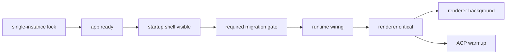

# Application lifecycle

本目录是应用级启动与退出顺序的唯一编排入口。Service/infra 只暴露幂等的启动、quiesce、dispose 与 force 方法，不得通过 import side effect 决定全局顺序。

## 启动顺序

| 阶段       | 允许事项                                                 | 禁止事项                             |
| ---------- | -------------------------------------------------------- | ------------------------------------ |
| visible    | 创建静态 shell、记录指标                                 | migration、业务 IPC、MCP/ACP spawn   |
| gate       | PATH、required migration、cutover validation             | Launcher context、业务 IPC、后台进程 |
| runtime    | IPC/event wiring、MCP 后台启动、正式 renderer navigation | 等待 MCP/ACP ready 才显示 UI         |
| critical   | Workspace window context/list/current/session bootstrap  | 显示 Welcome 或启动 background task  |
| background | ACP renderer cache、main Agent warmup                    | 阻塞 Launcher/Workspace 交互         |

## 退出顺序

同一 phase 的独立任务并行，phase 之间严格串行。运行期资源共享一个绝对 deadline；已进入写盘区间的 required migration 是唯一 protected-mutation 例外，必须先安全结算。

| 资源 owner               | quiesce                                 | graceful / force                | PID 所有权              |
| ------------------------ | --------------------------------------- | ------------------------------- | ----------------------- |
| ACP warmup               | cancel initial/fallback/queue           | 交给 process pool               | 无                      |
| Chat sessions            | cancel active sessions                  | generation invalidation         | process pool            |
| Draft session probes     | 失效 registry、关闭 ready probe         | 交给 process pool               | process pool            |
| ACP process pool         | 拒绝 acquire                            | dispose / process-tree force    | pool 登记               |
| Bundled MCP host         | 停止 activation、撤销 grant、取消 timer | stop / process-tree force       | host 登记               |
| Proposal/lineage watcher | unwatch / stop listener                 | dispose                         | 无                      |
| Agent installer          | abort fetch、拒绝 mutation              | terminate npx/uvx/archive child | installer 登记          |
| Auxiliary commands       | 停止 shell/Git/detector 新命令          | dispose / process-tree force    | auxiliary registry 登记 |

`shutdown.ts#SHUTDOWN_PHASES` 是退出任务、owner、API 与 PID ownership 的可执行清单；本表只解释规则，不另建第二套顺序。`snapshot-and-hide` 在等待 protected migration 前同步执行，保证用户立即看到应用退出，并标记 Workspace 窗口销毁时不再重复清理 runtime；随后 quiesce 中的 timer、watcher、session、draft probe、grant 与 installer 任务并行，terminate 中 ACP、bundled MCP 与 auxiliary child 并行。Draft probe 清理只复用现有 ready ACP 进程，禁止为关闭资源重新 spawn Agent。

### 子进程审计

- ACP process pool、bundled MCP host 和 installer 分别拥有长期 ACP、MCP 及 npx/uvx/archive 子进程，并提供独立 graceful/force API。
- `sync-shell-path`（5 秒）、`git worktree list`（5 秒）、overview Git（10 秒）虽有单次 timeout，但均可能跨越 4 秒退出 deadline；ACP detector 命令原先没有统一 timeout。因此它们统一进入 `auxiliary-process-registry.ts`，不得以“短任务”为由排除。
- POSIX 子进程以独立 process group 启动；Windows force 使用 detached `taskkill /T /F`，不依赖 Electron 父进程继续存活。
- Installer 下载临时目录使用唯一 `mkdtemp`，正常/失败/abort 都 best-effort 删除；未能在 deadline 内删除的目录不会被后续安装复用，因而不会污染安装记录或最终二进制目录。

## 新增任务 checklist

1. 在 `index.ts`、`startup.ts`、`runtime.ts` 或 `shutdown.ts` 的浅层清单中声明 task 名称与 phase。
2. 说明 task 是否进入 startup visible、required gate、renderer critical 或 shutdown deadline。
3. 深层 owner 导出幂等方法；不得调用全局 registry，也不得依赖 import 顺序。
4. 为相对顺序、失败隔离、abort/force 和重复调用增加测试。
5. 子进程必须登记 PID/process group，并提供有界 graceful 与 force 路径。

禁止的反例：在 service 模块顶层调用 `registerDisposable()`；导入模块即启动 timer/process；为单个资源重新分配完整退出 deadline；在 startup shell 可见前加载完整 runtime graph。
